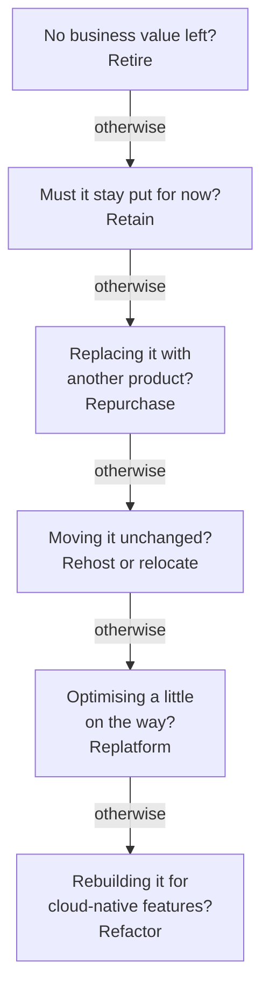

# Domain 1 — Cloud Concepts

Cloud Concepts is 24% of the scored content, roughly a quarter of the exam. It rewards one skill
above all: knowing AWS's own words for what the cloud changes, and telling apart ideas that sound
alike — agility and elasticity, a Region and an Availability Zone, a Well-Architected pillar and a
Cloud Adoption Framework perspective, rehosting and replatforming.

Study it first. Every other domain assumes this vocabulary.

| Exam guide task | Where it is taught |
|---|---|
| 1.1 Define the benefits of the AWS Cloud | What the cloud changes; Regions, Availability Zones and the words for staying up |
| 1.2 Identify design principles of the AWS Cloud | The Well-Architected Framework |
| 1.3 Understand the benefits of and strategies for migration | AWS CAF; the 7 Rs; migration tools |
| 1.4 Understand concepts of cloud economics | What the cloud changes; cloud economics |

The principal definitions and examples on this page are AWS's own, from the pages listed under
Official sources at the end. Columns headed
"the tell in a question" or "the separator", and the 7 Rs ladder, are our exam guidance.

---

## What this domain actually asks

Three habits carry most of the marks here.

**Name the advantage the way AWS names it.** Cloud computing is the on-demand delivery of
information technology (IT) resources over the internet with pay-as-you-go pricing. AWS describes its value as six advantages,
and questions are written around those phrases. A question about paying per use instead of buying
servers upfront is "trade fixed expense for variable expense". A question about lower prices is
"economies of scale". Learn the six by name.

**Know which pillar a practice serves.** The AWS Well-Architected Framework has six pillars, and
the guide asks you to tell them apart, not just list them. A Multi-AZ database is reliability.
Delivering business value at the lowest price point is cost optimization. Energy use is
sustainability.

**Know what each migration choice changes.** There are seven migration strategies and a handful of
migration tools. Each one changes a different thing — nothing, the platform, the product, or the
architecture — and the question tells you which.

---

## What the cloud changes, in AWS's own words

Cloud computing is the **on-demand delivery** of compute power, databases, storage, applications
and other IT resources over the internet, with **pay-as-you-go pricing**. You do not make large
upfront investments in hardware. You provision exactly the type and size of resources you need,
almost instantly, and pay only for what you use.

The ownership changes too. AWS owns and maintains the network-connected hardware; you provision and
use what you need. AWS does the heavy lifting of racking, stacking and powering servers, and with
managed services it also removes the burden of managing operating systems and applications. That is
the value proposition the exam guide asks about, in one paragraph.

AWS publishes six advantages of cloud computing. Most cloud-economics questions in this domain are
one of these, reworded.

| Advantage | What it means | The tell in a question |
|---|---|---|
| Trade fixed expense for variable expense | Pay only when you consume, and only for how much, instead of investing in data centres before you know the demand | Avoiding upfront investment |
| Benefit from massive economies of scale | Usage from hundreds of thousands of customers is aggregated, so AWS can charge lower pay-as-you-go prices | Lower prices than you could get alone |
| Stop guessing capacity | Use as much or as little as you need; scale up and down with minutes' notice | Idle servers, or running out of capacity |
| Increase speed and agility | New resources are a click away: weeks become minutes, and experiments cost less | Time to provision, freedom to experiment |
| Stop spending money running and maintaining data centres | Focus on your customers, not racking, stacking and powering servers | Undifferentiated work moving to AWS |
| Go global in minutes | Deploy in multiple Regions with a few clicks for lower latency at minimal cost | Reaching customers in other countries |

The pair candidates confuse most is the first two. **Trade fixed expense for variable expense is
about when and how you pay**: per use, not upfront. **Economies of scale is about the price**:
because AWS aggregates demand across so many customers, the per-unit rate is lower. A stem about
avoiding a large purchase is the first. A stem about lower unit prices is the second. Many questions
use the accounting words for the first one: capital expenditure (CAPEX) for the upfront purchase,
and operational expenditure (OPEX) for paying as you go. AWS describes its own pricing as an OPEX
model. "Move from CAPEX to OPEX" is the same advantage as "trade fixed expense for variable expense". Neither one
says AWS's hardware is cheaper than yours — that is the distractor.

"Go global in minutes" is the guide's "benefits of global infrastructure": speed of deployment and
global reach. You do not build or lease a data centre to serve customers abroad. You deploy into a
Region near them.

---

## Regions, Availability Zones, and the words for staying up

The AWS Cloud is built around **Regions** and **Availability Zones**. A Region is a physical
location in the world that contains multiple Availability Zones. An Availability Zone (AZ) is one or more
discrete data centres, each with redundant power, networking and connectivity, in separate
facilities. What matters for the exam is the containment and the separation: a Region holds
several Availability Zones, and those zones are separate from one another.

| | Region | Availability Zone |
|---|---|---|
| What it is | A geographic location in the world | One or more discrete data centres inside a Region |
| Contains | Multiple Availability Zones | Redundant power, networking and connectivity |
| You use more than one to | Reach customers elsewhere, at lower latency | Survive the failure of one location |

Deploying across several Availability Zones lets you run applications and databases that are more
highly available, fault tolerant and scalable than a single data centre allows. Launching Amazon EC2
instances in multiple AZs protects an application from the failure of a single location in the
Region. That is the Domain 1 view: high availability as a benefit. Domain 3 covers how to build it.

Four words in this domain sound alike and mean different things. The exam uses all four.

| Word | What it means on AWS | Not to be confused with |
|---|---|---|
| Agility | How fast you can get new resources and try things: weeks become minutes | Elasticity |
| Elasticity | Capacity that grows and shrinks with demand | Provisioning for peak in advance |
| Availability | The percentage of time a workload is available for use | Fault tolerance |
| Fault tolerance | Carrying on when a component fails, by replacing it or shifting work elsewhere | Availability |

**Elasticity is the opposite of provisioning for peak.** Amazon EC2 Auto Scaling shows both sides.
If you buy enough capacity for your busiest day, the extra sits unused the rest of the week and
raises your running cost. If you buy for average demand, customers get a poor experience whenever
demand exceeds it. With Auto Scaling, capacity increases and decreases as needed. You launch
instances when they are needed and terminate them when they are not, so you save money.

Auto Scaling also shows fault tolerance. It detects an unhealthy instance, terminates it and
launches a replacement. Configured across several AZs, it launches instances in another zone if one
becomes unavailable.

The same idea sits behind a design principle you will meet again under reliability: **scale
horizontally**. Replace one large resource with several small ones, so a single failure has less
impact and requests do not share a common point of failure. A bigger server is still one server.

There is an on-premises side to this too. AWS names resource saturation — demand exceeding a
workload's capacity — as a common cause of failure in on-premises workloads. In the cloud you
monitor demand and automate adding or removing resources, avoiding both over- and
under-provisioning.

<b>Self-check — Regions, AZs and the four availability words</b>

1. A company wants to cut the time it takes to give developers a new test server from three weeks
   to minutes. Which advantage is that, and why is it not elasticity?
2. An Availability Zone is often described as "a data centre". What does AWS actually say it is?
3. Traffic to a website doubles every Friday. What does provisioning for Friday cost you on the
   other six days, and what does Auto Scaling do instead?
4. Why does replacing one large server with several smaller ones improve availability?

**Answers.** (1) Agility: speed to provision and lower cost to experiment. Elasticity is capacity
following demand. (2) One or more discrete data centres with redundant power, networking and
connectivity, in separate facilities. (3) Unused capacity that raises running cost; Auto Scaling
launches instances when needed and terminates them when not. (4) A single failure has less impact,
and requests no longer share a common point of failure.

---

## The Well-Architected Framework: six pillars, one job each

The **AWS Well-Architected Framework** is a consistent approach to evaluating a workload against the
qualities expected of modern cloud systems, and the remediation needed to reach them. It has **six
pillars**: operational excellence, security, reliability, performance efficiency, cost optimization
and sustainability. Some older material lists five; sustainability is the one it leaves out.

The guide asks you to identify the pillars and the differences between them. Learn each pillar's job
in AWS's words, and the kind of stem that points to it.

| Pillar | Its job, in AWS's words | The tell in a question |
|---|---|---|
| Operational excellence | Build software correctly while consistently delivering a great customer experience | Operations as code, small reversible changes |
| Security | Protect data, systems and assets | Least privilege, traceability, encryption |
| Reliability | Perform the intended function correctly and consistently when expected | Recover from failure, Multi-AZ, no single point of failure |
| Performance efficiency | Use cloud resources efficiently to meet performance requirements as demand changes | Right resource for the load, serverless, global reach |
| Cost optimization | Deliver business value at the lowest price point | Pay for what you use, attribute spend |
| Sustainability | Reduce environmental impact, especially energy consumption | Utilisation, energy use, emissions per unit of work |

Each pillar has its own design principles, and the principles are where the near-misses live.

**Operational excellence** says to safely automate where possible. You define the entire workload
and its operations as code, which limits human error, and you make frequent, small, reversible
changes.

**Security** starts with a strong identity foundation — least privilege and separation of duties.
Then it adds traceability, security at all layers, and protecting data in transit and at rest.
Firewalls are one layer, not the pillar.

**Reliability** says to automatically recover from failure, test recovery procedures, scale
horizontally, stop guessing capacity and manage change through automation. A database deployed
across multiple Availability Zones is a reliability decision. AWS's own practice questions key it
that way.

**Performance efficiency** says to democratise advanced technologies by consuming them as services,
go global in minutes, use serverless architectures and experiment more often. Running a technology
such as machine learning as a service, rather than hosting it yourself, is this pillar.

**Cost optimization** starts with Cloud Financial Management as an ongoing capability. It then adds
a consumption model, measuring overall efficiency, not spending on undifferentiated heavy lifting,
and attributing expenditure. The consumption model is the core: pay for what you require and adjust
usage to business needs, not to elaborate forecasts. AWS's own example is development and test
environments used eight hours a day on weekdays. Stopping them when unused saves a potential 75%.

**Sustainability** says to maximise utilisation and use managed services. AWS's illustration is
that two hosts at 30% utilisation are less efficient than one at 60%, because each host draws
baseline power. Managed services help because sharing infrastructure across many customers means
less of it is needed.

Four pairs cause most of the wrong answers.

| Pair | The separator |
|---|---|
| Reliability vs performance efficiency | Doing the job when expected, even through failure, against using resources efficiently for the load |
| Cost optimization vs sustainability | The goal stated: money, or energy and environmental impact. Right-sizing helps both |
| Operational excellence vs reliability | Both automate. Operational excellence automates operations; reliability automates recovery and capacity |
| Security vs operational excellence | Protecting data, systems and assets, against running and evolving the workload well |

The pillars are traded against each other according to business context. You might favour
sustainability and cost over reliability in a development environment. AWS adds one firm rule:
**security and operational excellence are generally not traded off** against the other pillars.

The framework comes with a general set of design principles too. Two matter for this domain.
**Test systems at production scale**: create a full-size test environment on demand, test, then
decommission it, paying only while it runs. **Automate with architectural experimentation in mind**:
automation lets you create and replicate workloads at low cost and avoid the expense of manual
effort.

To apply the framework, AWS provides the **AWS Well-Architected Tool**. The review tool itself is
offered at no charge, and it gives you a consistent process to review and measure a workload's
architecture against the framework. It is a review process, not a certification.

> **Trap.** A stem describing Multi-AZ, automatic recovery or "no single point of failure" is
> reliability, even when an option says "performance". Performance efficiency is about fitting
> resources to the load, not surviving a failure.

<b>Self-check — the six pillars</b>

1. A team deploys its database across two Availability Zones so it stays up if one fails. Which
   pillar, and which design principle?
2. Which two pillars does AWS say are generally not traded off against the others?
3. A company right-sizes its servers to cut its energy use. Which pillar does the stated goal point
   to?
4. What does the AWS Well-Architected Tool do, and what does it cost?

**Answers.** (1) Reliability; scale horizontally, so no single failure takes the workload down.
(2) Security and operational excellence. (3) Sustainability — the goal is energy, not money.
(4) It reviews and measures a workload's architecture against the framework, at no charge.

---

## Adopting the cloud: the AWS Cloud Adoption Framework

The **AWS Cloud Adoption Framework (CAF)**, which AWS writes as AWS CAF, applies AWS's experience and best practices to help
an organisation digitally transform and accelerate its business outcomes. You use it to identify and
prioritise transformation opportunities, evaluate and improve your cloud readiness, and evolve a
transformation roadmap over time.

Keep it apart from Well-Architected. **CAF is about the organisation adopting the cloud.
Well-Architected is about a workload's architecture.**

CAF names four key business outcomes. These are the four the exam guide lists, word for word:
**reduced business risk**, **improved environmental, social and governance (ESG) performance**,
**increased revenue** and **increased operational efficiency**.

It also describes a value chain of four transformation domains, each enabling the next: technology
enables process, which enables organisational, which enables product transformation.

CAF groups the capabilities an organisation needs into **six perspectives**.

| Perspective | What it covers | Typical owners |
|---|---|---|
| Business | Cloud investment accelerating business outcomes | Chief executive, finance, operations, information and technology officers |
| People | Culture, organisational structure, leadership, workforce | Information, operations and technology chiefs; cloud director |
| Governance | Orchestrating cloud initiatives; minimising transformation risk | Transformation, finance, data and risk chiefs |
| Platform | An enterprise-grade, scalable, hybrid cloud platform; modernising workloads | Chief technology officer, technology leaders, architects, engineers |
| Security | Confidentiality, integrity and availability of data and workloads | Security and compliance chiefs, internal audit, security architects |
| Operations | Delivering cloud services at the level the business needs | Infrastructure and operations leaders, site reliability engineers |

The six perspectives and the six pillars are the most-crossed boundary in this domain, because two
names appear in both lists.

| | Well-Architected pillars | CAF perspectives |
|---|---|---|
| Evaluates | One workload's architecture | The organisation's capability to adopt cloud |
| Only here | Reliability, performance efficiency, cost optimization, sustainability | Business, People, Governance, Platform |
| In both | Security, operational excellence | Security, Operations |

CAF's journey runs through four **iterative and incremental** phases. **Envision** shows how cloud
accelerates business outcomes. **Align** finds capability gaps across the six perspectives.
**Launch** delivers pilots in production. **Scale** expands those pilots to the desired scale. It is
a loop you repeat, not a one-time waterfall.

<b>Self-check — AWS CAF</b>

1. Name the four business outcomes AWS CAF lists.
2. A cloud project is being organised around executive sponsorship and the business case. Which
   perspective is that, and which perspective builds the hybrid cloud platform?
3. Which perspective protects confidentiality, integrity and availability, and which one minimises
   transformation-related risk?
4. Reliability and sustainability: pillars, perspectives, or both?

**Answers.** (1) Reduced business risk; improved environmental, social and governance (ESG)
performance; increased revenue; increased operational efficiency. (2) Business; Platform.
(3) Security; Governance. (4) Pillars only.

---

## Migration strategies: the 7 Rs by what they change

The exam guide asks you to identify an appropriate migration strategy from a scenario; it does not
list the strategies by name. The names come from AWS Prescriptive Guidance, which defines **seven
migration strategies, the 7 Rs**. Each is a different answer to one question: how much does this
application change on its way to the cloud? Some older
material lists fewer strategies; learn the current seven.

| Strategy | Also called | What changes |
|---|---|---|
| Retire | — | The application is decommissioned or archived |
| Retain | — | Nothing moves yet: it stays in the source environment |
| Rehost | Lift and shift | Nothing: moved without any changes |
| Relocate | — | Many servers move to a cloud version of the same platform, without new hardware, rewrites or new operations |
| Replatform | Lift, tinker and shift | Some optimisation on the way, such as moving a database to Amazon RDS |
| Repurchase | Drop and shop | The application is replaced by a different product, such as Software as a Service (SaaS) |
| Refactor or re-architect | — | The architecture is rebuilt for cloud-native features |

Read the ladder from the top and stop at the first question the stem answers "yes" to. It is our
exam memory aid for matching a stem to a strategy, not an AWS planning method.

Three boundaries decide most questions.

**Rehost against replatform.** Rehosting changes nothing. As soon as the stem adds an optimisation —
moving a self-managed database onto Amazon RDS, say — it is replatform.

**Repurchase against refactor.** Repurchasing swaps the application for a different product, for
example moving from a traditional licence to SaaS. Refactoring keeps your application and rebuilds
its architecture to use cloud-native features, which makes it the most complex strategy of the
seven.

**Retire against retain.** Retire shuts the application down. Retain keeps it where it is for now,
for example to stay compliant with data residency requirements.

<b>Self-check — the 7 Rs</b>

1. A company moves its servers to AWS exactly as they are. Which strategy?
2. On the way, it moves its self-managed database onto Amazon RDS. What does that make the
   strategy?
3. Which strategy replaces a custom application with a SaaS product?
4. An application must stay on premises because of data residency. Which strategy?

**Answers.** (1) Rehost (lift and shift). (2) Replatform (lift, tinker and shift). (3) Repurchase
(drop and shop). (4) Retain.

---

## Migration tools, and who can help

The guide asks about resources that support the migration journey. Learn the tools by the stage
they serve.

| Stage | Tool | What it does |
|---|---|---|
| Decide | Migration Evaluator | Builds a data-driven business case, including reusing existing licences |
| Plan | AWS Application Discovery Service (closed to new customers; see note below) | Collects usage and configuration data about on-premises servers and databases |
| Track | AWS Migration Hub (closed to new customers; see note below) | One place to discover servers, plan migrations and track each one |
| Move servers | AWS Application Migration Service, now AWS Transform MGN | Migrates physical, virtual and cloud servers by continuous block-level replication |
| Move data | AWS Database Migration Service (AWS DMS) | Migrates databases, data warehouses and other data stores |

**Move the server, or move the data?** This is the boundary AWS's own practice questions test. AWS
Application Migration Service moves whole servers, with minimal downtime. AWS describes it as the
primary service recommended for lift-and-shift migrations. AWS DMS moves the data in relational
databases, data warehouses, NoSQL databases and other data stores. A stem that says "migrate the
database server to Amazon EC2" wants Application Migration Service. A stem about moving the data
into a managed database wants AWS DMS.

**Database replication** is the guide's example of a migration approach: changes are replicated
from a source database to a target so the two stay in sync while you move. AWS DMS is a tool that
supports it. It can run a one-time migration or **replicate ongoing changes** to keep source and
target in sync.

You also do not have to do it alone. AWS and the AWS Partner Network provide tools and services for
each step. **AWS Professional Services** is a global team of experts offering assistance aligned to
AWS CAF.

> **Currency note (checked 1 October 2026).** AWS Migration Hub and AWS Application Discovery
> Service stopped accepting new customers on 7 November 2025. Existing customers can finish their
> projects, and AWS recommends AWS Transform for new ones. **For the exam, follow the guide:** both
> are on its current list of in-scope services, so answer on the job each tool does and do not rule
> one out because of the notice. That is a statement about the exam, not a recommendation: for a
> new migration project, check current availability and start from what AWS recommends now.

> **Currency note (checked 1 October 2026).** In June 2026 AWS renamed AWS Application Migration
> Service (MGN) to **AWS Transform MGN**; its role, rehosting servers through replication, is
> unchanged. The current exam guide still lists the former name, so expect to see AWS Application
> Migration Service in questions. Recognise both names as one service and answer on what it does.

<b>Self-check — migration tools</b>

1. A company wants a business case that shows projected AWS costs, including reusing the licences it
   already owns. Which tool?
2. Which tool collects configuration and usage data about on-premises servers to plan a migration?
3. A company wants to move a group of on-premises application servers to Amazon EC2 without
   changing them. Which service?
4. Can AWS DMS keep the source database in use while the target catches up?

**Answers.** (1) Migration Evaluator. (2) AWS Application Discovery Service. (3) AWS Application
Migration Service, now AWS Transform MGN — it moves whole servers, and is AWS's recommended
lift-and-shift service. (4) Yes: it can replicate ongoing changes to keep source and target in sync.

---

## Cloud economics beyond pay-as-you-go

The guide's economics task is mostly the six advantages again. **Fixed costs** become **variable
costs**: you stop buying capacity before you know the demand. Economies of scale lower the
pay-as-you-go price. And you stop paying to run data centres. This section adds the parts that are
only about economics.

**What on-premises really costs.** On premises you pay for capacity decided in advance. You either
sit on expensive idle resources or run short, and resource saturation is a common cause of failure.
You also carry the heavy lifting of racking, stacking and powering servers. In the cloud, AWS does
that work. With managed services, it also takes on managing operating systems and applications.

**Licensing: Bring Your Own License (BYOL) against licence included.** The guide contrasts the BYOL
model with "included licenses".

| | Bring Your Own License (BYOL) | License Included |
|---|---|---|
| Who supplies the licence | You, from licences you already own | AWS, as part of the price |
| Example | Existing Oracle Database licences on Amazon RDS; per-socket or per-core licences on Amazon EC2 Dedicated Hosts | Amazon RDS for Oracle without buying Oracle licences separately |
| Why choose it | Reuse what you have paid for, subject to your licence terms | No separate licence to buy |

**AWS License Manager** helps you manage software licences across AWS Regions and accounts. BYOL is
how you re-purpose existing licence inventory to save costs.

**Rightsizing** means matching resource type, size and number to the workload. The cost optimization
pillar names selecting the correct resource type, size and number, and the best pricing model, as
ways to build cost-effective resources. **AWS Compute Optimizer** analyses configuration and
utilisation metrics to recommend right-sized resources and identify idle ones. Rightsizing is not
choosing the biggest instance for safety, and the sustainability pillar counts it too.

**Automation** saves money, not just time. It lets you create and replicate workloads at low cost
and avoid the expense of manual effort, and you can track and revert changes. Defining operations as
code also limits human error. Automation is also what makes production-scale testing affordable: you
build the test environment on demand and pay only while it runs.

**Economies of scale**, one last time, because it is a 1.4 sub-bullet in its own right. The saving
comes from AWS aggregating usage across hundreds of thousands of customers, and every customer gets
the lower price. Discounts you earn yourself, for committing to a term or using more, are a
different topic: they are pricing models, covered in Domain 4.

> **Trap.** "Pay only for what you use" does not depend on forecasting. AWS's consumption-model
> principle is to adjust usage to business needs, not to elaborate forecasts. Stopping development
> environments when they are idle is the textbook example.

<b>Self-check — cloud economics</b>

1. A company already owns per-core software licences. Which licensing model, and which EC2 option
   supports it?
2. What does AWS Compute Optimizer recommend, and from what data?
3. Name two ways automation reduces cost.
4. Where does AWS's economies-of-scale saving come from?

**Answers.** (1) Bring Your Own License (BYOL); Amazon EC2 Dedicated Hosts. (2) Rightsizing, and
which resources are idle, from configuration and utilisation metrics. (3) Workloads are created and
replicated at low cost without manual effort, and test environments exist only while they run.
(4) Usage aggregated across hundreds of thousands of customers, which lowers pay-as-you-go prices.

---

## Traps worth carrying into the exam

- **Cheaper hardware** is never AWS's stated reason. The reasons are variable expense and economies
  of scale.
- **Agility is speed; elasticity is capacity following demand.**
- **An Availability Zone is one or more data centres**, and a Region contains several.
- **Multi-AZ is reliability**, not performance efficiency.
- **Six pillars**, with sustainability as the sixth. Security and operational excellence are
  generally not traded off.
- **Pillars evaluate a workload; CAF perspectives describe an organisation.** Only Security and
  Operations sit in both lists.
- **CAF's four outcomes**: reduced business risk, improved ESG performance, increased revenue,
  increased operational efficiency.
- **Rehost changes nothing; replatform changes a little; refactor rebuilds.**
- **Application Migration Service (now AWS Transform MGN) moves servers; AWS DMS moves data.**
- **"No longer open to new customers" does not take a service out of the exam guide.** Answer on
  what the tool does.
- **BYOL is your licence; License Included is AWS's.**

---

## Official sources

The principal definitions and examples on this page are drawn from these AWS pages. Check them rather
than any summary, including this one. The availability and naming notices were checked on 1 October 2026.

- [AWS Certified Cloud Practitioner exam guide, Domain 1: Cloud Concepts](https://docs.aws.amazon.com/aws-certification/latest/cloud-practitioner-02/cloud-practitioner-02-domain1.html) — the four task statements
- [Six advantages of cloud computing](https://docs.aws.amazon.com/whitepapers/latest/aws-overview/six-advantages-of-cloud-computing.html) and [What is cloud computing?](https://docs.aws.amazon.com/whitepapers/latest/aws-overview/what-is-cloud-computing.html) — the value proposition
- [AWS global infrastructure overview](https://docs.aws.amazon.com/whitepapers/latest/aws-overview/global-infrastructure.html) and [Amazon EC2 Regions and Zones](https://docs.aws.amazon.com/AWSEC2/latest/UserGuide/using-regions-availability-zones.html) — Regions and Availability Zones
- [Benefits of Amazon EC2 Auto Scaling](https://docs.aws.amazon.com/autoscaling/ec2/userguide/auto-scaling-benefits.html) — elasticity and fault tolerance in practice
- [The pillars of the Well-Architected Framework](https://docs.aws.amazon.com/wellarchitected/latest/framework/the-pillars-of-the-framework.html), [general design principles](https://docs.aws.amazon.com/wellarchitected/latest/framework/general-design-principles.html) and [trade-offs between pillars](https://docs.aws.amazon.com/wellarchitected/latest/framework/definitions.html)
- [An overview of the AWS Cloud Adoption Framework](https://docs.aws.amazon.com/whitepapers/latest/overview-aws-cloud-adoption-framework/welcome.html) — outcomes, perspectives and phases
- [About the migration strategies (the 7 Rs)](https://docs.aws.amazon.com/prescriptive-guidance/latest/large-migration-guide/migration-strategies.html) — AWS Prescriptive Guidance
- [AWS Database Migration Service](https://docs.aws.amazon.com/dms/latest/userguide/Welcome.html), [AWS Transform MGN release notes](https://docs.aws.amazon.com/mgn/latest/ug/mgn-release-notes.html) (the rename), [Migration Evaluator](https://aws.amazon.com/migration-evaluator/)
- [AWS Migration Hub availability change](https://docs.aws.amazon.com/migrationhub-orchestrator/latest/userguide/migrationhub-availability-change.html) and [AWS Application Discovery Service availability change](https://docs.aws.amazon.com/application-discovery/latest/userguide/application-discovery-service-availability-change.html)
- [Amazon RDS for Oracle licensing options](https://docs.aws.amazon.com/AmazonRDS/latest/UserGuide/Oracle.Concepts.Licensing.html), [AWS License Manager](https://docs.aws.amazon.com/license-manager/latest/userguide/license-manager.html) and [AWS Compute Optimizer](https://docs.aws.amazon.com/compute-optimizer/latest/ug/what-is-compute-optimizer.html) — licensing and rightsizing
