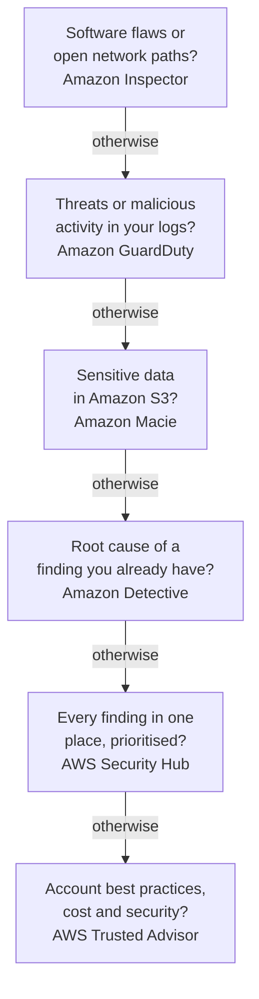

# Domain 2 — Security and Compliance

Security and Compliance is 30% of the scored content, the second-largest domain. It rewards knowing
where a responsibility sits — with AWS or with you — and knowing which service does which security
job. Most wrong options here are real AWS services doing a neighbouring job.

| Exam guide task | Where it is taught |
|---|---|
| 2.1 Understand the AWS shared responsibility model | The shared responsibility model |
| 2.2 Understand AWS Cloud security, governance, and compliance concepts | Compliance; finding problems; encryption; logs, monitoring and governance |
| 2.3 Identify AWS access management capabilities | The root user; IAM; storing credentials and signing people in |
| 2.4 Identify components and resources for security | Finding problems; protecting the edge, and where to find security help |

The security services the guide names under 2.2 and 2.4 overlap, so this page teaches each one once,
by the job it does. The principal definitions on this page are AWS's own, from the pages listed
under Official sources at the end. Columns headed "the separator" or "the tell", and the service
ladder, are our exam guidance.

---

## What this domain actually asks

Three habits carry most of the marks here.

**Place the responsibility, then check the service.** Security and compliance is a shared
responsibility. AWS secures the cloud itself; you secure what you put in it. How much "what you put
in it" covers depends on the service: a lot on Amazon EC2, very little on AWS Lambda. When a
question asks who does something, find the service in the stem before you answer.

**Match the service to the verb.** Amazon Inspector finds vulnerabilities. Amazon GuardDuty detects
threats. Amazon Macie finds sensitive data. Amazon Detective investigates. AWS CloudTrail records who
did what. The distractors are almost always the service one job to the left.

**Prefer the temporary, narrow credential.** AWS's answer to almost every access question is the
same: give only the permissions a task needs (least privilege), use roles and temporary credentials
instead of stored keys, add multi-factor authentication (MFA), and keep the root user for the few
tasks that need it.

---

## The shared responsibility model

**AWS is responsible for security *of* the cloud. You are responsible for security *in* the cloud.**
That one sentence — security of the cloud against security in the cloud — answers most questions on
task 2.1.

Security *of* the cloud means protecting the infrastructure that runs every AWS service: the
hardware, software, networking and facilities. AWS operates and controls everything from the **host**
operating system and the virtualisation layer down to the physical security of its data centres.

Security *in* the cloud is yours, and its size is set by the services you choose. On Amazon EC2 you
manage the **guest** operating system, including its updates and security patches, the software you
install, and the configuration of the security groups that act as each instance's firewall. Host
and guest are the words to watch: the host operating system is AWS's, the guest operating system on
your instance is yours.

### How the line moves with the service

The guide asks how responsibilities shift between services, and names Amazon RDS, AWS Lambda and
Amazon EC2. Read the table from top to bottom: the further down, the more AWS carries.

| Service | AWS handles | You still handle |
|---|---|---|
| Amazon EC2 (Infrastructure as a Service) | Host, virtualisation, facilities | Guest operating system and patches, applications, security groups, credentials, the IAM role on the instance |
| Amazon RDS (managed database) | Operating system and engine patches: it finds the flaw, builds the fix and releases it | Picking the maintenance window, network access with security groups, who manages it with IAM, database logins, choosing encryption when the database is created |
| AWS Lambda (serverless) | Servers, operating system, capacity and scaling; publishes runtime updates and, by default, applies them | Your code and its dependencies, its permissions, and keeping container-image functions and deprecated runtimes up to date |
| Amazon S3 and Amazon DynamoDB (abstracted) | Infrastructure, operating system and platform, patched with no action from you | Your data, its encryption choice, classifying it, and IAM permissions |

Whatever the service, AWS does not take over your responsibility for **your data** - its
classification and encryption choices - or for **who can access it**. Even on Amazon S3, managing your
data, classifying it and setting permissions stay with you. AWS adds
that turning on detective controls such as AWS CloudTrail or Amazon GuardDuty for S3 is yours too.

The Lambda row has exceptions worth knowing. Automatic runtime updates are Lambda's default for managed
runtimes. If a function is set not to update automatically, or is deployed as a container image, keeping
it current is your job: you update the function, or rebuild the image from the latest base image and
redeploy it. When AWS deprecates a runtime, upgrading the function is yours too. Your code and its
dependencies are always yours. At exam depth the answer stays "AWS patches the servers and the runtime";
these are the cases where that stops being true.

The RDS row is where candidates slip. RDS is managed, so you do not log in and patch the database
server. AWS identifies vulnerabilities and develops, tests and releases the patches. Your part is
choosing when they apply: you select the maintenance window or schedule the restart. A question that
asks who patches the operating system under an RDS database wants AWS.

Responsibility also moves with how you integrate a service into your own systems, and with the laws
that apply to you. Two companies using the same service can carry different obligations.

### Inherited, shared and customer-specific controls

The model extends to information technology (IT) controls, and AWS sorts them three ways.

| Control type | Who | Examples |
|---|---|---|
| Inherited | AWS entirely; you inherit it | Physical and environmental controls |
| Shared | Both, each in its own layer | Patch management, configuration management, awareness and training |
| Customer-specific | You alone | Routing or zoning data within specific security environments |

A shared control is not split down the middle. Each side does its own version. For patching, AWS
patches the infrastructure and you patch your guest operating systems and applications. For
configuration, AWS configures its devices and you configure your operating systems, databases and
applications. For training, AWS trains its staff and you train yours.

<b>Self-check — the shared responsibility model</b>

1. A web application runs on Amazon EC2. A critical operating system vulnerability is announced.
   Who applies the patch, and why is the answer different for Amazon RDS?
2. Name two responsibilities that stay with you even on Amazon S3.
3. Which control type are the physical locks on an AWS data centre, and which are your employees'
   security awareness sessions?
4. Your team uses AWS Lambda and says it has no security responsibilities left. What is still
   yours?

**Answers.** (1) You do, because the guest operating system on EC2 is yours; on RDS, AWS builds and
releases the patch and you choose the maintenance window. (2) Any two of: managing your data and its
encryption, classifying it, setting IAM permissions. (3) Inherited; shared (AWS trains its staff, you
train yours). (4) Your code and content, and the security configuration of what you use, such as
permissions.

---

## Compliance: AWS's evidence and yours

**AWS Artifact is where you get AWS's compliance evidence.** It provides on-demand downloads of
AWS security and compliance documents, such as International Organization for Standardization (ISO)
certifications, Payment Card Industry (PCI) reports and System and Organization Controls (SOC)
reports. It is free. You can hand these documents to your auditors or regulators as evidence about
the AWS infrastructure and services you use. Artifact is also where you review and accept agreements
with AWS, such as the Business Associate Addendum used for health data.

What Artifact does not hold is evidence about *you*. AWS customers are responsible for developing or
obtaining documents that demonstrate their own company's security and compliance. AWS's reports cover
AWS's half of the controls, and only that half.

AWS's certifications and attestations are assessed by an independent third-party auditor. Laws are
different: no cloud provider can be certified against a law. AWS supports you with security features,
enablers and legal agreements, but complying with laws and regulations remains your responsibility.

| Kind of program | What it is | Who is certified |
|---|---|---|
| Certification or attestation | Assessed by an independent auditor, ending in a report or certificate | AWS's infrastructure and services |
| Law or regulation, such as the Health Insurance Portability and Accountability Act (HIPAA) | A legal obligation | Nobody: you comply; AWS supports with features and agreements |
| Alignment or framework | Published requirements for a specific industry or function | Usually not certified; AWS provides guidance |

**Compliance needs differ by country and by industry.** AWS lists its programs by geography —
Americas; Asia Pacific; Europe, the Middle East and Africa — with frameworks for specific
industries. Geographic location also matters for data residency: you choose the AWS Regions where your content is
stored. AWS will not move or replicate it outside those Regions without your agreement, except where that is
needed to provide a service you started or to comply with the law. When residency is a requirement, check each
service's own data-location information.

**Compliance requirements also vary among AWS services.** AWS adds services to each program's scope according to
expected use, feedback and demand, so not every service is covered by every program. Before you put
regulated data in a service, check the AWS Services in Scope by Compliance Program page. A service
missing from the list can still be used, but deciding whether that is acceptable for your data is
your responsibility.

---

## Finding problems: which security service does which job

**The question's verb names the service.** Five services in this domain look for trouble, and each
looks for a different kind.

Read the ladder from the top and stop at the first question the stem answers "yes" to. It is our
memory aid, not an AWS method.

| Service | Its job | The tell in a question |
|---|---|---|
| Amazon Inspector | Vulnerability management: continually scans EC2 instances, container images in Amazon ECR and Lambda functions for software vulnerabilities and unintended network exposure | "Vulnerabilities", "unpatched software" |
| Amazon GuardDuty | Threat detection: analyses AWS CloudTrail management events, VPC flow logs and Domain Name System (DNS) logs with threat intelligence and machine learning | "Malicious", "compromised credentials", "cryptomining" |
| Amazon Macie | Finds sensitive data in Amazon S3, and flags buckets that become publicly accessible | "Personal data", "sensitive data in S3" |
| Amazon Detective | Investigates: finds the root cause of findings, linked to GuardDuty findings | "Investigate", "root cause" |

**GuardDuty and Inspector are the pair to separate.** GuardDuty watches *activity* — something is
happening that looks malicious. Inspector looks at *software* — something installed could be
exploited. Neither needs scheduling: Inspector discovers and scans eligible resources automatically,
and GuardDuty starts analysing its data sources as soon as you turn it on.

**GuardDuty detects; Detective investigates.** GuardDuty raises the finding. Detective helps you
work out what led to it, using log data it collects automatically.

**AWS Security Hub and AWS Security Hub CSPM work together.** Security Hub CSPM, for cloud security posture management (CSPM), evaluates your resources against security standards and best practices and produces
posture findings. AWS Security Hub gives the unified view for prioritising and responding to critical
risks, correlating CSPM findings with signals from services such as GuardDuty, Inspector and Macie.
When a question asks about checks against standards or best practices, look for Security Hub CSPM. When
it asks for one prioritised view of security findings, look for AWS Security Hub.

> **Currency note.** In 2025 AWS renamed the original Security Hub to *AWS Security Hub CSPM* and
> launched a new service called AWS Security Hub. They work together but have distinct
> responsibilities. The current exam guide names only AWS Security Hub, because it was written before
> the split. **If an exam question offers AWS Security Hub but not Security Hub CSPM, pick AWS Security
> Hub for either job**: standards checks or prioritised findings. That rule is about the exam's older
> naming, not about today's services: in current AWS, the standards checks run in Security Hub CSPM. Recheck this section whenever the
> exam guide or AWS's service names change. Checked 1 October 2026.

**AWS Trusted Advisor** inspects your account and recommends where to save money, improve
availability and performance, or close security gaps. Its security checks include an unrestricted
security group, exposed access keys, missing MFA on the root account and open S3 bucket permissions.
With Basic Support you get all the Service Limits checks and selected Security and Fault tolerance
checks. The full set needs a paid plan:
Business Support+, Enterprise Support or Unified Operations.

<b>Self-check — finding problems</b>

1. A security team wants to know whether any EC2 instance runs software with a published
   vulnerability. Which service, and why not GuardDuty?
2. GuardDuty reports that credentials are being used from an unusual country. Which service helps
   you trace what else that identity did?
3. A company must find customer personal data stored across hundreds of S3 buckets. Which service?
4. Which job belongs to AWS Security Hub, and which to Security Hub CSPM?

**Answers.** (1) Amazon Inspector; GuardDuty detects malicious activity, not vulnerable software.
(2) Amazon Detective. (3) Amazon Macie. (4) AWS Security Hub correlates and prioritises
findings in one view; Security Hub CSPM checks resources against standards and best practices.

---

## Encryption at rest and in transit

**Data at rest is stored; data in transit is moving.** Data at rest is anything kept in
non-volatile storage — block storage, objects, databases, archives. Data in transit is anything sent
from one system to another, including between two resources inside your own workload.

Encryption makes content unreadable without the key that decrypts it. That is the benefit the guide
asks about. Encrypting data at rest keeps it confidential and adds a layer of protection if it is
ever disclosed by accident or taken. Encryption in transit keeps data confidential across networks
you do not trust, using Transport Layer Security (TLS).

Much of this is on by default. AWS service endpoints use Hypertext Transfer Protocol Secure (HTTPS) with TLS, so calls to AWS APIs are
encrypted in transit. Every new object uploaded to Amazon S3 is encrypted at rest automatically, at
no extra cost. For Amazon EBS you can set the account so new volumes are encrypted by default.

Three services hold the keys and certificates.

| Service | What it manages | The separator |
|---|---|---|
| AWS Key Management Service (AWS KMS) | Encryption keys, mainly for data at rest; key policies decide who can use each key | Managed: AWS runs the hardware |
| AWS CloudHSM | Single-tenant hardware security modules (HSMs) under your complete control | Dedicated: more control, more responsibility |
| AWS Certificate Manager (ACM) | Secure Sockets Layer (SSL) and TLS certificates for websites and applications | Certificates for data in transit, at no extra charge |

**KMS against CloudHSM.** AWS KMS is a managed service. You create and control keys and decide with
key policies who may use them, while AWS operates the hardware security modules that protect them.
With AWS KMS keys managed by AWS, AWS also handles them on your behalf; customer managed keys give
you full control, including rotation. CloudHSM gives you your own single-tenant HSMs and your own user
management. The trade-off, in AWS's words, is more responsibility than a managed service.

**KMS against ACM.** KMS manages keys. ACM issues, stores and renews certificates — the thing that
lets a browser connect to your site over HTTPS.

<b>Self-check — encryption</b>

1. Messages pass between two services inside the same application. Is that data at rest or in
   transit?
2. A regulator requires keys on single-tenant hardware that only the company controls. KMS or
   CloudHSM?
3. A team needs a free public certificate for a website behind a load balancer. Which service?
4. Are new objects in Amazon S3 encrypted if nobody configured anything?

**Answers.** (1) In transit: any data sent between systems counts. (2) CloudHSM. (3) AWS Certificate
Manager. (4) Yes: every new upload is encrypted at rest automatically.

---

## Logs, monitoring and governance

**Three services, three questions.** Amazon CloudWatch answers "how is it running?". AWS CloudTrail
answers "who did what?". AWS Config answers "how is it configured, and did that change?".

| Service | The question it answers | What it holds |
|---|---|---|
| Amazon CloudWatch | How are my resources and applications performing right now? | Metrics, alarms against thresholds you set, and logs |
| AWS CloudTrail | Who did what, when, and through which interface? | Actions by users, roles and services in the console, the AWS Command Line Interface (AWS CLI), SDKs and APIs |
| AWS Config | How is this resource configured, and how has that changed? | Current and past configurations, with rules that flag noncompliant resources |

The guide's own grouping is monitoring with CloudWatch and auditing with CloudTrail and Config.
CloudTrail and Config are the pair candidates mix up. When someone opens a security group to the
internet, CloudTrail records the API call and who made it. Config records the security group before
and after, and a Config rule can flag the new state as noncompliant. Config's history of past
configurations is what you show an auditor to prove compliance over time.

**Where to capture and locate security logs.** CloudTrail's Event history is on from the day you create the
account, free, and keeps 90 days of management events in each Region. To keep events longer you create
a trail, which delivers them to an Amazon S3 bucket and, if you choose, to CloudWatch Logs and Amazon
EventBridge. CloudWatch
Logs gathers logs from your instances, from CloudTrail and from other services in one place. VPC Flow
Logs record information about the Internet Protocol (IP) traffic going to and from network interfaces in a Virtual
Private Cloud (VPC) and publish it to CloudWatch Logs or S3. They record information about the
traffic, not the contents of the packets.

**The guide's access reports.** IAM gives you two. The credential report lists every user and the
status of their passwords, access keys and MFA devices — a ready-made document for an auditor. Last
accessed information shows which services and actions each identity actually uses, so you can remove
the permissions it never touches.

**Governance across many accounts.** AWS Organizations manages accounts centrally: you create them,
group them into organisational units (OUs), apply policies and pay with one payment method. Service control policies are its guardrails. A service control policy (SCP) sets the maximum permissions available in member
accounts and **grants nothing itself**; permissions still come from IAM policies. AWS Control Tower
builds on Organizations to set up a multi-account environment that follows AWS best practices, and
applies controls (guardrails) that keep accounts from drifting away from them.

<b>Self-check — logs and governance</b>

1. An S3 bucket was deleted overnight. Which service tells you who deleted it?
2. An auditor asks for proof that a database has been encrypted at every point in the last year.
   Which service records that?
3. A team wants an alert when CPU use passes 80 percent. Which service?
4. An administrator attaches an SCP that allows Amazon S3. Can a user with no IAM policy now use S3?

**Answers.** (1) AWS CloudTrail. (2) AWS Config, from its history of past configurations.
(3) Amazon CloudWatch, with an alarm. (4) No: an SCP grants nothing; it only caps what IAM policies
can grant.

---

## The root user

**The root user is the identity created with the account, and it can do everything.** It signs in
with the email address and password used to create the account and has complete access to every
service and resource. That is why AWS says not to use it for everyday work. Create an administrative
user for daily tasks, and keep the root credentials for the few jobs only root can do.

An IAM user with full administrator permissions is still not the root user. These tasks need root:

| Task | Why it matters for the exam |
|---|---|
| Change the root user's email address or password (standalone account) | The account's own identity |
| Close the account (standalone account) | Irreversible, account-level |
| Restore the permissions of the only IAM administrator after they removed their own | The way back in |
| Activate IAM access to the Billing and Cost Management console | Billing starts as root-only |
| Register as a seller in the Reserved Instance Marketplace | Commercial account action |
| Sign up for AWS GovCloud (US) | Account-level sign-up |
| Turn on MFA for an S3 bucket, or edit an S3 bucket policy that denies everyone | The fixes no IAM user can make |

> **Currency note.** Some older study material lists changing the account name, contact details or
> Support plan as root-only. AWS's current IAM documentation says the account name, contact
> information, alternate contacts, payment currency and Regions do not need root, and the Support
> plan is no longer on the list. **Learn the list above**: those tasks are root-only in every
> version, and the questions in this course stay on them. Checked 1 October 2026.

**The importance of protecting the root user** follows from its power: it has complete access, so whoever holds its
credentials controls the whole account. Protection comes down to four habits from AWS's root user best practices: a strong
password, MFA on root sign-in, no access keys for the root user, and never sharing the credentials.
AWS now enforces MFA on the root user for every account type, but you still add the device yourself,
when you create the account or when prompted at sign-in. The IAM password policy does *not* protect
the root user; it applies only to IAM users' passwords. Accounts in AWS Organizations can go further:
root credentials can be removed from member accounts centrally, and new member accounts are created
without them.

<b>Self-check — the root user</b>

1. The only IAM administrator removed their own permissions. What now?
2. Give three habits that protect the root user.
3. Does the account's IAM password policy apply to the root password?

**Answers.** (1) Sign in as the root user and restore the permissions. (2) Any three of: a strong
password, MFA, no root access keys, not sharing the credentials, using an administrative user for
daily work. (3) No: it applies only to IAM users.

---

## IAM: users, groups, roles and policies

**AWS Identity and Access Management (IAM) decides who can sign in and what they may do.** It
controls authentication (who you are) and authorisation (what you are allowed to do), and it costs
nothing extra. IAM, IAM Identity Center and AWS Security Token Service (STS) are free.

| Identity | What it is | Credentials |
|---|---|---|
| IAM user | One person or workload in one account | Long-term: a console password, and access keys for programmatic calls |
| IAM user group | A set of users that share the same permissions | None: nobody signs in as a group |
| IAM role | Permissions anyone authorised can assume when needed | Temporary, issued when the role is assumed |

**Groups make permissions follow the job.** Attach the permissions to a group and add users to it.
When someone changes jobs, move them to the new groups instead of editing their permissions. A user
can be in several groups, groups cannot contain other groups, and there is no default group that
holds everyone.

**Roles are AWS's preferred answer.** A role has no password and no access keys. Whoever assumes it
receives temporary credentials. Three classic uses:

- **An application on EC2 needs to call another AWS service.** Attach a role to the instance. AWS
  delivers the role's temporary credentials to the instance, and the SDK uses them. Never store an IAM
  user's access keys on the instance.
- **Cross-account access.** With cross-account IAM roles, users in one account assume a role in another, so you do not create IAM
  users in every account and nobody signs out and back in.
- **Federated users** from a corporate directory (next section).

### Policies and least privilege

**The principle of least privilege means granting only the permissions a task needs** — specific
actions, on specific resources, under specific conditions. Least privilege is not "read-only for
everyone"; it is exactly what the job requires, and nothing more.

| Policy type | Who writes and maintains it | Can you edit it? |
|---|---|---|
| AWS managed | AWS, for common use cases | No; AWS updates it |
| Customer managed (your custom policies) | You | Yes, as often as you like |
| Inline | You, embedded in one user, group or role | Yes, and it belongs to that one identity only |

AWS suggests starting with AWS managed policies and moving to customer managed ones. AWS managed
policies are written for every customer, so they may grant more than your use case needs. To reach
least privilege, write your own. IAM Access Analyzer helps check the result by finding resources
shared publicly or with other accounts.

### Passwords, MFA and access keys

A **password policy** sets complexity rules and rotation periods for IAM users' passwords. It cannot
lock an account after failed attempts, and it does not cover the root user or access keys. AWS's
advice is to pair a strong password policy with **MFA**, which requires both the password and a code
or response from a device. AWS supports passkeys and security keys, authenticator apps and hardware
tokens, and recommends phishing-resistant passkeys and security keys where possible.

**Access keys** are long-term credentials for programmatic access: an access key identifier (ID) plus a
secret access key. The secret is shown only once, when the key is created; lose it and you delete the key and
make a new one. Never create access keys for the root user, never put keys in application files, and
update keys when needed, for example when an employee leaves.

<b>Self-check — IAM</b>

1. An application on an EC2 instance must read from an S3 bucket. What is the most secure way to give
   it access?
2. A developer moves from the test team to the database team. What do you change?
3. Can you tighten the permissions in an AWS managed policy?
4. A user lost their secret access key. Can AWS recover it?

**Answers.** (1) An IAM role attached to the instance. (2) Their group memberships.
(3) No: create a customer managed policy instead. (4) No: delete the key and create a new one.

---

## Storing credentials and signing people in

**Store credentials in AWS Secrets Manager, not in code.** Secrets Manager manages, retrieves and
rotates database credentials, API keys and other secrets, so nothing is hard-coded in the
application. It can rotate a secret on an automatic schedule, replacing a long-lived secret with
short-lived ones.

AWS Systems Manager Parameter Store also stores values, and can encrypt them with AWS KMS. It is a
configuration store. For secrets such as database passwords, AWS recommends Secrets Manager,
because of automatic rotation. AWS's own split for other kinds of secret: AWS credentials belong in
IAM, encryption keys in AWS KMS, and certificates in AWS Certificate Manager.

| Need | Service | The separator |
|---|---|---|
| Database password that must rotate automatically | AWS Secrets Manager | Built for secrets, with rotation |
| Configuration values such as an endpoint address or a machine image name | AWS Systems Manager Parameter Store | A configuration store |
| Employees signing in once to many AWS accounts | AWS IAM Identity Center | The workforce |
| An app's customers signing up and in, including through Google or Facebook | Amazon Cognito | The application's users |

**IAM Identity Center is AWS's recommended way to give people access to many accounts.** It
manages access to multiple AWS accounts centrally and gives users single sign-on, protected by MFA,
to every account they are assigned. You can create users in Identity Center or connect your existing
identity provider. It was called AWS Single Sign-On until 2022.

**Federation** is the type of identity management the guide names. Identities stay in an external
identity provider, such as a corporate directory, and receive permissions in AWS. IAM federates using
Security Assertion Markup Language (SAML) 2.0 or OpenID Connect (OIDC); Active Directory Federation
Services is a well-known SAML provider. Federated users get temporary credentials, so no long-term
keys are handed out. AWS's best practice is federation for human users, rather than an IAM user for
each person. AWS Directory Service connects AWS to Microsoft Active Directory (AD), including AD
Connector, which points at your existing on-premises directory.

**Amazon Cognito is for your application's users, not your staff.** It signs customers up and in to
web and mobile apps, from its own directory or from providers such as Google and Facebook.

---

## Protecting the edge, and where to find security help

**AWS Shield stops floods; AWS WAF filters requests.** A distributed denial of service (DDoS)
attack uses many compromised systems to flood a target with traffic.

| Service | What it protects against | The separator |
|---|---|---|
| AWS Shield Standard | Common network and transport layer DDoS attacks | Automatic, for every customer, no extra charge |
| AWS Shield Advanced | Larger and more targeted DDoS attacks | Paid: Shield Response Team (SRT) access and cost protection |
| AWS WAF | Unwanted web requests, by rules on IP address, query string and more | A web application firewall for Amazon CloudFront, Amazon API Gateway and load balancers |
| AWS Firewall Manager | Gaps between accounts | Applies WAF rules, Shield Advanced and security group rules across an organisation |

You never buy Shield Standard: every AWS customer has it. Shield Advanced adds a team you can call
during an attack and some protection against the bill spike an attack can cause. AWS WAF works at the
level of web requests. You write rules — block this IP range, this query string — and it answers with
the content, a 403 (Forbidden) error or a custom response. AWS Firewall Manager does not inspect
traffic itself. You define the protections once and it applies them to every account and resource in
the organisation, including ones added later.

**Third-party security products are on AWS Marketplace**, a curated catalogue of third-party
software with a security category. Purchases appear on your AWS bill, and Firewall Manager can use
managed rules bought there.

**Where AWS publishes security information.** The guide names three places, and AWS's documentation
adds a fourth.

- **AWS Security Center** — AWS's cloud security site, which organises its guidance under identify,
  prevent, detect, respond and remediate.
- **AWS Security Blog** — AWS's posts on security, identity and compliance.
- **AWS Knowledge Center** — official articles and videos on AWS re:Post answering the questions
  customers ask most.
- **Each service's security-related documentation** — the built-in and configurable security of that
  service, which is also where to check how the shared responsibility model applies to it.

<b>Self-check — the edge and security help</b>

1. A small business wants basic DDoS protection without paying extra. What must it do?
2. A site must block requests from one country's IP ranges. Shield or WAF?
3. A company with 40 accounts wants the same WAF rules everywhere, including new accounts. Which
   service?
4. Where would you buy a third-party firewall appliance to run on AWS?

**Answers.** (1) Nothing: Shield Standard is automatic. (2) AWS WAF. (3) AWS Firewall Manager.
(4) AWS Marketplace.

---

## Traps worth carrying into the exam

- **AWS secures the cloud; you secure what is in it.** AWS does not take over your responsibility for your data, its classification and encryption, or access permissions.
- **Host operating system is AWS's; guest operating system on EC2 is yours.**
- **RDS: AWS releases the patches; you pick the maintenance window.**
- **Lambda still leaves you the code, its dependencies and the permissions**, and the runtime too if you turn off automatic updates or deploy container images.
- **AWS Artifact holds AWS's reports, not yours.** And it is free.
- **No cloud provider is certified against a law.** HIPAA compliance is yours to meet.
- **Inspector finds vulnerabilities; GuardDuty detects threats; Macie finds sensitive data;
  Detective investigates; Security Hub CSPM checks standards; Security Hub prioritises.**
- **CloudTrail is who did what; Config is what changed; CloudWatch is how it is running.**
- **An SCP grants nothing.** It caps permissions.
- **KMS manages keys; CloudHSM gives you the hardware; ACM issues certificates.**
- **The root user is for root-only tasks.** An IAM administrator is not the root user.
- **The password policy does not cover the root user.**
- **Roles, not stored keys, for applications on EC2.**
- **You cannot edit an AWS managed policy.** Write a customer managed one.
- **Secrets Manager rotates; Parameter Store stores configuration.**
- **Identity Center is for your staff; Cognito is for your app's customers.**
- **Shield Standard is automatic and free; WAF filters web requests; Firewall Manager spreads the
  rules.**

---

## Official sources

The principal definitions and examples on this page are drawn from these AWS pages. Check them rather
than any summary, including this one. All were retrieved on 1 October 2026.

- [AWS Certified Cloud Practitioner exam guide, Domain 2: Security and Compliance](https://docs.aws.amazon.com/aws-certification/latest/cloud-practitioner-02/cloud-practitioner-02-domain2.html) — the four task statements
- [Shared Responsibility Model](https://aws.amazon.com/compliance/shared-responsibility-model/) and [Security Pillar: shared responsibility](https://docs.aws.amazon.com/wellarchitected/latest/security-pillar/shared-responsibility.html) — of and in the cloud, control types, patching by service
- [Security in Amazon EC2](https://docs.aws.amazon.com/AWSEC2/latest/UserGuide/ec2-security.html), [Security in Amazon RDS](https://docs.aws.amazon.com/AmazonRDS/latest/UserGuide/UsingWithRDS.html), [What is AWS Lambda?](https://docs.aws.amazon.com/lambda/latest/dg/welcome.html) and [Security in Amazon S3](https://docs.aws.amazon.com/AmazonS3/latest/userguide/security.html)
- [What is AWS Artifact?](https://docs.aws.amazon.com/artifact/latest/ug/what-is-aws-artifact.html), [AWS Compliance Programs](https://aws.amazon.com/compliance/programs/), [AWS Services in Scope by Compliance Program](https://aws.amazon.com/compliance/services-in-scope/) and [Data Privacy Frequently Asked Questions (FAQ)](https://aws.amazon.com/compliance/data-privacy-faq/)
- [Amazon Inspector](https://docs.aws.amazon.com/inspector/latest/user/what-is-inspector.html), [Amazon GuardDuty](https://docs.aws.amazon.com/guardduty/latest/ug/what-is-guardduty.html), [Amazon Macie](https://docs.aws.amazon.com/macie/latest/user/what-is-macie.html), [Amazon Detective](https://docs.aws.amazon.com/detective/latest/userguide/what-is-detective.html) and [What are Security Hub and Security Hub CSPM?](https://docs.aws.amazon.com/securityhub/latest/userguide/what-are-securityhub-services.html)
- [Security Pillar: protecting data at rest](https://docs.aws.amazon.com/wellarchitected/latest/security-pillar/protecting-data-at-rest.html) and [in transit](https://docs.aws.amazon.com/wellarchitected/latest/security-pillar/protecting-data-in-transit.html), [AWS KMS](https://docs.aws.amazon.com/kms/latest/developerguide/overview.html), [AWS CloudHSM](https://docs.aws.amazon.com/cloudhsm/latest/userguide/introduction.html) and [AWS Certificate Manager](https://docs.aws.amazon.com/acm/latest/userguide/acm-overview.html)
- [Amazon CloudWatch](https://docs.aws.amazon.com/AmazonCloudWatch/latest/monitoring/WhatIsCloudWatch.html), [AWS CloudTrail](https://docs.aws.amazon.com/awscloudtrail/latest/userguide/cloudtrail-user-guide.html), [AWS Config](https://docs.aws.amazon.com/config/latest/developerguide/WhatIsConfig.html), [VPC Flow Logs](https://docs.aws.amazon.com/vpc/latest/userguide/flow-logs.html), [AWS Organizations](https://docs.aws.amazon.com/organizations/latest/userguide/orgs_introduction.html), [service control policies](https://docs.aws.amazon.com/organizations/latest/userguide/orgs_manage_policies_scps.html) and [AWS Control Tower](https://docs.aws.amazon.com/controltower/latest/userguide/what-is-control-tower.html)
- [AWS account root user](https://docs.aws.amazon.com/IAM/latest/UserGuide/id_root-user.html) and [root user best practices](https://docs.aws.amazon.com/IAM/latest/UserGuide/root-user-best-practices.html)
- [Security best practices in IAM](https://docs.aws.amazon.com/IAM/latest/UserGuide/best-practices.html), [IAM roles](https://docs.aws.amazon.com/IAM/latest/UserGuide/id_roles.html), [managed and inline policies](https://docs.aws.amazon.com/IAM/latest/UserGuide/access_policies_managed-vs-inline.html), [MFA in IAM](https://docs.aws.amazon.com/IAM/latest/UserGuide/id_credentials_mfa.html), [access keys](https://docs.aws.amazon.com/IAM/latest/UserGuide/id_credentials_access-keys.html) and [password policy](https://docs.aws.amazon.com/IAM/latest/UserGuide/id_credentials_passwords_account-policy.html)
- [AWS Secrets Manager](https://docs.aws.amazon.com/secretsmanager/latest/userguide/intro.html), [Parameter Store](https://docs.aws.amazon.com/systems-manager/latest/userguide/systems-manager-parameter-store.html), [IAM Identity Center](https://docs.aws.amazon.com/singlesignon/latest/userguide/what-is.html), [identity providers and federation](https://docs.aws.amazon.com/IAM/latest/UserGuide/id_roles_providers.html) and [Amazon Cognito](https://docs.aws.amazon.com/cognito/latest/developerguide/what-is-amazon-cognito.html)
- [AWS Shield](https://docs.aws.amazon.com/waf/latest/developerguide/ddos-overview.html), [AWS WAF](https://docs.aws.amazon.com/waf/latest/developerguide/waf-chapter.html), [AWS Firewall Manager](https://docs.aws.amazon.com/waf/latest/developerguide/fms-chapter.html), [AWS Marketplace](https://docs.aws.amazon.com/marketplace/latest/buyerguide/what-is-marketplace.html), [AWS Trusted Advisor](https://docs.aws.amazon.com/awssupport/latest/user/trusted-advisor.html), [AWS Cloud Security](https://aws.amazon.com/security/), [AWS Security Blog](https://aws.amazon.com/blogs/security/) and [AWS Knowledge Center](https://repost.aws/knowledge-center)
