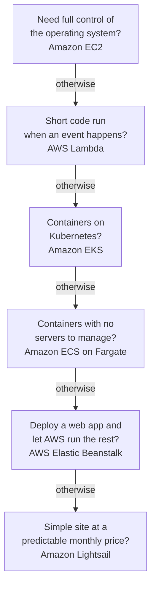
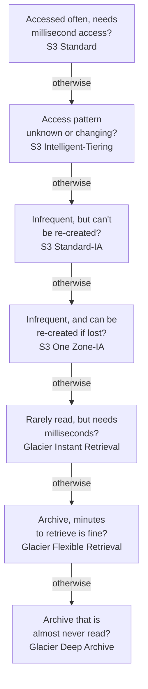

# Domain 3 — Cloud Technology and Services

Cloud Technology and Services is 34% of the scored content, the largest domain on the exam. It is
wide rather than deep: dozens of services, each with one job. Almost every question gives you a need
and asks which service meets it, so the skill is matching the need to the job, and telling a service
apart from the neighbour that does something close to it.

| Exam guide task | Where it is taught |
|---|---|
| 3.1 Define methods of deploying and operating in the AWS Cloud | Ways to deploy and operate |
| 3.2 Define the AWS global infrastructure | Regions, Availability Zones and edge locations |
| 3.3 Identify AWS compute services | Compute |
| 3.4 Identify AWS database services | Databases |
| 3.5 Identify AWS network services | Networking |
| 3.6 Identify AWS storage services | Storage |
| 3.7 Identify AWS AI/ML services and analytics services | AI, machine learning and analytics |
| 3.8 Identify services from other in-scope AWS service categories | Messaging, business applications and other services |

The principal definitions on this page are AWS's own, from the pages listed under Official sources at
the end. Columns headed "the separator" or "the tell", and the two decision ladders, are our exam
guidance.

---

## What this domain actually asks

Three habits carry most of the marks here.

**Read the stem for the job, then name the service.** A stem that says "convert speech to text" wants
Amazon Transcribe, "text to speech" wants Amazon Polly, "query data in S3 with SQL" wants Amazon
Athena. Learn each service by the verb it owns.

**Know the boundary pairs.** Most wrong options are the service next door: security groups and
network ACLs, Direct Connect and Site-to-Site VPN, EBS and EFS, SNS and SQS, AWS DMS and AWS SCT.
Each pair has one separator, and the comparison tables below give it.

**Prefer the managed option when it meets the requirements.** When a stem asks for less
administration, the answer is usually the managed or serverless service: Amazon RDS rather than a
database on EC2, Fargate or Lambda rather than servers you run. When it asks for full control, the
answer moves the other way. Engine compatibility, licensing or a feature the managed service lacks can
also outweigh the saving in administration.

---

## Ways to deploy and operate

**There are three ways in: the console, programmatic access, and infrastructure as code.** The AWS
Management Console is a web application that gives central access to every service console.
Programmatic access means the application programming interfaces (APIs), the software development
kits (SDKs) that let code call AWS, and the AWS Command Line Interface (AWS CLI). The CLI gives the
same functionality as the console from a command shell, with direct access to AWS's public APIs.

**Infrastructure as code (IaC)** treats infrastructure the way developers treat code: configuration
is written declaratively and kept in source control. AWS CloudFormation is the in-scope example. You
write a template describing the resources you want, and CloudFormation provisions and configures them.
The same template can help you rebuild the infrastructure in another Region, though Region-specific
values and service availability may need adjusting.

| Method | Best for | The tell in a question |
|---|---|---|
| AWS Management Console | One-time, interactive work | "Quickly", "a single change", a person clicking |
| Programmatic access: APIs, SDKs, AWS CLI | Scripts and applications calling AWS | "From an application", "automate from the command line" |
| Infrastructure as code (AWS CloudFormation) | Repeatable processes and identical environments | "Repeatable", "consistent", "template", "every Region" |

The guide asks you to determine whether a requirement needs a one-time operation or a repeatable process. AWS says provisioning with
scripts and manual run books leaves new environments "not always repeatable, reliable, or
consistent". When the stem wants the same environment many times, the answer is infrastructure as
code.

**Deployment models.** In a cloud deployment, every part of the application runs in the cloud. A
hybrid deployment connects cloud resources with resources that are not in the cloud, most often
existing on-premises infrastructure. An on-premises deployment, sometimes called a private cloud, lacks
most cloud benefits and is chosen for dedicated resources. AWS Outposts sits between them: AWS
installs and manages AWS infrastructure in your own building, for low latency and local data
processing.

| Deployment model | What runs where |
|---|---|
| Cloud | Everything in the cloud |
| Hybrid | Cloud resources connected to resources outside it, usually on premises |
| On-premises (private cloud) | Everything in your own data centre |

---

## Regions, Availability Zones and edge locations

**A Region contains Availability Zones; edge locations are separate, and closer to users.** An AWS
Region is a physical location with multiple Availability Zones. An Availability Zone is one or more
discrete data centres with redundant power, networking and connectivity. Edge locations are the
worldwide network of data centres that Amazon CloudFront uses to deliver content to users with low
latency.

**Availability Zones do not share single points of failure.** AWS keeps generators and cooling
separate per Availability Zone, and places zones far enough apart to avoid correlated failures but
close enough for synchronous replication. That is why high availability means running across
multiple Availability Zones: each subnet sits in one zone, and resources spread over several survive
the loss of one. A load balancer across those zones sends traffic only to the healthy ones.

**Regions are isolated from each other.** A failure stays inside one Region, and the resources and data you
create in a Region do not exist in any other Region unless you replicate or copy them. The guide
lists four reasons to use more than one Region.

| Reason for multiple Regions | Why a second Region helps |
|---|---|
| Disaster recovery | A Region-wide disaster is survived by recovering in another Region |
| Business continuity | The business keeps running from the second Region while the first is down |
| Low latency for end users | Users far from your first Region reach a nearer one |
| Data sovereignty | You choose the Region, and so the country, where you store your data |

For a data residency requirement, choosing the Region is the start; each service's documentation
says how that service handles your data.

Multiple Availability Zones answer the loss of a data centre. For a disaster that takes out a
Region, or where a regulator requires it, AWS's disaster recovery guidance moves to strategies with a
recovery site in another Region.

**Edge locations bring content closer.** Amazon CloudFront routes each request to the edge location
with the lowest latency, and fetches content it does not yet hold from your origin, such as an S3
bucket. AWS Global Accelerator does something different: it gives you static IP addresses and carries
traffic over the AWS global network to the nearest Regional endpoint. CloudFront caches content;
Global Accelerator speeds up the path.

<b>Self-check — global infrastructure</b>

1. Why does running in two Availability Zones protect an application from a power failure?
2. A company must keep customer data inside one country. What property of Regions makes that possible?
3. A static website loads slowly for users on another continent. Which service caches it near them?
4. Will two Availability Zones in one Region protect against the loss of the whole Region?

**Answers.** (1) Availability Zones do not share generators, cooling or power substations. (2) Data
you create in a Region stays there unless you copy it; for a residency rule, still check the service. (3) Amazon CloudFront. (4) No: that needs a
recovery site in another Region.

---

## Compute

**Amazon EC2 gives you virtual servers; everything else in this section takes some of the server
away.** EC2 provides on-demand, scalable capacity: you launch as many or as few instances as you need,
from Amazon Machine Images that package the operating system and software. Each instance type offers a
different balance of compute, memory, storage and networking.

| Instance family | Built for | Example workloads |
|---|---|---|
| General purpose | A balance of compute, memory and networking | Web servers, code repositories |
| Compute optimized | Compute-bound work on high-performance processors | Batch processing, media transcoding, game servers |
| Memory optimized | Large data sets processed in memory | In-memory databases, data analytics |
| Storage optimized | Very high input/output on large local data sets | High-throughput databases, data processing |

Accelerated computing instances add hardware accelerators for graphics and floating-point work. The
pair most often confused is compute against memory: if the stem names the processor, it is compute
optimized; if it names data held in memory, it is memory optimized.

**Scaling and load balancing are two different jobs.** Amazon EC2 Auto Scaling changes how many
instances you run, launching or terminating them as demand rises and falls. That is the guide's
"auto scaling provides elasticity". Elastic Load Balancing spreads incoming traffic across the
instances you have, in one or more Availability Zones, and sends it only to healthy ones. That raises
availability and fault tolerance.

**Containers and serverless.** Amazon Elastic Container Service (Amazon ECS) is AWS's managed
container orchestrator. Amazon Elastic Kubernetes Service (Amazon EKS) is managed Kubernetes; if the
stem says Kubernetes, the answer is EKS. AWS Fargate runs containers without servers or EC2 clusters
to manage, with Amazon ECS or with Amazon EKS. AWS Lambda runs code in response to events without servers, each invocation for up to 15
minutes. Amazon Elastic Container Registry (Amazon ECR) stores container images; it does not run them.

Read the ladder from the top and stop at the first question the stem answers "yes" to. It is our
memory aid for common cues, not an AWS method or a strict order. Fargate appears with ECS here
because Kubernetes already pointed to EKS, but EKS can run on Fargate too.

Three more compute services each fit one stem. AWS Elastic Beanstalk deploys your web application and
handles the instances, load balancing, monitoring and scaling for it. Amazon Lightsail is AWS's
easiest starting point for websites, with servers, storage and more at a low, predictable monthly
price. AWS Batch runs batch computing jobs and provisions the compute they need.

<b>Self-check — compute</b>

1. A media company transcodes video around the clock. Which instance family fits, and why not memory
   optimized?
2. Traffic doubles every evening. Which service adds instances, and which spreads requests across
   them?
3. A team wants to run containers on Kubernetes without operating the control plane. Which service?
4. A nightly job runs for three hours. Why is AWS Lambda a poor fit?

**Answers.** (1) Compute optimized: transcoding is processor-bound. (2) Amazon EC2 Auto Scaling adds
them; Elastic Load Balancing spreads the traffic. (3) Amazon EKS. (4) A Lambda function invocation runs
for at most 15 minutes.

---

## Databases

**Choose between running the database yourself and letting AWS run it.** You can install a database
on Amazon EC2, but then you update the operating system and database software yourself. AWS
recommends Amazon Relational Database Service (Amazon RDS) as the default for most relational
databases. RDS manages backups, patching, failure detection and recovery, and offers high availability
with a synchronous standby to fail over to. That is the guide's "EC2 hosted databases or AWS managed
databases" decision: choose EC2 only when the stem needs control that a managed service does not give.

| Need | Service | Type |
|---|---|---|
| Relational database on a familiar engine (MySQL, PostgreSQL, Oracle, SQL Server and others) | Amazon RDS | Relational |
| AWS-built relational engine compatible with MySQL and PostgreSQL | Amazon Aurora | Relational |
| Key-value or document data, single-digit millisecond performance at any scale, serverless | Amazon DynamoDB | NoSQL |
| An in-memory cache or data store in front of a database | Amazon ElastiCache | Memory-based |
| MongoDB-compatible documents | Amazon DocumentDB | Document |
| Highly connected data: recommendations, fraud detection | Amazon Neptune | Graph |
| A petabyte-scale data warehouse for analytics | Amazon Redshift | Data warehouse |

The guide names three types: relational (RDS and Aurora), NoSQL (DynamoDB) and memory-based
(ElastiCache). ElastiCache is a cache: it holds data in memory to speed an application up, in front
of the database that keeps the durable copy.

**Migrating a database takes two tools when the engine changes.** AWS Database Migration Service (AWS DMS) moves the data. When the target uses a different engine, the AWS Schema
Conversion Tool (AWS SCT), or DMS Schema Conversion, converts the schema first. Same engine: DMS
alone. Different engine: SCT for the schema, DMS for the data.

<b>Self-check — databases</b>

1. A team runs MySQL on EC2 and is tired of patching. What does AWS recommend?
2. An app needs single-digit millisecond reads at any scale with a key-value model. Which service?
3. A company is moving from Oracle to Aurora PostgreSQL. Which tool converts the schema, and which
   moves the data?
4. What is ElastiCache for?

**Answers.** (1) Amazon RDS, which manages patching, backups and recovery. (2) Amazon DynamoDB.
(3) AWS SCT converts the schema; AWS DMS moves the data. (4) An in-memory cache or data store that
speeds up an application.

---

## Networking

**A Virtual Private Cloud (VPC) is your own isolated network in AWS.** Amazon VPC lets you launch
resources in a logically isolated virtual network you define. Inside it, a subnet is a range of internet protocol (IP) addresses in one Availability Zone. A public subnet has a route to an internet
gateway; a private subnet does not.

| Component | What it does |
|---|---|
| Subnet | A range of addresses in one Availability Zone, public or private |
| Internet gateway | Two-way communication between the VPC and the internet |
| NAT gateway | Lets private-subnet instances connect out; outside services cannot start a connection in |
| Security group | Firewall for an instance |
| Network access control list (ACL) | Firewall for a subnet |

NAT is network address translation (NAT). A private subnet needs a NAT device only to reach the
internet: its instances connect out, and outside services cannot start a connection to them. To reach AWS services
privately, AWS PrivateLink (below) needs no NAT at all.

**Security groups and network ACLs are the pair to know cold.** Both filter traffic; they differ on
three points, and AWS's own comparison gives all three.

| | Security group | Network ACL |
|---|---|---|
| Level | Instance | Subnet |
| Rules | Allow only | Allow and deny |
| Return traffic | Allowed automatically (stateful) | Must be allowed explicitly (stateless) |

To block one specific IP address, you need a deny rule, so you need a network ACL. The guide also
lists Amazon Inspector under "security in a VPC": it finds vulnerabilities and unintended network
exposure, as taught in Domain 2. It is not a firewall.

**Amazon Route 53 is DNS.** It registers domain names, routes users to your resources through the
Domain Name System (DNS), and runs health checks that send traffic away from unhealthy resources. It
does not cache content; CloudFront does.

**Connecting your network to AWS.**

| Option | What it is | The separator |
|---|---|---|
| AWS Direct Connect | A dedicated fibre connection to a Direct Connect location | Bypasses the internet: consistent, but not encrypted by default |
| AWS Site-to-Site VPN | Encrypted IPsec tunnels between your network and your VPC | Over your existing internet connection |
| AWS Client VPN | A managed VPN for individual users | People connecting from anywhere |
| AWS Transit Gateway | A hub joining many VPCs and on-premises networks | Many networks, one hub |

Private is not the same as encrypted. Direct Connect does not encrypt traffic by default, so when a
scenario needs encryption as well, run Site-to-Site VPN over the Direct Connect connection.

The guide's "AWS VPN" covers both Site-to-Site and Client VPN. Two more connect services rather than
networks. AWS PrivateLink lets a VPC reach services privately, as if they were inside it, with no
internet gateway. Amazon API Gateway creates and manages APIs for your applications.

<b>Self-check — networking</b>

1. A security team must block one malicious IP address from a subnet. Security group or network ACL?
2. Instances in a private subnet need software updates from the internet but must accept no inbound
   connections. What do they use?
3. A company needs a consistent, private connection to AWS that avoids the internet. Which option?
4. Which service registers domains and routes traffic away from failed servers?

**Answers.** (1) A network ACL: only it supports deny rules. (2) A NAT gateway. (3) AWS Direct
Connect. (4) Amazon Route 53.

---

## Storage

**Three kinds of storage: objects, blocks and files.** Amazon S3 is object storage for almost any
amount of data: data lakes, websites, backups, archives. Amazon Elastic Block Store (Amazon EBS) gives
block storage volumes that attach to an EC2 instance like a local drive, with snapshots that persist on
their own. Amazon Elastic File System (Amazon EFS) is a shared file system that instances in several
Availability Zones can use at once.

| Storage | Type | The separator |
|---|---|---|
| Amazon S3 | Object | Any amount of data: data lakes, websites, backups, archives |
| Amazon EBS | Block, persistent | Attached to an instance; survives stops; snapshots |
| Instance store | Block, temporary | On the host; lost when the instance stops |
| Amazon EFS | File, shared, Network File System (NFS) | Many instances across Availability Zones at once |
| Amazon FSx | File, fully managed | For example Windows file servers using Server Message Block (SMB) |
| AWS Storage Gateway | Hybrid | On-premises access to cloud storage, with a local cache |

**The two block storage solutions behave differently. Instance store is temporary.** Its data survives a reboot but not a stop, hibernation or
termination, so it suits caches, buffers and scratch data. Anything that must persist goes on EBS.
For the guide's "cached file systems", recognise AWS Storage Gateway. It has two caching modes that
are not the same feature. Volume Gateway cached volumes are block storage: data lives in S3 and the
frequently used part is cached on premises for low latency. S3 File Gateway gives file shares over
NFS or SMB backed by S3, and it also caches locally.

**S3 storage classes trade access speed against price.** Every object has a storage class, and S3
Standard is the default.

Read the ladder from the top and stop at the first "yes". It is our memory aid. The infrequent access
(IA) classes give millisecond access but charge to retrieve. S3 Standard-IA keeps data in several
Availability Zones; S3 One Zone-IA keeps it in one, so it is cheaper but lost if that zone is. The S3
Glacier classes are for long-term archives. Glacier Instant Retrieval still answers in milliseconds;
Flexible Retrieval and Deep Archive data is archived and not available in real time. All three
Glacier classes have minimum storage durations and retrieval fees, so they suit data you will leave
alone; a scenario that names retrieval time or cost is pointing at those trade-offs.

**Lifecycle policies move data down the ladder for you.** The classic use cases are logs and backups that cool over time. An S3 Lifecycle configuration has transition
actions, which move objects to cheaper classes after a set time, and expiration actions, which delete
them, for example at the end of a retention period. You do not need a script.

**Backup and recovery.** The use cases for AWS Backup are central backup policies and compliance across many services. AWS Backup centralises and automates backups across AWS services, with
policies managed in one place. AWS Elastic Disaster Recovery is different: it replicates servers into AWS so you can recover applications quickly.

<b>Self-check — storage</b>

1. An application writes scratch files that can be lost at any time and needs the fastest local disk.
   EBS or instance store?
2. Fifty Linux instances across three Availability Zones must read the same files. Which service?
3. Log files are read for 30 days, then kept for seven years and almost never read. How do you cut the
   cost without a script?
4. Why is S3 One Zone-IA cheaper than S3 Standard-IA, and when is it acceptable?

**Answers.** (1) Instance store. (2) Amazon EFS. (3) An S3 Lifecycle rule transitioning them to an
archive class such as S3 Glacier Deep Archive, then expiring them. (4) It keeps data in one
Availability Zone; it suits data you can re-create.

---

## AI, machine learning and analytics

**Most AI services are ready-made: you call them, you do not train them.** Learn each by the task it can accomplish. Amazon SageMaker AI is the
exception. It is the managed platform for building, training and deploying your own machine learning
(ML) models. The others need no ML expertise.

| Need | Service |
|---|---|
| Build, train and deploy your own ML models | Amazon SageMaker AI |
| A chatbot that talks by voice or text | Amazon Lex |
| Text to lifelike speech | Amazon Polly |
| Speech to text | Amazon Transcribe |
| Translate text between languages | Amazon Translate |
| Sentiment, key phrases and entities in text | Amazon Comprehend |
| Text, forms and tables from scanned documents | Amazon Textract |
| Objects, faces and text in images and video | Amazon Rekognition |
| A generative AI assistant | Amazon Q |

The pairs that trip candidates are direction pairs. Polly speaks text; Transcribe writes down speech.
Comprehend understands text it is given; Textract pulls text out of a document image.

**Analytics services split by what they do to data.**

| Need | Service |
|---|---|
| Query data where it sits in S3 with Structured Query Language (SQL) | Amazon Athena |
| Collect and process streaming data in real time | Amazon Kinesis |
| Discover, prepare and move data: extract, transform and load (ETL) | AWS Glue |
| Dashboards and business intelligence | Amazon Quick Sight |
| A petabyte-scale data warehouse | Amazon Redshift |
| Big data frameworks such as Apache Hadoop and Spark | Amazon EMR |
| Search and log analytics clusters | Amazon OpenSearch Service |

Athena against Redshift is the analytics boundary the exam likes. Athena queries files in S3 directly.
Redshift is a warehouse you load data into.

<b>Self-check — AI and analytics</b>

1. A call centre must turn recorded calls into text and then judge whether customers were happy.
   Which two services, in order?
2. A website must read articles aloud. Which service?
3. An analyst wants to run one-off SQL queries against log files already in S3, with no servers.
   Which service?
4. What does SageMaker AI do that Rekognition does not?

**Answers.** (1) Amazon Transcribe, then Amazon Comprehend. (2) Amazon Polly. (3) Amazon Athena.
(4) It lets you build, train and deploy your own models; Rekognition is ready-made.

---

## Messaging, business applications and other services

**Application integration: push, queue or route.** SNS, SQS and EventBridge are the guide's application integration services.

| Need | Service | The separator |
|---|---|---|
| Send alerts and notifications to many subscribers (email, short message service (SMS) texts, apps) | Amazon SNS | Push to many: publish once to a topic |
| Decouple components with a queue | Amazon SQS | A queue that a consumer reads from |
| Connect components with events | Amazon EventBridge | Event-driven routing |
| Orchestrate steps into a workflow | AWS Step Functions | A state machine of steps |

The guide's "deliver messages and send alerts and notifications" is SNS for alerts and SQS for
queued messages. An alarm that must reach a whole team at once is SNS.

**Business applications.** Amazon Connect is a cloud contact centre that connects customers with
agents. Amazon Simple Email Service (Amazon SES) sends and receives email, such as marketing and order
confirmations, from your own domains.

**Developer tools and their capabilities.** AWS CodeBuild compiles code, runs tests and produces deployable artifacts.
AWS CodePipeline automates the whole release process. AWS X-Ray traces requests through an application
and the services it calls, which is how you troubleshoot. The guide's "develop, deploy, and
troubleshoot" maps to those three.

**End-user computing** presents virtual machines (VMs) and applications on users' own devices.
Amazon WorkSpaces gives each user a full virtual desktop. Amazon AppStream 2.0 streams individual
applications. Amazon WorkSpaces Secure Browser hosts the browser in AWS for reaching internal websites
and software as a service (SaaS) apps. It streams the rendered page to the user's device; AWS states that
no HTML, document object model (DOM) or sensitive company data is transmitted to it.

**Frontend, IoT and customer enablement.** AWS Amplify hosts and deploys frontend web and mobile applications, full stack, from a Git repository. AWS IoT Core connects Internet of Things (IoT) devices to each other and to AWS
services. AWS Support, the guide's customer enablement service, offers plans for business support assistance; every plan, including the free
one, gives round-the-clock customer service, documentation and forums. The plans themselves are
taught in Domain 4.

**Names that have changed.** Several services in this domain have new names or notices. They do not
change the service distinctions taught here. The current exam guide still uses the names in the left
column, so recognise those, know the current name, and check the guide and AWS's pages for later
changes. A rename changes the name, not the service. Closed to new customers is a notice about
new sign-ups; on its own it does not mean existing customers lose the service.

| Name in the exam guide | Name AWS uses now | Availability notice |
|---|---|---|
| Amazon AppStream 2.0 | Amazon WorkSpaces Applications | None; AWS says the renamed client is the same application |
| Amazon Quick Sight | Amazon Quick Sight, a feature within Amazon Quick | None |
| Amazon Connect | Amazon Connect Customer | None |
| Amazon WorkSpaces Secure Browser | Unchanged | Closes to new customers on 29 October 2026 (checked 1 October 2026) |
| Amazon Q | Amazon Q Developer, unchanged | Amazon Q Business is closed to new customers (checked 1 October 2026) |
| Amazon S3 Glacier | S3 Glacier storage classes, unchanged | The original vault service is closed to new customers (checked 1 October 2026) |

<b>Self-check — other services</b>

1. A monitoring alarm must email and text the whole operations team at once. SNS or SQS?
2. An order system must keep working when the shipping service is slow. Which service decouples them?
3. Which service compiles code and runs unit tests, and which automates the release?
4. Contractors need a full Windows desktop on their own laptops. Which service?

**Answers.** (1) Amazon SNS. (2) Amazon SQS. (3) AWS CodeBuild compiles and tests; AWS CodePipeline
automates the release. (4) Amazon WorkSpaces.

---

## Traps worth carrying into the exam

- **Repeatable means infrastructure as code**; the console is for one-time work.
- **Hybrid means cloud plus on premises**, not two Regions.
- **Multiple Availability Zones for high availability; multiple Regions for disaster recovery,
  latency and data sovereignty.**
- **CloudFront caches content at edge locations; Global Accelerator speeds the route.**
- **Compute optimized is the processor; memory optimized is the data in memory.**
- **Auto Scaling changes the number of instances; a load balancer shares traffic among them.**
- **Kubernetes means EKS. ECR stores images; it does not run them.**
- **A Lambda function invocation runs for at most 15 minutes.**
- **RDS is the default relational choice; on EC2 you patch it yourself.**
- **DMS moves data; SCT converts schemas.**
- **Security groups: instance, allow only, stateful. Network ACLs: subnet, allow and deny,
  stateless.**
- **Direct Connect avoids the internet but is not encrypted by default; Site-to-Site VPN encrypts.**
- **Instance store is lost when the instance stops.**
- **EFS is shared across instances; EBS typically attaches to one.**
- **One Zone-IA only for data you can re-create.**
- **Polly speaks; Transcribe listens. Comprehend understands; Textract extracts.**
- **SNS pushes; SQS queues.**
- **WorkSpaces is a desktop; AppStream 2.0 streams applications.**

---

## Official sources

The principal definitions and examples on this page are drawn from these AWS pages. Check them rather
than any summary, including this one. All were retrieved on 1 October 2026.

- [AWS Certified Cloud Practitioner exam guide, Domain 3: Cloud Technology and Services](https://docs.aws.amazon.com/aws-certification/latest/cloud-practitioner-02/cloud-practitioner-02-domain3.html) — the eight task statements
- [AWS Management Console](https://docs.aws.amazon.com/awsconsolehelpdocs/latest/gsg/what-is.html), [AWS CLI](https://docs.aws.amazon.com/cli/latest/userguide/cli-chap-welcome.html), [infrastructure as code](https://docs.aws.amazon.com/whitepapers/latest/introduction-devops-aws/infrastructure-as-code.html), [AWS CloudFormation](https://docs.aws.amazon.com/AWSCloudFormation/latest/UserGuide/Welcome.html), [types of cloud computing](https://docs.aws.amazon.com/whitepapers/latest/aws-overview/types-of-cloud-computing.html) and [AWS Outposts](https://docs.aws.amazon.com/outposts/latest/userguide/what-is-outposts.html)
- [Global infrastructure](https://docs.aws.amazon.com/whitepapers/latest/aws-overview/global-infrastructure.html), [AWS fault isolation boundaries: Availability Zones](https://docs.aws.amazon.com/whitepapers/latest/aws-fault-isolation-boundaries/availability-zones.html) and [Regions](https://docs.aws.amazon.com/whitepapers/latest/aws-fault-isolation-boundaries/regions.html), [disaster recovery options](https://docs.aws.amazon.com/whitepapers/latest/disaster-recovery-workloads-on-aws/disaster-recovery-options-in-the-cloud.html), [Amazon CloudFront](https://docs.aws.amazon.com/AmazonCloudFront/latest/DeveloperGuide/Introduction.html) and [AWS Global Accelerator](https://docs.aws.amazon.com/global-accelerator/latest/dg/what-is-global-accelerator.html)
- [Amazon EC2](https://docs.aws.amazon.com/AWSEC2/latest/UserGuide/concepts.html), [EC2 instance types](https://aws.amazon.com/ec2/instance-types/), [EC2 Auto Scaling](https://docs.aws.amazon.com/autoscaling/ec2/userguide/what-is-amazon-ec2-auto-scaling.html), [Elastic Load Balancing](https://docs.aws.amazon.com/elasticloadbalancing/latest/userguide/what-is-load-balancing.html), [Amazon ECS](https://docs.aws.amazon.com/AmazonECS/latest/developerguide/Welcome.html), [Amazon EKS](https://docs.aws.amazon.com/eks/latest/userguide/what-is-eks.html), [AWS Fargate](https://docs.aws.amazon.com/AmazonECS/latest/developerguide/AWS_Fargate.html), [AWS Lambda](https://docs.aws.amazon.com/lambda/latest/dg/welcome.html), [Elastic Beanstalk](https://docs.aws.amazon.com/elasticbeanstalk/latest/dg/Welcome.html) and [Lightsail](https://docs.aws.amazon.com/lightsail/latest/userguide/what-is-amazon-lightsail.html)
- [Amazon RDS](https://docs.aws.amazon.com/AmazonRDS/latest/UserGuide/Welcome.html), [Aurora](https://docs.aws.amazon.com/AmazonRDS/latest/AuroraUserGuide/CHAP_AuroraOverview.html), [DynamoDB](https://docs.aws.amazon.com/amazondynamodb/latest/developerguide/Introduction.html), [ElastiCache](https://docs.aws.amazon.com/AmazonElastiCache/latest/dg/WhatIs.html), [AWS DMS](https://docs.aws.amazon.com/dms/latest/userguide/Welcome.html) and [AWS SCT](https://docs.aws.amazon.com/SchemaConversionTool/latest/userguide/CHAP_Welcome.html)
- [Amazon VPC](https://docs.aws.amazon.com/vpc/latest/userguide/what-is-amazon-vpc.html), [security groups and network ACLs compared](https://docs.aws.amazon.com/vpc/latest/userguide/infrastructure-security.html), [Route 53](https://docs.aws.amazon.com/Route53/latest/DeveloperGuide/Welcome.html), [Direct Connect](https://docs.aws.amazon.com/directconnect/latest/UserGuide/Welcome.html), [Site-to-Site VPN](https://docs.aws.amazon.com/vpn/latest/s2svpn/VPC_VPN.html) and [Client VPN](https://docs.aws.amazon.com/vpn/latest/clientvpn-admin/what-is.html)
- [Amazon S3](https://docs.aws.amazon.com/AmazonS3/latest/userguide/Welcome.html), [S3 storage classes](https://docs.aws.amazon.com/AmazonS3/latest/userguide/storage-class-intro.html), [S3 Lifecycle](https://docs.aws.amazon.com/AmazonS3/latest/userguide/object-lifecycle-mgmt.html), [Amazon EBS](https://docs.aws.amazon.com/ebs/latest/userguide/what-is-ebs.html), [instance store data persistence](https://docs.aws.amazon.com/AWSEC2/latest/UserGuide/instance-store-lifetime.html), [Amazon EFS](https://docs.aws.amazon.com/efs/latest/ug/whatisefs.html), [Amazon FSx](https://aws.amazon.com/fsx/), [Storage Gateway](https://docs.aws.amazon.com/storagegateway/latest/vgw/WhatIsStorageGateway.html) and [AWS Backup](https://docs.aws.amazon.com/aws-backup/latest/devguide/whatisbackup.html)
- [SageMaker AI](https://docs.aws.amazon.com/sagemaker/latest/dg/whatis.html), [Lex](https://docs.aws.amazon.com/lexv2/latest/dg/what-is.html), [Polly](https://docs.aws.amazon.com/polly/latest/dg/what-is.html), [Transcribe](https://docs.aws.amazon.com/transcribe/latest/dg/what-is.html), [Comprehend](https://docs.aws.amazon.com/comprehend/latest/dg/what-is.html), [Textract](https://docs.aws.amazon.com/textract/latest/dg/what-is.html), [Rekognition](https://docs.aws.amazon.com/rekognition/latest/dg/what-is.html), [Athena](https://docs.aws.amazon.com/athena/latest/ug/what-is.html), [Kinesis Data Streams](https://docs.aws.amazon.com/streams/latest/dev/introduction.html), [AWS Glue](https://docs.aws.amazon.com/glue/latest/dg/what-is-glue.html), [Amazon Quick](https://docs.aws.amazon.com/quick/latest/userguide/what-is.html) and [Redshift](https://docs.aws.amazon.com/redshift/latest/mgmt/welcome.html)
- [Amazon SNS](https://docs.aws.amazon.com/sns/latest/dg/welcome.html), [Amazon SQS](https://docs.aws.amazon.com/AWSSimpleQueueService/latest/SQSDeveloperGuide/welcome.html), [EventBridge](https://docs.aws.amazon.com/eventbridge/latest/userguide/eb-what-is.html), [Amazon Connect](https://docs.aws.amazon.com/connect/latest/adminguide/what-is-amazon-connect.html), [Amazon SES](https://docs.aws.amazon.com/ses/latest/dg/Welcome.html), [CodeBuild](https://docs.aws.amazon.com/codebuild/latest/userguide/welcome.html), [CodePipeline](https://docs.aws.amazon.com/codepipeline/latest/userguide/welcome.html), [X-Ray](https://docs.aws.amazon.com/xray/latest/devguide/aws-xray.html), [WorkSpaces](https://docs.aws.amazon.com/workspaces/latest/adminguide/amazon-workspaces.html), [WorkSpaces Applications (AppStream 2.0)](https://docs.aws.amazon.com/appstream2/latest/developerguide/what-is-appstream.html), [WorkSpaces Secure Browser availability change](https://docs.aws.amazon.com/workspaces-web/latest/adminguide/workspaces-secure-browser-maintenance-mode.html), [AWS Amplify](https://docs.aws.amazon.com/amplify/latest/userguide/welcome.html) and [AWS IoT Core](https://docs.aws.amazon.com/iot/latest/developerguide/what-is-aws-iot.html)
