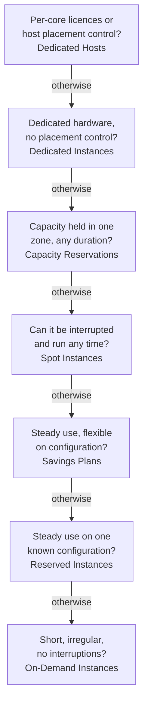

# Domain 4 — Billing, Pricing, and Support

Billing, Pricing, and Support is 12% of the scored content, the smallest domain. It rewards three
pieces of judgement: which way of paying for compute fits a workload, which billing tool answers a
cost question, and which support plan or resource meets a need. The services are few, but the options
inside each are easy to swap, and that is where the marks go.

| Exam guide task | Where it is taught |
|---|---|
| 4.1 Compare AWS pricing models | Paying for compute; data transfer and storage pricing |
| 4.2 Understand resources for billing, budget, and cost management | Billing and cost management tools |
| 4.3 Identify AWS technical resources and AWS Support options | Support plans; technical resources and partners |

The principal definitions on this page are AWS's own, from the pages listed under Official sources at
the end. Columns headed "the separator" or "the tell", and the purchasing ladder, are our exam guidance.

---

## What this domain actually asks

Three habits carry most of the marks here.

**Match the payment model to the workload's shape.** Interruptible and flexible means Spot. Steady and
predictable means a commitment: Savings Plans or Reserved Instances. Short, irregular and not
interruptible means On-Demand. Licences bound to physical cores mean Dedicated Hosts.

**Name the cost tool by when it works.** Before you build: AWS Pricing Calculator. After you spend:
AWS Cost Explorer. When spend crosses a line: AWS Budgets. The most detailed data: the AWS Cost and
Usage Report.

**Learn the current support plans.** The guide lists Basic Support, AWS Business Support+, AWS
Enterprise Support and AWS Unified Operations. Older material lists plans that AWS is retiring; learn
the four the guide names.

---

## Paying for compute

**Amazon EC2 has seven ways to pay, and the stem's workload shape picks one.**

| Option | What you commit to | Best for |
|---|---|---|
| On-Demand Instances | Nothing; pay by the second | Short-term, irregular workloads that cannot be interrupted |
| Savings Plans | A dollar amount of usage per hour, for 1 or 3 years | Steady use where the instance type or Region may change |
| Reserved Instances | A specific instance configuration, for 1 or 3 years | Steady use on a known configuration |
| Spot Instances | Nothing; spare capacity that can be interrupted | Batch jobs, data analysis, background work that can stop and restart |
| Dedicated Hosts | A physical server for your use | Per-socket, per-core licences; control over placement |
| Dedicated Instances | Hardware dedicated to your account | Isolation without placement control |
| Capacity Reservations | Capacity in one Availability Zone, any length | Business-critical capacity assurance |

Read the ladder from the top and stop at the first "yes". It is our memory aid, not an AWS method.
Real purchases also weigh capacity needs and how much interruption the workload can absorb.

**Spot is a steep discount, not a fixed price.** Amazon EC2 sets the Spot price and adjusts it
gradually with long-term supply and demand, and it can take the capacity back. Spot is the
cost-effective choice only when the work can stop and restart.

**Savings Plans against Reserved Instances.** Both trade a 1- or 3-year commitment for a lower price.
Reserved Instances commit you to a specific instance configuration. Savings Plans commit you to a
dollar amount per hour, and Compute Savings Plans then apply whatever the instance family, size,
operating system, tenancy or Region, and cover AWS Fargate and AWS Lambda too. EC2 Instance Savings
Plans narrow that to one family in one Region in exchange for a bigger discount. AWS's own EC2
documentation now recommends Savings Plans over Reserved Instances. **This does not change the exam
answer.** Reserved Instances are still sold and still in the guide; pick them when the stem fixes the
instance configuration.

**Reserved Instance flexibility.** A Reserved Instance is not a server; it is a billing discount
applied to matching usage, immediately if a matching instance is already running.

| Choice | One side | The other side |
|---|---|---|
| Offering class | Standard: bigger discount, cannot be exchanged, can be sold on the Reserved Instance Marketplace | Convertible: smaller discount, can be exchanged, cannot be sold |
| Scope | Regional: any Availability Zone in the Region; eligible Linux/Unix ones also any size in the family | Zonal: reserves capacity in one Availability Zone |

Size flexibility has exceptions: it does not apply to Reserved Instances for Windows Server, Red Hat
Enterprise Linux and some other licensed operating systems, or to those with dedicated tenancy.

**Reserved Instances in AWS Organizations.** This is the guide's "Reserved Instance behavior in AWS Organizations". The management account controls whether Reserved Instance
and Savings Plans discounts are shared across the organization. With sharing on, the owning account
benefits first and the rest flows to other accounts.

**Dedicated Hosts against Dedicated Instances.** Both put your instances on hardware no other customer
uses, and AWS says there is no performance, security or physical difference. Dedicated Hosts add
control over which physical server runs each instance, and full Bring Your Own License (BYOL) support
for per-socket, per-core or per-virtual-machine licences. Dedicated Instances give no placement control and
only limited BYOL support, so whether an existing licence fits depends on its terms. Either kind of
dedicated hardware can help meet compliance requirements that call for it.

<b>Self-check — paying for compute</b>

1. A nightly analytics job can stop and resume without harm. Which option is most cost-effective?
2. A company will run steady EC2 capacity for three years but expects to change instance families and
   move some work to Lambda. Savings Plans or Reserved Instances?
3. A licence is priced per physical core. Which option, and why not Dedicated Instances?
4. Can a Convertible Reserved Instance be sold on the Reserved Instance Marketplace?

**Answers.** (1) Spot Instances. (2) Savings Plans: Compute Savings Plans follow the usage across
families and into Lambda. (3) Dedicated Hosts, which give full per-core licence support; Dedicated
Instances do not. (4) No; only Standard Reserved Instances can be sold.

---

## Data transfer and storage pricing

**Data coming in is free; data going out is not.** Incoming data transfer costs nothing: AWS states that data transfer in is always free of charge. That is the
transfer charge itself, not every cost around it: Amazon S3, for example, still charges for storage and
requests, so check the service's pricing page. Outgoing data transfer costs money, including transfer within the same Region in some cases. Data transfer out to the internet is charged, and tiered so the price per gigabyte falls as
volume rises. Inside AWS the guide wants two more cases.

| Transfer | Charged? |
|---|---|
| Into AWS from the internet | No, always free |
| Out to the internet | Yes, tiered by volume |
| From one Region to another | Yes: charged out of the source Region; data into the destination is not charged |
| Between Availability Zones in the same Region | Yes for many services, in both directions |
| From Amazon S3 to a service in the same Region, or to CloudFront | No |

**Storage is priced by how you use it.** Amazon S3 has no minimum charge: you pay for storage,
requests and retrieval, data transfer and management features. The storage price depends on object
size, how long you keep it and its storage class, and the cheaper classes for rarely used data add
retrieval fees and minimum storage durations. Amazon EBS is different: you pay for what you provision,
not what you write.

<b>Self-check — data transfer and storage</b>

1. A company uploads 50 terabytes of data into Amazon S3 from its data centre over the internet. What
   is the transfer charge for the upload?
2. An application copies data between two Availability Zones in the same Region. Is that always free?
3. Why can deleting an object early from an S3 Glacier class still cost money?

**Answers.** (1) Nothing: data transfer in is always free. (2) No: transfer between Availability
Zones is charged for many services. (3) The Glacier classes have minimum storage durations.

---

## Billing and cost management tools

**Each tool works at a different time, and knowing their capabilities is the guide's point.** Pricing information for each AWS service is published on its own pricing page.

| Tool | What it does | The tell in a question |
|---|---|---|
| AWS Pricing Calculator | Estimates costs before you use AWS; free, no AWS experience needed | "Estimate", "before migrating", "plan" |
| AWS Cost Explorer | Views and analyzes past costs and usage, forecasts spend, recommends Reserved Instances | "Analyze", "trend", "forecast" |
| AWS Budgets | Alerts on actual or forecasted spend, and can take actions | "Alert when", "threshold", "notify" |
| AWS Cost and Usage Reports | The most detailed cost and usage data, delivered to an S3 bucket | "Most detailed", "line items", "by hour" |

Budgets can also watch Reserved Instance and Savings Plans utilisation, notify by email or Amazon SNS,
and apply an action such as an IAM policy that stops new resources. An alert or notification only
tells you; the budget action is what blocks new resources. The Cost Explorer interface is
free.

**AWS Organizations consolidated billing.** The management account pays for every member account,
the organization gets one bill, and each account's charges can still be tracked. Usage is combined,
so volume discounts, Reserved Instance discounts and Savings Plans are shared. It costs nothing extra.

**Cost allocation tags and their relation to billing reports.** A tag is a key and value on a resource. Activated cost allocation tags
organise costs on the cost allocation report, so you can see spend by project, team or environment.
There are two types, AWS-generated and user-defined, and both must be activated before they appear in
Cost Explorer or the report. The Cost and Usage Report can then break costs down by those tags.

**AWS Billing and Cost Management** is the console that ties these together: it sets up billing, pays invoices, and analyses, organises and plans costs.

**Billing support and information.** Every account owner has account and billing support free of charge, and
anyone can open an account and billing case in the AWS Support Center. Only personalised technical support needs a paid plan.

<b>Self-check — billing tools</b>

1. A startup wants an estimate of its monthly AWS bill before it migrates. Which tool?
2. A finance team wants an email when spend is forecast to pass its monthly limit. Which tool?
3. Five departments have separate accounts and want one bill and shared volume discounts. What do they
   use?
4. Tags were added to every resource last week, but nothing appears in Cost Explorer. What step is
   missing?

**Answers.** (1) AWS Pricing Calculator. (2) AWS Budgets. (3) AWS Organizations consolidated billing.
(4) Activating them as cost allocation tags.

---

## Support plans

**Four plans, from free to mission-critical.**

| Plan | AWS's description | Notable inclusions |
|---|---|---|
| Basic Support | Included for all customers | 24/7 customer service, documentation, whitepapers, re:Post; core Trusted Advisor checks; AWS Health. No technical cases |
| AWS Business Support+ | Minimum recommended plan for production workloads | Technical cases, full Trusted Advisor checks, the AWS Health API |
| AWS Enterprise Support | For business-critical workloads | A designated Technical Account Manager (TAM) |
| AWS Unified Operations | For mission-critical workloads needing enhanced resilience | Application-specific expertise for mission-critical systems |

The questions turn on two things: which is the minimum plan that gives a feature, and which plan
names a designated Technical Account Manager. Technical support cases, the full set of Trusted Advisor
checks and the AWS Health API all start at Business Support+. A designated TAM starts at Enterprise
Support.

> **Currency note.** AWS is retiring Developer Support and Business Support on 1 January 2027, and
> moving Enterprise On-Ramp customers to Enterprise Support during 2026 before discontinuing
> Enterprise On-Ramp on the same date. Those three plans remain available in the AWS GovCloud (US)
> Region. Older study material and
> some practice questions still use those names. **The current exam guide lists only Basic Support,
> AWS Business Support+, AWS Enterprise Support and AWS Unified Operations.** Answer with those four.
> Checked 1 October 2026.

**Trusted Advisor and AWS Health help monitor different things.** AWS Trusted Advisor inspects your account
and recommends improvements in six categories: cost optimisation, performance, security, fault
tolerance, service limits and operational excellence. That is the guide's cost-optimisation role. AWS
Health shows the availability of AWS services and alerts you when events affect your resources. The
AWS Health Dashboard needs no setup and every customer has it; calling the AWS Health API needs
Business Support+ or above. Do not confuse it with the AWS Support API, which automates support cases
and Trusted Advisor operations. Both start at Business Support+, but they are different APIs.

<b>Self-check — support plans</b>

1. What is the least expensive plan that lets a company open technical support cases?
2. Which plan first includes a designated Technical Account Manager?
3. A team wants a recommendation to remove idle resources. Trusted Advisor or AWS Health?
4. Which of today's plans does AWS describe as the minimum for production workloads?

**Answers.** (1) AWS Business Support+. (2) AWS Enterprise Support. (3) AWS Trusted Advisor.
(4) AWS Business Support+.

---

## Technical resources and partners

**Free resources available on official AWS websites, the community, and technical assistance you can hire.**

| Need | Resource |
|---|---|
| Answers from the community and AWS experts | AWS re:Post |
| Official answers to the most common questions | AWS Knowledge Center (on re:Post) |
| Expert guidance on adoption and modernisation | AWS Prescriptive Guidance |
| Whitepapers, guides, blogs and reference architectures | AWS whitepapers, AWS blogs and documentation websites |
| Paid expert help to design, build and migrate | AWS Professional Services |
| Report abuse of AWS resources, such as spam or attacks | AWS Trust and Safety team |

The guide also names AWS solutions architects. They are AWS staff who work with customers, alongside account managers and Technical Account Managers.

**The AWS Partner Network (APN)** is a global community of organisations that build solutions and
services with AWS. Partners include independent software vendors, who sell software, and system
integrators and consultancies, who deliver training and professional services. The exam guide lists three benefits of being an AWS Partner: partner
training and certification, partner events and partner volume discounts. Partner volume discounts
belong to partner membership. They are not the volume pricing that consolidated billing shares
across the accounts in a customer's organization.

**AWS Marketplace** is where you buy what partners sell: a curated catalogue of third-party software,
data and services, billed through your AWS bill. It also helps with the guide's cost management and
governance points. All pricing options are billed from one source, and Private Marketplace lets
administrators control which products users across the organization may buy.

<b>Self-check — resources and partners</b>

1. A customer sees an EC2 instance sending spam from AWS's address range. Who do they report it to?
2. A company wants paid AWS experts to help design and migrate a workload. Which resource?
3. An administrator wants to limit Marketplace purchases to an approved list. Which feature?

**Answers.** (1) The AWS Trust & Safety team. (2) AWS Professional Services. (3) Private Marketplace.

---

## Traps worth carrying into the exam

- **Spot can be interrupted; On-Demand cannot.** Never choose Spot for work that must not stop.
- **Savings Plans commit to dollars per hour; Reserved Instances commit to a configuration.**
- **A Reserved Instance is a billing discount, not a server.**
- **Standard: bigger discount, sellable, not exchangeable. Convertible: the reverse.**
- **Dedicated Hosts for per-core licences and placement control.** No security difference from
  Dedicated Instances.
- **Data in is free; data out, between Regions (charged leaving the source) and between Availability Zones costs.**
- **Pricing Calculator before, Cost Explorer after, Budgets for alerts.**
- **Cost allocation tags must be activated.**
- **Consolidated billing is free and shares discounts.**
- **Billing help is free for everyone; technical cases start at Business Support+.**
- **A designated Technical Account Manager starts at Enterprise Support.**
- **The four plans are Basic, Business Support+, Enterprise and Unified Operations.**
- **Trusted Advisor recommends; AWS Health reports what is happening to AWS services.**
- **Abuse goes to Trust & Safety, not to a support case.**

---

## Official sources

The principal definitions and examples on this page are drawn from these AWS pages. Check them rather
than any summary, including this one. All were retrieved on 1 October 2026.

- [AWS Certified Cloud Practitioner exam guide, Domain 4: Billing, Pricing, and Support](https://docs.aws.amazon.com/aws-certification/latest/cloud-practitioner-02/cloud-practitioner-02-domain4.html) — the three task statements
- [Amazon EC2 billing and purchasing options](https://docs.aws.amazon.com/AWSEC2/latest/UserGuide/instance-purchasing-options.html), [On-Demand Instances](https://docs.aws.amazon.com/AWSEC2/latest/UserGuide/ec2-on-demand-instances.html), [Reserved Instances](https://docs.aws.amazon.com/AWSEC2/latest/UserGuide/ec2-reserved-instances.html), [Reserved Instance types](https://docs.aws.amazon.com/AWSEC2/latest/UserGuide/reserved-instances-types.html), [how Reserved Instance discounts apply](https://docs.aws.amazon.com/AWSEC2/latest/UserGuide/apply_ri.html), [Spot Instances](https://docs.aws.amazon.com/AWSEC2/latest/UserGuide/using-spot-instances.html), [Savings Plans](https://docs.aws.amazon.com/savingsplans/latest/userguide/what-is-savings-plans.html), [Dedicated Hosts](https://docs.aws.amazon.com/AWSEC2/latest/UserGuide/dedicated-hosts-overview.html), [Dedicated Instances](https://docs.aws.amazon.com/AWSEC2/latest/UserGuide/dedicated-instance.html) and [Capacity Reservations](https://docs.aws.amazon.com/AWSEC2/latest/UserGuide/ec2-capacity-reservations.html)
- [AWS Pricing](https://aws.amazon.com/pricing/), [understanding data transfer charges](https://docs.aws.amazon.com/cur/latest/userguide/cur-data-transfers-charges.html), [Amazon S3 pricing](https://aws.amazon.com/s3/pricing/) and [Amazon EBS pricing](https://aws.amazon.com/ebs/pricing/)
- [AWS Budgets](https://docs.aws.amazon.com/cost-management/latest/userguide/budgets-managing-costs.html), [AWS Cost Explorer](https://docs.aws.amazon.com/cost-management/latest/userguide/ce-what-is.html), [AWS Pricing Calculator](https://docs.aws.amazon.com/pricing-calculator/latest/userguide/what-is-pricing-calculator.html), [consolidated billing](https://docs.aws.amazon.com/awsaccountbilling/latest/aboutv2/consolidated-billing.html), [discount sharing](https://docs.aws.amazon.com/awsaccountbilling/latest/aboutv2/ri-turn-off.html), [cost allocation tags](https://docs.aws.amazon.com/awsaccountbilling/latest/aboutv2/cost-alloc-tags.html), [Cost and Usage Reports](https://docs.aws.amazon.com/cur/latest/userguide/what-is-cur.html) and [getting help with your bills](https://docs.aws.amazon.com/awsaccountbilling/latest/aboutv2/billing-get-answers.html)
- [Compare AWS Support plans](https://aws.amazon.com/premiumsupport/plans/), [Developer, Business, and Enterprise On-Ramp end of support](https://docs.aws.amazon.com/awssupport/latest/user/support-plans-eos.html), [case management](https://docs.aws.amazon.com/awssupport/latest/user/case-management.html), [AWS Trusted Advisor](https://docs.aws.amazon.com/awssupport/latest/user/trusted-advisor.html), [AWS Health](https://docs.aws.amazon.com/health/latest/ug/what-is-aws-health.html) and [the AWS Health API](https://docs.aws.amazon.com/health/latest/ug/health-api.html)
- [Report abuse of AWS resources](https://repost.aws/knowledge-center/report-aws-abuse), [AWS Partner Network](https://aws.amazon.com/partners/), [AWS Marketplace](https://docs.aws.amazon.com/marketplace/latest/buyerguide/what-is-marketplace.html), [Private Marketplace](https://docs.aws.amazon.com/marketplace/latest/buyerguide/private-marketplace-current.html), [AWS Professional Services](https://aws.amazon.com/professional-services/), [AWS Prescriptive Guidance](https://aws.amazon.com/prescriptive-guidance/), [AWS re:Post](https://repost.aws/about), [AWS Knowledge Center](https://repost.aws/knowledge-center) and [AWS whitepapers](https://aws.amazon.com/whitepapers/)
