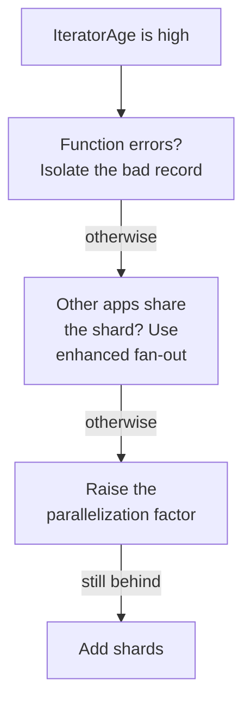
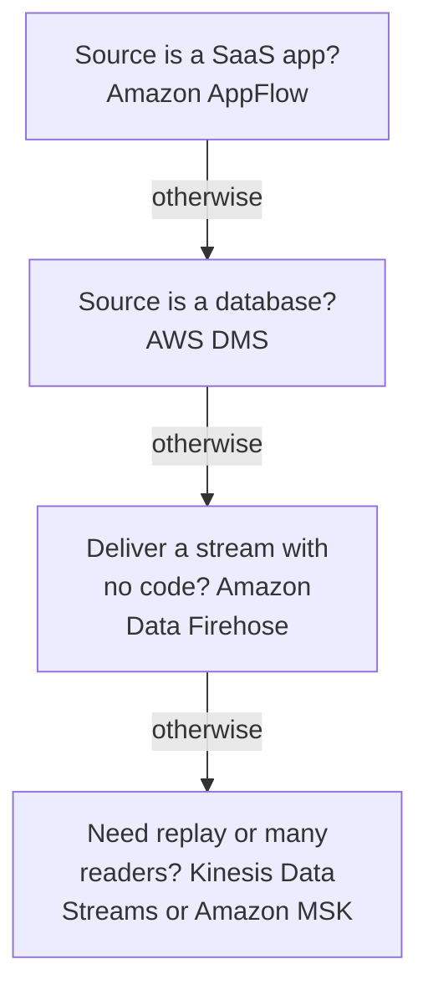

# Domain 1 — Data Ingestion and Transformation

Data Ingestion and Transformation is 34% of the scored content, the largest domain on the exam. It
rewards one kind of thinking above all: given a source, a speed and a constraint, picking the AWS
service and the setting that meets the constraint with the least effort. Most questions offer
several designs that would work. One of them breaks a stated requirement, costs more, or asks you to
run something AWS would run for you.

The sections follow the decisions the exam asks you to make, in the guide's task order.

| Exam guide task | Where it is taught |
|---|---|
| 1.1 Perform data ingestion | Streams; reading a stream; moving data in; schedules and events; throttling |
| 1.2 Transform and process data | Where the transformation runs; formats and the slow job; connecting sources |
| 1.3 Orchestrate data pipelines | Orchestrating the pipeline |
| 1.4 Apply programming concepts | Programming the pipeline, and Lambda settings throughout |

The definitions and limits on this page are AWS's own, from the pages listed under Official sources
at the end. Columns headed "the separator" or "the tell in a question", and the two ladders, are our
exam guidance.

---

## What this domain actually asks

Three habits carry most of the marks.

**Prefer the managed service that already does the job.** When a question asks for the *least operational
overhead*, the answer is usually the service built for that exact movement. Amazon Data Firehose
delivers a stream to Amazon S3 or Amazon Redshift with no consumer code. Amazon AppFlow pulls from a
software as a service (SaaS) application. A self-built consumer on Amazon EC2 works too, and it is
the distractor.

**Know which knob fixes which symptom.** A lagging stream, a throttled table, a job that runs out of
memory and a queue that loses messages each have a specific fix. The wrong answers are real
settings that fix a neighbouring problem. Raising a function's reserved concurrency does not make it
read a stream faster.

**Know each service's limits.** Lambda is for short-lived tasks. Firehose converts JSON, not CSV, to
Parquet on its own. Express workflows stop at five minutes. Many questions are decided by the one
thing a plausible service cannot do.

---

## Streams: shards, keys and how long data stays

A Kinesis data stream is a set of **shards**. Each record carries a sequence number, a partition key
and a data blob that Kinesis never inspects or changes. The **partition key** decides which shard a
record lands on, and every producer must supply one.

Each shard is a fixed unit of capacity: 1 MB per second and 1,000 records per second for writes,
2 MB per second for reads. The stream's capacity is the sum of its shards. So a skewed partition key
can throttle one shard while the rest sit idle. When a producer is throttled, AWS's first advice is
a key that spreads writes evenly across shards. For a large producer, batch writes with the Kinesis
Producer Library (KPL) or the multi-record `PutRecords` call.

### Capacity modes

| | On-demand | Provisioned |
|---|---|---|
| Shards | Managed for you | You set and change the count |
| You pay | Per GB written and read | Per shard-hour |
| Fits | Variable, unpredictable traffic | You manage shards; a hot key needing fine splits |
| Watch for | Throttling if traffic more than doubles its peak within 15 minutes | Paying for shards you do not use |

On-demand mode is not a cure for a hot key. It splits shards evenly as traffic rises, but it does not
isolate hash keys that carry a disproportionate share. For highly uneven keys AWS recommends
provisioned mode, which supports granular shard splits. In provisioned mode you **reshard**
yourself: a split turns one shard into two and raises capacity and cost; a merge combines two
shards into one. AWS calls resharding pairwise: each operation works on exactly two shards, the two a
split produces or the two a merge combines.

### Retention is what makes replay possible

A stream keeps records for **24 hours by default**, and you can raise that to 365 days at extra
cost. Reading a record does not remove it, and several applications can read the same stream
independently. That is what gives a Kinesis pipeline its **replayability**: a consumer that was down can
read the data again, as long as it is still inside the retention period. AWS describes retention as
a safety net for exactly that case. Lowering retention takes effect almost at once, so older
records become inaccessible immediately.

### The other streaming sources

**Amazon DynamoDB Streams** records item-level changes to a table for **up to 24 hours**. Each change
appears exactly once in the stream, in the order it happened to the item. You choose what each record carries: keys only, the new image, the
old image, or both. It runs asynchronously, so turning it on does not slow the table.

**Amazon MSK** runs open-source Apache Kafka as a managed service. Existing Kafka applications and
tools move without code changes, which is the tell in a question. MSK Serverless removes cluster
capacity management altogether.

> **Trap.** Switching to on-demand mode does not fix throttling caused by one hot partition key. Fix
> the key, or use provisioned mode and split the hot shard.

<b>Self-check — streams and retention</b>

1. A stream's consumer was offline for 30 hours and the data must be reprocessed. What setting
   decides whether that is possible, and what is its default?
2. One partition key carries most of a stream's traffic and writes are throttled. Why does moving to
   on-demand mode not solve it?
3. What does a DynamoDB stream record capture, and for how long?

Answers: (1) The retention period; 24 hours by default, so the data is gone unless retention was
raised beforehand. (2) On-demand splits shards evenly but does not isolate a hot hash key; fix the
key or split it in provisioned mode. (3) An item-level change, with the key, new or old image as
configured, kept for up to 24 hours.

---

## Reading a stream: shared, dedicated and Lambda

Consumers read a stream in one of two ways, and the difference decides most fan-out questions.

| | Shared-throughput consumer | Enhanced fan-out consumer |
|---|---|---|
| Read throughput | 2 MB per second per shard, split between all of them | Its own 2 MB per second per shard |
| Delivery | Polls with `GetRecords` | Pushed over HTTP/2 with `SubscribeToShard` |
| Typical delay | About 200 ms with one reader, 1,000 ms with five | About 70 ms regardless of count |
| Extra cost | None | Data retrieval and consumer-shard hours |

If several applications read the same shards and all of them fall behind, the shard's shared read
capacity is the bottleneck. AWS's fix is more shards; enhanced fan-out gives each consumer its own
pipe instead.

### Lambda as the consumer

A Lambda function can read a stream as a shared consumer or through enhanced fan-out. Lambda reads a
batch from one shard at a time and invokes the function synchronously. It processes each shard **in
order**, and if the function returns an error it stops that shard until the record succeeds or
expires. With default settings one bad record can block a shard for up to a week.

| Symptom or need | The setting | What it does |
|---|---|---|
| Function falls behind (high IteratorAge) | `ParallelizationFactor` up to 10 | Several concurrent batches per shard, still in order per key |
| Still behind | More shards | More batches in parallel across the stream |
| One record poisons a batch | `BisectBatchOnFunctionError`, retries, maximum record age | Isolates the bad record and stops endless retries |
| Keep what failed | On-failure destination | Sends details to SNS, SQS, S3 or Kafka |
| Avoid retrying good records | `ReportBatchItemFailures` | The function reports which records failed |
| Too many tiny invocations | Batching window, up to 5 minutes | Waits for a fuller batch |

Two settings look relevant and are not. **Reserved concurrency** guarantees and caps how much
concurrency a function may use. **Provisioned concurrency** keeps environments warm to cut cold
starts for interactive workloads. Neither changes how many batches Lambda reads per shard.

Lambda processes each record **at least once**, so duplicates happen, and AWS strongly recommends
idempotent code. It also starts a new consumer where you tell it: `TRIM_HORIZON` starts at the
oldest record still in the stream, `LATEST` just after the newest, so it sees only new data.

### Stateless and stateful

Lambda invocations are **stateless** by default: nothing carries from one invocation to the next
without an external store. Tumbling windows are the exception. They let a stream consumer carry an
aggregate across invocations, up to 1 MB per shard. For real stateful stream processing, Amazon
Managed Service for Apache Flink runs Flink applications in Java, Scala or Python, with state backed
up as checkpoints and snapshots, and Flink Studio for interactive SQL.

> **Trap.** Provisioned and reserved concurrency are Lambda settings, not stream settings. When a
> Kinesis consumer lags, the answer is parallelization factor, more shards or enhanced fan-out.

<b>Self-check — reading a stream</b>

1. Five applications read the same stream and all of them lag. What is the bottleneck, and what are
   two fixes?
2. A Lambda consumer has stopped advancing on one shard after a malformed record. What three settings
   stop that happening again?
3. Why is a Lambda function that keeps a running total in a variable not a reliable aggregator?

Answers: (1) The shard's shared 2 MB per second read limit; add shards, or move consumers to
enhanced fan-out. (2) A retry limit, a maximum record age, and batch bisection, plus an on-failure
destination to keep the record. (3) Invocations are stateless; use tumbling windows or an external
store.

---

## Moving data in without writing a consumer

Most ingestion questions name a source and ask for the least effort. Match the source to the
service built for it.

| Service | Moves | Worth knowing |
|---|---|---|
| Amazon Data Firehose | A stream to S3, Redshift, OpenSearch, Splunk, Apache Iceberg tables, HTTP | Buffers by size or time; not a replayable stream |
| AWS DMS | A database: existing data, ongoing changes, or both | Change capture has no latency SLA; views only in full load |
| Amazon AppFlow | SaaS data to and from S3 and Redshift | On demand, on a schedule, or on a change event |
| Redshift streaming ingestion | Kinesis or MSK straight into Redshift | No S3 landing area; each view refresh reads the new data |

**Amazon Data Firehose** is the guide's "Amazon Kinesis Data Firehose" under its current name. AWS's
documentation and AWS's own practice questions now use Amazon Data Firehose. It is the same service,
and no question turns on the name. Firehose **buffers** to a size or an interval before it delivers,
so it is near real time rather than instant. It can read from an existing Kinesis stream. For a
Redshift destination it lands data in S3 first, then runs a Redshift `COPY`. If that Redshift
cluster sits in a virtual private cloud (VPC), it must be publicly accessible and must **allow
Firehose's IP address range**, one Classless Inter-Domain Routing (CIDR) block per Region. That is
the guide's "allowlists for IP addresses", in practice. Firehose also cannot write to a cluster that
uses enhanced VPC routing, even with the CIDR allowed.

**AWS DMS** has three task types: full load, full load then change data capture (CDC), and changes
only. Change capture reads the source's transaction logs, and most engines need preparation first,
such as supplemental logging on Oracle or row-level binary logging on MySQL. AWS states that DMS
change capture is **not real-time**: there is no service level agreement (SLA) for latency, and it
can reach minutes. Views migrate only in a full load.

**Amazon AppFlow** moves SaaS data, such as Salesforce records, into S3 or Redshift without code.
A flow runs on demand, on a schedule, or on an event, and event triggers exist only for applications
that publish change events. A scheduled flow can use **incremental transfer** to copy only records added or changed since the last successful run; the source timestamp field you pick decides what counts as new or changed.
AppFlow can keep the transfer off the public internet with AWS PrivateLink. To consume data APIs it
does not support natively, such as private application programming interfaces (APIs), you build a
custom connector.

**AWS Glue job bookmarks** make a scheduled extract, transform and load (ETL) job process only new
data. They are **off by default**, so a job without them reprocesses everything. They work with
Java Database Connectivity (JDBC) sources, the Relationalize transform and some S3 sources. Glue
streaming jobs run continuously against Kinesis, Kafka or MSK, track progress with checkpoints
instead, write in 100-second windows by default, which lets aggregations include late-arriving data, and bill
hourly while running.

> **Trap.** Firehose is a delivery service, not a stream you can replay. Replay and multiple
> independent readers come from Kinesis Data Streams retention.

<b>Self-check — managed ingestion</b>

1. A company needs a nightly copy of new Salesforce opportunities in S3 with no code. Which service,
   and which transfer mode avoids recopying everything?
2. Firehose cannot load into a Redshift cluster in a VPC. What two things does AWS say the cluster
   needs?
3. A team wants an on-premises Oracle database copied once and then kept in sync. One task or two?

Answers: (1) Amazon AppFlow, schedule-triggered with incremental transfer. (2) Public accessibility
and an inbound rule allowing Firehose's IP address range for the Region. (3) One AWS DMS task of the
full load and change data capture type, after supplemental logging is enabled.

---

## Schedules, events and fan-out

Two kinds of trigger start pipelines: a clock and an event.

| Need | Use | The separator |
|---|---|---|
| Run at a time, or every N minutes | Amazon EventBridge Scheduler | Cron, rate or one-time, in a time zone you choose |
| React to something that happened | Amazon EventBridge rule | Matches an event pattern; several targets in parallel |
| React to an object in a bucket | S3 Event Notifications | To SNS, SQS standard queues or Lambda |
| Start Glue jobs or crawlers | AWS Glue trigger | Schedule, on demand, or after other jobs succeed or fail |

**EventBridge Scheduler** is serverless. It runs time-based schedules (cron, rate and one-time) in the time zone
you specify and can retry delivery, so a script that ran from cron on a server needs no server.
**Glue crawlers** run on demand or on a cron schedule, and Glue triggers can chain jobs and crawlers
on success or failure. Apache Airflow schedules belong to Amazon MWAA, covered under orchestration.

**Amazon S3 Event Notifications** send the event types you select to SNS topics, SQS queues or Lambda functions,
or to EventBridge, which is a separate bucket setting that sends every event type. Delivery is at least once and usually takes seconds, but can take a minute or longer.
They cannot target a first-in-first-out (FIFO) queue; route through EventBridge for that. If you
**enable EventBridge** on a bucket, S3 sends every event type to EventBridge, and rules route from
there. A function triggered by a bucket must not write back to the same bucket and prefix, or it
triggers itself in a loop.

EventBridge can also **archive** events and replay them to the original bus later, for example to
recover from a failed release. Archives keep events indefinitely by default.

**Fan-out** means one message reaching many consumers. Subscribe several SQS queues to one Amazon SNS
topic: SNS pushes each message to every queue, and each queue holds it until its own consumer is
ready. An EventBridge rule can likewise send one event to several targets, but it holds no backlog: an
event it cannot deliver is retried for a while, then dropped unless a dead-letter queue is set. To let
a consumer behind a rule fall behind safely, target a queue for that consumer. **Fan-in** is the
reverse, many producers writing to one stream or queue, distributed by partition key.

> **Trap.** An S3 event notification cannot go straight to a FIFO queue. Send S3 events to
> EventBridge and target the FIFO queue from a rule.

<b>Self-check — schedules and events</b>

1. A report must be generated at 07:00 Tokyo time every weekday by invoking a Lambda function. What
   runs the schedule, and how do you make 07:00 mean Tokyo time?
2. Every new object in a bucket must reach three different processors. Name two designs.
3. What happens if a function triggered by uploads writes its output to the same prefix?

Answers: (1) EventBridge Scheduler with a cron schedule, evaluated in the Asia/Tokyo time zone you
specify. (2) An S3
notification to an SNS topic with three SQS queue subscribers; or EventBridge enabled on the bucket
with a rule targeting all three. (3) It triggers itself in a loop; use a second bucket or an
incoming-only prefix.

---

## Throttling, rate limits and who may connect

Throttling is a service protecting itself. The fix is either more capacity where the pressure is, or
a client that backs off.

| Where | What throttles | The fix |
|---|---|---|
| Kinesis Data Streams | A shard over its write or read limit | Even partition keys; more shards; batch with the KPL or `PutRecords` |
| Amazon DynamoDB | A hot partition, provisioned capacity, or on-demand quotas | Spread keys; raise capacity; retry with backoff |
| Amazon RDS | Connection surges from many clients | Amazon RDS Proxy pools and reuses connections |
| Amazon API Gateway | Requests over the account's rate in a Region | Clients receive 429 and retry |

DynamoDB **on-demand** mode removes capacity planning and is AWS's default recommendation, but it
does not remove throttling. A hot partition can still exceed its partition-level limit, and on-demand
tables have account quotas.

The client side of every rate limit is the same. AWS SDKs retry with **exponential backoff and
jitter**, waiting longer after a throttling error than after a network blip. A tight retry loop
makes throttling worse.

**RDS Proxy** answers a specific pattern: many short-lived functions each opening a database
connection. The proxy pools and reuses connections and queues the ones it cannot serve at once, so
the application scales without overwhelming the database.

Network access is the other half of "who may connect". An RDS instance accepts **no** network
traffic by default. A VPC security group must allow the source's Internet Protocol (IP) address
range, port or security group. Redshift destinations for Firehose need the Firehose range allowed,
as above.

> **Trap.** DynamoDB on-demand mode can still throttle. A hot partition key throttles in both modes.

---

## Choosing where the transformation runs

Pick the engine from the size of the job, how long it runs, and how much you want to manage.

| Engine | Fits | Watch for |
|---|---|---|
| AWS Glue (Spark) | Serverless ETL from many sources, with a catalogue | Data processing units (DPUs): one is 4 vCPUs, 16 GB |
| Amazon EMR on EC2 | Large Hadoop and Spark clusters you control | Clusters run, and bill, until you stop them |
| Amazon EMR Serverless | Spark or Hive with no cluster to run | Sizes resources per job and releases them |
| AWS Lambda | Short, event-driven steps | Designed for short-lived tasks |

**AWS Glue** is a serverless data integration service. A Glue ETL script is written in Python or
Scala, generated for you or your own. Glue runs Spark jobs, Python shell jobs for plain Python
scripts, and streaming jobs. Two settings carry most cost questions. **Auto Scaling** (Glue 3.0
and later) adds and removes workers with each stage's parallelism, so you stop guessing a worker
count. The **Flex** execution class is for non-urgent jobs, such as tests and one-time loads, and
bills each worker only for the time it actually ran.

**Amazon EMR** runs Apache Hadoop and Apache Spark on a cluster. Its cost levers are Spot Instances
for **task nodes**, which hold no persistent data, so reclaiming them loses nothing; and **transient
clusters** that terminate after their last step. A default cluster is long-running and bills until
you shut it down. **EMR Serverless** removes the cluster. **EMR on EKS** runs Spark on an existing
Amazon EKS cluster and manages the containers for you. For containers outside EMR, AWS Fargate runs
Amazon ECS tasks without managing EC2 instances.

**AWS Lambda** is designed for short-lived tasks that keep no state between invocations. A standard function runs for at most 15 minutes (Lambda Managed Instances are the exception; see the currency note below). A transformation that runs for hours belongs on Glue or EMR.

### Large language models in a pipeline

Version 1.1 of the guide adds integrating large language models (LLMs) into data processing.
**Amazon Bedrock** is a fully managed service that gives you foundation models from leading AI
companies; you call a model rather than host one. Two pipeline patterns follow. **Bedrock batch
inference** reads many prompts from files in S3 and writes the responses back to S3, asynchronously.
**Amazon Redshift ML with Bedrock** invokes a model from SQL over warehouse data, for jobs such as
sentiment analysis, translation or text generation.

> **Currency note.** AWS Glue for Ray is no longer open to new customers, and the guide does not
> name it. For a new build, pick Glue for Spark or Python shell. Separately, Lambda Managed
> Instances functions can now run for up to 90 minutes, but only when invoked asynchronously or
> through most event source mappings; standard functions keep the 15-minute limit. The
> guide names neither. **This does not change the exam answer:** Lambda is the short-lived option,
> and a job of several hours belongs on Glue or EMR.

<b>Self-check — the engine</b>

1. A nightly Spark job runs on an EMR cluster that sits idle the rest of the day. Name two ways to cut
   its cost.
2. A test ETL job can finish whenever capacity is available. Which Glue setting lowers its cost?
3. Why is Lambda the wrong engine for a three-hour transformation?

Answers: (1) A transient cluster that terminates after the step, Spot Instances for task nodes, or
EMR Serverless. (2) The Flex execution class. (3) Lambda is designed for short-lived tasks, with a
15-minute limit on a standard function.

---

## Formats, partitions and the slow job

Most performance questions come down to reading less data, and most ways to troubleshoot and debug a
slow job start there.

**Columnar formats** such as Apache Parquet and Optimized Row Columnar (ORC) compress each column
separately with an algorithm suited to its data type. That saves storage in S3 and reduces I/O
during queries compared with row formats such as CSV and JSON. You can convert with a single Athena `CREATE TABLE AS` (CTAS)
query, with an AWS Glue job, or in flight with Firehose.

Firehose's own conversion has a precise limit. It reads **JSON** and writes Parquet or ORC, using a
schema defined in AWS Glue. For CSV or other input, AWS says to transform it to JSON first with a
Lambda function on the stream. That Lambda function may run for up to five minutes.

**Partitioning** lays data out in folders by column value, such as year, month and day, so Athena,
Redshift Spectrum and AWS Glue skip whole partitions. Less data scanned means faster and cheaper Athena
queries. In a Glue job, a **pushdown predicate** applies
the filter to partition metadata in the Data Catalog before any file is listed.

| Symptom | Cause AWS documents | Fix |
|---|---|---|
| Glue driver runs out of memory | Listing a huge number of small files | File grouping: `groupFiles` set to `inPartition` |
| Job reads far more than it needs | No partition filter | Partition the data; use a pushdown predicate |
| Queries scan whole files | Row format | Convert to Parquet or ORC |
| Need to see where time goes | — | The Spark web user interface (UI): stage timelines, directed acyclic graph (DAG), plans |

On the out-of-memory (OOM) case: AWS's example is a driver listing over a million small files.
Grouping is automatic for dynamic frames above 50,000 files, and you can turn it on yourself below
that.

> **Currency note.** AWS's page on sizing a Glue job from profiled metrics on the job run monitoring
> view says it applies only to Glue 0.9 and 1.0. AWS's own practice question still uses that method.
> For current Glue versions, **Auto Scaling sizes the workers to the job.** AWS's own practice question
> keys the job run monitoring view, so if a question asks how to determine capacity by monitoring,
> choose that view.

> **Trap.** Firehose does not convert CSV to Parquet on its own. It converts JSON; CSV needs a Lambda
> transform to JSON first.

<b>Self-check — formats and performance</b>

1. Sensor readings arrive as CSV and must land in S3 as ORC in near real time. What two Firehose
   features does that need?
2. A Glue job fails with a driver out-of-memory error reading millions of tiny JSON files. What is the
   documented fix?
3. What is the difference between partitioning and a pushdown predicate?

Answers: (1) A Lambda transformation to JSON, then record format conversion to ORC with a Glue
schema. (2) File grouping, which reads groups of files into one in-memory partition. (3)
Partitioning is how the data is laid out; a pushdown predicate is a job using that layout to skip
partitions before reading.

---

## Connecting sources and publishing data

**Connecting.** Business intelligence (BI) tools and applications reach Amazon Athena and Amazon Redshift
through JDBC and Open Database Connectivity (ODBC) drivers; Redshift also has a Python driver. An
**AWS Glue connection** stores a data store's credentials, address and VPC details once, for every
crawler and job that uses it.

**Integrating multiple sources.** Two engines query data where it lives. **Athena Federated Query** runs
SQL across relational, non-relational, object and custom sources through connectors, or extracts
them to S3. **Redshift federated queries** read live Amazon RDS and Aurora PostgreSQL and MySQL data
alongside the warehouse, and can load tables without a separate ETL pipeline.

**Publishing.** The **Redshift Data API** runs SQL over a secure HTTP endpoint from the AWS SDKs,
asynchronously, with no driver or persistent connection, which suits Lambda. To create data APIs that make data
available to other systems, **Amazon API Gateway** creates, secures and monitors Hypertext Transfer Protocol (HTTP) and
WebSocket APIs in front of AWS services.

| Need | Use | The separator |
|---|---|---|
| A BI tool queries Athena or Redshift | JDBC or ODBC driver | A client connection |
| Lambda runs SQL on Redshift | Redshift Data API | No driver, no persistent connection |
| Join RDS data with the warehouse | Redshift federated query | Live data, from inside Redshift |
| Query many source types with SQL | Athena Federated Query | Connectors; can land results in S3 |

**The three Vs.** AWS describes big data by **volume** (terabytes to petabytes), **variety** (many
sources and formats) and **velocity** (how fast data must be collected and analysed, from daily to
real time). Data comes in three shapes. **Structured** data has a predefined schema, usually tables.
**Semi-structured** data such as JSON and XML has no relational model but carries tags and nesting.
**Unstructured** data, such as text, images, audio and video, has no schema at all.

---

## Orchestrating the pipeline

An orchestrator runs steps in order, retries what fails and records what happened. That is how a
pipeline gets the availability, scalability, resiliency and fault tolerance the guide asks for. AWS gives you
three, and the question usually says which world you are in.

**AWS Step Functions** builds workflows as state machines, and it is the usual serverless workflow
service. Task states call services such as Lambda,
or control them, such as starting a Glue job and waiting for it with the `.sync` pattern. When a
state fails, the whole execution fails by default. Task, Parallel and Map states can **Retry**, at
increasing intervals, and **Catch** errors to a fallback. A Map state in Distributed mode processes
large S3 datasets with many concurrent child workflows.

| | Standard workflow | Express workflow |
|---|---|---|
| Runs for | Up to one year | Up to five minutes |
| Execution model | Exactly once, unless you add a `Retry` | At least once if asynchronous; at most once if synchronous |
| Billed by | State transitions | Executions, duration and memory |
| Fits | Long, auditable, non-idempotent steps | High-volume event processing |

The workflow type cannot be changed after creation.

**AWS Glue workflows** chain Glue crawlers, jobs and triggers into one visual graph, started on a
schedule, on demand, or by an EventBridge event such as a new S3 object. **Amazon MWAA** is managed
Apache Airflow: you write each workflow as a DAG in Python, upload the DAG
files to the environment's S3 bucket, and MWAA scales the workers. Choose it when the team already runs Airflow.

### Queues and alerts in a resilient pipeline

| Setting | What it does | What it does not do |
|---|---|---|
| Retention period | Keeps unconsumed messages: 4 days default, up to 14 | Hide messages from other consumers |
| Visibility timeout | Hides a received message while it is processed | Stop messages expiring |
| Dead-letter queue (DLQ) | Keeps messages that keep failing, for inspection and redrive | Delete them |
| `maxReceiveCount` | How many receives before the move to the DLQ | Retry forever |

A received SQS message is not deleted until the consumer deletes it. Standard queues deliver at least
once with best-effort order; FIFO queues give strict order. For **alerts**, Amazon SNS pushes a
notification to every subscriber at once. Amazon SQS holds messages for consumers to process, which
is why the two are paired.

> **Trap.** A longer visibility timeout does not stop messages expiring while a consumer is down. A
> longer retention period does, and a DLQ keeps the ones that keep failing.

<b>Self-check — orchestration</b>

1. A pipeline step starts an EMR cluster and must never run twice. Standard or Express, and why?
2. Messages that cannot be processed keep returning to the queue and blocking a consumer. What
   moves them aside after a set number of attempts, and where do they go?
3. A team already maintains forty Airflow DAGs. Which orchestrator, and where do the DAGs go?

Answers: (1) Standard. AWS names starting an EMR cluster as the kind of non-idempotent step its
exactly-once model suits; that model holds unless you add a `Retry` to the step. The guarantee is
about how often Step Functions runs a state, not about what the state's task does elsewhere. It can also run
past five minutes. (2) A redrive policy with a `maxReceiveCount`; they move to the dead-letter queue. (3) Amazon MWAA, with the DAG files
in the environment's S3 bucket.

---

## Programming the pipeline

**Lambda settings.** Concurrency is the number of requests a function handles at once; each gets its
own execution environment, and an account starts with 1,000 per Region.

| Setting | What it changes | The separator |
|---|---|---|
| Memory | Memory and, in proportion, CPU | Raise it to raise CPU |
| Reserved concurrency | A guaranteed share that is also a cap | Free; can throttle the function |
| Provisioned concurrency | Pre-initialised environments | Cuts cold starts, for interactive use |
| Ephemeral storage `/tmp` | Scratch space, 512 MB to 10,240 MB | Private to one environment |
| File system mount | Amazon EFS (the guide's answer); the newer Amazon S3 Files is an alternative, not both | Shared across concurrent functions |
| Layers | Libraries packaged separately | Smaller deployment packages |

When concurrent functions must share files over the Network File System (NFS), mount **Amazon EFS**.
With EFS mounted, functions can access and modify shared files safely at high concurrency. `/tmp` is
private to each environment, and EBS is not among the file systems Lambda mounts.

**Infrastructure as code (IaC)** defines the infrastructure's desired state in code instead of
manual steps, which makes deployments repeatable.

| Tool | What it is | Deploys through |
|---|---|---|
| AWS CloudFormation | Templates describing resources and their dependencies | Itself |
| AWS CDK | Infrastructure defined in a general-purpose language | CloudFormation |
| AWS SAM | Shorthand templates for serverless resources, plus a CLI | CloudFormation |

AWS SAM declares Lambda functions, API Gateway APIs, DynamoDB tables and other serverless resources
in a few lines, tests them locally and deploys them. It sits on CloudFormation and mixes with
existing templates.

**Software practices.** Continuous integration (CI) automates merging changes into a shared
repository, with builds and tests, so code ships more often without losing quality. Continuous
delivery (CD) automates the release stages after that. Together they are CI/CD. On AWS, AWS CodePipeline models and runs the
release stages, and AWS CodeBuild compiles code, runs unit tests and produces artifacts with no build
servers. Version control, testing, logging and monitoring are the habits the guide names.

**Distributed computing** makes many computers work on one problem, so the cluster behaves like one
large machine and grows by adding nodes. Apache Spark, which Glue and EMR run, is a distributed
engine that keeps data in memory. As for languages, the guide lists Python, SQL, Scala, R, Java, Bash and PowerShell.
Glue scripts are Python or Scala, Flink applications Java, Scala or Python, and SQL runs across
Athena and Redshift.

**Data structures and algorithms.** A **graph** stores entities and the relationships between them, instead of
rows in rigid tables. Amazon Neptune is AWS's managed graph database for highly connected data, such
as recommendations, fraud detection and knowledge graphs. The guide's other example, a **tree**, is
hierarchical data: each item hangs under one parent, as in an organization chart where each employee row
stores its manager's identifier. Amazon Redshift walks such a hierarchy with a **recursive common table
expression (CTE)**, and Amazon DynamoDB can store one in a composite sort key such as
`country#region#state#city`, queried at any level with `begins_with`.

<b>Self-check — programming</b>

1. A function downloads a 3 GB reference file on every cold start and runs out of scratch space. Which
   setting fixes it, and why does it not help other concurrent functions?
2. A function is CPU-bound and slow. Which setting do you raise?
3. What do AWS SAM and the AWS CDK have in common?

Answers: (1) Raise ephemeral storage (`/tmp`) up to 10,240 MB; it is private to each execution
environment, so sharing needs a mounted file system such as EFS. (2) Memory, because Lambda
allocates CPU in proportion to it. (3) Both deploy through AWS CloudFormation.

---

## Traps worth carrying into the exam

- On-demand Kinesis does not isolate a hot partition key. Fix the key or split the shard.
- Reading a Kinesis record does not delete it; retention decides replay, 24 hours by default.
- DynamoDB Streams keeps changes for 24 hours at most.
- Reserved and provisioned concurrency do not speed up a lagging stream consumer.
- One failing record stops its shard; bisect, cap retries and add an on-failure destination.
- Firehose buffers and delivers; it is not a replayable stream, and it converts JSON, not CSV.
- AWS DMS change capture is not real time and has no latency SLA.
- Glue job bookmarks are off by default.
- S3 notifications cannot target a FIFO queue directly.
- DynamoDB on-demand tables can still throttle on a hot partition.
- Lambda is for short-lived tasks; hours of processing belong on Glue or EMR.
- Express workflows stop at five minutes, and an asynchronous one may run more than once.
- Visibility timeout does not stop messages expiring; retention does.

---

## Official sources

- [Amazon Kinesis Data Streams terminology and concepts](https://docs.aws.amazon.com/streams/latest/dev/key-concepts.html)
- [Using Lambda with Kinesis Data Streams](https://docs.aws.amazon.com/lambda/latest/dg/with-kinesis.html)
- [What is Amazon Data Firehose?](https://docs.aws.amazon.com/firehose/latest/dev/what-is-this-service.html)
- [AWS DMS ongoing replication](https://docs.aws.amazon.com/dms/latest/userguide/CHAP_Task.CDC.html)
- [What is AWS Glue?](https://docs.aws.amazon.com/glue/latest/dg/what-is-glue.html)
- [Amazon AppFlow flow triggers](https://docs.aws.amazon.com/appflow/latest/userguide/flow-triggers.html)
- [Tracking processed data using AWS Glue job bookmarks](https://docs.aws.amazon.com/glue/latest/dg/monitor-continuations.html)
- [Streaming ingestion to a Redshift materialized view](https://docs.aws.amazon.com/redshift/latest/dg/materialized-view-streaming-ingestion.html)
- [Amazon EventBridge rules](https://docs.aws.amazon.com/eventbridge/latest/userguide/eb-rules.html)
- [Lambda quotas](https://docs.aws.amazon.com/lambda/latest/dg/gettingstarted-limits.html)
- [Choosing a Step Functions workflow type](https://docs.aws.amazon.com/step-functions/latest/dg/choosing-workflow-type.html)
- [Amazon SQS dead-letter queues](https://docs.aws.amazon.com/AWSSimpleQueueService/latest/SQSDeveloperGuide/sqs-dead-letter-queues.html)
