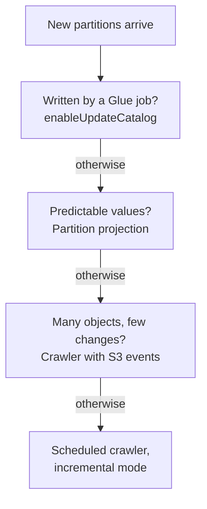
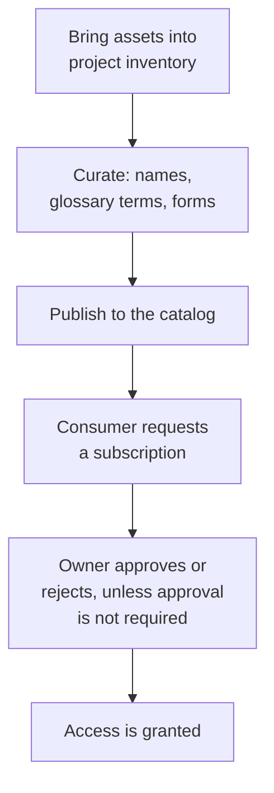

# Domain 2 — Data Store Management

Data Store Management is 26% of the scored content. It rewards knowing what each store is built for,
and which setting changes how it holds, finds, keeps or deletes data. Most questions describe an
access pattern, a cost pressure or a retention rule. Two or three options name real services, and
only one of them matches the pattern without extra work.

The sections follow the guide's four tasks in order. Vector indexes and vectorization sit together,
because the second only makes sense beside the first.

| Exam guide task | Where it is taught |
|---|---|
| 2.1 Choose a data store | Picking the store; reaching Redshift data; locks; vectors; Apache Iceberg |
| 2.2 Understand data cataloging systems | The technical catalog; keeping partitions in sync; the business catalog |
| 2.3 Manage the lifecycle of data | Loading and unloading Redshift; storage classes; deletion; recovery |
| 2.4 Design data models and schema evolution | Redshift tables; DynamoDB keys; schema change and lineage; file layout; vectors |

The definitions and limits on this page are AWS's own, from the pages listed under Official sources
at the end. Columns headed "the separator" or "the tell in a question", and the ladder diagram, are our
exam guidance.

---

## What this domain actually asks

Three habits carry most of the marks.

**Match the store to the access pattern first, then to the cost.** A key lookup in microseconds, a
warehouse join across billions of rows and a file that a partner drops over SFTP need different
stores. Price only decides between stores that already fit.

**Know what each setting does not do.** An expiration rule in a versioned bucket does not free the
storage. A read replica does not give failover. A crawler on incremental mode does not notice a
deleted partition. The wrong answers are usually real features that stop one step short.

**Prefer the managed option for upkeep.** Redshift picks sort and distribution keys for you, S3
Tables compacts Iceberg files for you, and partition projection removes partition loading. When a
question asks for the least operational overhead, look for the setting AWS already runs.

---

## Picking the store

Start from how the data is read. The store follows from that, and the cost lever follows from the
store.

| The data is read as | Store | The tell in a question |
|---|---|---|
| Large joins and aggregations in SQL | Amazon Redshift | Warehouse, petabytes, dashboards over history |
| Transactions on a relational schema | Amazon RDS or Amazon Aurora | Orders, foreign keys, an existing engine |
| Key lookups at any scale | Amazon DynamoDB | Single-digit milliseconds, unpredictable traffic |
| Key lookups in microseconds, kept durably | Amazon MemoryDB | In-memory primary database, no separate cache |
| A stream replayed by several consumers | Kinesis Data Streams or Amazon MSK | Real time, retention, Kafka tooling |
| Files queried in place by many engines | Amazon S3 with Lake Formation | Data lake, fine-grained access |

**Amazon Redshift** is a fully managed, petabyte-scale warehouse. Redshift Serverless provisions and
scales capacity for you, and AWS says you incur no charges while the warehouse is idle; storage is still billed
separately from compute. That suits a warehouse used
a few hours a week. On a provisioned cluster, RA3 nodes use **managed storage**: compute and storage
are scaled and paid for separately, and data that outgrows the local SSDs moves to Amazon S3
automatically. So growing data does not force more compute nodes. When many analysts query at once,
**concurrency scaling** adds capacity for the burst and charges only while it runs queries.

**Amazon RDS** offers two storage types. Provisioned input/output operations per second (IOPS) solid state
drive (SSD) storage is for I/O-intensive databases that need consistent low latency. General Purpose SSD is the
cost-effective default for a broad range of workloads. A **read replica** is a read-only copy updated
asynchronously, used to take reporting queries off the primary. A database (DB) instance can run as a **Multi-AZ** deployment, across more than one
Availability Zone (AZ). Its standby gives failover and serves no reads. Only a Multi-AZ DB cluster's standbys serve reads too.

**Amazon DynamoDB** on-demand mode needs no capacity planning and is AWS's recommended default for
most tables. The **Standard-Infrequent Access** table class is for tables where storage, not traffic,
is the dominant cost, such as order history. DynamoDB Accelerator (DAX) is an in-memory cache that
cuts eventually consistent reads from milliseconds to microseconds. AWS calls it not ideal for an
application that requires strongly consistent reads: DAX passes those reads through to DynamoDB instead of
serving them from its cache, so they gain nothing from it.

**Amazon MemoryDB** keeps all data in memory and stores it durably across Availability Zones with a
transactional log. That makes it a primary database rather than a cache, which is the separator from
Amazon ElastiCache.

> **Currency note.** The guide's service list says "Amazon MemoryDB for Redis". AWS's documentation
> now calls it Amazon MemoryDB, compatible with Valkey and Redis open source software (OSS). It is
> the same service.
> **This does not change the exam answer.** Pick MemoryDB for durable, in-memory key/value access,
> whichever name the option uses.

**Streaming stores.** Kinesis Data Streams and Amazon MSK hold records for replay, as Domain 1
covered. For long Kafka retention, **MSK tiered storage** moves data past the topic's primary
retention to a low-cost tier with no storage to provision. The first bytes read from that tier arrive
more slowly, then sequential reads match the primary tier.

**Amazon EMR** stores working data in the Hadoop Distributed File System (HDFS), which is fast but **reclaimed when
the cluster ends**. Data that must outlive a transient cluster belongs in Amazon S3, which EMR reads
directly with `s3://`. **AWS Lake Formation** is not a separate store. It governs data in S3 and its
metadata in the AWS Glue Data Catalog, with permissions down to column, row and cell. A request must
pass both IAM and Lake Formation checks.

**Files arriving from outside.** Partners that send files over Secure File Transfer Protocol (SFTP),
FTP Secure (FTPS), File Transfer Protocol (FTP) or AS2 keep their clients unchanged with **AWS Transfer Family**, which lands the files in
S3 or Amazon EFS. A bulk move of an on-premises Network File System (NFS), Server
Message Block (SMB) or HDFS store into AWS is **AWS DataSync**'s
job instead.

<b>Self-check — picking the store</b>

1. A Redshift warehouse is used for two hours each Monday. What deployment stops the idle charges?
2. Reporting queries slow an RDS primary. A colleague proposes Multi-AZ. Why does that not help, and
   what does?
3. A table of five-year-old orders is rarely read but large. What DynamoDB setting cuts its cost?
4. An application needs microsecond key lookups and cannot lose data if a node fails. Which store?

Answers: (1) Redshift Serverless, which has no compute charges while idle. (2) A Multi-AZ instance standby
serves no reads; add a read replica. (3) The Standard-Infrequent Access table class. (4) Amazon
MemoryDB, which is in memory and durable across Availability Zones.

---

## Reaching Redshift data without moving it

Four features let Redshift use data it does not own. The question is always where the data lives.

| Feature | Reads | The separator |
|---|---|---|
| Redshift Spectrum | Files in Amazon S3 | Query the lake in place, no load |
| Federated query | Live RDS and Aurora PostgreSQL or MySQL tables | Operational data, no pipeline |
| Materialized view | A stored, precomputed query result | Repeated dashboard queries |
| Data sharing | Another warehouse's live data, read-only | No copy across clusters or accounts |

**Spectrum** queries structured and semi-structured files in S3 without loading them, and many
clusters can query the same files. **Federated query** joins live operational tables with warehouse
and S3 data, and can load target tables without an extract, transform and load (ETL) pipeline.

A **materialized view** stores the result of a query. Reads return the stored result without touching
the base tables, which suits predictable, repeated queries. Redshift refreshes it **incrementally**
when it can, applying only the base-table changes, and falls back to a full refresh that reruns the
query when it cannot. A view created with **`AUTO REFRESH`** is refreshed as soon as possible after base tables change.
Redshift puts user workloads first and may delay an autorefresh, so when a view must be current at a
known moment, run `REFRESH MATERIALIZED VIEW` yourself or schedule it; that works on any view.

**Data sharing** gives other clusters, workgroups, accounts and Regions read-only access to live data
without a copy. Use it to put a consumer team on its own compute without duplicating tables.

---

## Locks and concurrent writes

Locks prevent access to data while another transaction changes it, but Redshift readers are not
blocked by ordinary writes. A read that runs during an update sees a
**snapshot** of the data already committed.

To serialize two loads, take an explicit `LOCK` at the start of each transaction. It obtains an
`ACCESS EXCLUSIVE` table lock, so other sessions' reads **and** writes wait until the transaction completes.
`LOCK` means nothing outside a transaction block. `DROP TABLE` and `TRUNCATE` also take exclusive
locks that stop reads.

When a lock conflict happens, Redshift stops the transaction and writes a row to `STL_TR_CONFLICT`.
`STV_LOCKS` shows current table updates, and `SVV_TRANSACTIONS` shows open transactions and lock
contention. Those three are where you look when a load fails for no visible reason.

Redshift has two isolation levels. **`SNAPSHOT`** is the default for new clusters and workgroups and
processes more data in less time. **`SERIALIZABLE`** is stricter: it lets one of two conflicting
transactions commit and cancels the other with a serializable isolation violation.

On **RDS for PostgreSQL**, the `Lock:Relation` wait event means a query is waiting for a table lock
that another transaction holds. `DROP TABLE`, `TRUNCATE`, `VACUUM FULL` and `CLUSTER` take
`ACCESS EXCLUSIVE` locks, which block all access. A blocking transaction stops blocking when it commits or
rolls back. A blocking query ends when the application cancels it or the user ends the process.

<b>Self-check — locks</b>

1. Two nightly jobs load the same Redshift table and sometimes fail. What do you add, and where?
2. A dashboard reads a table while a large update runs. What does the dashboard see?
3. A Redshift load failed with a lock conflict last night. Which table records it?
4. On RDS for PostgreSQL, queries pile up on `Lock:Relation` after someone ran `VACUUM FULL`. Why?

Answers: (1) An explicit `LOCK` on the table at the start of each job's transaction. (2) A snapshot of
data committed before the update. (3) `STL_TR_CONFLICT`. (4) `VACUUM FULL` takes an `ACCESS EXCLUSIVE`
lock, which blocks all access until it finishes.

---

## Vectors: indexes and embeddings

A vector is a numerical representation of data. An **embedding model**, such as Amazon Titan Text
Embeddings, turns text into vectors so that similar items sit close together. Searching for the
nearest vectors is how semantic search and retrieval work.

Without an index, the search compares against every vector. That is **exact nearest neighbour**
search, with perfect recall. An index trades some recall for speed, so results can differ from the
exact search. The guide names two index types: Hierarchical Navigable Small
World (HNSW) and IVFFlat.

| | HNSW | IVFFlat |
|---|---|---|
| Structure | A multi-layered graph | Inverted File with Flat Compression: vectors grouped into lists |
| Search | Uses the graph | Searches only the lists nearest the query |
| Trade-off | Slower to build; better query speed and recall | Faster to build; lower recall |
| Tuned with | `m` and `efConstruction` | `lists` |

AWS's own comparison is the one above. Both settings shift the balance between recall, build time and
search speed, so the contrast holds at comparable settings rather than at every configuration.

**Aurora PostgreSQL** stores and indexes vectors with the `pgvector` extension, which supports HNSW
indexing. That is the guide's example of HNSW in a relational store. Amazon OpenSearch Service offers
exact and approximate k-nearest-neighbour (`k-NN`) search, where approximate search uses algorithms
such as HNSW. OpenSearch Serverless Classic vector collections support only HNSW, with the Faiss engine, and not `IVF`.
Newer NextGen collections do not ask for an engine or method; they choose the configuration themselves.

**Vectorization** is the step that fills the index. An Amazon Bedrock **knowledge base** splits
documents into chunks, converts each chunk to an embedding, and writes it to a vector index with a
link back to the source. Default chunking makes chunks of about 300 tokens. Fixed-size chunking lets
you set the chunk size and overlap, and you can choose no chunking. The vector store can be one
Bedrock creates for you, or one you set up, such as Aurora PostgreSQL.

The knowledge base is used for **retrieval augmented generation** (RAG): it retrieves passages from
your data to improve a model's answers. The model is not retrained, and the embeddings live in the
vector store, not in the model.

<b>Self-check — vectors</b>

1. Which index groups vectors into lists, and which builds a layered graph?
2. A team needs the best recall from an index and accepts slower builds. Which type?
3. Why can results change after you add a vector index?
4. A knowledge base is created over a document bucket. Where do the embeddings end up?

Answers: (1) IVFFlat uses lists; HNSW builds a multi-layered graph. (2) HNSW. (3) An index trades some
recall for speed; without one, search is exact. (4) In the vector store, such as Aurora PostgreSQL
with `pgvector`.

---

## Apache Iceberg: tables on top of files

**Apache Iceberg** is an open table format. It manages a collection of files in S3 as a table, and
adds what plain files lack: record-level insert, update and delete, **time travel**, and schema and
partition evolution. It also helps keep data correct under concurrent writes.

Athena reads, writes and alters Iceberg tables, but only tables created against the AWS Glue catalog.
Each table keeps a versioned manifest of its files, so `FOR TIMESTAMP AS OF` queries a consistent
snapshot as the table was at a past time. That reproduces last month's report without a backup.

Iceberg tables need upkeep. Small files and row-level delete files pile up and slow queries.

| Operation | What it does | Who runs it |
|---|---|---|
| Compaction | Merges small and delete files into larger ones | `OPTIMIZE ... REWRITE DATA` in Athena, or a Glue optimizer |
| Snapshot expiration | Removes old snapshots and their files | `VACUUM` in Athena, or a Glue optimizer |
| Orphan file removal | Deletes files no table metadata references | `VACUUM` in Athena, or a Glue optimizer |

**Binpack** is Iceberg's default compaction strategy. Sort and Z-order cluster similar data for
filtered queries on one or several columns. AWS Glue's table optimizers run these three operations
for tables in the Data Catalog, and compaction can run automatically.

**Amazon S3 Tables** go one step further. A **table bucket** stores tables in Iceberg format, queried
from Athena, Redshift or Apache Spark, and runs compaction and snapshot management **by default** for
every table. When a question asks for Iceberg with the least maintenance, that is the tell.

<b>Self-check — Iceberg</b>

1. An Iceberg table's queries slow down after months of small writes and deletes. What fixes it?
2. Auditors want the table exactly as it was on the first of last month. What query feature?
3. Which AWS option stores Iceberg tables and compacts them without any job you schedule?

Answers: (1) Compaction: `OPTIMIZE ... REWRITE DATA`, or Glue's compaction optimizer. (2) Time travel
with `FOR TIMESTAMP AS OF`. (3) Amazon S3 Tables, where compaction is on by default.

---

## The technical catalog

The **AWS Glue Data Catalog** stores metadata, not data. It is an index to the location, schema and
runtime metrics of your data, organized into databases and tables. Each account has one Data Catalog
per Region. Athena keeps its table definitions there, so a table created in Athena is usable in Glue,
and the reverse.

The Data Catalog is a drop-in replacement for the **Apache Hive metastore**. That matters on Amazon
EMR, where Hive's default metastore is a MySQL database on the primary node. It disappears when the
cluster terminates. AWS recommends the Data Catalog as the metastore whenever metadata must persist
or be shared across clusters and services.

A **crawler** discovers schemas and populates the catalog by scanning data sources. It runs your custom
classifiers first, in the order you list them, and the first one that recognizes the data creates the
schema. Built-in classifiers, such as the one for JSON, try only if no custom classifier matches. A
crawler also decides what is a table. When most folders at one level hold similar schemas, it creates
**partitions of one table**. To get separate tables, add each table's root folder as its own data
store.

By default a crawler updates the catalog schema to match the data it reads. If you have cleaned or
transformed the schema and do not want it overwritten, set the crawler not to change existing schemas.

Some sources need a **connection** before a crawler or job can reach them. A Glue connection stores
credentials, URI strings and virtual private cloud (VPC) details for one data store. One connection
serves crawlers and jobs, as source or target. For a store Glue does not support natively, use a
connector from AWS Marketplace or build your own.

---

## Keeping partitions in sync

New partitions land in S3 every day, and queries only see them once you synchronize the partitions
with the catalog.
There are several ways to get there, and each has a limit.

A Glue ETL job can register partitions as it writes them, with `enableUpdateCatalog` and
`partitionKeys`, so no crawler needs to rerun. **Partition projection** goes further: Athena
calculates partition values and locations from table properties instead of looking them up, so
nothing is registered at all and queries on highly partitioned tables run faster.

A crawler can consume **S3 event notifications** from an SQS queue and list only the folders that
changed, which speeds up recrawls of a large bucket. An **incremental crawl** adds only new
partitions after one full crawl. It does not notice changed or deleted partitions, so after a major
schema change AWS advises a temporary full crawl.

From Athena, `MSCK REPAIR TABLE` loads new Hive-style partitions, the ones with `key=value` paths. It
only adds and never removes, and it can take a long time, so AWS advises against it for routine
maintenance. Paths that are not Hive-style need `ALTER TABLE ADD PARTITION`, and deleted partitions
need `ALTER TABLE DROP PARTITION`.

<b>Self-check — catalogs and partitions</b>

1. A transient EMR cluster's Hive tables vanish each night. What fixes it?
2. A crawler made one table with partitions, but you wanted two tables. What do you change?
3. A table gains an hourly partition with a date path. Which approach needs no loading step at all?
4. Partitions deleted from S3 still show in Athena after `MSCK REPAIR TABLE`. Why, and what removes
   them?

Answers: (1) Use the Glue Data Catalog as the Hive metastore. (2) Add each table's root folder as a
separate data store. (3) Partition projection. (4) `MSCK REPAIR TABLE` only adds partitions; run
`ALTER TABLE DROP PARTITION`.

---

## The business catalog

The technical catalog tells an engine where data is. A **business data catalog** tells a person
what the data means. Amazon SageMaker Catalog, part of Amazon SageMaker Unified Studio, is the guide's
example. It sits on top of the Glue Data Catalog and adds descriptions, documentation and business
terms.

Assets usually move through the following workflow.

Inventory assets are visible only to the project's members until they are **published**. Only the
latest version can be published, and an asset edited after publishing must be published again before
the catalog shows the change. In IAM-based domains, new assets are published automatically the first
time they enter the catalog; later metadata edits still need publishing.

A **business glossary** is a list of business terms and their definitions, attached to assets so that
everyone uses the same meaning. A **metadata form** adds required business fields, and can enforce
the same fields on every asset published. Finding an asset does not grant access. A consumer submits a
subscription request with a justification. By default the owner approves or rejects it, and access
follows only after approval. An owner can instead publish an asset with subscription approval **not
required**, and then every request is approved automatically. A request is also approved automatically
when the requester is a member of both the publishing and the requesting project.

---

## Loading and unloading Redshift

**`COPY`** is how data gets into Redshift in bulk. It loads in parallel from S3, Amazon EMR, DynamoDB or
remote hosts, far more efficiently than `INSERT` statements. It reads the source through an **IAM
role attached to the cluster**, not with a database user's credentials. It accepts delimited,
fixed-width, CSV, JSON, Avro, Parquet and Optimized Row Columnar (`ORC`) files.

Parallelism depends on the files. Use **one `COPY`** over many files, from a prefix or a manifest.
Several concurrent `COPY` commands into one table force a slower serialized load. A single `GZIP`-compressed
CSV or JSON file cannot be split, which also forces a serialized load. AWS advises a number of files
that is a multiple of the cluster's slices.

**`UNLOAD`** writes a query's result to S3, encrypted with server-side encryption using S3 managed keys
(`SSE-S3`) by default, or with a KMS key. Its default output is pipe-delimited text, one or more
files per slice. It can also write JSON or Apache Parquet. Parquet unloads faster and takes far less
space than text. `PARTITION BY` writes Hive-style partition folders, ready for Athena. `UNLOAD` fails
rather than overwrite existing files unless you add `ALLOWOVERWRITE`.

> **Trap.** Client-side encryption for `COPY` and `UNLOAD` has ended for all customers. If an option
> encrypts on the client before `COPY`, it is wrong; AWS recommends server-side encryption.

---

## Storage classes and lifecycle rules

Pick the class by how often the data is read and how fast it must come back.

| Class | Access | The separator |
|---|---|---|
| S3 Standard-IA | Milliseconds, retrieval fee | Rare reads, multiple Availability Zones |
| S3 One Zone-IA | Milliseconds, retrieval fee | One Availability Zone, cheaper, not resilient to that zone's physical loss |
| S3 Glacier Instant Retrieval | Milliseconds | Rarely read but instant when it is |
| S3 Glacier Flexible Retrieval | Archived; parts retrievable in minutes | Not available for real-time access |
| S3 Glacier Deep Archive | Archived | Data that rarely needs to be accessed |
| S3 Intelligent-Tiering | Automatic tiers | Unknown or changing access patterns |

The infrequent access (IA) classes suit objects over 128 KB kept at least 30 days. Smaller objects are
charged as 128 KB, and earlier deletion is charged for the full 30 days. The Glacier classes have
minimum storage durations too: 90 days for Instant Retrieval and Flexible Retrieval, and 180 days for Deep
Archive. Removing an object earlier is charged for the rest of the minimum, and the Glacier classes also
charge retrieval fees.

An **S3 Lifecycle** configuration holds rules with two kinds of action. **Transition** actions move
objects to a colder class. **Expiration** actions expire objects, and S3 deletes them asynchronously: removal can lag the
expiration date, but storage stops being charged once an object has expired. A rule can be
filtered by prefix, tags or object size. Transitions only go down a waterfall, from warmer to colder.
From Glacier Flexible Retrieval, the only move is to Deep Archive. By default objects under 128 KB are
not transitioned, because each transition is a charged request. That default dates from September
2024; lifecycle configurations created earlier keep the old behaviour until they are modified, so check
the bucket's own configuration when a small object moves unexpectedly.

When nobody knows the access pattern, a fixed lifecycle schedule is a guess. **S3
Intelligent-Tiering** watches each object instead. It moves objects not read for 30 consecutive days
to an infrequent tier, and after 90 days to Archive Instant Access. It charges a small monitoring fee
and no retrieval fees. The optional archive tiers need a restore before reading.

<b>Self-check — storage classes</b>

1. Logs are read heavily for a week, then almost never, but must be readable at once for a year.
   Which rule?
2. Analysts cannot predict which datasets they will reopen. Which class avoids guessing?
3. A rule to move 40 KB objects to Glacier moves nothing. Why?
4. A team stores derived data it can re-create in One Zone-IA. What risk are they accepting?

Answers: (1) Transition to S3 Glacier Instant Retrieval after a week, which keeps millisecond access.
(2) S3 Intelligent-Tiering. (3) By default objects under 128 KB are not transitioned. (4) Losing the
data if that Availability Zone is physically lost, for example in a disaster.

---

## Versioning, expiry and deletion

Deleting data to meet business and legal requirements, and keeping it when the law says to, are two
halves of one task.

**S3 Versioning** keeps every version of every object. A delete without a version ID adds a **delete
marker**, and the object can be recovered. Each version is a whole object and is billed as one, so
three versions cost three objects. A bucket is unversioned by default; once versioning is on, it can
be suspended but never removed.

That changes what expiration does. In a **versioned** bucket, an expiration rule only adds a delete
marker and makes the current version noncurrent. The bytes stay, and so does the bill. A
**NoncurrentVersionExpiration** action is what permanently deletes noncurrent versions, a set number of
days after they became noncurrent. In an unversioned bucket, expiration removes the object, and
storage charges stop once it has expired. A legal erasure request in a versioned bucket means deleting
every version, because permanently deleted versions cannot be recovered.

**DynamoDB Time to Live** (TTL) deletes items after a per-item timestamp, at no write cost. The
attribute must be a Number holding Unix epoch time in seconds. A string date is ignored. Deletion
happens typically within a few days of expiry, so filter expired items out of reads. TTL deletions
appear in DynamoDB Streams as service deletions, which lets a stream consumer archive them.

**S3 Object Lock** stores objects write-once-read-many (WORM) for regulatory retention. It needs
versioning.

| Protection | Lasts | Can it be cut short |
|---|---|---|
| Retention period, compliance mode | A fixed time | No, not even by the root user |
| Retention period, governance mode | A fixed time | Yes, with `s3:BypassGovernanceRetention` |
| Legal hold | Until removed | Only by removing the hold |

> **Trap.** A legal hold has no expiry date. If the requirement is "until the case closes", the
> answer is a legal hold, not a long retention period.

<b>Self-check — deletion</b>

1. A lifecycle rule expires objects after 90 days, yet the bucket's size never falls. What is
   missing?
2. TTL is on, but no items are ever deleted. What is the likely cause?
3. A regulator requires that nobody, not even administrators, can delete records for seven years.
   Which setting?

Answers: (1) The bucket is versioned; add a NoncurrentVersionExpiration action. (2) The TTL attribute
is not a Number holding epoch seconds. (3) S3 Object Lock in compliance mode with a seven-year
retention period.

---

## Recovery and availability

Resiliency starts with where copies live. Most S3 classes store objects across at least three
Availability Zones. One Zone-IA uses one.

**S3 replication** copies objects asynchronously between buckets: Cross-Region Replication to another
Region, Same-Region Replication within one. It suits compliance rules that need copies far apart, and
users who are far away. Live replication copies only **new and updated** objects. Objects already in
the bucket need **S3 Batch Replication**.

| Need | Feature | The separator |
|---|---|---|
| Undo a bad write from an hour ago | DynamoDB point-in-time recovery (PITR) | Per-second recovery points; restores to a new table |
| Reads and writes in several Regions | DynamoDB global tables | Every replica is writable |
| A table copy for analytics | DynamoDB export to S3 | Uses PITR; consumes no read capacity |
| Restore a database to a moment | RDS automated backups | Any point in the retention period |
| One backup policy for many services | AWS Backup | Central, no per-service scripts |

Redshift takes automated incremental snapshots, and you can take manual ones. Restoring creates a new
cluster that you can query before all data has loaded. Rows deleted from Redshift are only marked for
deletion until Redshift's automatic `VACUUM DELETE` runs in the background.

---

## Designing Redshift tables

Two design choices matter most in Redshift: where rows live, and in what order.

| Style | Places rows | Fits |
|---|---|---|
| `AUTO` | Redshift decides, and changes it as the table grows | The default; least effort |
| `EVEN` | Round-robin across slices | Tables that do not join |
| `KEY` | Matching values of one column on one slice | Two large tables joined on that column |
| `ALL` | A full copy on every node | Slow-moving tables joined everywhere |

With no style given, Redshift uses **`AUTO`** and picks a style from the table's size. A small table
starts as `ALL`; as it grows, Redshift might change it to `KEY`, or to `EVEN` if no column suits a
distribution key. These are possibilities, not a fixed sequence every table follows. A fact table has only one distribution key, so AWS advises distributing it and its
most-joined dimension on their common column. `ALL` multiplies storage by the node count and slows
loads, which is why it suits only tables that rarely change.

Redshift stores each column in 1 MB blocks and records each block's minimum and maximum. A **sort
key** lets a range-restricted query skip blocks outside the range. If recent data is queried most,
make the timestamp the leading sort key column. A **compound** sort key helps when predicates use a
prefix of its columns, in order.

Compression reduces storage and disk I/O. `ENCODE AUTO` is the default, and setting an encoding on any
column turns automatic management off for the whole table. **Automatic table optimization** watches
query patterns and applies sort and distribution keys itself. AWS recommends `SORTKEY AUTO`, and
tables with `AUTO` keys are already enabled.

---

## Designing DynamoDB keys and indexes

DynamoDB scales with its partitions, so design spreads activity evenly across partition keys. Each
partition delivers at most 3,000 read units and 1,000 write units per second. A read unit is one
strongly consistent read, or two eventually consistent reads, of an item up to 4 KB, and a write unit is
one write of up to 1 KB, so larger items use more units against the same limit. These are per-partition ceilings, not a throughput
guarantee: the table's total is also capped by its provisioned throughput, or by the table-level limit
in on-demand mode. A key that concentrates
writes, such as today's date, is spread with **write sharding**: add a random or calculated suffix.

The **sort key** groups related items. Range operators such as `begins_with` and `between` fetch a
group in one query. A composite sort key such as `country#region#city` models a hierarchy you can
query at any level.

| | Global secondary index | Local secondary index |
|---|---|---|
| Partition key | Can differ from the table | Same as the table |
| Added later | Yes, and can be deleted | No; only at table creation |
| Consistency | Eventual only | Eventual or strong |
| Size limit | None | 10 GB per partition key value |

An index holds an entry only for items that carry its key attributes. That **sparse index** is useful
for finding a small subset, such as open orders among millions. Items are limited to 400 KB.
Larger data is compressed, split across items, or stored in S3 with its key in the item.

<b>Self-check — table design</b>

1. A large fact table joins one dimension constantly. Which distribution style, and on what column?
2. An existing DynamoDB table needs queries by email address, a new attribute. Which index?
3. Most dashboard queries cover the last seven days. Which column leads the Redshift sort key?
4. Writes keyed on today's date throttle one partition. What spreads them?

Answers: (1) `KEY` on the shared join column in both tables. (2) A global secondary index, because a
local one cannot be added to an existing table. (3) The timestamp. (4) Write sharding with a random or
calculated suffix.

---

## Schema change, conversion and lineage

The characteristics of data change over time, and the tools handle that in different places.

In **Apache Iceberg**, a schema change is metadata only. Adding, dropping, renaming or reordering a
column rewrites no data files. Only widening type changes are supported, such as integer to big
integer or float to double.

For streams, the **AWS Glue Schema Registry** centrally controls and evolves record schemas, with
serializers for Amazon MSK and Apache Kafka. Each schema has a compatibility rule.

| Rule | Consumers can | Rejects |
|---|---|---|
| `BACKWARD` (recommended) | Read the current and the previous version | A new version adding a required field |
| `FORWARD` | Read new data with the previous version | A new version deleting a required field |

For moving between database engines, the **AWS Schema Conversion Tool** (SCT) converts online transaction processing (OLTP) and
warehouse schemas, with targets including RDS, Aurora and Amazon Redshift. **DMS Schema Conversion** is
the fully managed, web-based feature of AWS Database Migration Service (DMS), built on SCT's engine. It
assesses what converts automatically and what needs manual work. AWS states that DMS Schema Conversion converts the schema, **not the data**: moving and replicating the
table data is a separate AWS DMS task.

To establish lineage is to answer "where did this come from". **Amazon SageMaker ML Lineage Tracking** records the
steps of a machine learning workflow, from data preparation to deployment, so you can find the exact
artifacts that trained a model. **Data lineage in SageMaker Unified Studio** is OpenLineage-compatible
and traces data origins and transformations across the catalog.

---

## File layout: partitioning, bucketing and compression

Query engines that bill by bytes scanned reward layout techniques that let them skip data.

**Partitioning** splits a table by values that queries filter on, such as date. Filtering on a
partition key reads only the matching partitions. Too many partition keys create many small files,
and too few make queries scan too much. AWS's own example: if queries look at days, do not partition
by hour.

**Bucketing** uses a hash of one column to decide which file, or bucket, each record goes into. It suits high-cardinality,
evenly distributed columns that are queried for specific values, such as a customer identifier (ID). Partitioning
and bucketing can be combined.

**Columnar formats** such as Parquet load only the needed columns, compress well, and carry metadata
that lets the engine skip data. Many small files hurt performance. **Compression** makes Athena
queries faster and cheaper, because Athena bills bytes scanned before decompression. Most compression
formats must be read from the start, so a compressed text file cannot, in general, be split across
workers. Splitting the data into many files keeps reads parallel, as `COPY` also needs.

---

## Traps worth carrying into the exam

- Redshift Serverless has no compute charges while idle (storage still bills); RA3 scales storage without more compute.
- A Multi-AZ instance standby serves no reads. A read replica serves reads and gives no failover.
- DAX passes strongly consistent reads through to DynamoDB; it speeds only eventually consistent ones.
- MemoryDB is a durable primary database; ElastiCache is a cache.
- HDFS on EMR disappears with the cluster, and so does the default Hive metastore.
- HNSW is the graph with better recall; IVFFlat is the lists with faster builds.
- A crawler on incremental mode misses changed and deleted partitions.
- `MSCK REPAIR TABLE` adds Hive-style partitions only and never removes any.
- A published catalog asset edited later must be published again.
- Several concurrent `COPY` commands into one table load serially; use one `COPY`.
- In a versioned bucket, expiration adds a delete marker; noncurrent versions keep costing.
- TTL needs a Number in epoch seconds and deletes within days, not at once.
- Compliance mode cannot be overridden, even by the root user; a legal hold never expires.
- Live replication skips existing objects; use Batch Replication.
- A local secondary index cannot be added to an existing table.
- DMS Schema Conversion converts schemas, not data; an AWS DMS task moves the data.

---

## Official sources

- [What is Amazon Redshift?](https://docs.aws.amazon.com/redshift/latest/mgmt/welcome.html)
- [Materialized views in Amazon Redshift](https://docs.aws.amazon.com/redshift/latest/dg/materialized-view-overview.html)
- [Redshift LOCK](https://docs.aws.amazon.com/redshift/latest/dg/r_LOCK.html)
- [Redshift distribution styles](https://docs.aws.amazon.com/redshift/latest/dg/c_choosing_dist_sort.html)
- [Amazon RDS DB instance storage](https://docs.aws.amazon.com/AmazonRDS/latest/UserGuide/CHAP_Storage.html)
- [DynamoDB secondary indexes](https://docs.aws.amazon.com/amazondynamodb/latest/developerguide/SecondaryIndexes.html)
- [What is Amazon MemoryDB?](https://docs.aws.amazon.com/memorydb/latest/devguide/what-is-memorydb.html)
- [Vector search for Amazon DocumentDB (HNSW and IVFFlat)](https://docs.aws.amazon.com/documentdb/latest/devguide/vector-search.html)
- [Query Apache Iceberg tables in Athena](https://docs.aws.amazon.com/athena/latest/ug/querying-iceberg.html)
- [Data discovery and cataloging in AWS Glue](https://docs.aws.amazon.com/glue/latest/dg/catalog-and-crawler.html)
- [Partition projection with Athena](https://docs.aws.amazon.com/athena/latest/ug/partition-projection.html)
- [Catalog in Amazon SageMaker Unified Studio](https://docs.aws.amazon.com/sagemaker-unified-studio/latest/userguide/working-with-business-catalog.html)
- [Redshift COPY](https://docs.aws.amazon.com/redshift/latest/dg/r_COPY.html)
- [Amazon S3 storage classes](https://docs.aws.amazon.com/AmazonS3/latest/userguide/storage-class-intro.html)
- [Expiring S3 objects](https://docs.aws.amazon.com/AmazonS3/latest/userguide/lifecycle-expire-general-considerations.html)
- [S3 Object Lock](https://docs.aws.amazon.com/AmazonS3/latest/userguide/object-lock.html)
- [DynamoDB time to live](https://docs.aws.amazon.com/amazondynamodb/latest/developerguide/TTL.html)
- [AWS Glue Schema Registry](https://docs.aws.amazon.com/glue/latest/dg/schema-registry.html)
- [DMS Schema Conversion](https://docs.aws.amazon.com/dms/latest/userguide/CHAP_SchemaConversion.html)
- [How Amazon Bedrock knowledge bases work](https://docs.aws.amazon.com/bedrock/latest/userguide/kb-how-it-works.html)
