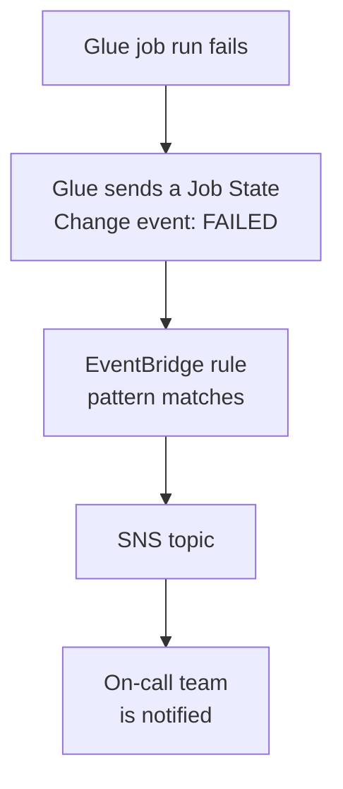
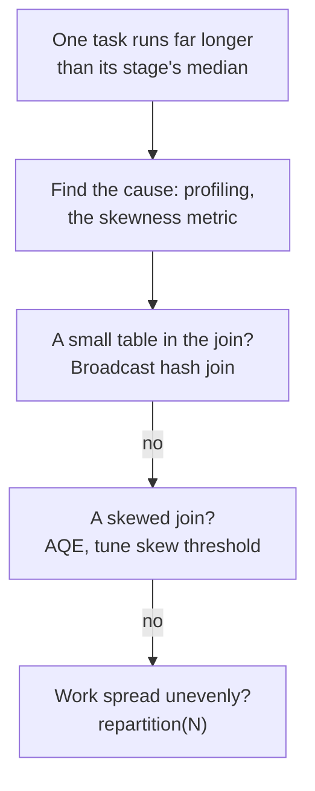

# Domain 3 — Data Operations and Support

Data Operations and Support is 22% of the scored content. It is about running pipelines after they
are built: finding why one failed, querying and checking the data it produced, and proving to an
auditor what happened. Most questions describe a symptom, such as a missing log, a silent failure or
a slow stage, and ask for the setting or service that explains or fixes it.

The sections follow the guide's four tasks in order. Domain 1 taught how to orchestrate pipelines
and wire up events; this domain covers operating them once they run.

| Exam guide task | Where it is taught |
|---|---|
| 3.1 Automate data processing by using AWS services | Troubleshooting managed workflows; calling AWS from code; preparing and querying data; events |
| 3.2 Analyze data by using AWS services | Visualizing and exploring; SQL for analysis; provisioned or serverless |
| 3.3 Maintain and monitor data pipelines | Audit trails; CloudWatch Logs and alarms; troubleshooting Glue, EMR and Redshift |
| 3.4 Ensure data quality | Data quality rules; sampling and skew |

The definitions and limits on this page are AWS's own, from the pages listed under Official sources
at the end. Columns headed "the separator" or "the tell in a question", and the two diagrams, are our
exam guidance.

---

## What this domain actually asks

Three habits carry most of the marks.

**Know where the evidence lives.** Many logs exist only if someone switched them on: Airflow logs in
Amazon MWAA, Express workflow history, Redshift user activity, CloudTrail data events. When a question
says the logs are missing, the answer is usually the setting that was never enabled.

**React to events instead of polling.** AWS services emit events and metrics. A Glue job failure
reaches Amazon EventBridge, and a log pattern becomes a CloudWatch metric with an alarm. A function
that checks status on a schedule works, and it is usually the wrong answer.

**Use the built-in check before writing one.** Glue Data Quality, DataBrew rulesets, job run insights
and redrive already exist. The distractor is often custom code that rebuilds one of them.

---

## Troubleshooting managed workflows

**Amazon Managed Workflows for Apache Airflow** (Amazon MWAA) runs Airflow for you and scales
automatically. A workflow there is a directed acyclic graph (DAG) of tasks written in Python. Most MWAA problems trace back to three files in the environment's S3 bucket, and to
logs that were never turned on.

- **Logs.** MWAA sends Airflow logs to CloudWatch only for the logging options you enable in the MWAA
  console. It creates one log group per enabled option: DAG processing, scheduler, task, webserver
  and worker.
- **Dependencies.** You install Python packages by uploading `requirements.txt` to the bucket and
  then selecting the new file version in the MWAA console. Uploading alone changes nothing.
- **The bucket.** It must have Block Public Access on and versioning enabled.

For import errors, AWS advises checking `requirements.txt`, confirming the packages suit the Airflow
version, and testing locally with the `aws-mwaa-docker-images` project. If the scheduler is not
running, DAGs may vanish from the list and no new tasks start; the CloudWatch log groups show why.

**AWS Step Functions** fails in more specific ways.

| Symptom | Cause | Fix |
|---|---|---|
| An Express workflow failed, with no history | Express keeps no history in Step Functions | Enable CloudWatch Logs logging |
| A long Standard run failed near the end | One step failed | Redrive from the failed step |
| `States.ALL` did not catch an error | `States.DataLimitExceeded` is terminal | Name it in `ErrorEquals` |
| A callback task never returned | No heartbeat within `HeartbeatSeconds` | Catch or retry `States.HeartbeatTimeout` |

**Redrive** restarts a Standard execution that failed, aborted or timed out in the last 14 days. It
continues from the unsuccessful step with the same input and does not rerun the steps that
succeeded. The redriven run keeps the original definition and execution Amazon Resource Name (ARN). Catchers exist on Task,
Parallel and Map states, but not on the execution as a whole, so a top-level failure is the caller's
or a parent workflow's to handle.

<b>Self-check — managed workflows</b>

1. A new library was uploaded in `requirements.txt`, but the DAG still fails to import it. What step
   was missed?
2. An Express workflow failed overnight and there is nothing to inspect. Why, and what fixes it next
   time?
3. A 20-step Standard workflow failed at step 18. How do you finish it without rerunning steps 1 to 17?

Answers: (1) Selecting the new `requirements.txt` version in the MWAA console. (2) Express workflows
keep no history in Step Functions; enable logging to CloudWatch Logs. (3) Redrive the execution.

---

## Calling AWS from code and data APIs

**SDK retries.** The AWS SDKs retry failed calls for you. Standard mode, AWS's recommendation for all
workloads, uses exponential backoff with jitter and a retry quota that limits how many retries are spent. Adaptive
mode suits a single, heavily throttled resource where some delay is acceptable. Code should not loop
on immediate retries.

**Credentials.** Every SDK searches a **credential provider chain**, a fixed series of sources, and
refreshes the credentials it finds. Code running on AWS should rely on that chain and the role it
runs under, not on keys in configuration.

**Paging.** Many list calls return truncated results. In boto3, a **paginator** from
`get_paginator()` walks the whole result set.

| Need | Use | The separator |
|---|---|---|
| Run SQL on Redshift from Lambda or an app | Amazon Redshift Data API | Asynchronous SDK calls; no driver, no persistent connection |
| Spare a data API's backend from repeat reads | API Gateway caching | Responses served from cache for a time-to-live (TTL) |
| Limit each consumer of a data API | API Gateway usage plan with API keys | Throttling and quotas per client, not authentication |
| Run an Athena query from code | `StartQueryExecution` | A repeated client request token returns the same query |

The **Redshift Data API** works with provisioned clusters and Redshift Serverless. It authenticates
with AWS Secrets Manager or temporary credentials, runs a query for up to 24 hours, and keeps results
for up to 24 hours, so fetch results within that window rather than treat them as storage. `ExecuteStatement` and `BatchExecuteStatement` run the SQL. AWS warns explicitly
not to use API Gateway API keys for authentication or authorization.

<b>Self-check — code and APIs</b>

1. A Lambda function must query Redshift without bundling a driver. Which API?
2. A script lists objects and processes only the first thousand. What is missing?
3. A partner needs a request limit on your data API. Which feature, and what must it not be used for?

Answers: (1) The Redshift Data API. (2) A paginator. (3) An API Gateway usage plan with API keys; not
for authentication or authorization.

---

## Preparing and querying data

**AWS Glue DataBrew** is a serverless, visual tool for cleaning and normalizing data with no code. It
has over 250 ready-made transformations. You build a **recipe** of steps in a **project**, which shows
a sample of the data, then run it on the full dataset with a **recipe job**. A **profile job** analyzes
a dataset instead of changing it. Publishing a recipe saves a version.

**Amazon SageMaker Data Wrangler** prepares and featurizes data for machine learning with little to no
code. AWS has integrated it into Amazon SageMaker Canvas. In **Amazon SageMaker Unified Studio**,
Visual extract, transform and load (ETL) builds flows by drag and drop, the query editor runs SQL on engines including Athena and
Redshift, and notebooks run SQL and Python in JupyterLab.

**Amazon Athena** queries data in Amazon S3 with standard SQL, and can also run Apache Spark.

| Control | What it does | The tell in a question |
|---|---|---|
| Workgroup | Separates teams, history and settings; an IAM resource | Two teams must not see each other's queries |
| Data usage control | Cancels a query over a scan limit, or alarms on a workgroup total | Runaway ad hoc query costs |
| Result reuse | Returns a stored result within a maximum age | A dashboard reruns the same query every minute |
| `CREATE TABLE AS SELECT` (CTAS) | Writes a query's results as a new table in S3 | Save a cleaned result as a table |

Athena stores every query's results, either in an S3 location you choose or as managed query results
it cleans up for you.

For processing at scale, Domain 1's engines apply. **Amazon EMR Serverless** finds the resources a
job needs, acquires them and releases them when the job finishes. A job's **AWS Glue version** sets
which Apache Spark and Python versions it gets.

<b>Self-check — preparing and querying</b>

1. Analysts must clean a dataset with no code and rerun the same steps weekly. Which tool, and what
   runs the steps on the full data?
2. A dashboard runs an identical Athena query every minute. What cuts the bytes scanned?
3. An analyst's query scanned 40 TB by mistake. What would have stopped it?

Answers: (1) AWS Glue DataBrew; a recipe job. (2) Athena query result reuse. (3) A per-query data
usage control in the workgroup.

---

## Events, alerts and automation

AWS services announce what happens to them, and the pipeline should listen rather than ask.

AWS Glue sends **Glue Job State Change** events to EventBridge for `SUCCEEDED`, `FAILED`, `TIMEOUT`
and `STOPPED`. An EventBridge rule's **event pattern** decides which events reach its targets, so a
rule can notify an SNS topic on failure, and SNS delivers the message to every subscriber of the
topic, or start a Lambda function on success. **EventBridge Pipes**
is different: it connects one source to one target, with optional filtering and enrichment.

**AWS Lambda** automates processing when Amazon S3 invokes it on object creation or deletion. The
bucket's notification is not enough on its own: the function's resource-based policy must let S3
invoke it. A function that writes back to the bucket that triggers it can loop. For asynchronous
invocations, an **on-failure destination** keeps a record with the error details, while a
**dead-letter queue** keeps only the event content.

---

## Visualizing and exploring data

**Amazon QuickSight** is a business intelligence service for interactive visualizations, dashboards
and reports. Its datasets use either the Super-fast, Parallel, In-memory Calculation Engine
(SPICE) or a direct query to the source. SPICE makes analytical queries faster because they do not
wait for the source. SPICE data is refreshed on demand or on a schedule. For SQL sources such as
Redshift and Athena, Enterprise edition can refresh incrementally within a look-back window.

> **Currency note.** QuickSight has become Amazon Quick Sight, a feature within Amazon Quick, and its
> documentation now lives under Amazon Quick. **This does not change the exam answer.** The guide says
> QuickSight; pick it for dashboards and business intelligence, whichever name the option uses.

To verify and clean data before it moves on, DataBrew's interface lets you visualize it and see
suggested quality issues, and a Lambda function or an Athena query can check it inside a pipeline. To explore data in code, **Athena notebooks** run Apache Spark serverlessly, with automatic
scaling and nothing to provision. **SageMaker Unified Studio notebooks** provide a Jupyter
environment whose default Spark runtime is that same Athena for Apache Spark, so there is no cluster to
size; AWS Glue and EMR Serverless are alternative runtimes there.

---

## SQL for analysis

Two kinds of view look alike and behave differently.

| Object | Stores data? | The separator |
|---|---|---|
| Athena view | No | A logical table; its query runs on every reference |
| Redshift view | No | Not materialized; needs SELECT on the view only |
| Redshift late-binding view | No | `WITH NO SCHEMA BINDING`; tables can change underneath |
| CTAS table | Yes | The query's results written as files in S3 |

A standard Redshift view is bound to its tables, so a nightly job that drops and rebuilds a table can
fail. A **late-binding view** checks its underlying objects only when queried, so the tables can be
dropped or altered without recreating the view. It is also the only kind of view that can reference
Redshift Spectrum external tables.

The guide's analysis terms map to specific SQL constructs.

| Term | Construct | What it returns |
|---|---|---|
| Aggregation and grouping | `GROUP BY` with `SUM`, `AVG`, `COUNT` | One row per group |
| Subtotals and grand totals | `ROLLUP`, `CUBE`, `GROUPING SETS` | Several groupings in one statement |
| Rolling average | `AVG(...) OVER (ORDER BY ... ROWS UNBOUNDED PRECEDING)` | A value for every row |
| Pivoting | `PIVOT` and `UNPIVOT` in the `FROM` clause | Rows rotated to columns, and back |

A **window function** works on a window of rows defined by `OVER`, with partitioning, ordering and a
frame. Unlike `GROUP BY`, it keeps every row. Window functions run after joins, `WHERE`, `GROUP BY`
and `HAVING`, and before only the final `ORDER BY`. Redshift's query editor v2 is a web-based client
for running such queries and visualizing the results.

<b>Self-check — SQL</b>

1. A report needs each day's sales next to a running average, one row per day. `GROUP BY` or a window
   function?
2. A nightly job drops and rebuilds a Redshift table, and a view on it keeps breaking the job. What
   kind of view avoids this?
3. Monthly totals must appear as one column per region. Which clause?

Answers: (1) A window function, `AVG(...) OVER (...)`, because it keeps every row. (2) A late-binding
view, created `WITH NO SCHEMA BINDING`. (3) `PIVOT`.

---

## Provisioned or serverless

Serverless removes capacity planning and bills only for use; provisioned capacity is sized and
reserved ahead. The tradeoffs between provisioned and serverless services show up in billing and in
start-up time.

- **Redshift Serverless** meters capacity per second while it runs, with a 60-second minimum, either
  on demand or through reservations that discount a preset amount for a term. An open transaction
  that is never ended keeps it using capacity.
- **Athena** is serverless, but **capacity reservations** give chosen workgroups dedicated capacity,
  measured in Data Processing Units (DPUs), that does not count toward the query quota.
- **EMR Serverless** starts workers per job; **pre-initialized capacity** keeps workers ready to
  respond in seconds when start-up time matters.

---

## Audit trails with CloudTrail

To extract logs for audits, start with **AWS CloudTrail**. It records actions by users, roles and
services, from the console, the AWS CLI, and SDKs and APIs. What is on by default is **Event history**:
90 days of management events in each Region. A **trail** is separate, and you have to create it; creating
one enables ongoing delivery of events as log files to S3. Deploying a
trail and audit logging early is what will facilitate traceability later, and a trail is how you track
API calls beyond 90 days.

| Record | Holds | Kept |
|---|---|---|
| Event history | Management events in one Region | 90 days, at no charge |
| Trail | Events you choose, as log files in S3 | As long as you keep the files |

| Event type | Covers | Logged by default |
|---|---|---|
| Management events | Management operations, such as attaching a role policy | Yes |
| Data events | Operations on or in a resource, such as S3 `GetObject` | No; extra charges |

So "who read this object last month?" needs a trail with **data events** enabled before the read
happened. A **multi-Region trail** covers every enabled Region. **Log file integrity validation**
shows whether a delivered log file was modified, deleted or left unchanged. A trail can also send its
events to CloudWatch Logs, where a metric filter and an alarm can alert on a specific API call.

CloudTrail stores its log files in S3, and **Athena** queries them in place, as it does VPC flow logs.

> **Currency note.** AWS CloudTrail Lake, which runs SQL over CloudTrail events, closed to new
> customers on 31 May 2026. **The exam answer is unchanged.** The guide does not name Lake. For SQL
> over audit logs, pick Athena over the trail's logs in S3.

<b>Self-check — audit trails</b>

1. Auditors want two years of API activity. Event history shows 90 days. What was needed?
2. Security asks who downloaded an S3 object, and the trail shows nothing. Why?
3. How do you prove a delivered log file was not altered?

Answers: (1) A trail delivering logs to S3. (2) Object reads are data events, which trails do not log
by default. (3) CloudTrail log file integrity validation.

---

## CloudWatch Logs, metrics and alarms

**Amazon CloudWatch Logs** centralizes logs from systems, applications and AWS services. The exam's
focus here is configuration and automation, more than reading logs by hand. A **log
stream** is the sequence of events from one source. A **log group** holds streams that share
retention, monitoring and access settings. Logs are kept **indefinitely** by default, so cost keeps
growing until you set a retention period on the group.

| Feature | Does | The separator |
|---|---|---|
| Metric filter | Turns matching log lines into a metric for alarms | Not retroactive |
| Subscription filter | Streams matching events in real time to Kinesis, Firehose or Lambda | Continuous delivery |
| Logs Insights | Searches and analyzes logs interactively | Ad hoc investigation |
| Export to S3 | Copies a log group to a bucket | Up to 12 hours delay; not for continuous archiving |

A **metric filter** counts only events after it exists. For continuous archiving, AWS recommends a
subscription, not repeated exports. The **CloudWatch agent** collects logs and metrics from EC2
instances, on-premises servers and containers.

For log analytics dashboards and search over large log volumes, **Amazon OpenSearch Service** is the
usual destination. OpenSearch Ingestion loads streaming data into a domain directly, and both Amazon
Data Firehose and CloudWatch Logs have built-in support for delivering to OpenSearch Service. Athena,
Amazon EMR and CloudWatch Logs Insights cover the other ways to analyze logs: Athena for logs at rest
in S3, EMR for big data application logs, and Logs Insights for logs already in CloudWatch.

To send alerts during monitoring, a **CloudWatch alarm** watches a metric against a threshold over
several periods and acts, for example by notifying an Amazon SNS topic. A composite alarm combines other alarms' states.

<b>Self-check — logs and alarms</b>

1. A job writes `ERROR` lines to CloudWatch Logs. How do you get paged when they appear?
2. A metric filter was added today. Why does its graph show nothing for last week's errors?
3. Log storage costs rise every month. What setting is missing?

Answers: (1) A metric filter on the pattern, then an alarm that notifies an SNS topic. (2) Metric
filters are not retroactive. (3) A retention period on the log group.

---

## Troubleshooting Glue, EMR and Redshift

| Tool | Answers | The tell in a question |
|---|---|---|
| Glue job run insights | Which script line failed, why, and what to do | Find the cause without reading raw logs |
| Glue Observability metrics | Reliability and performance trends, including skewness | Diagnose a slow or failing job over time |
| Glue logging | Real-time driver and executor logs in CloudWatch | Watch a running job |
| EMR logs archived to S3 | Step, bootstrap and instance logs after termination | The cluster is gone |
| Persistent Spark History Server | Spark history for active and terminated EMR clusters | No Secure Shell (SSH) proxy |

**AWS Glue** jobs log in real time. By default the logs go to the `/aws-glue/jobs/error` log group,
and the Glue logger writes your own messages to the driver stream. A job can retry automatically 0 to
10 times. Its timeout caps the run, and on Glue 5.0 and later an unset timeout defaults to 480
minutes. AWS's troubleshooting guide lists the VPC error "Could not find S3 endpoint or network address
translation (NAT) gateway for subnetId", to be diagnosed from the subnet and VPC IDs in the message.

**Amazon EMR** writes logs to `/mnt/var/log/` on the primary node. Archive them to S3 to keep them
after the cluster terminates.

**Amazon Redshift** audit logging writes a connection log, a user log and a user activity log to S3
or CloudWatch; Redshift Serverless sends them only to CloudWatch. The user activity log, which records
each query, also needs the `enable_user_activity_logging` parameter, which is off by default. For
performance, **workload management** (WLM) controls resources per queue. **Query monitoring rules**
log, hop or abort queries that cross a limit, such as runtime in a short-query queue. CloudWatch
metrics show CPU, latency and throughput.

---

## Data quality rules and checks

Quality checks belong inside the pipeline, before bad data lands.

| | AWS Glue Data Quality | DataBrew rulesets |
|---|---|---|
| Rules | Data Quality Definition Language (DQDL) | Rules comparing metrics with expected values |
| Runs in | Glue ETL jobs and on Data Catalog tables | Profile jobs |
| Extras | Rule recommendations, anomaly detection | A validation report with the profile |

**AWS Glue Data Quality** is serverless and built on the open-source Deequ framework. A DQDL ruleset
reads like `Rules = [ IsComplete "order-id", IsUnique "order-id" ]`. To check for empty fields in string columns,
DQDL has separate `NULL`, `EMPTY` and `WHITESPACES_ONLY` keywords, because some formats turn nulls into empty
strings that a null check misses. In a Glue Studio job, the **Evaluate Data Quality** transform runs
the rules. Its actions can publish metrics to CloudWatch and EventBridge or stop the job. By default,
the job **completes even if rules fail**, so stopping it is a choice you make.

A **DataBrew ruleset** fails as a whole if any one rule fails. You validate it by adding it to a
profile job, which writes a validation report beside the data profile in S3. Profiling is also how
you investigate consistency: a profile job runs a series of evaluations on the dataset and writes the
results to S3.

<b>Self-check — data quality</b>

1. A Glue job's rules failed, yet the bad rows still reached the target. Why?
2. A null check passes, but the column is full of blanks. What rule keyword catches them?
3. How are DataBrew data quality rules actually run?

Answers: (1) No failure action was set; by default the job completes. (2) `EMPTY`. (3) By adding the
ruleset to a profile job.

---

## Sampling and skew

**Sampling** trades accuracy for speed, and the guide expects you to describe the techniques below.

| Method | Picks | The separator |
|---|---|---|
| DataBrew first n rows | The first rows of the dataset | The default selection for a project |
| DataBrew random rows | A random selection of rows | Rows drawn from anywhere in the dataset |
| Athena `TABLESAMPLE BERNOULLI` | Each row with the given probability | Row-level |
| Athena `TABLESAMPLE SYSTEM` | Whole segments of data, kept or skipped | Segment-level |

A larger DataBrew sample reflects the source better, at the cost of slower interactive work.

**Skew** means some workers get far more data than others, and the mechanisms that fix it differ by
engine. In Spark it shows as a **straggler task**
that takes much longer than the rest of its stage. In Redshift, uneven distribution makes some nodes do
more work and slows queries.

Diagnose before you tune. In AWS Glue, **job profiling** shows which stage and executor hold the
straggler, and the **stage skewness** metric compares a stage's longest task with its median task.
Skew might come from the input data or from a transformation such as a skewed join, and the fix
depends on which it is.

A **broadcast hash join** sends the small table to every worker and needs no shuffle. **Adaptive Query
Execution** (AQE) can switch a sort-merge join to a broadcast join at run time; on Amazon EMR, that
conversion is on by default. For skew in AWS Glue, AWS suggests enabling AQE and tuning the skew join
threshold. `repartition(N)` spreads data evenly across N partitions. `coalesce(N)` is preferred only
for reducing partitions, because `repartition` shuffles everything.

<b>Self-check — sampling and skew</b>

1. A recipe built on the first 500 rows misses problems in later data. What sample setting helps?
2. One Spark task in a stage runs ten times longer than the others. What is the likely cause?
3. A large table joins a small lookup table and shuffles both. What avoids the shuffle?

Answers: (1) Random rows, or a larger sample. (2) Data skew, which leaves that task with more data.
(3) A broadcast hash join.

---

## Traps worth carrying into the exam

- MWAA logs reach CloudWatch only for options you enable; a new `requirements.txt` needs its version selected.
- Express workflows keep no history unless CloudWatch Logs logging is on.
- Redrive continues a failed Standard run from the failed step; it does not start over.
- `States.ALL` does not catch `States.DataLimitExceeded`.
- The Redshift Data API needs no driver or persistent connection; its calls are asynchronous.
- API Gateway API keys are for usage plans, not authentication.
- An S3 trigger also needs the function's resource-based policy to allow S3.
- A DataBrew profile job analyzes data; a recipe job changes it.
- Window functions keep every row; `GROUP BY` collapses them.
- A late-binding view lets underlying tables change; a standard view does not.
- CloudTrail data events, such as S3 object reads, are off by default.
- Event history is on by default and covers 90 days; a trail, which you create, keeps longer records in S3.
- CloudWatch Logs keeps data forever by default; metric filters are not retroactive.
- Redshift's user activity log also needs `enable_user_activity_logging`.
- A Glue job completes despite failed data quality rules unless you choose to stop it.
- A null check misses empty strings; use `EMPTY`.

---

## Official sources

- [Accessing Airflow logs in Amazon CloudWatch](https://docs.aws.amazon.com/mwaa/latest/userguide/monitoring-airflow.html)
- [Restarting Step Functions executions with redrive](https://docs.aws.amazon.com/step-functions/latest/dg/redrive-executions.html)
- [Retry behavior in AWS SDKs](https://docs.aws.amazon.com/sdkref/latest/guide/feature-retry-behavior.html)
- [Using the Amazon Redshift Data API](https://docs.aws.amazon.com/redshift/latest/mgmt/data-api.html)
- [What is AWS Glue DataBrew?](https://docs.aws.amazon.com/databrew/latest/dg/what-is.html)
- [Athena workgroups](https://docs.aws.amazon.com/athena/latest/ug/workgroups-manage-queries-control-costs.html)
- [Automating AWS Glue with EventBridge](https://docs.aws.amazon.com/glue/latest/dg/automating-awsglue-with-cloudwatch-events.html)
- [What is Amazon Quick?](https://docs.aws.amazon.com/quick/latest/userguide/what-is.html)
- [Importing data into SPICE](https://docs.aws.amazon.com/quick/latest/userguide/spice.html)
- [Redshift window functions](https://docs.aws.amazon.com/redshift/latest/dg/c_Window_functions.html)
- [Creating a view in Amazon Redshift](https://docs.aws.amazon.com/redshift/latest/dg/r_CREATE_VIEW.html)
- [CloudTrail concepts](https://docs.aws.amazon.com/awscloudtrail/latest/userguide/cloudtrail-concepts.html)
- [Working with CloudTrail event history](https://docs.aws.amazon.com/awscloudtrail/latest/userguide/view-cloudtrail-events.html)
- [Working with AWS CloudTrail Lake](https://docs.aws.amazon.com/awscloudtrail/latest/userguide/cloudtrail-lake.html)
- [Creating metrics from log events using filters](https://docs.aws.amazon.com/AmazonCloudWatch/latest/logs/MonitoringLogData.html)
- [Monitoring with AWS Glue job run insights](https://docs.aws.amazon.com/glue/latest/dg/monitor-job-insights.html)
- [Database audit logging in Amazon Redshift](https://docs.aws.amazon.com/redshift/latest/mgmt/db-auditing.html)
- [AWS Glue Data Quality](https://docs.aws.amazon.com/glue/latest/dg/glue-data-quality.html)
- [Monitoring with AWS Glue Observability metrics](https://docs.aws.amazon.com/glue/latest/dg/monitor-observability.html)
- [Optimize shuffles in AWS Glue for Apache Spark](https://docs.aws.amazon.com/prescriptive-guidance/latest/tuning-aws-glue-for-apache-spark/optimize-shuffles.html)
