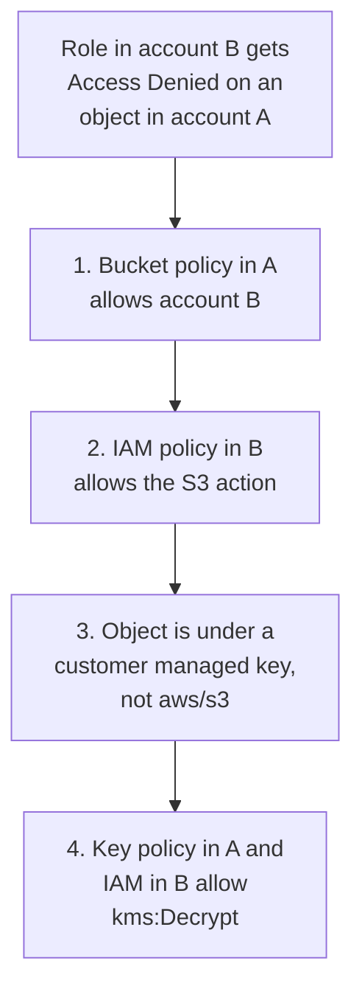
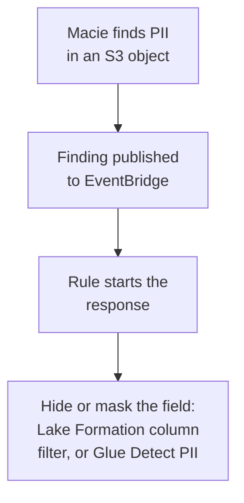

# Domain 4 — Data Security and Governance

Data Security and Governance is 18% of the scored content. It asks who may touch the data, with which
credentials, under which encryption key, in which Region, and how you would prove it afterwards. Most
questions describe a pipeline that works and ask for the control that makes it safe, or describe an
access failure and ask which permission is missing.

The sections follow the guide's five tasks in order. Domain 3 taught CloudTrail and CloudWatch Logs
for troubleshooting; here the same services appear as audit evidence.

| Exam guide task | Where it is taught |
|---|---|
| 4.1 Apply authentication mechanisms | Network controls; identities and roles; credentials; managed or unmanaged; SageMaker Unified Studio structure |
| 4.2 Apply authorization mechanisms | IAM policies; RBAC and ABAC; Redshift permissions; Lake Formation |
| 4.3 Ensure data encryption and masking | AWS KMS; encryption in S3 and other services; masking |
| 4.4 Prepare logs for audit | Logs for audit |
| 4.5 Understand data privacy and governance | Sharing and PII; keeping data in its Region; AWS Config; SageMaker Catalog |

The definitions and limits on this page are AWS's own, from the pages listed under Official sources
at the end. Columns headed "the separator" or "the tell in a question", and the two diagrams, are our
exam guidance.

---

## What this domain actually asks

Three habits carry most of the marks.

**Give the workload a role, never a key.** AWS Glue jobs, Lambda functions and Amazon EC2 instances
receive temporary credentials from a role. Any option that stores access keys in a script, a job
parameter or a configuration file is the distractor, however convenient it looks.

**Crossing an account needs permission on both sides.** A key in another account needs its key policy
and your IAM policy. A secret in another account needs its resource policy, your identity policy and
the key it is encrypted with. When cross-account access fails, look for the side that was forgotten.

**Pick the layer that matches the requirement.** A network rule, an IAM policy, a Lake Formation grant
and a database `GRANT` all restrict access, at different levels. "Only these columns" points to Lake
Formation or Redshift; "only from this VPC" points to an endpoint or bucket policy.

---

## Network controls

A **security group** controls the traffic that may reach and leave the resources it is attached to.
It is stateful, so the reply to an allowed request is allowed automatically. Its rules can only allow;
when several groups are attached, their rules are combined, and a rule change applies at once to every
attached resource. A **network access control list** (ACL) works at the subnet level. It can allow or
deny, evaluates numbered rules from the lowest number up, and is stateless.

| | Security group | Network ACL |
|---|---|---|
| Attached to | A resource, such as an instance or a Glue connection | A subnet |
| Rules | Allow only | Allow and deny |
| State | Stateful | Stateless |
| The tell in a question | "Allow the job to reach the database" | "Block this one address range" |

An **AWS Glue** job that runs inside a VPC needs a security group with a **self-referencing inbound
rule** for all Transmission Control Protocol (TCP) ports, so Glue's own components can talk to each
other. The rule names the same security group as its source; it does not open the VPC to every network.
**Amazon Redshift enhanced VPC routing** forces all `COPY` and `UNLOAD` traffic through the VPC, so
security groups, network ACLs, VPC endpoints and endpoint policies all apply to it.

**Private paths to services.** **AWS PrivateLink** connects a VPC to services privately, with no
internet gateway, network address translation (NAT) device, public Internet Protocol (IP) address or
virtual private network (VPN).

| Need | Use | The separator |
|---|---|---|
| Reach Amazon S3 or DynamoDB from private subnets, cheaply | Gateway VPC endpoint | A route table target in one Region; no PrivateLink; no extra charge |
| Reach Amazon S3 privately from on premises | Interface endpoint | Network interfaces with private IPs, reachable over Direct Connect or VPN |
| Limit which principals use an endpoint | VPC endpoint policy | Does not override IAM or bucket policies |
| Give each team its own way into one bucket | S3 access point | Its own policy and network controls; works with the bucket policy |

A bucket policy can require a particular endpoint with the `aws:sourceVpce` condition key. The
`aws:SourceIp` condition does not work for requests that travel through a VPC endpoint, so an
IP-based policy stops matching once traffic moves onto one. For an **S3 access point**, both the
access point and the bucket must permit a request; AWS recommends delegating access control from the
bucket to its access points.

<b>Self-check — network controls</b>

1. A Glue job in a VPC cannot start because its components cannot reach each other. What rule fixes
   it without opening the VPC?
2. You must block one address range from reaching a subnet. Security group or network ACL?
3. An on-premises application must reach S3 without the internet. Gateway or interface endpoint?

Answers: (1) A self-referencing inbound rule for all TCP ports on the job's security group. (2) A
network ACL; security groups cannot deny. (3) An interface endpoint.

---

## Identities, roles and temporary credentials

An **AWS Identity and Access Management** (IAM) **user group** collects users so you can give them
permissions together. A group cannot be the principal in a policy, and groups cannot contain other
groups. An **IAM role** has permissions but no password or long-term access keys; assuming it returns
temporary security credentials for the session. Calls made with temporary credentials must include the
session token that came with them.

**Workloads get roles.** On AWS compute such as Amazon EC2 or AWS Lambda, AWS delivers the role's
temporary credentials to the resource, and code that uses an AWS SDK picks them up, so nobody
distributes long-lived keys. Workloads outside AWS can still use temporary credentials, for example
through **IAM Roles Anywhere** with an X.509 certificate from your own public key infrastructure.

| Who needs access | The role or policy | What it controls |
|---|---|---|
| An AWS Glue job or crawler | A service role you pass to Glue | What Glue may do in other services |
| A Lambda function's own calls | The function's execution role | What the function may do; Lambda assumes it for you |
| Another account or service invoking a function | The function's resource-based policy | Who may invoke the function |
| AWS CloudFormation deploying a stack | A CloudFormation service role | What CloudFormation may do, instead of the user's own session |
| A person using the AWS CLI | A role profile in `~/.aws/config` | The CLI assumes the role with a separate source profile |
| Callers of an API Gateway API | IAM permissions on the execution component, or a resource policy | Who may invoke, from which accounts, IP ranges or VPCs |

A **service role** is a role you create for a service to assume. A **service-linked role** is
different: the service predefines it with every permission it needs. Lambda assumes its execution role
automatically, and AWS advises against calling `sts:AssumeRole` for it in function code. Permission to
create and deploy an API Gateway API does not include permission to call it; invoking is a separate
grant on the execution component.

**Managed or unmanaged.** AWS protects the infrastructure that runs every AWS service; the customer's
share depends on the service chosen. On Amazon EC2 you patch the guest operating system and configure
its security group. For abstracted services such as Amazon S3 and Amazon DynamoDB, AWS runs the
infrastructure, operating system and platform, and you use the endpoints.

<b>Self-check — identities and roles</b>

1. A Glue job reads S3 with access keys stored as job parameters. What should replace them?
2. A partner account must invoke your Lambda function. Do you edit the execution role?
3. Your CloudFormation users have broad rights, but stacks must deploy with narrower ones. How?

Answers: (1) An IAM role passed to Glue. (2) No; add a statement to the function's resource-based
policy. (3) A CloudFormation service role with only the permissions the stacks need.

---

## Storing and rotating credentials

**AWS Secrets Manager** stores and rotates database credentials, API keys and other secrets.
Applications replace hard-coded credentials with a call that fetches the secret when needed. You can
set rotation to run on an automatic schedule, in one of two forms. **Managed rotation**, offered for
Amazon RDS and Amazon Aurora master user credentials and Amazon Redshift admin passwords, needs no
Lambda function. Other secrets rotate through a Lambda function that updates the secret and the
database together.

**AWS Systems Manager Parameter Store** is a central store for configuration values. A
**SecureString** parameter keeps its name in plaintext and its value encrypted with an AWS Key
Management Service (AWS KMS) key. Parameter Store can reference Secrets Manager secrets, so a service
that reads parameters can also read secrets.

| | Secrets Manager | Parameter Store SecureString |
|---|---|---|
| Best for | Database credentials, API keys, tokens | Encrypted configuration values |
| Rotation | Automatic, managed or by Lambda | AWS recommends Secrets Manager for credentials that rotate |
| The tell in a question | "Rotate automatically" | "Store configuration securely" |

To use a secret from another account, allow it in both the secret's resource policy and the caller's
identity policy, and let the caller use the secret's KMS key. That key must be a customer managed key
with its own key policy. For Redshift, IAM can replace stored passwords altogether:
`GetClusterCredentials` issues temporary database credentials from IAM permissions.

---

## SageMaker Unified Studio domains, domain units and projects

In **Amazon SageMaker Unified Studio**, a **domain** connects assets, users and their projects. You
can run one domain for the whole enterprise or several for business units. **Domain units** organize
assets and teams inside a domain and pass authority from account owners to domain unit owners, who set
authorization policies such as who may create projects and who may join them. A **project** is a
boundary inside the domain where people work on one business use case; members get the project's
files and tools, which come from its project profile.

---

## Writing IAM policies

**Identity-based policies** attach to a user, group or role and grant that identity permissions.
**Resource-based policies**, such as S3 bucket policies and role trust policies, attach to a resource
and grant permissions to the principal they name. **Within one account**, AWS allows an action when
either kind allows it, and an explicit deny in either one overrides any allow; permissions boundaries
and SCPs, covered below, can still cap what an allow grants. **Across accounts**, AWS
evaluates the request in both accounts and allows it only if both evaluations allow it, so one allow is
not enough.

| Policy | Who writes it | Reuse | When to choose it |
|---|---|---|---|
| AWS managed | AWS; you cannot change it | Many identities | Getting started |
| Customer managed | You | Many identities | When an AWS managed policy grants more than the task needs |
| Inline | You | One identity, deleted with it | A strict one-to-one link |

The **principle of least privilege** means granting only the permissions a task requires. To construct
such a policy, name the actions the task performs and the resources it touches. AWS managed policies
serve every customer, so they may grant more than you need, and AWS recommends narrowing them with
customer managed policies. You do not have to guess what a role uses: **IAM Access Analyzer** policy
generation reads the role's AWS CloudTrail activity for a date range and drafts a policy containing the
actions it used. Access Analyzer also finds resources shared with external accounts and access nobody
uses.

Two controls set ceilings without granting anything. A **permissions boundary** caps what an
identity-based policy can give one entity. A **service control policy** (SCP) caps what IAM users and
roles in an organization's member accounts can do. For access across accounts, create a role in the
account that owns the resources and let users in the other account assume it.

<b>Self-check — IAM policies</b>

1. An AWS managed policy grants a pipeline role far more than it needs. Can you edit it?
2. A role must be trimmed to what it used last quarter. Which tool drafts the policy?
3. A bucket policy allows a user, but the user's IAM policy has an explicit deny. What happens?

Answers: (1) No; write a customer managed policy instead. (2) IAM Access Analyzer policy generation,
from CloudTrail activity. (3) The request is denied.

---

## Role-based and attribute-based access

**Role-based access control** (RBAC) writes a policy per job function, listing the resources each
function may reach. Each time a resource is added, the policies need updating. **Attribute-based
access control** (ABAC) uses tags instead: a single policy can allow an action when the principal's tag
matches the resource's tag, so new resources are covered as soon as they are tagged. In IAM,
`aws:ResourceTag` tests a resource's tags and `aws:RequestTag` limits which tags a request may set.
Business needs decide which model fits: stable job functions suit RBAC, while fast-growing projects
suit ABAC.

---

## Permissions inside Amazon Redshift

Whoever creates a Redshift object owns it, and by default only the owner or a superuser can query it,
change it or grant access to it. `GRANT` gives permissions to a user, a group or a role, down to
individual columns. **Groups** give all their users the same permissions. **Redshift RBAC** puts
permissions on roles granted to users; a user can then do only what the role allows, including tasks
normally kept for superusers.

**Row-level security** (RLS) policies narrow which rows a query returns, on top of column permissions,
so one table can serve every region's managers with each seeing only their own rows.

---

## Lake Formation permissions

**AWS Lake Formation** governs data in Amazon S3 and its metadata in the AWS Glue Data Catalog. Its
own permissions model sits on top of IAM and works like a database: grant and revoke. Grants can reach
the column, row and cell level, and Amazon Athena, Amazon Redshift Spectrum, Amazon EMR and AWS Glue
enforce them.

Lake Formation governs a location only after you **register** it; registration covers the path and
every folder under it. Athena applies Lake Formation permissions to registered data and ignores them
for unregistered data and for writes, so a column grant on an unregistered path changes nothing.
Permissions apply only in the Region where they were granted. **Data location permissions** decide who
may create catalog tables that point at a location.

| Need | Lake Formation feature |
|---|---|
| Hide PII columns from most users | Column filter |
| Each analyst sees only their region's rows | Row filter |
| Both at once | Cell-level security |
| Grant hundreds of tables by classification | `LF-Tags` (`LF-TBAC`) |
| Move from IAM to Lake Formation gradually | Hybrid access mode |
| Share tables with another account | Cross-account grant through Resource Access Manager |

**Lake Formation tag-based access control** (`LF-TBAC`) grants through **`LF-Tags`**, key-value pairs on
catalog resources such as `classification=restricted`. AWS recommends it when there are many catalog
objects. `LF-Tags` are not IAM tags: they grant Lake Formation permissions, while IAM tags feed IAM
policies. **Hybrid access mode** lets chosen principals use Lake Formation permissions while everyone
else keeps their IAM policies for S3 and Glue, so adoption can be gradual. You choose it when you
register the S3 location, then opt in the principals who should use Lake Formation permissions.

Engines join in different ways. Amazon EMR applies Lake Formation access control to Spark, Hive and
Presto jobs on clusters created with a **runtime role**. For a Redshift datashare, the producer shares
it with the data lake administrator, who accepts it and creates a Data Catalog database for it.
Cross-account grants use **AWS Resource Access Manager** (RAM). Inside one organization the share
is available at once; otherwise the other account's data lake administrator accepts an invitation.

<b>Self-check — Lake Formation</b>

1. A column grant in Lake Formation has no effect on an Athena query. What is the likely reason?
2. Hundreds of tables must be granted by data classification. Which method does AWS recommend?
3. Only some teams are ready for Lake Formation permissions. How do the rest keep working?

Answers: (1) The S3 location is not registered with Lake Formation. (2) `LF-Tags` (`LF-TBAC`). (3)
Hybrid access mode, which keeps IAM permissions for principals who have not opted in.

---

## Encryption keys with AWS KMS

**AWS KMS** keys come in two kinds you will meet. **Customer managed keys** are yours: full control of
the key's lifecycle and use, at a monthly cost. **AWS managed keys**, named like `aws/s3`, exist in
your account but serve only certain uses, and **resources encrypted under them cannot be shared with
other accounts**.

Every KMS key has exactly one **key policy**, the main control on who may use it. The default key
policy lets the owning account use IAM policies to grant access. To use a key from another account you
need two permissions: the key policy in the owning account must allow you, and an IAM policy in your
account must allow you too. A **grant** gives temporary use of a key and can be deleted without editing
any policy.

| Need | KMS feature |
|---|---|
| Share encrypted data with another account | Customer managed key, with the key policy allowing that account |
| Let a job use a key for a while | A grant |
| Rotate key material without re-encrypting data yourself | Automatic or on-demand rotation |
| Decrypt in another Region without re-encrypting | Multi-Region keys |

When a role in another account cannot read an SSE-KMS object, check these four permissions in order.

With automatic rotation, KMS creates new key material every year by default, or on a period you set;
on-demand rotation is also available. **Envelope encryption** encrypts the data with a data key and
the data key with another key, so changing protection means re-encrypting only the data keys.
**Multi-Region keys** are related keys in different Regions: you create a primary key and replicate it
into the Regions you select. They share key material and key identifier, so data encrypted in one Region
can be decrypted with the related key in another, without re-encrypting or a cross-Region call.

<b>Self-check — KMS</b>

1. Objects encrypted with `aws/s3` must be shared with another account. What must change?
2. A role in account B gets AccessDenied using a key in account A, though its IAM policy allows it.
   What is missing?
3. A batch job needs a key for one night only. What avoids editing the key policy?

Answers: (1) Encrypt them with a customer managed key whose policy allows that account. (2) Permission
in the key policy in account A. (3) A KMS grant.

---

## Encrypting data in S3 and other services

Amazon S3 applies server-side encryption (SSE) with Amazon S3 managed keys, called **SSE-S3**, to every
bucket as a base level. The other options add control or layers.

| Option | Who holds the key | The separator |
|---|---|---|
| SSE-S3 | Amazon S3 | The default for every bucket |
| Server-side encryption with KMS keys (SSE-KMS) | AWS KMS | You control and audit key use; reading needs `kms:Decrypt` |
| Dual-layer server-side encryption (DSSE) with KMS keys: DSSE-KMS | AWS KMS | Two layers, for rules that demand multilayer encryption; costs more |
| Server-side encryption with customer-provided keys (SSE-C) | You, sent with every request | S3 encrypts and decrypts, you manage the keys |
| Client-side encryption | You | Encrypted before it leaves your application |

With SSE-KMS, a user allowed by the bucket policy still cannot download an object without
`kms:Decrypt` on its key. **S3 Bucket Keys** cut the KMS request costs of SSE-KMS by reducing traffic
from S3 to KMS, with no client changes, but do not work with DSSE-KMS. If no key is named, SSE-KMS uses
`aws/s3`, which works for principals in the key's own account; for cross-account access, AWS says to use
a customer managed key.

> **Currency note.** Since April 2026, Amazon S3 disables SSE-C by default on new general purpose
> buckets, and on existing buckets in accounts that hold no SSE-C objects. **The exam answer is
> unchanged.** SSE-C still means "you manage the key and send it with each request"; a workload that
> needs it now enables it deliberately on the bucket.

**In transit.** To enable encryption in transit, AWS recommends allowing only Hypertext Transfer
Protocol Secure (HTTPS) connections over Transport Layer Security (TLS) to S3 by adding the
`aws:SecureTransport` condition to the bucket policy. Redshift requires Secure Sockets Layer (SSL)
connections once `require_SSL` is true in the cluster's parameter group. Client-side encryption, with
the Amazon S3 Encryption Client, protects data before it travels; S3 stores the result as an ordinary
object.

**Replication.** S3 does not replicate SSE-KMS or DSSE-KMS objects unless the replication configuration
asks for them. Replicas keep the source object's encryption type, not the destination bucket's default.

| Service | How data at rest is encrypted |
|---|---|
| Amazon Redshift | Encrypted by default, cluster and snapshots; an unencrypted cluster can be modified to use KMS |
| AWS Glue Data Catalog | Metadata encrypted with KMS once catalog encryption is on |
| AWS Glue jobs and crawlers | A security configuration, for example for encrypted CloudWatch Logs |
| Amazon EMR | A reusable security configuration for data at rest, in transit or both |
| Amazon Athena | Query results in S3 can be encrypted, whether or not the source is |
| Amazon Kinesis Data Streams | Server-side encryption with KMS keys |

<b>Self-check — encryption in S3 and services</b>

1. A user allowed by the bucket policy gets AccessDenied on an SSE-KMS object. What is missing?
2. A regulation demands two layers of encryption at rest in S3. Which option?
3. Replication is on, but SSE-KMS objects do not appear in the destination. Why?

Answers: (1) `kms:Decrypt` on the object's key. (2) DSSE-KMS. (3) S3 replicates SSE-KMS objects only
when the replication configuration asks for them.

---

## Masking and anonymization

Masking and anonymization hide a value from people who should not see it, according to compliance laws
or company policy. Where you mask depends on where the data is.

| Where the data is | Masking tool | What it does |
|---|---|---|
| Flowing through an AWS Glue job | Detect PII transform | Detects, masks or removes personally identifiable information (PII) |
| In Amazon Redshift | Dynamic data masking (DDM) | Masks per user or role at query time; stored data unchanged |
| In a Lake Formation table | Column filter | Users outside a team never see the PII columns |
| In CloudWatch Logs | Data protection policy | Masks matches at every exit; `logs:Unmask` reveals them |

The **Detect PII** transform finds entities you define or that AWS predefines, such as masking social
security numbers with a fixed string. It can scan every cell or flag whole columns. **Redshift dynamic
data masking** applies masking policies to users and roles at query time, so a privacy change needs
no new copy of the data and no rewritten queries.

---

## Logs for audit

Domain 3 covered trails, event types and log retention. For audit, three things matter: covering
every account, protecting the logs, and choosing where to analyse them.

CloudTrail tracks API calls in every account it covers. An **organization trail** logs events for
every account in an AWS Organizations organization; the management account, or a delegated
administrator it names, creates it. Which events it logs is still the trail's configuration: data
events, and the resources they cover, are chosen when the trail is set up. CloudTrail stores encrypted log files in Amazon S3, and they record
API calls, including those made from the console. **Amazon CloudWatch Logs** stores and centralizes
application and service logs. Its data is always encrypted at rest, and you can associate your own KMS key with
a log group. Cross-account subscriptions deliver another account's log events to a central Kinesis or
Firehose stream in the same Region.

| Question to answer | Tool |
|---|---|
| SQL over trail log files in S3 | Amazon Athena |
| Interactive search of logs in CloudWatch | CloudWatch Logs Insights |
| Full-text search and dashboards over logs | Amazon OpenSearch Service |
| Logging at very large volumes, processed with Spark | Amazon EMR |
| SQL over events in an existing event data store | AWS CloudTrail Lake |

**AWS CloudTrail Lake** gives centralized logging queries: SQL over events gathered in immutable event
data stores; an organization
event data store holds events from many accounts and Regions, and a store can be federated to the Data
Catalog so Athena can query it.

> **Currency note.** CloudTrail Lake closed to new customers on 31 May 2026. Existing customers can
> keep using it, and AWS now recommends migrating its data to Amazon CloudWatch. **The exam answer is
> unchanged where a question says the company already uses CloudTrail Lake.** For a new SQL audit
> setup, pick Athena over the trail's logs in S3.

<b>Self-check — logs for audit</b>

1. Every account in an organization must be audited without configuring each one. What do you create?
2. Logs from 30 accounts must reach one central stream for processing. Which feature?
3. Security analysts need full-text search and dashboards over application logs. Which service?

Answers: (1) An organization trail. (2) CloudWatch Logs cross-account subscriptions. (3) Amazon
OpenSearch Service.

---

## Sharing data and finding PII

**Amazon Redshift data sharing** gives read-only access to live data across clusters, workgroups,
accounts and Regions, with nothing copied. On the producer, `GRANT` decides who may change a datashare
and who may share it with consumers. Across accounts, the producer's administrator authorizes the
consumer account, the consumer's administrator associates the datashare with the account or with
chosen clusters, and both clusters must be encrypted. With a **Lake Formation-managed datashare**,
column and row permissions on the datashare live centrally in Lake Formation.

**Amazon Macie** finds sensitive data in Amazon S3 with machine learning and pattern matching, and
creates a finding for each object where it finds some. Automated sensitive data discovery samples
representative objects continually; **sensitive data discovery jobs** give deeper, more targeted
analysis. Both use **managed data identifiers**, **custom data identifiers** for your own formats, or
both. Macie also inventories your buckets and monitors their security and access control. Each new
finding is published to Amazon EventBridge automatically.

Macie handles PII identification; it reports and does not mask. The pattern for "find PII, then
restrict it" pairs Macie with Lake Formation, or with Glue in the pipeline.

---

## Keeping data in its Region

Data sovereignty starts with location: you control where your data lives by choosing AWS Regions; a
Region is a physical location with several Availability Zones. To maintain sovereignty, a privacy
strategy must prevent backups or replications of data reaching disallowed Regions. Several features
copy data elsewhere on purpose, and a residency rule means switching them off or keeping them
in-Region.

| Feature | Copies data to |
|---|---|
| S3 Cross-Region Replication (CRR) | Buckets in other Regions |
| S3 Same-Region Replication (SRR) | Buckets in the same Region |
| AWS Backup copy rules | Other Regions, on demand or on a schedule |
| Amazon RDS cross-Region read replica | A database instance in another Region |

**Service control policies** set the most any IAM user or role in the organization can do; they never
grant anything and do not affect the management account. The `aws:RequestedRegion` condition key
compares the Region a request calls with the Regions in a policy. **It controls the endpoint, not the
effect**: a replication configuration created in an allowed Region can still copy data into another
Region. The **AWS Control Tower Region deny** control blocks operations outside the Regions chosen for
the whole landing zone, apart from the operations it lists as exempt. Neither control, alone, proves
where data ends up; that also takes switching off the copy features above.

<b>Self-check — keeping data in its Region</b>

1. Data must stay in one Region but needs a second copy in another bucket. Which replication?
2. An SCP denies requests outside eu-west-1. Can S3 replication still copy data to another Region?
3. Does attaching an SCP give a role new permissions?

Answers: (1) Same-Region Replication. (2) Yes; `aws:RequestedRegion` limits the endpoint called, not
where a replication configuration sends data. (3) No; SCPs never grant permissions.

---

## Configuration history with AWS Config

**AWS Config** records how each resource was configured, how resources relate, and how both changed
over time. It can show which security group ports were open at a given moment. CloudTrail answers who
made a call; Config answers what the resource looked like before and after. **AWS Config rules**
describe the settings you want, and managed rules are predefined ones. Config evaluates resources as
they are created, changed or deleted, and flags a resource that breaks a rule as noncompliant. An
**aggregator** gathers configuration and compliance data from many accounts and Regions into one view.

---

## Governed sharing in SageMaker Catalog

The **Amazon SageMaker Catalog** holds assets published from projects. It is scoped to the domain, so
every project in the domain can find them. This is a governance framework for data sharing built on a
producer and consumer pattern: the **owner project** publishes an asset and controls how subscriptions
are granted, and a **consumer project** asks for access.

- Only an owner or contributor of a project can publish its assets. In IAM-based domains, a new asset
  is published automatically the first time it enters the catalog.
- Subscribing creates a request. By default a member of the owning project approves or rejects it; the
  request is approved automatically if the asset was published with approval not required, or if the
  requester is a member of both projects.
- Access can be narrowed with **row filters** and **column filters**, for example rows where
  `region = 'Europe'` for staff in Europe.

---

## Traps worth carrying into the exam

- Security groups only allow; a network ACL is what denies.
- A Glue job in a VPC needs a self-referencing inbound rule, not an open security group.
- Workloads get roles; access keys in a job or script are the wrong answer.
- A Lambda execution role is what the function may do; a resource-based policy is who may invoke it.
- Managed rotation needs no Lambda function; Parameter Store is not the answer for rotating credentials.
- `aws:SourceIp` stops matching once traffic uses a VPC endpoint.
- AWS managed policies cannot be edited; write a customer managed policy.
- An explicit deny in any policy overrides every allow.
- Within one account either an identity or a resource policy can allow; across accounts both must.
- Permissions boundaries and SCPs set ceilings; neither grants permissions.
- Lake Formation permissions apply only to registered locations, and only in their Region.
- Data encrypted with an AWS managed key cannot be shared with another account.
- Cross-account KMS use needs the key policy and an IAM policy.
- SSE-KMS downloads need `kms:Decrypt`; replication skips SSE-KMS objects unless configured.
- Macie finds PII; Glue Detect PII, Redshift DDM and Lake Formation filters hide it.
- `aws:RequestedRegion` controls the endpoint, not where replication sends data.
- CloudTrail says who called the API; AWS Config says what the configuration was.

---

## Official sources

- [Control traffic with security groups](https://docs.aws.amazon.com/vpc/latest/userguide/vpc-security-groups.html)
- [Setting up a VPC for AWS Glue](https://docs.aws.amazon.com/glue/latest/dg/setup-vpc-for-glue-access.html)
- [Gateway endpoints for Amazon S3](https://docs.aws.amazon.com/vpc/latest/privatelink/vpc-endpoints-s3.html)
- [IAM roles](https://docs.aws.amazon.com/IAM/latest/UserGuide/id_roles.html)
- [Security best practices in IAM](https://docs.aws.amazon.com/IAM/latest/UserGuide/best-practices.html)
- [Rotate AWS Secrets Manager secrets](https://docs.aws.amazon.com/secretsmanager/latest/userguide/rotating-secrets.html)
- [Managed policies and inline policies](https://docs.aws.amazon.com/IAM/latest/UserGuide/access_policies_managed-vs-inline.html)
- [ABAC authorization](https://docs.aws.amazon.com/IAM/latest/UserGuide/introduction_attribute-based-access-control.html)
- [Redshift role-based access control](https://docs.aws.amazon.com/redshift/latest/dg/t_Roles.html)
- [Lake Formation tag-based access control](https://docs.aws.amazon.com/lake-formation/latest/dg/tag-based-access-control.html)
- [Allowing users in other accounts to use a KMS key](https://docs.aws.amazon.com/kms/latest/developerguide/key-policy-modifying-external-accounts.html)
- [Protecting data with server-side encryption](https://docs.aws.amazon.com/AmazonS3/latest/userguide/serv-side-encryption.html)
- [Detect and process sensitive data in AWS Glue](https://docs.aws.amazon.com/glue/latest/dg/detect-PII.html)
- [CloudTrail Lake availability change](https://docs.aws.amazon.com/awscloudtrail/latest/userguide/cloudtrail-lake-service-availability-change.html)
- [Cross-account policy evaluation logic](https://docs.aws.amazon.com/IAM/latest/UserGuide/reference_policies_evaluation-logic-cross-account.html)
- [Approve or reject a subscription request](https://docs.aws.amazon.com/sagemaker-unified-studio/latest/userguide/approve-reject-subscription-request.html)
- [What is Amazon Macie?](https://docs.aws.amazon.com/macie/latest/user/what-is-macie.html)
- [AWS global condition context keys](https://docs.aws.amazon.com/IAM/latest/UserGuide/reference_policies_condition-keys.html)
- [What is AWS Config?](https://docs.aws.amazon.com/config/latest/developerguide/WhatIsConfig.html)
