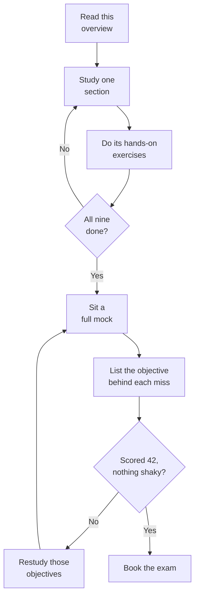

# Databricks Certified Data Engineer Professional (DEP) — exam overview

This page is the map. It tells you what the exam is made of, what its questions look like,
how to spend the 120 minutes, and where material you find elsewhere will mislead you.

That last part matters unusually much right now. **The exam changes on 9 October 2026.** The
new version has a different outline, different weights and a set of topics that no earlier
version covered. Almost every course, blog post and question bank you will find describes the
version that retires on 8 October. Everything on this page, and in this course, is built for
the new one.

---

A note on how to read it. Facts about the exam come from Databricks, and each section links its
source. Advice about how to prepare, how to pace yourself and what the sample questions show is
this course's own analysis, and the page says so where it gives it.

---

## The exam at a glance

These figures come from the New exam column of the
[exam guide](https://www.databricks.com/sites/default/files/2026-09/databricks-certified-data-engineer-professional-exam-guide-oct-2026.pdf).

| Fact | Value |
|---|---|
| Scored questions | 60, all multiple choice |
| Unscored questions | Up to 10 more, not identified on the exam |
| Time limit | 120 minutes, which already allows for the unscored questions |
| Registration fee | USD 200, plus local tax |
| Delivery | Online proctored, or at a test centre |
| Test aids | None permitted |
| Language | English |
| Prerequisite | None, though one year of hands-on data engineering is highly recommended |
| Validity | Two years, then you take the current live exam again |

So a sitting shows you somewhere between 60 and 70 questions, and only 60 of them count. You
cannot tell which ones are unscored, so treat every question as if it counts.

The new exam is offered in English only. The version that retires on 8 October is also offered
in Japanese, Brazilian Portuguese and Korean, and the certification page still lists those
languages because it still describes the old exam.

### The passing score is not published, and you will be told otherwise

Databricks does not publish passing scores for any certification. Its
[certification FAQ](https://www.databricks.com/learn/certification/faq) says the scores are set
by statistical analysis, change as exams are updated with new questions, and so are not
published.

Two corrections follow from that, and both are worth carrying:

- **70% is not an official figure.** It is repeated across third-party sites and has no
  published source behind it.
- **80% is a real Databricks number for a different thing.** It is the minimum for *Badges*,
  which are free, unproctored assessments. It is not the certification pass mark.

The scoring model is likewise unstated. Databricks does not say whether there is a per-section
minimum, so do not plan to write off a section and make up the marks elsewhere. Prepare as
though every section counts, because nothing published says it does not.

---

## What the exam covers

Nine sections, with the weights the guide publishes. The last column is this course's summary
of what each section's objectives ask you to do; the guide's own objective list is the
authority.

| Section | Weight | What it actually rewards |
|---|---|---|
| Developing Code for Data Processing using Python and SQL | 23% | Choosing between pipeline types and streaming designs, and getting jobs, tests and dependencies right |
| Data Ingestion & Acquisition | 12% | Picking the ingestion route for a source: files, message buses, database CDC, sharing or federation |
| Data Manipulation | 12% | Transformations in SQL and PySpark, VARIANT, AI functions, and what an expectation does to a bad row |
| Monitoring and Alerting | 10% | Knowing which surface answers which question: system tables, event logs, APIs, alerts |
| Cost & Performance Optimization | 15% | Choosing the Delta optimisation for an access pattern, and reading a query profile |
| Ensuring Data Security and Compliance | 8% | Least privilege, ABAC policies, masking, and purging data for good |
| Data Governance | 5% | Tags and comments, and how privileges inherit |
| Debugging and Deploying | 10% | Diagnosing a failure from evidence, repairing runs, and deploying with bundles and Git folders |
| Data Modeling | 5% | Table layout for size and access pattern, and dimensional models with materialized and metric views |

The first section is the largest by a distance, at 23%. Add Cost & Performance Optimization at
15% and those two alone are well over a third of the exam. If your time is short, that is where
it goes.

Section names are spelled as Databricks spells them, including American spellings such as
*Optimization* and *Modeling*. The rest of this material uses British spelling.

---

## What changed in the October 2026 version

The exam guide published in autumn 2026 is unusual: it describes two exams. One column and one
outline cover the current exam, available until 8 October 2026. The other cover the new exam,
live from 9 October 2026. Pick by your exam date. If you sit on or after 9 October, only the
new outline applies to you.

**The structure changed.** The old outline had ten sections. The new one has nine, with 46
objectives, and 60 scored questions instead of 59.

- **Data Sharing and Federation is no longer a section of its own.** OpenSharing, Clean Rooms
  and Lakehouse Federation now sit inside Data Ingestion & Acquisition, which grows to 12%.
- **Data Transformation, Cleansing, and Quality became Data Manipulation**, also 12%, and
  picked up two new topics.
- **Cost & Performance Optimization grew** to 15%. Security, Governance and Data Modeling
  each shrank.

The old and new sections do not map one to one, so this table shows where each old section's
weight went rather than a like-for-like comparison. Old weights are the ones the certification
page listed on 4 October 2026; the guide's own old outline prints two of them differently, 10%
for sharing and 7% for modeling, and those figures sum past 100.

| Old section (to 8 October) | Old weight | Where it went (from 9 October) | New weight |
|---|---|---|---|
| Developing Code for Data Processing | 22% | Developing Code for Data Processing using Python and SQL | 23% |
| Data Ingestion & Acquisition | 7% | Data Ingestion & Acquisition | 12% |
| Data Sharing and Federation | 5% | Folded into Data Ingestion & Acquisition | (in the 12%) |
| Data Transformation, Cleansing, and Quality | 10% | Data Manipulation | 12% |
| Monitoring and Alerting | 10% | Monitoring and Alerting | 10% |
| Cost & Performance Optimisation | 13% | Cost & Performance Optimization | 15% |
| Ensuring Data Security and Compliance | 10% | Ensuring Data Security and Compliance | 8% |
| Data Governance | 7% | Data Governance | 5% |
| Debugging and Deploying | 10% | Debugging and Deploying | 10% |
| Data Modelling | 6% | Data Modeling | 5% |

**A set of topics is new, with no counterpart in the old outline.** This is where older
material is silent, and it is the reason to use current material at all:

| New topic | Where it sits |
|---|---|
| The VARIANT data type, `parse_json`, `variant_get` | Data Manipulation |
| AI functions, including `ai_query`, inside pipelines | Data Manipulation |
| Iceberg, as a source format, a CDC target format and a table layout | Ingestion, Modeling |
| Lakeflow Connect CDC from SQL Server, MySQL and PostgreSQL | Data Ingestion & Acquisition |
| Clean Rooms | Data Ingestion & Acquisition |
| ABAC policies with governed tags, for masks and filters at scale | Security and Compliance |
| `CLUSTER BY AUTO`, automatic liquid clustering on Unity Catalog managed tables | Cost & Performance Optimization |
| Unity Catalog metric views | Data Modeling |
| Databricks Lakehouse alerts, far wider than the old SQL alerts | Monitoring and Alerting |
| The Databricks SDK, beside the REST APIs and CLI | Monitoring and Alerting |
| Serverless environments, dependency management and performance mode | Developing Code |
| Unity Catalog functions as UDFs | Developing Code |

**Some objectives became more specific.** CDC now names SCD Type 1 and Type 2 via
`stored_as_scd_type`. Structured Streaming has an objective of its own for stateful
processing: watermarks, output modes, `foreachBatch` and checkpoints. Delta cache and
`CLUSTER BY AUTO` are named outright.

Three of the Cost & Performance names sit close together and are not interchangeable. Liquid
Clustering is a way of laying out a table's data. `CLUSTER BY AUTO` is the automatic form of
it, where predictive optimization chooses and adapts the clustering keys, and the
[clustering documentation](https://docs.databricks.com/aws/en/tables/clustering) limits it to
Unity Catalog managed tables. Predictive optimization is the broader managed maintenance
service that runs the work.

**Some things left the outline.** ORC, AVRO, XML and plain text are gone from the list of
formats to ingest. The objective about building an append-only pipeline is gone, and so are
the built-in debugger in the testing objective and Auto Loader in classic jobs in the
quarantine objective. "Use SQL Alerts to monitor data quality" was replaced by the much
broader Lakehouse alerts objective.

**"No longer named" is not "never on the exam".** A topic that lost its own objective can still
appear where a current objective covers the ground. The test is always which **current**
objective a question is testing, not whether its topic used to have a bullet.

### The names, and which one the exam uses

This exam's vocabulary has been renamed faster than any study material can keep up. Two kinds
of change are mixed together, and it helps to keep them apart.

**Renames the guide itself states.** The new outline prints the old name in brackets after
"formerly", so both forms can appear.

| Older name | The guide's current name | What it is |
|---|---|---|
| Databricks Asset Bundles, DABs | Declarative Automation Bundles | Resources as code, deployed per target |
| `APPLY CHANGES` | AUTO CDC APIs | The API for declarative CDC in pipelines |
| Repos | Databricks Git folders | Git-backed folders in the workspace |

**Names that changed in the documentation, which the guide does not mark.** Older material uses
the first column; the guide and current documentation use the second.

| Older material says | Guide and current docs say | What to know |
|---|---|---|
| Delta Live Tables, DLT | Lakeflow Declarative Pipelines | The docs page on DLT says the product "has been updated to Lakeflow pipelines" |
| Delta Sharing, D2O | OpenSharing, Databricks-to-Open | The [OpenSharing docs](https://docs.databricks.com/aws/en/opensharing) use the new name throughout, and the old address redirects there |
| SQL alerts | Databricks Lakehouse alerts (guide) | The current docs page is titled Databricks SQL alerts, and the earlier version is now called legacy alerts |

Some old names live on inside the product. The documentation notes that event log schemas and
some Python APIs still carry `dlt` in their names, so seeing `dlt` in code does not mean the
code is out of date.

**The pipeline product has three names in one guide.** The outline says *Lakeflow Declarative
Pipelines* three times, *Lakeflow Pipelines* once and *Apache Spark Declarative Pipelines*
twice. Current Databricks documentation says *Lakeflow pipelines*, and its page on Delta Live
Tables says the product "has been updated to Lakeflow pipelines". The open-source framework
underneath is Apache Spark Declarative Pipelines. Treat them as one product. **This does not
change any exam answer**: no question turns on which of the current names it uses. If one
option says Delta Live Tables and another says Lakeflow Declarative Pipelines, the second is
the current name for the same thing.

---

## What the questions actually look like

Databricks publishes two sets of sample questions for this exam, and they are evidence of
different things. Read both, for different reasons.

Everything in this section is this course's description of those 19 published samples. It
describes them; it does not predict the live exam, which Databricks says nothing about beyond
"multiple choice". Nineteen questions is a small set, so treat each pattern as a habit worth
preparing for, not a rule.

- **The October 2026 guide has ten samples**, one per new objective it illustrates. They show
  what the new topics look like as questions. They are written to explain, and it shows: in
  all ten the correct answer is the longest, most explanatory option.
- **The July 2026 guide has nine samples, labelled "retired from a previous version of the
  exam".** These are real exam questions. They are the best evidence there is of how the live
  exam reads. In these, the correct answer is the strictly longest option in only two of nine.

So **do not pick the longest option**. That habit would serve you on the illustrations and fail
you on the real thing.

**Every sample is a scenario.** All 19 open with a situation before they ask anything. There is
no bare definition question in either set.

**Four options, one correct, in every sample.** All 19 give options A to D with a single
answer. Databricks describes the format only as multiple choice and says nothing about
multi-select. No sample uses "All of the above" or "None of the above".

**Stems run longer on the real items.** The retired items run 44 to 103 words, with a middle
value of 51. The October illustrations are shorter, 29 to 62 words. Expect the longer end.

**Expect code in the stem.** The certification page says code examples will primarily be in
Python and SQL. Four of the nine retired items put code or a table schema in the stem: a
`CREATE TABLE` and `ALTER TABLE` pair, a column list, a view using `is_member()`, and a
notebook cell reading a secret with `dbutils.secrets.get`. The question then asks what the code
does. You need to read SQL and PySpark accurately, not just recognise feature names.

**The deciding constraint is in lower case.** No sample capitalises MOST, LEAST or BEST. The
constraint sits quietly in the stem or the last line instead: "with the lowest cost", "while
emphasizing simplicity", "with minimal custom code", "without rearranging the data". Read the
last line twice. If you are used to exams that shout the qualifier, do not wait for the shout.

**Two options can share an action and differ only in the reason.** One retired item has two
options that both begin "Decrease the trigger interval to 5 seconds", followed by different
explanations. Only one explanation is true. When two options look identical at the start, the
reason is the question.

**Numbers in a stem are load-bearing.** Where a sample gives a micro-batch duration, a trigger
interval or a refresh cadence, the answer turns on it.

---

## Timing and pacing

You get 120 minutes for 60 scored questions plus up to 10 unscored ones. That is two minutes a
question at best, and about 103 seconds if your sitting carries all ten unscored items. Plan
on a little under two minutes.

That is tighter than it sounds on this exam, because the real items are long and some carry
code. The pass structure below is this course's recommendation, not a Databricks rule. The risk is spending four minutes untangling one notebook cell and then rushing three
questions you would have got right.

A workable pass structure:

1. **First pass, about 80 minutes.** Answer everything you know. Flag anything that needs more
   than about two minutes, pick your best guess, and move on.
2. **Second pass, about 30 minutes.** Return to the flagged questions, code items first, with
   the pressure off.
3. **Last ten minutes.** Confirm nothing is unanswered.

Answer every question. This is practical advice, not a scoring fact: Databricks publishes
nothing about how a blank is treated or whether a wrong answer is penalised. Nothing on record
makes an attempted answer worse than a blank, so answer.

---

## How to study for this exam

The whole route first. The step most people skip is the loop at the bottom: a weak mock sends
you back to **specific objectives**, not straight into another mock.

**Work through the sections in the guide's order, not by weight.** Developing Code comes first
and defines the pipeline, job and streaming vocabulary that every later section assumes.

**Weight your depth, not your order.** Developing Code and Cost & Performance Optimization
together carry well over a third of the marks. Governance is only 5%, but it is rules-based,
which makes it cheap to turn into reliable marks.

**Spend real time on the new topics.** VARIANT, `ai_query`, ABAC, metric views, Lakehouse
alerts, Lakeflow Connect database CDC, Clean Rooms and `CLUSTER BY AUTO` are where older
material is silent, and where a well-prepared candidate on the old outline will lose marks.

**Read code, not just about code.** Write the SQL and PySpark yourself until you can predict
what a short cell does before you run it. That is what four of nine real samples asked for.

**Check the names before you trust any source.** A source that says Delta Live Tables, Asset
Bundles, Repos or `APPLY CHANGES` is not necessarily wrong, but it was written for an older
vocabulary, and probably for the older outline. Check its topics against the new objectives.

**Read the objectives as written.** The guide's new-exam outline is the syllabus, and it is
specific. Where an objective names a function, a setting or a table, learn that thing.

### The hands-on checklist

Databricks' own advice is that you cannot pass most of its exams by reading alone. Each task
below answers a family of questions, and the section it serves is in the last column.

| Do this | What it settles | Section |
|---|---|---|
| Define one streaming table and one materialized view over the same source, then update an old row | Which one reflects a late change to history | Developing Code |
| Run a windowed streaming aggregation with a watermark into a Delta table, stop it, restart from the checkpoint | Bounded state, and recovery without double counting | Developing Code |
| Write the same stream through `foreachBatch` to two Delta tables, once plainly and once with `txnAppId` and `txnVersion` bound to the batch id | Why `foreachBatch` is only at-least-once until you make the write idempotent | Developing Code |
| Write an AUTO CDC flow twice, once with `stored_as_scd_type` 1 and once with 2 | What each SCD type keeps | Developing Code |
| Parse a JSON string column with `parse_json`, then extract fields with `variant_get` and colon paths | VARIANT against strings and fixed structs | Data Manipulation |
| Classify a column of short texts with `ai_query` inside a query or pipeline step | Where model inference sits in a pipeline | Data Manipulation |
| Add expectations that warn, drop and fail, and route failures to a quarantine table | What each action does to the row and the update | Data Manipulation |
| Query `system.billing.usage` joined to the pricing table for one job's cost | Cost attribution from system tables | Monitoring and Alerting |
| Schedule an alert on a data-quality query, such as a count of null keys | How an alert evaluates a query result and notifies | Monitoring and Alerting |
| Run frequent small `MERGE` statements with and without deletion vectors, then set `CLUSTER BY AUTO` on a managed table | Write amplification, and what automatic clustering needs | Cost & Performance |
| Attach an ABAC column-mask policy to a schema for a governed tag, then create a new tagged table in that schema | Masking at scale, and that a policy covers only its own scope | Security and Compliance |
| Define one revenue measure in a metric view and query it from two places | One governed metric definition instead of several | Data Modeling |
| Grant `SELECT` on a catalog, then create a new schema and table under it | Inheritance down the hierarchy | Data Governance |
| Deploy one bundle to two targets with different variables, then repair a failed job run with a parameter override | Bundle targets, repair and overrides | Debugging and Deploying |

#### What Free Edition cannot give you

Databricks Free Edition is free and covers most of that list. Know its edges before you plan
around it. As of 4 October 2026, the
[Free Edition limitations page](https://docs.databricks.com/aws/en/getting-started/free-edition-limitations)
said this, and limits like these change, so check the page before you plan:

- Free Edition runs **serverless compute only**. The
  [serverless limitations page](https://docs.databricks.com/aws/en/compute/serverless/limitations)
  says the Spark UI and Spark logs are not available there, and points you to the query profile
  instead.
- One active pipeline per pipeline type, and one 2X-Small SQL warehouse.
- **Clean Rooms is not supported.** It needs a second party in another metastore in any case, so
  learn it from the [Clean Rooms documentation](https://docs.databricks.com/aws/en/clean-rooms/)
  rather than by doing.
- No account console. Governed tags are account-level objects, so the ABAC exercise above depends
  on whether your account lets you create one.

The first point matters most for Debugging and Deploying, whose objectives name the Spark UI and
cluster logs. You cannot practise reading them in Free Edition.

| If you have | Do this | What you get |
|---|---|---|
| Free Edition only | Run a deliberately skewed join, then open the **query profile** | The slowest operators, with their time, rows and shuffle |
| A trial or workspace with classic compute | Run the same join on a classic cluster, then open the **Spark UI** and the cluster's driver logs | Stage and task detail, and the logs the objectives name |

If you can borrow a workspace with classic compute for an hour, spend it on that second row.

### Official resources

Deliberately short, all first-party. Most of it is free; the cost column says where that stops.

| Resource | Why it is worth your time | Cost |
|---|---|---|
| [Exam guide (Oct 2026)](https://www.databricks.com/sites/default/files/2026-09/databricks-certified-data-engineer-professional-exam-guide-oct-2026.pdf) | The syllabus for both exams; use the New Exam outline | Free |
| [Certification page](https://www.databricks.com/learn/certification/data-engineer-professional) | Registration and the link to the current guide | Free |
| [AI Prep Guide](https://www.databricks.com/sites/default/files/2026-06/ai-prep-guide-any-databricks-certification.pdf) | Databricks' method for studying with an AI tool, including how to catch its outdated answers | Free |
| [Databricks Academy](https://www.databricks.com/learn/training/certification) | The courses the guide recommends | Self-paced free; instructor-led is paid |
| [Product documentation](https://docs.databricks.com/) | The product truth; check you are on your cloud's tab | Free |
| [Free Edition](https://www.databricks.com/learn/free-edition) | Where most of the checklist gets done | Free |
| [Certification FAQ](https://www.databricks.com/learn/certification/faq) | Scoring policy, retakes, and what is not published | Free |

The guide recommends *Advanced Data Engineering with Databricks* as an instructor-led course,
and four self-paced courses: *Advanced Techniques with Apache Spark™ Declarative Pipeline*,
*Databricks Data Privacy*, *Databricks Performance Optimization* and *Automated Deployment with
Declarative Automation Bundles*.

Check the certification page for a newer guide about two weeks before you sit. Databricks
updates it whenever the exam changes, and this exam has just changed.

### Are you ready? This course's readiness measure, not a Databricks pass mark

**Read this first, because it decides how to use everything below.** Databricks does not
publish a pass mark, so no mock score predicts your result. Its own AI Prep Guide says
practice mocks *"aren't a calibrated readiness check; your real signal is full coverage of the
exam guide objectives plus hands-on confidence."*

So **a mock is a diagnostic, not a verdict.** Use it to find the objectives you cannot answer,
then go and learn those.

There is one number here, and only one.

**The threshold:** 42 correct out of 60 on a full-length mock, taken in 120 minutes with no
notes. That is this course's own readiness bar, the same figure shown on our practice tests. It
is not a Databricks pass mark, and it is not the 70% myth corrected above; it is a threshold we
chose, and 42 of 60 is what it works out to. Below it, keep studying. Above it, you are in
reasonable shape, and still not finished, because the real signal is objective coverage.

**Then read the mock by section, because the total hides where the marks went.** Our
60-question mocks split by the published weights, rounded to whole questions. That split is how
this course builds its mocks; Databricks does not publish how many questions each section gets
on the live exam.

| Section | Questions in a 60-question mock |
|---|---|
| Developing Code for Data Processing using Python and SQL | 14 |
| Data Ingestion & Acquisition | 7 |
| Data Manipulation | 7 |
| Monitoring and Alerting | 6 |
| Cost & Performance Optimization | 9 |
| Ensuring Data Security and Compliance | 5 |
| Data Governance | 3 |
| Debugging and Deploying | 6 |
| Data Modeling | 3 |

Two things fall out of that table. Losing half of Developing Code costs you seven marks, while
missing every Data Governance question costs three, so worry about a weak section in proportion
to its size. And because Databricks does not say whether a per-section minimum applies, do not
let any section sit near zero.

**Then turn each miss into an objective.** Find the objective each wrong answer tests in the
guide's new-exam outline and mark it. Objectives with two or more marks are your study list.
Full coverage of that list, plus the hands-on checklist, is the signal Databricks itself points
to, and unlike a score it is something you can finish.

**Retake the same mock only to check a fix.** A score that climbs because you remember the
questions is measuring memory, not readiness.

### The last 24 hours

Stop learning new material. Confirm your exam date falls on or after 9 October, so you are
sitting the outline you studied. Reread the section weights. Run through the renamed features
until the current name comes first. Reread the list of new topics once. Then rest: this is a
two-hour exam of long, careful reading, and accuracy is what it measures.

---

*This page tracks the official exam guide version Oct 2026, New Exam outline (live from 9
October 2026), retrieved 4 October 2026. The product details on this page were checked against
the Databricks documentation on the same day. Databricks updates the guide whenever the exam
changes. Check the certification page for a newer version about two weeks before you sit.*
