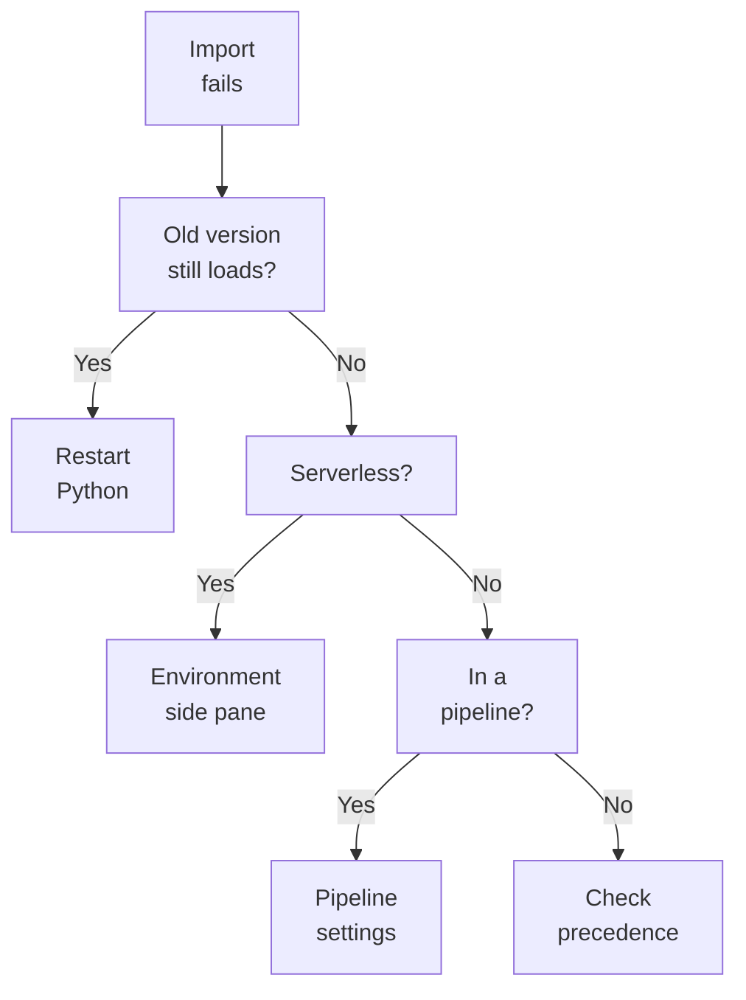
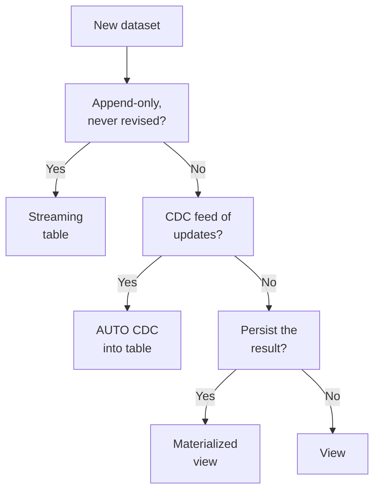

# Domain 1 — Developing Code for Data Processing using Python and SQL

This is the largest section of the exam, at 23%. It rewards knowing which mechanism a Databricks engineer reaches for in a given situation, and what that mechanism quietly does that the obvious alternative does not.

The sections follow the decisions you make while building, not the order the guide lists its objectives. Project layout and libraries come first because everything later is deployed with them. Hand-written Structured Streaming comes before the comparison with declarative pipelines, because that comparison only makes sense once you know what the hand-written route costs.

| Guide objective | Section |
|---|---|
| Project structure for bundles | Structure the project as a bundle |
| Library troubleshooting | Get libraries to install and import |
| User-defined functions | Pick the right kind of UDF |
| Streaming pipelines with Auto Loader | Run streaming pipelines with Auto Loader |
| Jobs via UI, API and CLI | Build and automate jobs |
| Streaming table or materialized view | Streaming table or materialized view |
| AUTO CDC and SCD types | Change data capture with AUTO CDC |
| Structured Streaming or declarative pipelines | Structured Streaming or declarative pipelines |
| If/Else and For Each | Branch and loop inside a job |
| Compute and configuration | Choose compute and settings |
| Unit and integration tests | Test the code |
| Stateful streaming semantics | Manage state in Structured Streaming |

---

## What this domain actually asks

Three habits carry most of the marks.

**Know when a value is decided.** A bundle variable is fixed when you deploy; a job parameter is fixed when you run. A streaming table row is fixed when it is first appended; a materialized view is recomputed to match the source. Many wrong options in this domain are right about the mechanism and wrong about the moment.

**Separate what a guarantee covers from what it does not.** A checkpoint lets a stream resume without reprocessing, but `foreachBatch` writes are only at-least-once until you make them idempotent. A streaming table processes each record exactly once, assuming an append-only source; when the source can update or delete rows, a materialized view stays consistent with it.

**Read the defaults.** Much of the difficulty sits in what happens when you set nothing: `assertDataFrameEqual` ignores row order, AUTO CDC keeps no history, an unset trigger polls every few milliseconds. The question usually describes a symptom that the default explains.

---

## Structure the project as a bundle

A Declarative Automation Bundle **is the project, not a deployment script**. It describes Databricks resources such as jobs and pipelines as source files, and the Databricks command-line interface validates, deploys and runs it against a target environment. It is an infrastructure-as-code (IaC) approach, recommended where several contributors, automation, and continuous integration (CI) and continuous delivery (CD), together CI/CD, are requirements.

A scalable Python project structure is a modular one, and the bundle enforces only one fixed point. **A bundle has exactly one `databricks.yml`, at the root**. That file pulls in other configuration files through `include`, so resources and targets can live in their own files. The `default-python` template shows the layout to copy: `databricks.yml` at the root, job definitions under `resources/`, package code under `src/`, sample unit tests under `tests/`. **Tests belong inside the bundle**; a bundle includes source files, resource definitions, and unit and integration tests.

```yaml
bundle:
  name: hello-bundle
include:
  - '*.yml'
targets:
  dev:
    default: true
  prod:
    workspace:
      host: https://<production-workspace-url>
```

**Top-level settings apply unless a target overrides them**, so a `prod` target states only what differs, such as the workspace host or cluster. Only one target can be `default: true`, and every other target must be named with `-t`, as in `databricks bundle deploy -t prod`.

**Deployment modes are a convenience, not a requirement**.

| | `mode: development` | `mode: production` |
|---|---|---|
| Resource names | Prefixed `[dev username]` | Unchanged |
| Schedules and triggers | Paused | Not paused by the mode |
| Pipelines | Marked `development: true` | Checked to be `development: false` |
| Other checks | Concurrent runs on, deployment lock off | Git branch must match the target's branch |

Presets override a mode's defaults, and a setting on an individual resource overrides both. For production, Databricks recommends deploying as a service principal by setting `run_as`.

The trap the exam likes most here is timing. Custom variables, declared under `variables` and referenced as `${var.my_variable}`, **are resolved at deployment**. You can supply them with `--var="key=value"`, an environment variable starting `BUNDLE_VAR_`, or per target. A job that is already deployed runs with the values of its deployment, so a value for one run must be a job parameter.

> **Trap.** The bundle was formerly Databricks Asset Bundles (DABs), and the guide prints both names. They are the same tool. **This does not change any exam answer**: pick the option whose mechanism is right, whichever name it uses.

<details>
<summary><b>Self-check — bundles</b></summary>

1. A team wants one job definition deployed to dev and prod, with prod using a different workspace and cluster. What does the prod target need to contain?
2. A scheduled job deployed with `mode: development` never runs on its schedule. Why?
3. An engineer passes `--var="table=sales_2026"` when running an already deployed job, and the run still reads the old table. What should they have used?

Answers: (1) Only what differs, such as the host and cluster; everything else falls back to the top-level resources. (2) Development mode pauses all schedules and triggers. (3) A job parameter, because bundle variables are resolved at deployment.
</details>

---

## Get libraries to install and import

Dependency conflicts and installation failures look similar whether the library comes from PyPI, local wheels or source archives. Most are one of three questions: which copy wins on import, whether the process has picked up the change, and whether this kind of compute supports the install method at all.

**Which copy wins.** When two copies of a library exist, **the higher-precedence one is imported**: a Git folder's working directory and root first, then notebook-scoped libraries installed with `%pip`, then compute-scoped libraries, then the libraries in Databricks Runtime. So a version installed with `%pip` wins over the cluster's. Init scripts are not recommended for installing libraries at all.

**Whether the change has landed.** **`%pip` does not restart Python**; after an upgrade you may need `dbutils.library.restartPython()`. A notebook already attached to a cluster does not see a newly installed cluster library until it starts a new session, and an uninstalled cluster library stays until the cluster restarts.

**Whether the compute supports it.** This is where serverless environments, pipelines and bundle-deployed jobs differ, and where dependency management works differently on each.

| Where the code runs | How dependencies get in | What does not work |
|---|---|---|
| Classic compute | Compute-scoped libraries from PyPI, workspace files, volumes; `%pip` per notebook | Libraries in the DBFS root, disabled by default from Databricks Runtime 15.1 |
| Serverless notebook or job | Environment side pane or a base environment; job tasks get a base environment plus extra libraries | Init scripts, compute policies, compute-scoped libraries, task libraries on notebook tasks |
| Lakeflow pipeline | The pipeline's Environment settings, or modules imported from workspace files | `restartPython()`, JVM libraries, init scripts on serverless |
| Bundle-deployed job | The task's `libraries` mapping, such as `whl` or `pypi` entries | Nothing the target compute itself does not support |

**A bundle does not change what the compute supports**; it only declares it. Databricks recommends uv with `pyproject.toml` for Python dependencies in bundles, and a `requirements*.txt` file also works.

```yaml
libraries:
  - whl: /Volumes/main/default/my-volume/my-wheel-0.1.0.whl
  - pypi:
      package: numpy==1.25.2
```

A serverless environment has three failure modes classic compute does not, and the first can look like a dependency conflict. It does not guarantee a CPU architecture, so a wheel with native extensions built for one architecture can fail on the next run; use pure-Python `py3-none-any` wheels or ship both `aarch64` and `x86_64` variants. Installing PySpark, or anything that pulls it in, stops the session. And dependencies are resolved before your code runs, so a proxy set in a cell changes nothing; a private repository needs `index-url` or `extra-index-url` in the dependency itself.

Serverless also caches the environment. If you fix a custom wheel but keep its version number, a job can keep running the old code; **bump the version**. A wheel for a serverless environment comes from workspace files, by an absolute `/Workspace/` path, or from a Unity Catalog volume, by a path such as `/Volumes/main/default/my-volume/my-wheel-0.1.0.whl`.



<details>
<summary><b>Self-check — libraries</b></summary>

1. A cluster has pandas 1.5 installed as a cluster library, and a notebook runs `%pip install pandas==2.2.3`. Which version does that notebook import after restarting Python?
2. A serverless job installs a wheel successfully on Monday and fails to install the same wheel on Tuesday. What is the likely cause?
3. A pipeline's code calls `%pip install` and then `dbutils.library.restartPython()`. What should it do instead?

Answers: (1) 2.2.3, because notebook-scoped libraries take precedence over compute-scoped ones. (2) The run landed on a different CPU architecture and the wheel has native extensions built for only one. (3) Declare the dependency in the pipeline's Environment settings; pipelines do not support restarting Python.
</details>

---

## Pick the right kind of UDF

**Start with whether you need a user-defined function (UDF) at all**. Built-in Spark functions are optimised for distributed processing, and Databricks recommends them for large datasets and anything that runs regularly or continuously, such as extract, transform and load (ETL) jobs and streaming. UDFs suit logic that built-ins cannot express, ad hoc work, and small to medium data.

Then decide, under the given constraints, who needs to use it.

| | Unity Catalog function | Session-scoped UDF |
|---|---|---|
| Lifetime | Persisted in Unity Catalog | Current SparkSession only |
| Sharing | Notebooks, jobs and SQL warehouses, governed by permissions | Not governed or shared |
| Languages | SQL, Python, Scala and Java | SQL, Python and Scala |
| Access | `EXECUTE` on the function, plus `USAGE` on schema and catalog | No Unity Catalog permissions |

```sql
CREATE OR REPLACE FUNCTION main.test.get_name_length(name STRING)
RETURNS INT
RETURN LENGTH(name);

GRANT EXECUTE ON FUNCTION main.test.get_name_length TO `user@example.com`;
```

A Unity Catalog Python UDF runs in a secure, isolated environment with no access to file systems or internal services, and your code inside it must handle nulls. Its external libraries go in its `ENVIRONMENT` clause with an `environment_version`, not on the cluster. A `TEMPORARY` function lives only in the current session; without `TEMPORARY` it is permanent. User-defined aggregate functions (UDAFs) are session-scoped only. A user-defined table function (UDTF) returns several rows per input row.

**Performance follows a rough order**. Built-in functions and SQL UDFs are the most efficient options. Python and pandas UDFs are slower because data leaves the Java virtual machine (JVM) for the Python interpreter, and pandas UDFs are up to 100x faster than Python UDFs because Apache Arrow reduces serialisation.

The pandas UDF type follows the shape of the work. A Series to Series UDF vectorises a scalar operation and must return a Series of the same length. An Iterator of Series UDF suits work that needs state initialised once, such as loading a model for every batch. A Series to scalar UDF is an aggregation.

One correctness rule surprises people. Spark SQL **does not guarantee the order in which subexpressions are evaluated**, so `WHERE s IS NOT NULL AND my_udf(s) > 1` can still pass nulls to the UDF. Make the UDF null-aware, or call it inside `IF` or `CASE WHEN`.

<details>
<summary><b>Self-check — UDFs</b></summary>

1. A hashing function must be shared by three teams and called from a SQL warehouse. Which kind of UDF, and which privilege does a caller need?
2. A pandas UDF loads a 2 GB model and is slow because it reloads per batch. Which pandas UDF type fixes this?
3. A function registered with `spark.udf.register` returns numbers, but the column comes back as strings. Why?

Answers: (1) A Unity Catalog function; callers need `EXECUTE` plus `USAGE` on the schema and catalog. (2) Iterator of Series to Iterator of Series, which initialises state once. (3) Without a declared return type, `spark.udf.register` defaults to `StringType`.
</details>

---

## Run streaming pipelines with Auto Loader

Lakeflow Declarative Pipelines are declarative: you define datasets, and the pipeline works out the order, runs flows in parallel, and retries transient failures from the task, to the flow, to the whole pipeline. Every table a pipeline creates and manages is a Delta table, and pipelines maintain them with Predictive Optimization, including `OPTIMIZE` and `VACUUM`.

Auto Loader is the ingestion half. It is a Structured Streaming source, `cloudFiles`, that processes new files as they arrive in cloud storage. It records discovered files in its checkpoint, which gives exactly-once processing and lets it resume after a failure while writing to Delta Lake. **Inside a pipeline you do not set its schema or checkpoint location**; the pipeline manages both.

```python
from pyspark import pipelines as dp

@dp.table
def customers():
    return (spark.readStream.format("cloudFiles")
            .option("cloudFiles.format", "json")
            .load("s3://mybucket/analysis/*/*/*.json"))
```

```sql
CREATE OR REFRESH STREAMING TABLE sales
AS SELECT * FROM STREAM read_files('s3://mybucket/analysis/*/*/*.json', format => "json");
```

Schema evolution is where the questions are, and it decides whether a pipeline is production-ready. For JSON, CSV and XML, Auto Loader infers every column as a string unless `cloudFiles.inferColumnTypes` is true; for Parquet it merges the sampled schemas. When it infers a schema it also adds `_rescued_data`, which keeps values that do not fit, with their source file, instead of dropping them.

| `cloudFiles.schemaEvolutionMode` | On a new column |
|---|---|
| `addNewColumns`, the default without a schema | Adds the column, then fails; a restart picks it up |
| `rescue` | Never evolves the schema; new columns go to the rescued data column |
| `failOnNewColumns` | Fails until you update the schema or remove the file |
| `none`, the default with a schema | Ignores the column and does not fail |

**The default failing is by design**, and Databricks recommends running such streams in Lakeflow Jobs so they restart automatically. Schema hints do not cast; they tell the reader what type to read, and a mismatch goes to the rescued column.

Directory listing is the default file detection mode and needs no extra permissions, but Databricks recommends file notification with file events for most workloads because it scales better. You can switch between them across restarts and keep exactly-once guarantees. Auto Loader does not guarantee the order in which files are processed.

Outside a pipeline, three options come up. `cloudFiles.schemaLocation` is what enables schema inference and evolution, and it can be the same directory as the checkpoint. `cloudFiles.maxFilesPerTrigger` is a hard limit on a micro-batch, but `cloudFiles.maxBytesPerTrigger` is a soft one, so a batch can run past the byte figure. And `cloudFiles.cleanSource`, on Databricks Runtime 16.4 LTS and above, archives (`MOVE`) or deletes processed files, which cuts storage cost and speeds directory listing; `MOVE` needs the destination in the same external location, volume or mount as the source.

Pipelines run in one of two modes, and **the mode is independent of the table type**.

| | Triggered | Continuous |
|---|---|---|
| Stops | When the available data is processed | Only when stopped |
| Freshness it suits | Every 10 minutes, hourly, daily | Every 10 seconds to a few minutes |
| Cost | Lower; compute runs only for the update | Higher; always-running compute |

For a continuous pipeline, Databricks recommends a continuous job rather than the pipeline's own continuous setting, and the job's mode overrides the pipeline's. If latency does not matter, Auto Loader can also run as a scheduled batch with `Trigger.AvailableNow`, which processes everything that arrived before the query started. When a second source must feed an existing streaming table, add another append flow; that avoids a full refresh and a `UNION`.

<details>
<summary><b>Self-check — pipelines and Auto Loader</b></summary>

1. A JSON stream with no declared schema fails with `UnknownFieldException` after a producer adds a field. What happened, and what is the recommended setup?
2. Every column ingested from CSV arrives as a string. Which option changes that?
3. A team must not lose data from new columns but must not change the table's schema. Which evolution mode?

Answers: (1) In the default `addNewColumns` mode the stream adds the column and fails; run it in Lakeflow Jobs so it restarts and resumes with the new schema. (2) `cloudFiles.inferColumnTypes`. (3) `rescue`, which records new columns in the rescued data column.
</details>

---

## Streaming table or materialized view

The choice comes down to **whether a row, once written, can ever need to change**. A streaming table processes each record exactly once, assuming an append-only source, which makes it fast and suited to ingestion and low-latency work. A materialized view recomputes as needed to reflect the current state of the data each time it refreshes. Materialized does not mean shared: by default only the pipeline owner can query a pipeline's materialized views and streaming tables, so other jobs and dashboards need a `SELECT` grant.



Three behaviours make the difference concrete. A row already appended to a streaming table **is not re-queried**, so if you change the query, old rows keep the old logic. A join in a streaming table does not recompute when the dimension changes, which is fast but can be wrong; a materialized view recomputes it. And a materialized view is not built for low latency: an update takes seconds to minutes, and some changes force a full recomputation.

This is why an aggregate that must reflect late updates to earlier days is a materialized view, not a streaming table. A view is the third option: computed on demand, not persisted, and usable only inside its pipeline.

| | Materialized view | Streaming table |
|---|---|---|
| Default refresh | Incremental when cheaper, full when needed | Only records since the last update |
| Full refresh | Recomputes the result | Truncates, clears checkpoints, reprocesses the source |
| Reset checkpoints | Not applicable | Reprocesses selected flows, keeps existing data |

**Incremental refresh of a materialized view happens only on serverless pipelines**; on classic compute it is always fully recomputed. A full refresh of a streaming table can lose data the source no longer holds, such as a Kafka topic past retention. A streaming table also expects a stream that is naturally bounded or bounded with a watermark; an unbounded stream without one can fail the pipeline from memory pressure.

<details>
<summary><b>Self-check — table types</b></summary>

1. A gold table totals daily orders, and refunds for earlier days arrive late. Streaming table or materialized view?
2. You change a streaming table's query from `LOWER(name)` to `UPPER(name)`. What happens to the rows already in it?
3. You must reprocess one flow's source after a logic change without emptying the table. Which operation?

Answers: (1) Materialized view; it keeps the full result consistent with changes to earlier data. (2) Nothing; only new rows use the new logic until a full refresh. (3) Reset that flow's streaming checkpoints.
</details>

---

## Change data capture with AUTO CDC

The AUTO CDC APIs apply a change data capture (CDC) feed to a streaming table. They replaced `APPLY CHANGES` with the same syntax, and `APPLY CHANGES` still works. If the source has no change feed and only snapshots, AUTO CDC FROM SNAPSHOT works out the changes by comparing them.

You create the streaming table first, then the flow, naming the source, the keys and the sequencing column.

```python
dp.create_streaming_table("users_current")
dp.create_auto_cdc_flow(
    target="users_current",
    source="users",
    keys=["userId"],
    sequence_by=col("sequenceNum"),
    apply_as_deletes=expr("operation = 'DELETE'"),
    except_column_list=["operation", "sequenceNum"],
    stored_as_scd_type=1,
)
```

The slowly changing dimension (SCD) type decides whether history survives.

| | SCD Type 1 | SCD Type 2 |
|---|---|---|
| Updates | Overwrite in place | New row per version |
| History columns | None | `__START_AT`, `__END_AT` |
| Current row | The only row | The one where `__END_AT` is null |
| Setting | `stored_as_scd_type=1`, the default | `stored_as_scd_type=2` |

By default Type 2 creates a version when any column changes; `TRACK HISTORY ON` limits that to chosen columns, so changes to the rest update the current row in place.

Four details decide most questions. The sequencing column carries the logical order, and AUTO CDC uses it to handle out-of-order events; a late update with an older sequence value is dropped in Type 1. It must be sortable and never null, and a tie is broken by sequencing on a `STRUCT` of several columns. **Deletes are not automatic**: inserts and updates are upserted, and deletes need `apply_as_deletes`. And `ignore_null_updates` defaults to false, so a feed carrying only changed columns overwrites the others with nulls unless you set it.

```sql
CREATE OR REFRESH STREAMING TABLE users_history;
CREATE FLOW apply_cdc AS AUTO CDC INTO users_history
FROM stream(main.cdc_tutorial.users_cdf)
KEYS (userId)
APPLY AS DELETE WHEN operation = "DELETE"
SEQUENCE BY sequenceNum
COLUMNS * EXCEPT (operation, sequenceNum)
STORED AS SCD TYPE 2;
```

<details>
<summary><b>Self-check — AUTO CDC</b></summary>

1. A flow omits `stored_as_scd_type`, and the analytics team finds no history. Why?
2. Deleted users still appear in the target. What is missing?
3. An update feed sends only the changed columns, and other columns become null in the target. Which setting fixes it?

Answers: (1) The default is SCD Type 1. (2) `apply_as_deletes` (or `APPLY AS DELETE WHEN`); deletes are not applied by default. (3) `ignore_null_updates=True`.
</details>

---

## Manage state in Structured Streaming

A stateful query keeps intermediate state across micro-batches: aggregations, `distinct`, `dropDuplicates`, stream-stream joins. Without a bound, that state grows until the query slows or fails. Stateful-processing semantics come down to four tools: watermarks bound the state, output modes decide when results are written, checkpoints make recovery fault-tolerant and exactly-once, and `foreachBatch` reaches other sinks.

```python
(df.withWatermark("event_time", "10 minutes")
   .groupBy(window("event_time", "5 minutes"), "id")
   .count())
```

A watermark always processes records within its threshold and may, though it is not guaranteed to, process later ones. A shorter watermark means less state and lower latency but little tolerance for late data; a longer one is the reverse. With several input streams, the default global watermark is the minimum across streams, so the slowest stream sets the pace.

The output mode decides when results are written.

| Output mode | With a watermarked aggregation |
|---|---|
| Append, the default | Writes each row once, after the watermark passes; drops old state |
| Update | Writes changed rows every trigger; drops old state |
| Complete | Never drops state; rewrites the whole result each trigger |

Delta Lake sinks, and so Unity Catalog managed tables, **accept append and complete but not update**. For update-like behaviour into Delta, use `MERGE` inside `foreachBatch`.

The checkpoint is what makes recovery exact. It stores the source offsets of each micro-batch, so a restart resumes where it stopped, and a commit log of batches written to the sink. Each query needs its own checkpoint location. Changing the sources, Kafka topics, Auto Loader paths, stateful operations or sink type generally needs a new checkpoint; filters, rate limits and trigger intervals are generally safe to change. One setting is frozen with it: the number of shuffle partitions, so raising `spark.sql.shuffle.partitions` has no effect on a query that already has a checkpoint, unless you start it with a new checkpoint location. Newer runtimes relax this: from Databricks Runtime 18.0, stateless queries can change shuffle partitions without a new checkpoint, and from the 18 long-term support (LTS) release stateful queries can change the count without losing state. **This does not change the exam answer** for a question that gives no newer runtime: pick the option that starts a new checkpoint.

`foreachBatch` deserves its own warning. It runs arbitrary batch code on each micro-batch, but **it gives only at-least-once writes**. For Delta writes inside it, set `txnAppId` and `txnVersion`, binding the version to the batch id, so a replayed batch is skipped.

```python
def write_batch(batch_df, batch_id):
    (batch_df.write.format("delta").mode("append")
        .option("txnVersion", batch_id)
        .option("txnAppId", app_id)
        .saveAsTable(main_table))
```

Triggers set the rhythm. With no trigger, a query polls every few milliseconds, which can mean a large bill in cloud storage calls. `.trigger(processingTime='10 seconds')` sets an interval, and `.trigger(availableNow=True)` processes what is there and stops. **On serverless compute only `AvailableNow` and `Once` are supported**, and `Once` is deprecated, so use `AvailableNow`; for continuous streaming on serverless, use a pipeline in continuous mode. Because `AvailableNow` takes all available data in each trigger, a large backlog on serverless can make one very large micro-batch; set `maxFilesPerTrigger` or `maxBytesPerTrigger` to avoid out-of-memory errors.

<details>
<summary><b>Self-check — streaming state</b></summary>

1. A windowed count must bound state and resume after a driver failure without double counting. Which two mechanisms?
2. A query writes an aggregation to a Delta table with `outputMode("update")` and fails. Why, and what is the alternative?
3. A `foreachBatch` writes to Delta and sometimes duplicates rows after a retry. What fixes it?

Answers: (1) A watermark bounds the state, and the checkpoint restores offsets and state on restart. (2) Delta sinks do not support update mode; use `MERGE` inside `foreachBatch`. (3) Set `txnAppId` and `txnVersion` bound to the batch id.
</details>

---

## Structured Streaming or declarative pipelines

Choosing between Spark Structured Streaming and declarative pipelines for scalable ETL is a question of operational constraints: how much you want to write and run yourself. Lakeflow pipelines are built on Apache Spark Declarative Pipelines, so pipeline code stays portable to other runtimes of that open-source framework. Databricks then adds production features the open-source version does not have.

| Capability | Spark Declarative Pipelines | Lakeflow pipelines |
|---|---|---|
| Streaming tables, materialized views, append flows, sinks | Yes | Yes |
| AUTO CDC, Type 1 and Type 2 | No | Yes |
| Data quality expectations | No | Yes |
| Queryable event log | No | Yes |
| `foreachBatch` sinks and continuous mode | No | Yes |

Against hand-written Structured Streaming, a pipeline handles out-of-order CDC without watermark code and maintains materialized views incrementally. Pipelines expose only Append and Update flows, so complete output mode stays a hand-written option. A pipeline can still reach an arbitrary destination through `@dp.foreach_batch_sink()`. And a pipeline runs on serverless only when you turn its Serverless setting on.

> **Trap.** The guide uses three names for one product: Lakeflow Declarative Pipelines, Lakeflow Pipelines and Apache Spark Declarative Pipelines; the documentation now says Lakeflow pipelines. Code may import `dlt` or `pipelines as dp`. **This does not change any exam answer**: treat them as one product and answer on what each option does.

---

## Build and automate jobs

A Lakeflow Jobs job coordinates one or more tasks, shown as a directed acyclic graph (DAG), with a trigger, parameters pushed to its tasks, notifications and Git settings. Triggers can be schedules, using Quartz cron expressions, or events such as new files arriving.

Which tool you automate with depends on who is automating. For CI/CD, Databricks points to Declarative Automation Bundles or the Terraform provider. The command-line interface wraps the REST API and suits one-off tasks and scripts, and most of its commands map to a REST call: `databricks jobs get` is `GET /api/2.2/jobs/get`. The SDKs suit applications, and the REST API directly suits languages with no SDK.

```bash
databricks jobs create --json @job.json
databricks jobs run-now 123456
```

`run-now` takes `--idempotency-token`, so a request repeated after a timeout does not start a second run. `run-now` and `repair-run` also take `--performance-target`, `PERFORMANCE_OPTIMIZED` or `STANDARD`, to set a serverless job's mode for that run.

**Several commands look alike and do different things**.

| Command | What it does |
|---|---|
| `jobs run-now` | Runs a saved job and returns its run id |
| `jobs submit` | Runs a definition once without saving it; not shown in the UI |
| `jobs reset` | Overwrites all of a job's settings |
| `jobs update` | Changes only the settings you pass |
| `jobs repair-run` | Re-runs tasks inside the original run, with current settings |

Parameters come in two kinds. Job parameters are set at the job level, pushed to tasks, and can be overridden for a run with Run now with different parameters or the REST API. Task parameters with static values change only when the task definition does. **A default value is not a security control**, since anyone with the `CAN MANAGE RUN` permission can override it.

A run that would exceed the job's maximum concurrent runs, which defaults to 1, is skipped. With queueing on, the run waits for up to 48 hours instead.

---

## Branch and loop inside a job

Jobs have two control-flow operators, the If/Else conditions and For Each loops the guide names. The If/else task branches on a condition over task values, job parameters or dynamic values, with `==`, `!=`, `>`, `>=`, `<` and `<=`. The For each task runs a nested task once per parameter set, so 40 tables need one loop, not 40 tasks.

Run if conditions decide whether a task runs, based on how its dependencies ended.

| Run if | Runs when |
|---|---|
| All succeeded, the default | Every dependency succeeded |
| At least one succeeded | Any dependency succeeded |
| None failed | No dependency failed and at least one ran |
| All done | Every dependency finished, whatever the result |
| At least one failed | Any dependency failed |
| All failed | Every dependency failed |

All done suits cleanup. Excluded upstream tasks count as successful, and Upstream failed counts as failed. If all of a task's dependencies are excluded, it is excluded too, and that cascades down a chain.

Tasks pass small results to each other as task values. A task sets one with `dbutils.jobs.taskValues.set()`, and later tasks read it as `{{tasks.task_name.values.key}}`. Keys are strings, and values must be valid JSON no larger than 48 KiB. Dynamic value references bring in run context the same way, such as `{{job.start_time.iso_date}}` in coordinated universal time (UTC), or `{{tasks.task_name.result_state}}` to branch on how an upstream task ended.

---

## Choose compute and settings

For pipelines, Databricks recommends serverless almost always. It adds incremental materialized view refresh, autoscaling that grows executors as well as adding them, and concurrent micro-batches. Classic compute is for what serverless cannot run: Hive metastore tables, unsupported private networking, or a region without serverless.

Serverless jobs need a Unity Catalog workspace and run in standard access mode. They support notebook, Python script, dbt, Python wheel and Java archive (JAR) tasks.

| | Performance optimized | Standard |
|---|---|---|
| Startup | Fast, from warm compute | 4 to 6 minutes |
| Cost | Higher | Fewer DBUs, same billing SKU |
| Available for | Notebooks, jobs, pipelines | Jobs and pipelines only |

A Databricks unit (DBU) is the billing measure, and both modes share one stock-keeping unit (SKU). Standard mode can cut costs by up to 70%. A continuous job running a pipeline can use Standard; the pipeline's own continuous mode cannot.

High-memory notebook tasks, in Public Preview, raise a serverless notebook's read-eval-print loop (REPL) memory from 16 GB to 32 GB at a higher rate. It does not enlarge the Spark session, and it applies only to notebook tasks.

Auto-optimization is the setting the guide names. Serverless jobs retry failed tasks automatically, and that is on by default. For a job that must run at most once, such as one that is not idempotent, **disallowing retries means turning auto-optimization off** in the task's retry policy.

Serverless has its own rules. You set only supported Spark configuration parameters, at session level, and a run that sets an unsupported one fails. You code against an environment version while Databricks upgrades the server underneath. And because serverless uses Spark Connect, which evaluates temporary views lazily, reusing one temporary view name in a loop can fail; give each a unique name.

<details>
<summary><b>Self-check — compute</b></summary>

1. A nightly batch job can start 5 minutes late and must cost less. Which performance mode?
2. A serverless notebook hits an out-of-memory error inside a Spark aggregation. Does high memory help?
3. A serverless task sends payment instructions and must never run twice. Which setting?

Answers: (1) Standard. (2) No; high memory enlarges the REPL memory, not the Spark session. (3) Turn off auto-optimization in the task's retry policy.
</details>

---

## Test the code

Testable PySpark code puts each transformation in a function that takes and returns a DataFrame. A test then builds a small input, applies the function, and compares the result with an expected DataFrame. `DataFrame.transform` chains such functions and passes extra arguments through.

```python
from pyspark.testing.utils import assertDataFrameEqual

result = df.transform(remove_extra_spaces, "name")
assertDataFrameEqual(result, expected_df)
```

The two assertion helpers have defaults worth knowing. `assertDataFrameEqual` **ignores row order and nullability by default** and compares numbers with a tolerance, which `rtol` adjusts. `assertSchemaEqual` compares schemas and also ignores nullability by default. Both are standalone, so they work under unittest, pytest or any CI pipeline. With pytest, a fixture can share one SparkSession across tests.

For Python notebooks, Databricks recommends keeping functions and their tests outside the notebook, which is the `src/` and `tests/` layout a bundle already has. Run tests against non-production data, and let CI, such as GitHub Actions, run them on every change.

Pipelines also have a unit testing framework, currently in Beta. Learn the general pattern above; the exam guide names the assertion helpers and `DataFrame.transform`, not the Beta framework.

---

## Traps worth carrying into the exam

- Bundle variables are fixed at deployment; per-run values are job parameters.
- Development mode pauses schedules; a dev job that never runs on schedule is behaving correctly.
- A `%pip` install outranks the cluster library, but you may need to restart Python to see it.
- On serverless there are no init scripts, compute policies or task libraries on notebook tasks.
- A fixed custom wheel needs a new version number before a serverless job picks it up.
- A null check in `WHERE` does not protect a UDF; handle nulls inside it.
- Governed UDFs need `EXECUTE`; session UDFs cannot be shared.
- Auto Loader's default evolution fails the stream on purpose; restart it with a job.
- JSON and CSV columns arrive as strings unless you infer types.
- A streaming table never revisits a written row; late corrections need a materialized view or AUTO CDC.
- Incremental materialized view refresh needs serverless.
- AUTO CDC keeps no history unless you ask for SCD Type 2, and applies no deletes unless you say how.
- `foreachBatch` is at-least-once; idempotency needs `txnAppId` and `txnVersion`.
- Delta sinks reject update output mode.
- Shuffle partitions are frozen in the checkpoint, except on Databricks Runtime 18 and above.
- Serverless streaming supports only `AvailableNow` and the deprecated `Once` trigger.
- `jobs reset` replaces everything; `jobs update` changes only what you pass.
- `jobs submit` runs are not saved and cannot be auto-optimized.
- `assertDataFrameEqual` ignores row order by default.
