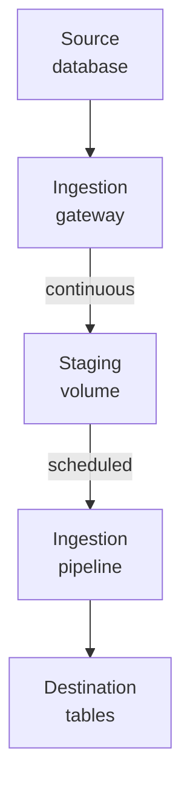
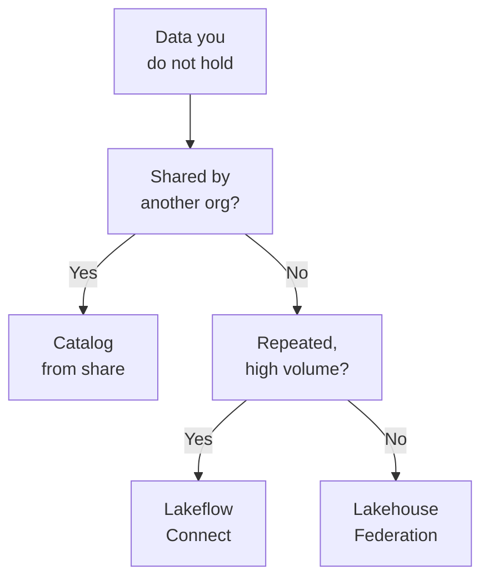

# Domain 2 — Data Ingestion & Acquisition

This section is 12% of the exam. It rewards knowing which of several routes gets external data in front of your users, and what each route quietly requires of the source system before it works.

The sections follow the guide with one split. Its first objective covers three kinds of source, message buses, files and tables, and each is read by a different mechanism, so each gets its own section. Change data capture (CDC) pipelines come next because they read those sources. Lakeflow Connect follows because its destination tables reuse the same history ideas. Sharing and federation close the domain: both give access without ingesting anything.

| Guide objective | Section |
|---|---|
| Ingest formats from message buses and cloud storage | Read from message buses · Read files from cloud storage · Delta and Iceberg as sources |
| Incremental CDC with a Delta or Iceberg target | CDC pipelines with a Delta or Iceberg target |
| CDC from SQL Server, MySQL and PostgreSQL | Ingest relational databases with Lakeflow Connect |
| OpenSharing and Clean Rooms | Share data with OpenSharing · Collaborate in a clean room |
| Lakehouse Federation with governance | Query in place with Lakehouse Federation |

---

## What this domain actually asks

Three habits carry most of the marks.

**Decide whether to move the data or query it.** Lakeflow Connect copies data in and is the recommended route for higher volumes and lower latency. Lakehouse Federation queries it where it lives, read-only, which suits ad hoc and proof-of-concept work. OpenSharing gives another organisation read-only access to your tables, and your updates reach them in near real time. Many wrong options pick a working route for the wrong access pattern.

**Know what must run all the time.** A database connector's ingestion gateway runs continuously so that the source does not truncate its change log before the changes are read. The pipeline behind it can run on a schedule. Stopping the wrong component is the most expensive mistake in this domain, because it ends in a full refresh.

**Respect append-only sources.** A stream reading a Delta table accepts only appends, and an `UPDATE` or `DELETE` on that table fails the stream. The fix depends on whether the downstream table needs the change: skip it with `skipChangeCommits`, or propagate it with the change data feed.

---

## Read from message buses

Kafka and Kinesis hand you **bytes, not records**. Kafka keys and values always arrive as binary byte arrays, and a Kinesis payload arrives in a binary `data` column. You deserialize explicitly, with `cast("string")`, `from_json` or `from_avro`, before you can parse anything.

A Kafka source needs two things: the cluster address in `kafka.bootstrap.servers`, and one of `subscribe`, `subscribePattern` or `assign` to choose topics. Authentication options include Unity Catalog service credentials and cloud-specific options for managed Kafka services.

```python
df = (spark.readStream.format("kafka")
      .option("kafka.bootstrap.servers", "<server:ip>")
      .option("subscribe", "orders")
      .option("startingOffsets", "latest")
      .load())
```

SQL reads Kafka with `read_kafka`, but **streaming in SQL works only in Lakeflow pipelines or with streaming tables** in Databricks SQL, not in an ordinary query.

```sql
CREATE OR REFRESH STREAMING TABLE orders_raw
AS SELECT * FROM STREAM read_kafka(bootstrapServers => '<server:ip>', subscribe => 'orders');
```

For incremental batch loading, Databricks recommends `Trigger.AvailableNow`, and on serverless compute it is the recommended trigger for incremental streaming. Low-latency continuous work belongs in pipelines' continuous mode. To see how far a query lags, read `avgOffsetsBehindLatest`, `maxOffsetsBehindLatest` and `minOffsetsBehindLatest`.

Kinesis has rules of its own. A source names its stream with **either `streamName` or `streamARN`, never both**, where the second is the stream's Amazon Resource Name (ARN). Switching between them on a running query is unsupported and can duplicate or lose records, so you start a new query with a fresh checkpoint. Resharding is the opposite case: you can add shards without restarting anything.

When Kinesis records expire before the query reads them, the query fails by default. Setting `spark.databricks.kinesis.failOnDataLoss` to `false` lets it skip them, and **that is a temporary mitigation, not a fix**: it can lose data permanently. When the data must be complete, restart the stream with a new checkpoint to reprocess it, and fix the cause, such as a retention period that is too short. `AvailableNow` on Kinesis is best-effort, too. A triggered batch can miss a few records, which the next batch picks up.

Google Pub/Sub uses `format("pubsub")` with `subscriptionId`, `topicId` and `projectId`. Its connector **processes subscriber rows exactly once**, but **Pub/Sub itself can publish duplicates and deliver rows out of order**, so your code still deduplicates. Pub/Sub does not support speculative execution.

| Source | What arrives | The detail that decides questions |
|---|---|---|
| Kafka | Binary key and value | Needs bootstrap servers plus a topic option |
| Kinesis | Binary `data` column | `streamName` or `streamARN`, never both; switching needs a new checkpoint |
| Pub/Sub | Rows from a subscription | Exactly-once read, but the source can still duplicate |

Lakeflow Connect also has fully managed streaming connectors, which handle authentication, decoding and the pipeline lifecycle without Structured Streaming code. Kinesis and Pub/Sub have no managed connector, so you stream them directly. You also read Kafka directly when you need finer control, such as custom offset handling or per-batch transformations.

<details>
<summary><b>Self-check — message buses</b></summary>

1. A stream reads Kafka and `from_json(col("value"), schema)` returns only nulls. What step is missing?
2. A Kinesis query fails because shard records expired. A colleague sets `failOnDataLoss` to false and closes the ticket. What is wrong with that?
3. A Pub/Sub ingestion job shows duplicate rows, although the connector is exactly-once. Why?

Answers: (1) The value is binary; cast it to a string before parsing. (2) It skips records and can lose data permanently; it is a temporary mitigation, and the cause, such as short retention, still needs fixing. (3) Exactly-once covers processing subscriber rows; Pub/Sub can publish duplicates, so the code must deduplicate.
</details>

---

## Read files from cloud storage

For files, the choice is the reader, and the reader decides what happens to bad data. `read_files` is the general SQL entry point: it reads JSON, CSV, XML, text, binary, Parquet, Avro and Optimized Row Columnar (ORC) files, can detect the format, and infers one schema across the files. **Its options are named, written `option => value`**, never positional.

Unstructured files have their own source. `binaryFile` turns each file into one record holding its raw bytes and metadata, which is how you load images, audio or PDFs. Databricks recommends it for image data and recommends saving the result to a Delta table for faster reads. Two options are easy to confuse: `pathGlobFilter` picks files by a pattern such as `*.jpg` and keeps partition discovery, while `recursiveFileLookup` walks nested folders and ignores partition discovery.

```python
df = (spark.read.format("binaryFile")
      .option("pathGlobFilter", "*.jpg")
      .option("recursiveFileLookup", "true")
      .load("/Volumes/main/raw/images/"))
```

JSON reads one complete object per line by default. A pretty-printed file, where one object spans several lines, needs multi-line mode.

CSV parsing has three modes. `PERMISSIVE` keeps going, `DROPMALFORMED` drops broken rows, and `FAILFAST` aborts on the first malformed line. Two options then decide where problem rows end up.

| Option | Where the problem row goes | Confused with |
|---|---|---|
| `badRecordsPath` | Written to files, removed from the DataFrame | The corrupt record column, which it overrides |
| `rescuedDataColumn` | Stays in the row; values that do not fit go to the rescued column | Dropping, which it prevents for type mismatches |

In CSV, with a rescued data column set, a type mismatch neither drops the row in `DROPMALFORMED` mode nor fails parsing in `FAILFAST` mode. That is usually the answer when the requirement is "lose nothing, but do not fail".

<details>
<summary><b>Self-check — files</b></summary>

1. A folder of product photos must be loaded for model inference. Which data source, and what should you do with the result?
2. A CSV load must not fail and must not drop rows whose prices fail to parse. Which option?
3. A JSON file with one object spread over twenty lines loads as corrupt records. Why?

Answers: (1) `binaryFile`, then save to a Delta table for read performance. (2) A rescued data column; type mismatches then neither drop the row nor fail the parse. (3) The default single-line mode expects one object per line; use multi-line mode.
</details>

---

## Delta and Iceberg as sources

A Delta table is a natural streaming source, with one condition: **Structured Streaming accepts only appends from it**. If an `UPDATE`, `DELETE`, `MERGE INTO` or `OVERWRITE` touches the source table, the stream fails with an error.

`skipChangeCommits` is the simple way through. It ignores the data files that those operations rewrite, so the stream survives, and Databricks recommends it for all new workloads, in place of the older `ignoreChanges`. **It skips the change; it does not propagate it.** That suits append-only processing where updates are handled somewhere else, or a one-off bad record. If the downstream table must reflect the update, read the change data feed instead, covered in the next section.

```python
(spark.readStream
  .option("skipChangeCommits", "true")
  .table("main.sales.orders"))
```

Apache Iceberg is an open table format that, like Delta Lake, gives atomic, consistent, isolated and durable (ACID) transactions on object storage. Databricks reads Iceberg tables written in Parquet, across versions 1 to 3 of the specification. Which kind of Iceberg table you have decides what you can do with it.

| | Managed Iceberg table | Foreign Iceberg table |
|---|---|---|
| Catalog | Unity Catalog | Outside catalog, such as Amazon Web Services (AWS) Glue |
| Writes from Databricks | Yes | No; read-only, through Lakehouse Federation |
| Maintenance | Unity Catalog handles snapshot expiration and file compaction | The outside catalog's job |

Managed Iceberg tables also feed streaming tables that load from Kafka and cloud storage. External engines reach every Iceberg table in Unity Catalog through the Iceberg REST Catalog API, for reads and writes, but **they cannot read Unity Catalog views**.

---

## CDC pipelines with a Delta or Iceberg target

A CDC pipeline applies a feed of inserts, updates and deletes to a target table, and the AUTO CDC APIs do that work. **Use AUTO CDC when the source has a change feed, and AUTO CDC FROM SNAPSHOT when it only produces snapshots**; the snapshot form compares snapshots in order to work out what changed. Both write into a streaming table you create first, and both need a serverless pipeline or the Pro or Advanced edition.

```sql
CREATE OR REFRESH STREAMING TABLE customers;

CREATE FLOW customers_cdc AS AUTO CDC INTO customers
FROM stream(main.cdc.customers_feed)
KEYS (customer_id)
APPLY AS DELETE WHEN operation = "DELETE"
SEQUENCE BY change_ts
STORED AS SCD TYPE 2;
```

A slowly changing dimension (SCD) Type 1 target keeps only the latest version of each record, so an update that arrives late with an older sequence value is dropped. A Type 2 target keeps every version as its own row, with `__START_AT` and `__END_AT` marking when it applied; the row whose `__END_AT` is null is current. By default Type 2 versions a record when any column changes, and tracking a subset of columns makes changes to the others update the current version in place. To break ties in the sequence, combine columns in a `STRUCT`. For the first load from a source that has a change feed, run AUTO CDC as a once flow, then keep processing the feed.

A feed that sends only the changed columns needs care. By default `IGNORE NULL UPDATES` treats every null as "leave this alone", so **it cannot apply a null the source sends on purpose**. Listing the columns that ignore nulls, or using `COLUMNS TO UPDATE` driven by a source column, resolves that, and the two cannot be combined.

A target is still a table you can work with. With Unity Catalog publishing you can run data manipulation language (DML), such as `UPDATE` or `MERGE`, against it, as long as the statement does not change its schema. On a Type 2 target the DML must keep `__START_AT` and `__END_AT` valid. A stream that reads a streaming table changed this way needs `skipChangeCommits`, for the append-only reason above. Downstream consumers can also read the target's change data feed like any Delta table's.

The change data feed records row-level changes between versions of a Delta table or an Iceberg v3 table, and each record says whether a row was inserted, updated or deleted. Automatic change data feed computes the changes at read time and needs no per-table setup; the legacy form materialises them at write time and works on Delta only. A stream reads it with `readChangeFeed` set to `true`.

```python
(spark.readStream
  .option("readChangeFeed", "true")
  .table("main.cdc.customers"))
```

Three behaviours trip people up. A new stream starts by returning the table's latest snapshot as `INSERT` records, then the changes after it. Change records are kept only for a retention window, so a permanent history needs its own table. And a batch read must name a starting version or timestamp.

Iceberg enters as the target format. By default a pipeline's streaming tables and materialized views are invisible to external systems. **External data access** exposes them to Delta and Iceberg clients through the catalog REST APIs without copying the data. Compatibility mode instead writes a read-only copy for older clients.

| | External data access | Compatibility mode |
|---|---|---|
| Data copy | None | Full copy |
| Freshness | Read-after-write | On a schedule, hourly by default |
| Clients | Delta 4.0 or Iceberg v3, through REST APIs | A wider range, including older clients |

Databricks recommends external data access when the clients support the REST APIs. You turn on external metadata with `pipelines.externalMetadata.enabled`, for the whole pipeline or per table, and the table setting wins. For Iceberg clients you add the UniForm Iceberg V3 properties. A reader then needs `EXTERNAL USE SCHEMA` on the schema as well as `SELECT` on the table.

```sql
CREATE OR REFRESH STREAMING TABLE customers
TBLPROPERTIES (
  'delta.columnMapping.mode' = 'name',
  'delta.enableRowTracking' = 'true',
  'delta.enableIcebergCompatV3' = 'true',
  'delta.universalFormat.enabledFormats' = 'iceberg',
  'pipelines.externalMetadata.enabled' = 'true'
);
```

A materialized view can use `USING ICEBERG` instead of those properties, and external Iceberg readers can read it but not write to it; a streaming table uses the properties. Outside pipelines, Iceberg reads, also called UniForm, make an ordinary Delta table generate Iceberg metadata alongside its own **without rewriting the data files**. You turn them on with column mapping plus `delta.enableIcebergCompatV2` and `delta.universalFormat.enabledFormats` set to `iceberg`. The table needs Unity Catalog, and it cannot keep deletion vectors. Do not expect Delta and Iceberg version numbers to line up.

> **Trap.** The change data feed is not part of the Iceberg specification. Databricks can read it on an Iceberg v3 table, and external Iceberg readers cannot. Only Databricks can read a materialized view's change data feed either.

> AUTO CDC replaced `APPLY CHANGES` with the same syntax, and `APPLY CHANGES` still works. **This does not change the exam answer.** The guide names AUTO CDC; pick the option that does the right thing, whichever name it prints.

<details>
<summary><b>Self-check — CDC pipelines</b></summary>

1. A source system can export only nightly full snapshots. Which API applies them as changes?
2. An analytics team needs every past address for each customer, and the flow sets no SCD type. What do they get, and what fixes it?
3. A partner's Iceberg engine must read a pipeline's streaming table without a copy. What do you enable?

Answers: (1) AUTO CDC FROM SNAPSHOT. (2) Only the current address, because Type 1 is the default; set `STORED AS SCD TYPE 2`. (3) External data access, with `pipelines.externalMetadata.enabled` and the UniForm Iceberg V3 properties; the reader needs `EXTERNAL USE SCHEMA` and `SELECT`.
</details>

---

## Ingest relational databases with Lakeflow Connect

In the standard, gateway-based architecture, a Lakeflow Connect database connector for SQL Server, MySQL or PostgreSQL is **two pipelines with a volume between them**. The ingestion gateway extracts snapshots, change logs and metadata from the source. It runs continuously on classic compute, so that it reads changes before the source truncates its log. The staging storage, a Unity Catalog volume, holds what the gateway extracted, and its contents are purged after 30 days. The ingestion pipeline moves staged data into the destination tables on serverless compute, on whatever schedule you set. SQL Server and MySQL also offer **integrated CDC**: one pipeline that references a Unity Catalog connection and runs extraction inside each update, with no separate gateway. For MySQL it is in Beta.



That split explains the rules. **Never stop the gateway to save money.** If the source truncates its log while the gateway is down, changes are lost and every affected table needs a full refresh. You also pay for the gateway's classic compute while the pipeline sits idle, and an undersized gateway can fail the first snapshot. Each pipeline has exactly one gateway, and gateways are not shared. The gateway must reach the database over the network, by a virtual private network (VPN), peering, a direct link or a public endpoint, even across clouds.

The three sources capture changes differently, so each needs its own preparation.

| Source | How changes are captured | Source preparation |
|---|---|---|
| SQL Server | Change tracking or CDC | Enable one per table; primary instance only |
| MySQL | Binary log (binlog) replication | `binlog_format=ROW`, `binlog_row_image=FULL`, enough retention |
| PostgreSQL | Logical replication | `wal_level = logical`, a publication and slot per database, a replica identity per table |

SQL Server offers two methods, and the choice turns on the primary key.

| | Change tracking | CDC |
|---|---|---|
| Records | That a row changed | Every operation, with history |
| Primary key | Required | Not required |
| Load on the source | Light | Heavier |

**Use change tracking for tables with a primary key and CDC for tables without one**; when both are on, the connector uses change tracking. Neither works on a read replica or secondary, so SQL Server ingestion reads the primary only. Change tracking data is not copied to secondaries either, so an Availability Group failover means a full refresh of every table.

MySQL needs row-based binary logging with full row images. If the binlog is purged before the gateway reads it, every table needs a full refresh, and Databricks recommends seven days of retention. Some MySQL deployments allow a read replica, which lightens the primary at the cost of replication lag, but **Aurora MySQL read replicas are not supported**. A pipeline must not be repointed at another replica, because its checkpoint belongs to the first node. MariaDB is not supported.

PostgreSQL needs logical replication, set with `wal_level = logical` in the write-ahead log (WAL) configuration, which usually means a restart. On Amazon's managed PostgreSQL services you set `rds.logical_replication` to 1. Each database needs its own publication and replication slot. Each table needs a replica identity: `DEFAULT` for a table with a primary key and no large variable-length (TOASTable) columns, `FULL` otherwise. You do the setup as an administrator, but the connection stores only the replication user's credentials. Replication slots outlive a deleted pipeline, so you remove them yourself to stop the log growing. And a failover that loses the slot ends in a full refresh.

> The MySQL and PostgreSQL connectors are in Public Preview. **This does not change the exam answer.** The guide names both sources for Lakeflow Connect; answer on how each captures changes and what the source must be configured to do.

Several behaviours are shared by the database connectors and come up as traps. They ingest raw data and do not transform it, so cleaning belongs downstream. A new source column arrives automatically, but a deleted one is only marked inactive. A data type change is not evolved. A column rename needs a full refresh on SQL Server and PostgreSQL, while MySQL treats it as a new column plus a deleted one. A column you add to the selection later is not backfilled. A dropped source table leaves its destination table behind. One pipeline cannot hold two tables with the same name from different schemas. History tracking, SCD Type 2, is set per table, and a full refresh erases that history. Creating a pipeline needs serverless enabled, `USE CONNECTION` on the connection or `CREATE CONNECTION` to make one, and `USE SCHEMA`, `CREATE TABLE` and `CREATE VOLUME` on the target schema.

When the source cannot provide CDC at all, a **query-based connector** queries the tables on a schedule, using a cursor column, an increasing timestamp or integer, to find rows newer than the last run. It needs no gateway and no staging volume. The price is that it captures only each row's latest state, not every change in between, and its queries load the source more than reading a log does.

<details>
<summary><b>Self-check — database connectors</b></summary>

1. A team stops the ingestion gateway each night to cut cost, and the morning run fails with missing changes. What happened, and what now?
2. A SQL Server table has no primary key. Which change capture method?
3. A PostgreSQL pipeline is deleted, and the database's disk keeps filling. What was left behind?

Answers: (1) The source truncated its log while the gateway was down, so the affected tables need a full refresh; the gateway must run continuously. (2) CDC; change tracking needs a primary key. (3) The replication slot, which is not removed with the pipeline and keeps the log from being recycled.
</details>

---

## Share data with OpenSharing

OpenSharing gives another organisation **read-only access to your data**, and the protocol depends on who receives it. Databricks-to-Databricks (D2D) sharing goes to a recipient on a Unity Catalog workspace. Databricks-to-Open sharing goes to anyone, on any platform.

| | Databricks-to-Databricks | Databricks-to-Open |
|---|---|---|
| Recipient | A Unity Catalog metastore, by sharing identifier | Any platform or tool |
| Authentication | Handled by the platform; no credential file | Bearer token or OpenID Connect (OIDC) federation |
| What can be shared | Tables, views, volumes, notebooks, models | Tabular data |

The objects are the same either way. A **share** is a read-only collection of tables and partitions, and a Databricks recipient can also receive views, volumes, notebooks and models. A **recipient** represents an organisation, so sharing from several metastores needs a recipient defined in each one. Removing a share or a recipient removes the access that went with it. Sharing between metastores in the same account is always on; sharing to other accounts or to non-Databricks clients needs OpenSharing enabled on the metastore.

```sql
CREATE SHARE IF NOT EXISTS partner_share;
ALTER SHARE partner_share ADD TABLE main.sales.orders PARTITION (region = 'emea') WITH HISTORY;
CREATE RECIPIENT IF NOT EXISTS acme USING ID 'aws:us-west-2:19a84bee-54bc-43a2-87de-023d0ec16016';
GRANT SELECT ON SHARE partner_share TO RECIPIENT acme;
```

A partition clause shares part of a table, such as one customer's rows, without copying it to a new table. Partitions and aliases are not available when you add a whole schema. **`SELECT` is the only privilege a recipient can hold on a share**, so recipients never write back. Updates on the provider side appear in near real time.

For an open recipient you choose the credential. A bearer token comes in a credential file that the recipient downloads once, from an activation link, and it is valid for at most a year. You can restrict it to an internet protocol (IP) access list and rotate it at any time. OIDC federation is the alternative to that long-lived secret. The recipient's identity provider issues short-lived JSON Web Tokens (JWT) and enforces policies such as multi-factor authentication (MFA), and Databricks only validates them.

On the receiving side, a Databricks recipient makes the share usable by creating a catalog from it. That needs `CREATE CATALOG` plus `USE PROVIDER`, or metastore admin. After that, access inside the recipient organisation follows the normal Unity Catalog privileges. If the provider enabled the change data feed on a shared table, the recipient can stream it with `readChangeFeed`.

```sql
CREATE CATALOG IF NOT EXISTS partner_data USING SHARE acme_provider.partner_share;
```

<details>
<summary><b>Self-check — OpenSharing</b></summary>

1. A partner uses a data warehouse outside Databricks. Which protocol, and what are the two ways to authenticate them?
2. A partner asks for permission to correct rows in a shared table. What can you grant?
3. You must share only the rows for one customer from a large table. How, without a copy?

Answers: (1) Databricks-to-Open sharing, with a bearer token in a credential file or OIDC federation. (2) Only `SELECT`; recipients are read-only. (3) Add the table to the share with a partition clause.
</details>

---

## Collaborate in a clean room

A clean room is OpenSharing's privacy-preserving collaboration space: several organisations **compute over each other's data without seeing it**. It runs on OpenSharing and serverless compute, so OpenSharing must be enabled on the metastore. Each collaborator shares assets into a central clean room, never directly to another collaborator. Collaborators see only the column names and types of each other's tables, and the analysis runs as notebook code inside the central clean room.

The model is **no-trust**. Every collaborator, the creator included, has equal privileges, and no notebook runs until every collaborator except its uploader has approved it. The uploader names a designated runner, and only that runner can run it, with `EXECUTE CLEAN ROOM TASK`. Any edit, or a change of runner, creates a new version and resets every approval, and only the latest version can run. You can set auto-approval rules for notebooks other collaborators upload, never for your own.

A clean room is locked once it is created, so a new partner cannot join, and if any collaborator deletes it, nobody can run anything. Creating one needs each collaborator's clean room sharing identifier, and collaborators can be in any cloud or region. Actions are recorded in the clean room events system table and in the audit log.

Results come back as output tables. A notebook writes one by naming it with the `cr_output_catalog` and `cr_output_schema` parameters, and the table lands, read-only, in the runner's metastore.

```sql
CREATE TABLE identifier(:cr_output_catalog || '.' || :cr_output_schema || '.overlap') AS
SELECT a.email FROM collaborator.ads.profiles a JOIN creator.shop.profiles b ON a.email = b.email;
```

**Only the principal who ran the notebook can read an output table by default**, and an admin can grant access to others. Output tables last 30 days, so keeping one longer means copying it. Each run creates a new schema rather than appending. Shared output, which every collaborator can read at once, must be chosen when the clean room is created and cannot be added later. Deleting the clean room deletes its output tables.

> **Trap.** A clean room is not a share with extra steps. A share hands the recipient the data; a clean room hands nobody the data, only the results of code everyone approved.

---

## Query in place with Lakehouse Federation

Lakehouse Federation gives **governed, read-only access** to data in other systems through Unity Catalog, without moving it. It comes in two forms, and the difference is where the query runs.

| | Query federation | Catalog federation |
|---|---|---|
| How it reads | Pushes the query to the database over Java Database Connectivity (JDBC) | Reads the foreign tables in object storage |
| Compute | Databricks compute and the remote database | Databricks compute only, so cheaper and faster |
| Typical sources | MySQL, PostgreSQL, SQL Server, Redshift | Hive metastores, AWS Glue, Snowflake |

Query federation needs two Unity Catalog objects. A **connection** holds the path and the credentials for the external database. These are connection-level credentials, so users never supply their own passwords. A **foreign catalog** mirrors one database from that connection for read-only queries. Use `secret()` references rather than plaintext in the connection.

```sql
CREATE CONNECTION pg_sales TYPE postgresql
OPTIONS (host 'db.example.com', port '5432',
         user secret('fed', 'pg_user'), password secret('fed', 'pg_password'));

CREATE FOREIGN CATALOG sales_pg USING CONNECTION pg_sales OPTIONS (database 'sales');
GRANT CREATE FOREIGN CATALOG ON CONNECTION pg_sales TO `data_engineers`;
```

The privileges are split across objects, and questions test the split. Creating a connection needs `CREATE CONNECTION` on the metastore. **Creating a foreign catalog needs two grants in two places.** You need `CREATE CATALOG` on the metastore, and you need ownership of the connection or `CREATE FOREIGN CATALOG` on it. `USE CONNECTION` on a connection lets you use it in Lakeflow pipelines for ingestion, and granted at the metastore level it only shows connection details. Reading foreign tables then uses ordinary Unity Catalog privileges, and lineage is tracked as for any table. On dedicated access mode compute, though, you must own the connection to query its foreign catalog. Federation compute needs Databricks Runtime 13.3 long-term support (LTS) or above in standard or dedicated access mode.

Catalog federation suits a migration to Unity Catalog that happens table by table, or a long-term hybrid where some data stays in an outside catalog. Unity Catalog checks access and audits, while the query uses the outside catalog's metadata. That metadata refreshes at query time, and `REFRESH FOREIGN CATALOG` refreshes it ahead of time. A Hive metastore federation adds authorized paths, because a user who can change table locations in an unsecured metastore could otherwise point a federated table at sensitive storage.

Pushdown decides performance. A filter the remote database cannot translate, such as `ILIKE` on MySQL, is applied by Databricks after the data arrives. A pushable condition joined by `AND` is still pushed on its own. A join is pushed down only when everything beneath it is pushable.



The last decision is whether to federate at all. When a source supports both, Databricks recommends Lakeflow Connect for higher volumes and lower latency, and federation for ad hoc reporting and proof-of-concept work. When you need to write to the external system, neither applies; that is the Spark Data Source API.

<details>
<summary><b>Self-check — federation</b></summary>

1. A user holds `CREATE FOREIGN CATALOG` on a connection and still cannot create the catalog. What is missing?
2. An analyst on a dedicated access mode cluster has `SELECT` on a foreign table and is refused. Why?
3. A dashboard must refresh every five minutes from a busy operational database at high volume. Federate or ingest?

Answers: (1) `CREATE CATALOG` on the metastore. (2) On dedicated access mode you must own the underlying connection. (3) Ingest with Lakeflow Connect, which Databricks recommends for higher volumes and lower latency.
</details>

---

## Traps worth carrying into the exam

- Message-bus payloads are binary; cast before you parse.
- Kinesis takes `streamName` or `streamARN`, never both, and switching needs a new checkpoint.
- `failOnDataLoss=false` is a temporary mitigation that can lose data.
- Pub/Sub can duplicate rows even though its connector is exactly-once.
- A stream from a Delta table fails on `UPDATE` or `DELETE` upstream; `skipChangeCommits` skips, it does not propagate.
- Foreign Iceberg tables are read-only in Databricks.
- AUTO CDC keeps only the current row unless you choose SCD Type 2.
- External data access needs no copy; compatibility mode copies.
- Iceberg readers need `EXTERNAL USE SCHEMA` as well as `SELECT`.
- The change data feed is Databricks-only on Iceberg tables and materialized views.
- The ingestion gateway runs continuously on classic compute; the ingestion pipeline runs on serverless.
- SQL Server: change tracking with a primary key, CDC without one, primary instance only.
- MySQL needs `ROW` binlogs with full row images; Aurora read replicas are not supported.
- PostgreSQL needs `wal_level = logical`, and slots must be removed by hand.
- Recipients get `SELECT` only; a share is never writable.
- A clean room notebook runs only after every other collaborator approves, and any edit resets that.
- A foreign catalog needs `CREATE CATALOG` on the metastore as well as rights on the connection.
- Federation is read-only; ingest for volume and latency.
