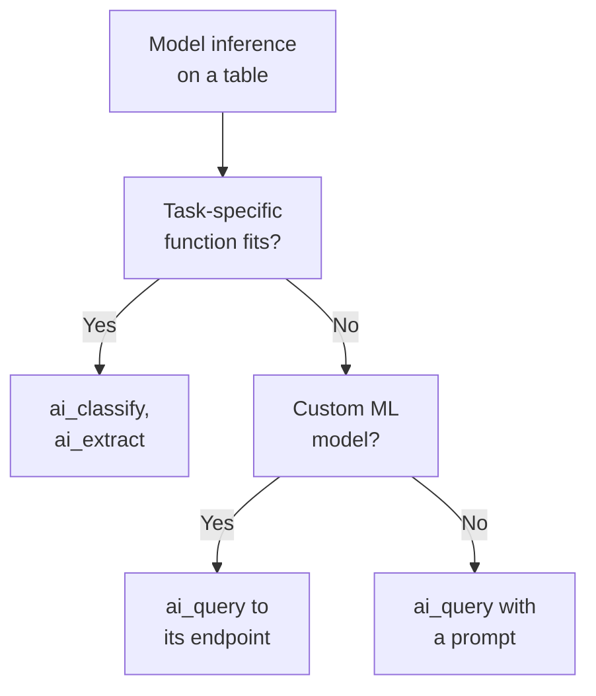
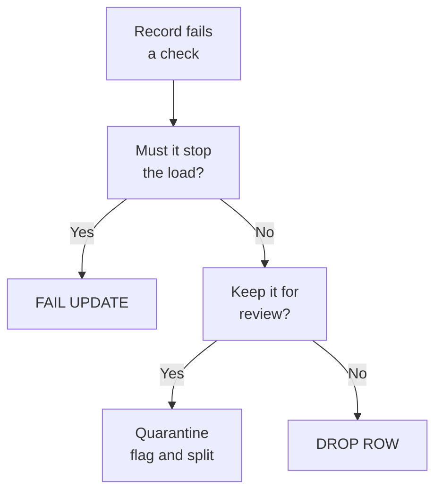

# Domain 3 — Data Manipulation

This section is 12% of the exam. It rewards reading a query the way Databricks will run it: which rows a window really covers, which join keeps which side, what a default does when you set nothing, and which purpose-built function saves you from writing your own.

The sections follow the guide. Its first objective, advanced transformations in Spark SQL and PySpark, covers three separate decisions, windows, joins and aggregations, so each gets its own section. VARIANT, the artificial intelligence (AI) functions and data quality expectations follow in the guide's order.

| Guide objective | Section |
|---|---|
| Window functions, joins and aggregations | Rank, compare and total with window functions · Choose the join · Aggregate at several levels |
| VARIANT and its functions | Model semi-structured data with VARIANT |
| AI functions for inference in pipelines | Run model inference with AI functions |
| Expectations that quarantine, drop or fail | Enforce data quality with expectations |

---

## What this domain actually asks

Three habits carry most of the marks.

**Read the default.** A PySpark window with an ordering and no frame gives a running total, not a partition total. `lag` keeps nulls unless told otherwise. An expectation with no action keeps the bad row. `ai_query` stops on the first failed row unless you set `failOnError` to false. The question usually describes a symptom that the default explains.

**Reach for the purpose-built tool.** `QUALIFY` instead of a subquery, an anti join instead of a left join and a filter, `ROLLUP` instead of three queries and a `UNION`, `ai_classify` instead of a hand-written prompt. Databricks recommends the specific tool when one fits, and the exam rewards knowing it exists.

**Know what is checked per row.** An expectation tests one record at a time and controls which records reach a table. It does not orchestrate anything, and it cannot see other rows or other tables. Cross-row checks and gating need their own dataset or their own pipeline.

---

## Rank, compare and total with window functions

A window function **computes a value for every row from a group of rows around it**, so the row count does not change. That is what makes it the tool for moving averages, running totals, rankings and comparisons with the previous row.

The specification has three parts: `PARTITION BY` splits the rows into groups, `ORDER BY` sorts them inside each group, and a frame picks which of those rows the function sees. Without `PARTITION BY`, the whole result is one partition. Ranking functions need `ORDER BY` and take no frame.

```sql
SELECT customer_id, order_ts, amount,
       row_number() OVER (PARTITION BY customer_id ORDER BY order_ts DESC) AS rn,
       sum(amount) OVER (PARTITION BY customer_id ORDER BY order_ts
                         ROWS BETWEEN 6 PRECEDING AND CURRENT ROW) AS last_7_total
FROM sales.orders;
```

The frame mode matters. A `ROWS` frame counts physical rows before and after the current one. A `RANGE` frame uses an offset from the value of the single `ORDER BY` expression, so rows with the same value fall into the frame together, and a `RANGE` frame without `ORDER BY`, or with several ordering expressions, is an error.

PySpark builds the same thing with `Window`. **The default frame depends on whether you order.** Without ordering, the frame is the whole partition. With ordering, it grows from the first row to the current row, which is why `sum("amount").over(Window.partitionBy("customer_id").orderBy("order_ts"))` returns a running total. `rowsBetween` sets a frame by position, where 0 is the current row and -1 the row before, and `rangeBetween` by value; `Window.unboundedPreceding`, `Window.currentRow` and `Window.unboundedFollowing` name the special boundaries.

```python
from pyspark.sql import Window, functions as F

w = Window.partitionBy("customer_id").orderBy("order_ts")
df = (orders
      .withColumn("running_total", F.sum("amount").over(w))
      .withColumn("prev_amount", F.lag("amount").over(w)))
```

The three ranking functions differ only on ties.

| Function | Tied rows | After a tie | Use it for |
|---|---|---|---|
| `row_number` | Different numbers | Continues 1, 2, 3 | One row per key, such as deduplication |
| `rank` | Same number | Skips: 1, 1, 3 | Competition ranking |
| `dense_rank` | Same number | No gap: 1, 1, 2 | Top-N distinct values |

`lag` reads a value from an earlier row and `lead` from a later one, one row away by default, with an optional default for when no such row exists. **Both respect nulls by default**, so a null in the previous row comes back as null unless you add `IGNORE NULLS`. `first_value` also respects nulls by default, and it is non-deterministic.

To filter on a window result, use `QUALIFY` instead of wrapping the query in a subquery. It needs a window function in the `SELECT` list or in the clause itself, and it cannot hold an aggregate.

```sql
SELECT * FROM sales.orders
QUALIFY row_number() OVER (PARTITION BY customer_id ORDER BY order_ts DESC) = 1;
```

<details>
<summary><b>Self-check — window functions</b></summary>

1. Two orders tie on amount. Which function gives one of them 1 and the other 2?
2. A PySpark `sum` over a window with `orderBy` returns rising values instead of one total per customer. Why?
3. You need the latest order per customer without a subquery. Which clause?

Answers: (1) `row_number`; `rank` and `dense_rank` give ties the same number. (2) With an ordering, the default frame grows from the start of the partition to the current row. (3) `QUALIFY` with `row_number() ... = 1`.
</details>

---

## Choose the join

The join type decides **which side's unmatched rows survive**. `INNER`, the default, keeps only matches. `LEFT OUTER` keeps every left row and fills the right side with nulls, and `FULL OUTER` keeps unmatched rows from both sides.

| Join | Returns | Typical question |
|---|---|---|
| `LEFT SEMI` | Left rows that have a match | Customers who ordered at least once |
| `LEFT ANTI` | Left rows with no match | Customers who never ordered |
| `CROSS` | Every combination | What you get when the join condition is missing |

Semi and anti joins return only left-side columns, so they replace `EXISTS` and `NOT EXISTS` subqueries and the "left join, then filter for nulls" pattern. **If you leave out the join criteria, any join type behaves as a cross join.** With `USING` or `NATURAL`, `SELECT *` shows each join column once. In PySpark, `df.join(other, "customer_id")` is an inner equi-join on a column both sides share.

Streams change the picture. Batch joins are stateless. A join between two streams is stateful, and Databricks recommends a watermark on both sides. A stream-static join is stateless: each micro-batch joins the latest version of the static Delta table, so it needs no watermark. The catch is that the static side should change slowly, because if it changes, reprocessing the same stream can give different results.

**Most join performance is automatic.** Adaptive query execution (AQE) re-plans a query from runtime statistics. It can turn a sort-merge join into a broadcast hash join, merge small shuffle partitions and split skewed tasks, so **skew hints are not needed**. `EXPLAIN` does not run the query, so it shows only the initial plan, not what AQE finally ran.

Hints remain for the cases you know better than the optimizer. A `BROADCAST` hint broadcasts the hinted side whatever `autoBroadcastJoinThreshold` says, and in PySpark `broadcast(df)` marks a DataFrame the same way. When two sides carry different hints, `BROADCAST` wins over `MERGE`, `SHUFFLE_HASH` and `SHUFFLE_REPLICATE_NL`, but no hint is guaranteed to be used.

```sql
SELECT /*+ BROADCAST(c) */ o.*, c.segment
FROM sales.orders o JOIN sales.customers c ON o.customer_id = c.customer_id;
```

Range joins, which match a point to an interval or one interval to another, get their own optimization. Databricks SQL applies it automatically, and hints or session settings tune it elsewhere. It needs numeric, date or timestamp values of the same type, and an inner join, or a left outer join with the point on the left.

<details>
<summary><b>Self-check — joins</b></summary>

1. Which join returns customers who have never placed an order, without a null filter?
2. A stream of clicks joins a slowly changing product table. Does the join need a watermark?
3. A query plan from `EXPLAIN` shows a sort-merge join, but the run used a broadcast join. Why?

Answers: (1) `LEFT ANTI`. (2) No; a stream-static join is stateless. (3) `EXPLAIN` shows only the initial plan, and AQE changed the join at runtime.
</details>

---

## Aggregate at several levels

When a report needs totals at more than one level, **do it in one `GROUP BY`**. `GROUPING SETS` lists the groupings you want, and `ROLLUP` and `CUBE` are shorthand for common lists.

| Clause | Groupings for `(city, car_model)` | Meaning |
|---|---|---|
| `ROLLUP` | `(city, car_model)`, `(city)`, `()` | Hierarchical subtotals and a grand total |
| `CUBE` | Adds `(car_model)` | Every combination |
| `GROUPING SETS` | Exactly the sets you list | A union of separate `GROUP BY`s in one pass |

Subtotal rows show `NULL` in the rolled-up column, so `grouping(col)` tells you which nulls are subtotals: it returns 1 for a subtotal over that column and 0 otherwise.

```sql
SELECT city, car_model, sum(quantity) AS qty, grouping(car_model) AS is_city_total
FROM dealer
GROUP BY ROLLUP (city, car_model);
```

A few smaller tools come up. A `FILTER` clause passes only matching rows to one aggregate, as in `count(*) FILTER (WHERE status = 'late')`. `GROUP BY ALL` groups by every non-aggregate expression in the `SELECT` list. `PIVOT` turns a column's values into columns, and its `IN` values must be literals. `collect_list` gathers values into an array in no guaranteed order. When an exact answer is not required, `approx_count_distinct` and `approx_percentile` are faster and cheaper, and `LIMIT` is not a random sample.

In a stream, an aggregate is stateful and **must have a watermark**, or its state grows until the query slows and runs out of memory. For aggregates over an entire table, Databricks recommends a materialized view, which updates them incrementally. Complete output mode is the exception to state cleanup: it never drops aggregation state and rewrites the target on each trigger.

<details>
<summary><b>Self-check — aggregation</b></summary>

1. A report needs totals by city and model, by city, and overall. Which clause gives all three in one query?
2. In that result, how do you tell a subtotal row's `NULL` from a real `NULL` model?
3. A streaming count by store slows down for days and then fails with an out-of-memory error. What is missing?

Answers: (1) `ROLLUP (city, car_model)`. (2) `grouping(car_model)` returns 1 on subtotal rows. (3) A watermark; without one, aggregation state grows forever.
</details>

---

## Model semi-structured data with VARIANT

For semi-structured data, **Databricks recommends VARIANT over JSON strings**. A JSON string keeps an exact raw copy but is parsed again on every read. VARIANT stores an optimized encoding that is faster to read and write, and it copes with a schema that changes or is unknown.

| Storage | Best for | Watch out for |
|---|---|---|
| VARIANT | Changing or unknown JSON shapes | Cannot be a clustering key or be grouped, ordered or compared |
| JSON string | An exact raw copy with no processing | Worst on read: the whole string is parsed for every query |
| Struct | A well-known schema you want enforced | Schema changes need pre-processing |

**A struct is still the right choice** when the schema is fixed and you want it validated on write and fast on read. VARIANT's limits shape the design too. **A VARIANT column cannot be a clustering, partition or Z-order key, and you cannot group, order or compare by it.** So extract the fields you filter and group on into ordinary typed columns, which Databricks recommends for frequently queried fields anyway.

```sql
CREATE TABLE events AS
SELECT raw:event_id::string AS event_id,
       parse_json(raw) AS payload
FROM landing.events_json;
```

VARIANT and its related functions do the rest. `parse_json` turns a string into VARIANT, and raises an error on malformed JSON; `try_parse_json` returns `NULL` instead. To read a field, use the colon path, `payload:device.os`, or `variant_get` with a path such as `'$.device.os'` and a type. Array elements are indexed from 0, and values are cast with `::` or `cast`.

Four rules catch people moving from JSON strings:

- **Paths are case-sensitive**: `payload:Device` and `payload:device` are different fields.
- A missing path or an index past the end returns `NULL`, not an error.
- `variant_get` raises `INVALID_VARIANT_CAST` when a value exists but cannot be cast, and `try_variant_get` returns `NULL` instead.
- `[*]` is not supported; to turn array elements into rows, use `variant_explode`.

```sql
SELECT e.event_id, item.value:sku::string AS sku
FROM events e, LATERAL variant_explode(e.payload:items) AS item;
```

`variant_explode` produces no rows for a `NULL` or non-array input, and `variant_explode_outer` produces one row of nulls. For an array its `key` column is null and `value` holds each element.

Field names with spaces, periods, colons or brackets need the bracket form, `payload:['zip.code']`, because backticks do not escape periods or brackets. Nulls come in two kinds: a SQL `NULL` means the value is missing, and a variant null is a JSON `null` stored in the data, which `is_variant_null` detects. `schema_of_variant` reports one value's schema, and `schema_of_variant_agg` combines the schemas of a whole group, falling back to VARIANT when types conflict.

For ingestion, Auto Loader's `singleVariantColumn` option stores each whole record in one VARIANT column, so no schema evolution happens and there is no rescued data column. You can also declare a single column as VARIANT in a schema or in `schemaHints`. Iceberg v2 tables cannot hold VARIANT columns; Iceberg v3 tables can.

<details>
<summary><b>Self-check — VARIANT</b></summary>

1. `variant_get(payload, '$.price', 'int')` fails on rows where price is the string "n/a". What should you use?
2. A query on `payload:UserId` returns nulls, though the JSON has `userId`. Why?
3. The team wants to cluster a table by a field inside a VARIANT column. What must they do first?

Answers: (1) `try_variant_get`, which returns `NULL` when the cast fails. (2) Variant paths are case-sensitive. (3) Extract the field into its own typed column; VARIANT columns cannot be clustering keys.
</details>

---

## Run model inference with AI functions

AI functions apply large language models (LLMs), or other research techniques, to data with ordinary SQL or PySpark, from Databricks SQL, notebooks, Lakeflow pipelines and jobs, which makes enrichment and classification a step inside a pipeline rather than a separate system. **Start with a task-specific function when one fits**, and use `ai_query` only when none does. Task-specific functions need no prompt and no model choice, and Databricks maintains the models behind them.

| Task | Function |
|---|---|
| Sort text into labels you supply | `ai_classify` |
| Pull named fields into a structure | `ai_extract` |
| Parse a document's text and layout | `ai_parse_document` |
| Translate, summarise, mask or score sentiment | `ai_translate`, `ai_summarize`, `ai_mask`, `ai_analyze_sentiment` |
| Your own prompt, model, or a custom machine learning (ML) model endpoint | `ai_query` |

The task-specific functions compose. `ai_extract` and `ai_classify` accept the VARIANT that `ai_parse_document` returns, so a document pipeline is parse, then extract or classify.

```sql
SELECT ticket_id,
       ai_classify(body, '["billing", "outage", "account"]') AS category,
       ai_extract(body, '["order_id", "product"]') AS fields
FROM support.tickets;
```



`ai_query` calls a Model Serving endpoint and parses the answer, and the person defining the query needs `CAN QUERY` on that endpoint. Its request is a `STRING` for a foundation model or external model. For a custom model, the request is a column or a `STRUCT` whose field names match the model's input features. `returnType` can be inferred from a custom model's schema, `modelParameters` passes fixed settings, and `responseFormat` makes a chat model return a structure you specify.

```sql
SELECT review_id,
       ai_query(endpoint => 'reviews-sentiment-endpoint',
                request => named_struct('text', review_text),
                failOnError => false) AS result
FROM sales.reviews;
```

**`failOnError` defaults to true**, so one failed row fails the whole query. Set to false, `ai_query` returns a `STRUCT` with the response and an error message for each row, a failed row gets a null response, and the rest of the job completes. Databricks recommends that for large workloads, so you keep the successful results without reprocessing everything.

For batch inference at scale, let the functions do the batching. They manage parallelization, retries and scaling themselves, so **submit the whole dataset in one query** rather than splitting it into small batches. For batch work with `ai_query`, use Databricks-hosted foundation models rather than provisioned throughput endpoints. In a pipeline, an AI function inside a materialized view or streaming table gives incremental batch inference as new rows arrive, and Structured Streaming with `ai_query` handles near-real-time cases. The query profile shows how many inferences completed or failed.

Two cost and governance points close this out. The compute running the query is always billed, and task-specific functions and hosted models add model inference on Databricks-managed infrastructure. Metastore admins can restrict task-specific functions through `EXECUTE` on the `system.ai` schema, which every user holds by default, but that does not govern `ai_query`, which calls an endpoint directly. These permissions are in Public Preview and must be enabled for the account by the Databricks account team.

<details>
<summary><b>Self-check — AI functions</b></summary>

1. Support tickets must be sorted into four fixed categories. Which function, and why not `ai_query`?
2. An `ai_query` job over two million rows fails near the end because of a handful of bad rows. What setting avoids losing the run?
3. An engineer splits a table into thousand-row chunks and loops over them with `ai_query`. What should they do instead?

Answers: (1) `ai_classify`; Databricks recommends a task-specific function when one fits. (2) `failOnError => false`, which returns an error message per row instead of failing the query. (3) Submit the full dataset in one query; AI functions handle parallelization, retries and scaling.
</details>

---

## Enforce data quality with expectations

An expectation is **a named SQL condition checked on every record** of a pipeline streaming table, materialized view or view, and the action decides what happens to a record that fails.

| Action | SQL | Python | Invalid record |
|---|---|---|---|
| Warn, the default | `EXPECT (...)` | `@dp.expect` | Kept in the target; metrics recorded |
| Drop | `... ON VIOLATION DROP ROW` | `@dp.expect_or_drop` | Removed; the count is logged |
| Fail | `... ON VIOLATION FAIL UPDATE` | `@dp.expect_or_fail` | Stops the update, which is rolled back |

```sql
CREATE OR REFRESH STREAMING TABLE customers (
  CONSTRAINT valid_age EXPECT (age BETWEEN 0 AND 120),
  CONSTRAINT has_email EXPECT (email IS NOT NULL) ON VIOLATION DROP ROW,
  CONSTRAINT has_id EXPECT (customer_id IS NOT NULL) ON VIOLATION FAIL UPDATE
) AS SELECT * FROM STREAM(raw.customers);
```

**The default keeps bad records.** An expectation with no action only records how many rows passed and failed. Names must be unique within a dataset, and a constraint is plain SQL: it cannot call a Python function or an external service, or query another table. Expectations work only on streaming tables, materialized views and temporary views, including those created in Databricks SQL.

**Failure has a scope.** A fail expectation rolls back that flow's update, and you fix the pipeline code before rerunning. In a triggered pipeline the other flows carry on. In a continuous pipeline the flow and everything that depends on it stop. Metrics appear for warn and drop, not for fail, and the event log holds them too.

Python adds grouping. `@dp.expect_all`, `@dp.expect_all_or_drop` and `@dp.expect_all_or_fail` take a dictionary of names to conditions and apply one action to the lot, which SQL cannot do. Databricks recommends keeping the rules apart from pipeline code, in a table or module, so several datasets reuse them. SQL cannot load expectations from a file.

To **quarantine** records, keeping them for review instead of dropping them, there is no built-in action. The documented pattern flags each row and splits the data.

```python
from pyspark import pipelines as dp
from pyspark.sql.functions import expr

rules = {"valid_pickup": "pickup_zip IS NOT NULL", "valid_dropoff": "dropoff_zip IS NOT NULL"}
quarantine_rule = "NOT({0})".format(" AND ".join(rules.values()))

@dp.table(temporary=True)
@dp.expect_all(rules)
def trips_flagged():
    return spark.readStream.table("raw.trips").withColumn("is_quarantined", expr(quarantine_rule))

@dp.table
def trips_clean():
    return spark.readStream.table("trips_flagged").filter("is_quarantined = false")

@dp.table
def trips_quarantine():
    return spark.readStream.table("trips_flagged").filter("is_quarantined = true")
```



Expectations check data quality; they do not orchestrate. A check that spans rows, such as primary-key uniqueness or matching row counts, is written as its own validation materialized view with `expect_or_fail`. **A validation table does not hold back other tables**, though, because reading it does not make anything wait. To stop downstream work when validation fails, put the two in separate pipelines and make the downstream task depend on the validation task in a job.

> The guide says Lakeflow Declarative Pipelines; current documentation says Lakeflow pipelines. **This does not change the exam answer.** They are one product; answer on what each option does.

<details>
<summary><b>Self-check — expectations</b></summary>

1. Rows with a null email must not reach the table, but the load must continue. Which clause?
2. A team adds `CONSTRAINT valid_amount EXPECT (amount > 0)` and still finds negative amounts in the table. Why?
3. Bad rows must be kept for a data steward to fix. Which pattern?

Answers: (1) `ON VIOLATION DROP ROW`. (2) With no action the default is warn, which keeps invalid records. (3) The quarantine pattern: flag rows with `is_quarantined` and write valid and invalid rows to separate tables.
</details>

---

## Traps worth carrying into the exam

- A PySpark window with `orderBy` and no frame gives a running total.
- `row_number` breaks ties; `rank` leaves gaps; `dense_rank` does not.
- `lag`, `lead` and `first_value` keep nulls unless you say `IGNORE NULLS`.
- `QUALIFY` filters window results; it cannot hold aggregates.
- A join with no condition is a cross join.
- Anti join for "never matched"; semi join for "matched at least once".
- Stream-static joins need no watermark; stream-stream joins need one on both sides.
- Skew needs no hint; AQE handles it, and `EXPLAIN` shows only the initial plan.
- `ROLLUP` is hierarchical, `CUBE` is every combination, and `grouping()` marks subtotal rows.
- Streaming aggregates need a watermark.
- VARIANT cannot be clustered, grouped, ordered or compared; extract the field first.
- Variant paths are case-sensitive, and `[*]` does not work.
- `variant_get` and `parse_json` raise errors where their `try_` forms return `NULL`.
- Start with a task-specific AI function; use `ai_query` when none fits.
- `failOnError` defaults to true; set it to false for large jobs.
- Submit the whole dataset to an AI function in one query.
- An expectation with no action keeps the bad row.
- Quarantine is a pattern, not an action.
- A validation table does not gate downstream tables; a job dependency does.
