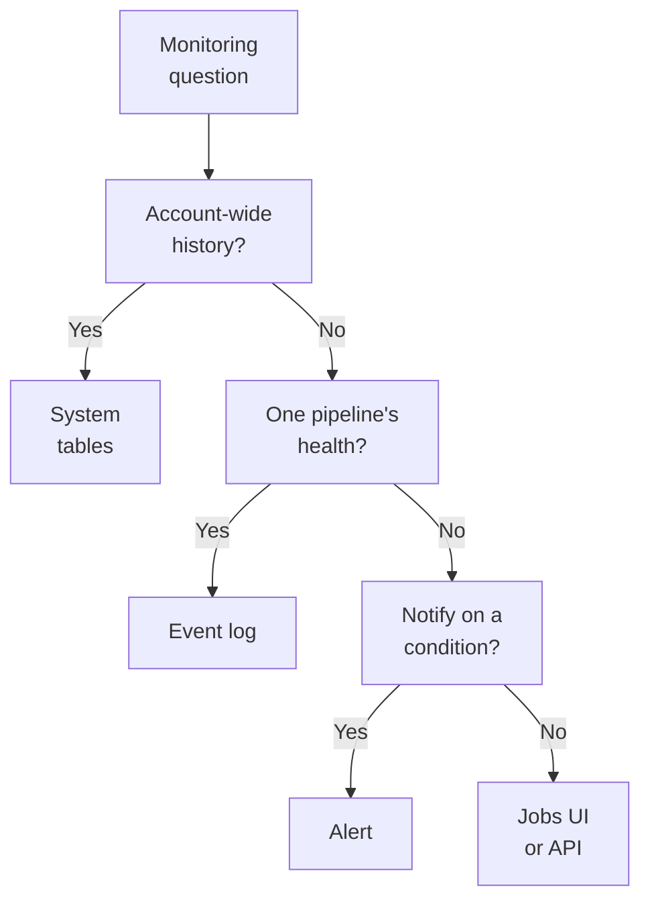
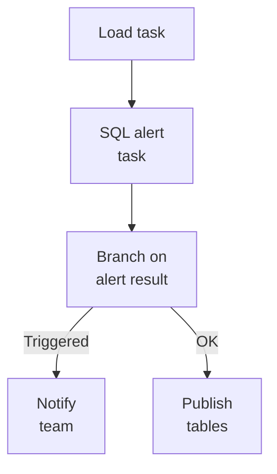

# Domain 4 — Monitoring and Alerting

This section is 10% of the exam. It rewards knowing which surface answers which question. A system table holds history and cost analysis across the account, and an event log holds one pipeline's health. The command-line interface (CLI) or software development kit (SDK) serves automation, an alert watches a condition, and the Lakeflow Jobs user interface (UI) shows the run you are looking at now.

The sections follow the guide. Its first objective covers both cost and operations, which read different tables and hide different traps, so it gets two sections.

| Guide objective | Section |
|---|---|
| System tables for cost, auditing and workload monitoring | Attribute cost with the billing tables · Monitor jobs, compute, queries and audit events |
| REST APIs, CLI and SDK for jobs and pipelines | Monitor from the CLI, REST API and SDK |
| Pipeline event logs for health and data quality | Read the pipeline event log |
| Lakehouse alerts | Alert on a condition |
| Jobs UI and Jobs API for status and performance | Watch job runs in the Jobs UI |

---

## What this domain actually asks

Three habits carry most of the marks.

**Pick the surface that holds the answer.** Cost across the account is in `system.billing`. A pipeline's data quality is in its event log. "Tell me when this happens" is an alert. Many wrong options name a real place to look that cannot answer the question at scale.



**Read what a status really means.** A SQL alert task succeeds even when its alert triggers. A run that ends "Succeeded with failures" counts as success. A job-level failure notification stays quiet while tasks are being retried. The question often describes a missing notification that the definition explains.

**One row is not always one thing.** Billing corrections add rows that cancel earlier ones. Long job runs are sliced into hourly rows. Slowly changing dimension (SCD) tables keep a row for every change. Count and sum with that in mind.

---

## Attribute cost with the billing tables

System tables are a Databricks-hosted store of the account's operational data, in the `system` catalog. **They are free to use**; you pay only for the compute that queries them. They are not a real-time feed: data is updated throughout the day, so a very recent event may not appear yet. Access goes through Unity Catalog. An admin who is both account admin and metastore admin has access by default, and anyone else needs `USE CATALOG` on `system` plus `USE SCHEMA` and `SELECT` on the schemas. You read them from a Unity Catalog workspace, but they include every workspace in the account. Most tables are regional, holding data for the workspaces in one cloud region, while billable usage is global. Databricks deletes old records from system tables, so a stream that reads one should set `skipChangeCommits` to true; otherwise those deletes break it.

`system.billing.usage` records consumption, not money, and its records are typically available within 12 hours. The columns that answer cost questions:

| Column | Holds | Watch out for |
|---|---|---|
| `usage_quantity`, `usage_unit` | How much was consumed | Corrections add negative rows |
| `usage_metadata` | `cluster_id`, `job_id`, `warehouse_id` and more | `job_id` is empty for jobs on all-purpose compute |
| `identity_metadata.run_as` | Who ran the workload | For a job, its run-as identity, by default the owner |
| `billing_origin_product` | Which product the usage came from | Separates products that share one SKU |
| `custom_tags` | Tags on the resource | Drives chargeback by team |

Two cost traps live in this table. **Corrections never edit a row.** Databricks adds a `RETRACTION` with a negative quantity and a `RESTATEMENT` with the right one, so summing `usage_quantity` over all records gives the correct total, and filtering to originals does not. And **a job run on all-purpose compute carries no `job_id`**: job cost queries cover jobs on jobs compute and serverless only. Some products, such as data quality monitoring and predictive optimization, share the serverless jobs stock-keeping unit (SKU), so use `billing_origin_product` to tell them apart.

Money comes from `system.billing.list_prices`, which adds a row only when a price changes. A cost query joins each usage record to the price in effect for its cloud and SKU at that time, then multiplies:

```sql
SELECT u.usage_metadata.job_id,
       SUM(u.usage_quantity * p.pricing.default) AS list_cost
FROM system.billing.usage u
JOIN system.billing.list_prices p
  ON u.cloud = p.cloud AND u.sku_name = p.sku_name
 AND u.usage_start_time >= p.price_start_time
 AND (u.usage_end_time <= p.price_end_time OR p.price_end_time IS NULL)
GROUP BY u.usage_metadata.job_id;
```

Serverless usage adds `job_run_id`, `job_name`, `notebook_id` and `notebook_path`, plus tags from serverless usage policies. One serverless workload can produce several records in the same period, and their sum is its total. Job cost queries return only the workspaces in the current workspace's region. To stream from a system table, set `skipChangeCommits` to true so deletes in it do not stop the stream.

<details>
<summary><b>Self-check — cost</b></summary>

1. A query of a job's monthly Databricks unit (DBU) consumption filters to `record_type = 'ORIGINAL'` and disagrees with the invoice. Why?
2. A team's nightly job runs on an all-purpose cluster and never appears in the job cost query. Why?
3. How does a query turn `usage_quantity` into list cost?

Answers: (1) Corrections add retraction and restatement records; sum over all records instead. (2) `job_id` is not populated for jobs on all-purpose compute, which are not billed as jobs. (3) Join to `system.billing.list_prices` on cloud and SKU within the price's time range and multiply by `pricing.default`.
</details>

---

## Monitor jobs, compute, queries and audit events

Job activity lives in `system.lakeflow`, which was previously named `workflow` and holds the same tables. The tables come in two kinds, and **you query them differently**.

| Kind | Tables | How to read it |
|---|---|---|
| SCD2 history | `jobs`, `job_tasks`, `pipelines` | Take the latest row per entity, then drop rows with `delete_time` |
| Immutable timeline | `job_run_timeline`, `job_task_run_timeline`, `pipeline_update_timeline` | No deduplication, but long runs are sliced into hourly rows |

In an SCD2 table every change adds a row and a deletion adds a row with `delete_time`. **Filter deletions after picking the latest row**: filtering in the same step returns each deleted job's last state instead of leaving it out. In a timeline table, a run longer than an hour spans several rows, and `result_state` is filled only on the row that ends the run, so count `DISTINCT run_id`. `job_id` is unique only within a workspace, so join on `workspace_id` and `job_id` together. Job records typically arrive within an hour.

```sql
SELECT workspace_id, job_id, result_state, COUNT(DISTINCT run_id) AS runs
FROM system.lakeflow.job_run_timeline
WHERE result_state IS NOT NULL
GROUP BY ALL;
```

The other operational tables each cover a defined slice. `system.compute.clusters` keeps the history of classic cluster configurations, and `node_timeline` records utilization minute by minute. **The classic compute tables hold nothing for serverless compute or SQL warehouses.** For those, `system.query.history` records queries from SQL warehouses, serverless notebooks and jobs, and pipelines, though only admins can read it by default. Databricks recommends a dynamic view to share it. `system.compute.warehouse_events` records each time a warehouse starts, stops, runs or scales, which suits an alert on a warehouse running too long.

`system.access.audit` records audit events with `service_name`, `action_name`, `request_params` and the identities involved. Some `request_params` keys that hold SQL definitions are hidden unless you are an account admin or in the `databricks_pii_access` group. Alerts have their own tables too, in Public Preview. `system.alert.alerts` keeps each alert's configuration over time, and `system.alert.alert_evaluation_history` keeps a row per evaluation.

<details>
<summary><b>Self-check — operational tables</b></summary>

1. A query counts rows in `job_run_timeline` to report runs per day, and long-running jobs look inflated. Why?
2. A query takes the latest row per job from `system.lakeflow.jobs` and finds deleted jobs in the result. What did it do wrong?
3. Which table shows the queries a serverless notebook ran?

Answers: (1) Runs over an hour are sliced into hourly rows; count distinct `run_id`. (2) It filtered `delete_time` in the same step instead of after selecting the latest row. (3) `system.query.history`; the classic compute tables hold no serverless records.
</details>

---

## Monitor from the CLI, REST API and SDK

The CLI, the SDKs and the REST API reach the same job and pipeline data, so **the choice is about who is calling**: a script, an application, or a person at a terminal. The jobs and pipelines commands that matter for monitoring:

| Command | Returns |
|---|---|
| `databricks jobs list-runs` | Runs, newest first, filtered by `--job-id`, `--active-only`, `--completed-only` and start time |
| `databricks jobs get-run` | One run's metadata |
| `databricks jobs get-run-output` | One task run's output, including a notebook's `dbutils.notebook.exit()` value |
| `databricks pipelines list-pipeline-events` | A pipeline's events, with a SQL-like `--filter` |
| `databricks pipelines list-updates`, `get-update` | A pipeline's updates |

```bash
databricks jobs list-runs --job-id 845291 --completed-only
databricks jobs get-run-output 7731045
```

**Runs are removed after 60 days**, so results you need later must be saved before then. `get-run-output` returns only the first five megabytes of output.

The SDK for Python, the `databricks-sdk` package, is in Beta and works through `WorkspaceClient`. Inside a notebook it uses default notebook authentication, so no credentials are needed. Databricks also provides SDKs for JavaScript, Go and Java.

```python
from databricks.sdk import WorkspaceClient

w = WorkspaceClient()
for run in w.jobs.list_runs(job_id=845291, completed_only=True):
    print(run.run_id, run.state.result_state)
```

Jobs API 2.2 changed two behaviours that monitoring code meets. **Jobs created with API 2.2 queue overlapping runs by default** instead of skipping them, while jobs created with 2.0 or 2.1 need `queue` set to true. And list fields such as `tasks` stop at 100 elements per response, so a job with more tasks needs `next_page_token` to read the rest.

<details>
<summary><b>Self-check — CLI and SDK</b></summary>

1. A notebook task returns a status with `dbutils.notebook.exit()`. Which command retrieves it?
2. A report needs runs from four months ago through the API, and they are gone. Why?
3. A script reads a job run with 150 tasks and sees only 100. What is missing?

Answers: (1) `databricks jobs get-run-output`. (2) Runs are removed after 60 days; save results earlier, or use the `system.lakeflow` tables. (3) Pagination with `next_page_token`; API 2.2 returns at most 100 list elements per response.
</details>

---

## Read the pipeline event log

The event log is **the ground truth for a pipeline**, what the guide calls the Apache Spark Declarative Pipelines event log: its audit trail, data quality checks, progress and lineage. The pipeline UI and the Pipelines REST API read from it, and you can query it directly. By default it is a hidden Delta table named `event_log_{pipeline_id}` in the pipeline's default catalog and schema. Only the pipeline's run-as user can query it, and you read it with the `event_log()` function. You can instead publish it under a name you choose in the pipeline's advanced settings.

```sql
CREATE VIEW event_log_raw AS SELECT * FROM event_log('a1b2c3d4-5678-90ab-cdef-1234567890ab');
```

Databricks recommends a view like this before you change privileges, rather than sharing the table itself. **Do not delete the event log or its schema**, because the pipeline can then fail to update. For many pipelines at once, Databricks recommends the `pipeline_events` system table, in Beta, which covers every pipeline in a region.

Every row has an `event_type`, and the `details` column is JSON whose shape depends on it, read with the `:` operator.

| Event type | Tells you | Where to look |
|---|---|---|
| `create_update` | The configuration that started an update | Order by timestamp to find the latest update |
| `update_progress` | The whole update starting, running, completing or failing | `details:update_progress.state` |
| `flow_progress` | One flow's progress, data quality and backlog | `details:flow_progress.data_quality.expectations`, `metrics.backlog_bytes` |
| `flow_definition` | Lineage: each flow's inputs and output | `details:flow_definition.input_datasets` |

Expectation pass and fail counts sit in `details:flow_progress.data_quality.expectations`, and the dropped-record count one level up in `data_quality`. A pipeline's cost is not in the event log: query `system.billing.usage` filtered on `usage_metadata.dlt_pipeline_id`. Do not build alerts on fields marked `EVOLVING` or `DEPRECATED`.

**Event hooks**, in Public Preview, are your own Python callbacks, declared with `@on_event_hook`, that run as events reach the event log, for example to post to a chat channel. They fire only for events whose maturity level is `STABLE`, and they run one at a time, so a hook that never finishes blocks the rest. They are not guaranteed to see every event before the compute shuts down. By default a failing hook is never disabled, and failures show up as `hook_progress` events. For ordinary success and failure messages, use notifications instead: on the pipeline when it runs on its own schedule, or on the job when it runs inside one.

<details>
<summary><b>Self-check — event logs</b></summary>

1. An analyst queries the event log table by name and gets "table not found", although the pipeline is healthy. The log was never published. How should they read it?
2. Where are the counts of records that passed and failed each expectation?
3. A team needs health metrics across 200 pipelines. What does Databricks recommend?

Answers: (1) With the `event_log()` function and the pipeline ID; the default log is hidden. (2) In `details:flow_progress.data_quality.expectations` on `flow_progress` events. (3) The `pipeline_events` system table, which covers all pipelines in a region.
</details>

---

## Alert on a condition

An alert **runs a query on a schedule, checks a condition against the result, and notifies someone** when the condition is met. The guide calls them Databricks Lakehouse alerts; the documentation calls them Databricks SQL alerts. Because the input is any SQL query, one mechanism covers every case the guide lists:

- governed business metrics, by querying a Unity Catalog metric view by its full name;
- data quality and anomaly signals, from data quality monitors and anomaly detection;
- usage and cost, from the billing system tables;
- SQL warehouse and query health, from warehouse events and query history;
- audit and security events, from audit log queries;
- AI agent quality metrics;
- and branching inside a Lakeflow job, through a SQL alert task.

> The guide says Databricks Lakehouse alerts; the documentation says Databricks SQL alerts, and the first version is now called legacy alerts. **This does not change the exam answer.** Answer on what an alert does, whichever name the option uses.

The condition tests either the first value of a column or an aggregate, such as `SUM` or `AVERAGE`, across all rows, against a threshold. An aggregate wraps your query in a common table expression (CTE), so a custom notification body shows only the aggregated value. To test several columns at once, put the logic in the query and return one value, such as 1 when both conditions hold. On a parameterised query, the alert uses each parameter's default.

| | Latest alerts | Legacy alerts |
|---|---|---|
| Query | Each alert owns its query; a saved query cannot be reused | Built on a saved query |
| States | `OK`, `TRIGGERED`, `ERROR` | `OK`, `TRIGGERED`, `UNKNOWN` |
| No rows returned | A state you set in the advanced settings | `UNKNOWN` |

`OK` describes only the latest evaluation, not whether the alert ever triggered. In legacy alerts, clicking Refresh updates the state but sends nothing, because **notifications come only from scheduled runs**. Notifications go to users or to notification destinations, and they can repeat until the alert returns to `OK`. Only workspace admins create destinations such as Slack, Teams or webhooks, and webhooks must use encrypted connections, `https`, with trusted certificates.

Compute affects reliability. Databricks recommends a serverless SQL warehouse for most alerts, because a stopped warehouse starts quickly. If the warehouse is stopped, the alert starts it. If it cannot start, or the warehouse is gone, the alert returns `ERROR`. A workspace also caps simultaneous alert runs. When the cap is reached a scheduled run is skipped, so stagger schedules rather than firing every alert at the same minute.

An alert can also be a step in a job. A **SQL alert task** evaluates an existing alert, needs `CAN RUN` on it and a serverless or pro warehouse, and ignores the alert's own schedule. **The task succeeds whenever the alert evaluates, triggered or not**, and fails only on an evaluation error. So a downstream task with the default Run if condition runs either way, and the job branches on the alert's result rather than on the task's status.



Two data quality features feed alerts without per-table code. **Anomaly detection**, in Public Preview, watches every table in a schema for freshness and completeness. Freshness asks whether a commit is unusually late, and completeness whether the last 24 hours wrote fewer rows than history predicts. Enabling it needs `MANAGE` on the schema or catalog, and it neither changes the tables nor slows the jobs that write them. Its results land in `system.data_quality_monitoring.table_results`, and alert rules scoped to a catalog or schema notify when a table turns unhealthy. **Data profiling** captures summary statistics and drift of a table's data over time, and a profile alert is an ordinary SQL alert on a query over the profile's metrics or drift table.

<details>
<summary><b>Self-check — alerts</b></summary>

1. A job's alert task reports Succeeded although the alert condition was met, and the downstream publish task ran. Why?
2. An analyst clicks Refresh on a legacy alert, it turns `TRIGGERED`, and no email arrives. Why?
3. A team wants to know when any table in a schema stops being updated on its usual pattern, without writing a query per table. What should they use?

Answers: (1) A SQL alert task succeeds whenever the alert evaluates; branch on the alert's result, not the task's status. (2) Refreshing a legacy alert never sends notifications; only scheduled runs do. (3) Anomaly detection on the schema, which checks freshness and completeness, with an alert rule.
</details>

---

## Watch job runs in the Jobs UI

The Jobs UI answers questions about runs **you are looking at now**. The Jobs & Pipelines list shows each job's trigger and the result of its last five runs. The Runs tab shows runs from the last 60 days, including those started by tools such as Airflow, with a count of finished runs and the five most frequent error types. Runs submitted through `runs/submit` have no saved job, so **you cannot find them by job name**; filter by run identifier (ID), run-as user or start time.

A job's matrix view shows each run and each task as cells, coloured by status. Green is success, red failure, pink skipped and yellow waiting for retry. A run that exceeds the expected completion time shows a warning. Click a failed task to see its output and error, and repair the run to re-run only the unsuccessful tasks and their dependents. For history beyond 60 days, or across the account, query `system.lakeflow` instead; its jobs tables keep 365 days of history free and hold one region's data.

Notifications are where the traps are.

| Event | Fires when | Trap |
|---|---|---|
| Failure | The run fails | Job-level notifications stay quiet while tasks retry; use task notifications for every failure |
| Success | The run succeeds | "Succeeded with failures" counts as success |
| Duration warning | A run exceeds the duration threshold | Needs a threshold set first |
| Streaming backlog | Average backlog over 10 minutes passes the threshold | Not supported for pipeline tasks |

Notifications go to email or to system destinations such as Slack, Teams, PagerDuty or webhooks, with up to three system destinations per event. Adding them needs `CAN MANAGE` or `IS OWNER` on the job.

<details>
<summary><b>Self-check — Jobs UI</b></summary>

1. A task fails twice and succeeds on its third retry, and the team got no failure email. Why?
2. A run ends "Succeeded with failures" and the on-call engineer hears nothing. Which notification would have caught it?
3. An Airflow workflow submits one-time runs. Why can a filter on the job name not find them?

Answers: (1) Job-level notifications are not sent while failed tasks are retried; add task notifications. (2) Success, because that state counts as successful. (3) Runs from `runs/submit` have no saved job; filter by run ID, run-as user or start time.
</details>

---

## Traps worth carrying into the exam

- System tables are free; you pay for the compute that queries them.
- Most system tables are regional; billable usage is global.
- Sum billing records; corrections add negative rows.
- Jobs on all-purpose compute carry no `job_id` in billing.
- Cost needs a join to `list_prices`.
- SCD2 tables: pick the latest row, then drop deletions.
- Timeline tables slice long runs hourly; count distinct `run_id`.
- The classic compute tables hold nothing for serverless or SQL warehouses.
- Runs disappear after 60 days; `get-run-output` returns a notebook's exit value.
- Jobs API 2.2 queues by default and pages lists at 100 elements.
- The event log is hidden by default; read it with `event_log()`.
- Expectation metrics are in `flow_progress` events.
- Event hooks run one at a time and only on `STABLE` events.
- Alerts own their query, and latest alerts have no `UNKNOWN` state.
- Refreshing a legacy alert never notifies.
- A SQL alert task succeeds even when its alert triggers.
- Job failure notifications are silent during retries; "Succeeded with failures" is a success.
- Streaming backlog notifications do not work on pipeline tasks.
