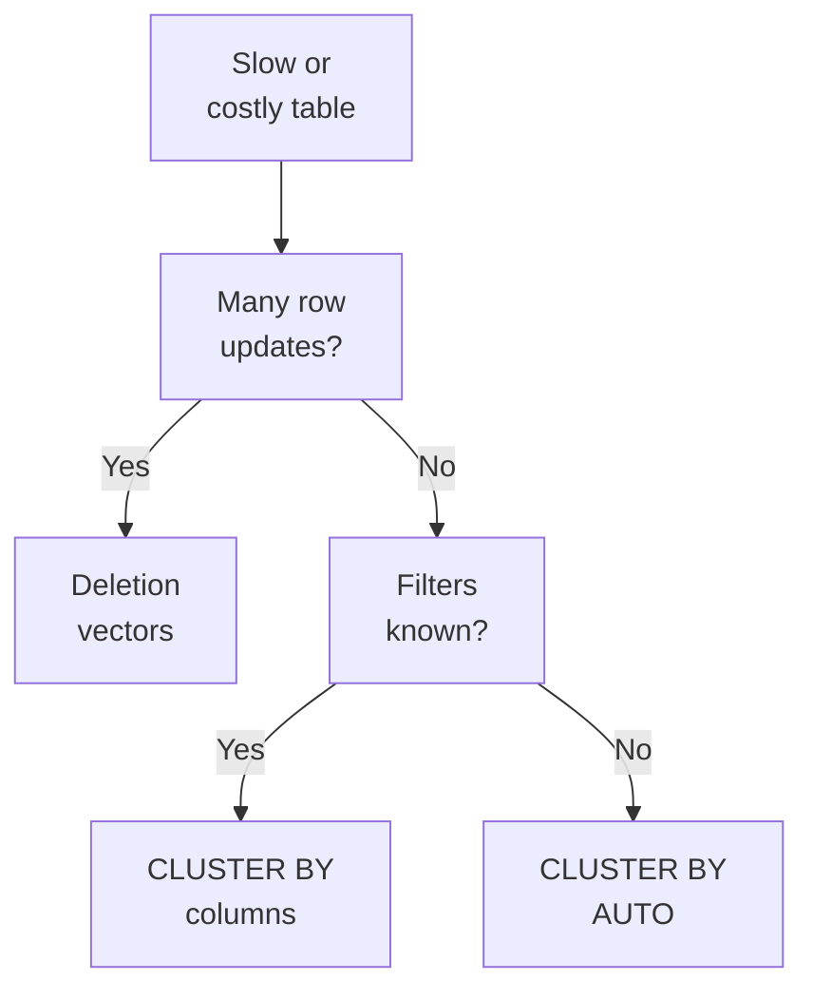
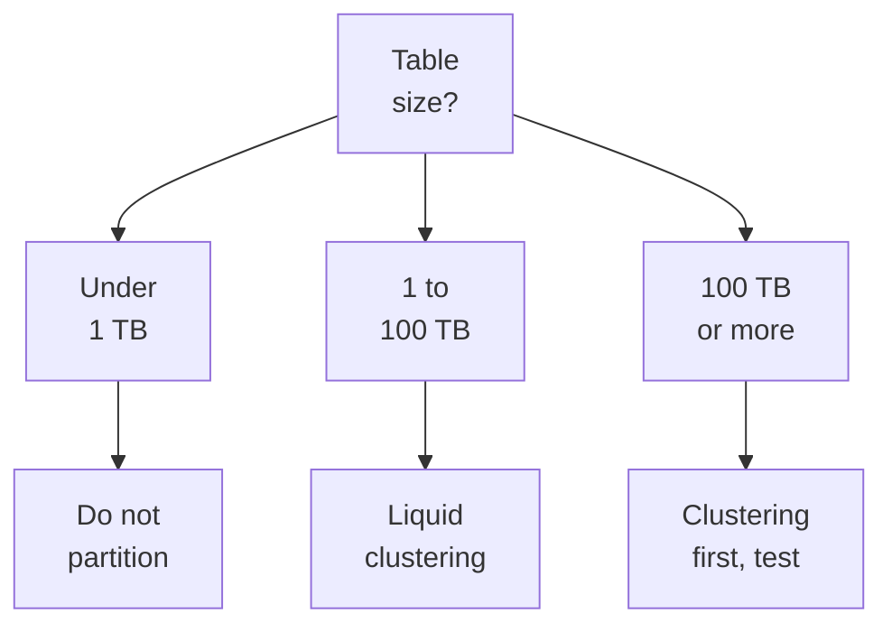

# Domain 5 — Cost & Performance Optimization

This section is 15% of the exam. It rewards matching a technique to a workload: which table type removes maintenance work, which layout suits an access pattern, which cache helps a repeated read, and which signal in a query profile points at the fix. Most wrong options name a real feature that solves a different problem.

The sections follow the guide, one per objective.

| Guide objective | Section |
|---|---|
| Managed tables, Predictive Optimization and Liquid Clustering reduce overhead | Let the platform maintain managed tables |
| Deletion vectors, Liquid Clustering or CLUSTER BY AUTO for an access pattern | Choose deletion vectors, liquid clustering or CLUSTER BY AUTO |
| Caching (Delta cache) for repeated reads | Cache repeated reads |
| Change Data Feed (CDF) for incremental downstream processing | Process only what changed with change data feed |
| The query profile for performance bottlenecks | Find the bottleneck in the query profile |
| Liquid Clustering versus partitioning and ZORDER | Liquid clustering versus partitioning and ZORDER |

---

## What this domain actually asks

Three habits carry most of the marks.

**Start from the default Databricks recommends.** For new tables that is a Unity Catalog managed table with predictive optimization and liquid clustering. An option that adds a hand-scheduled job, a partition scheme or a manual cache to that default usually adds work without adding speed.

**Match the technique to the access pattern.** Frequent row-level changes point to deletion vectors. Filters on a few known columns point to liquid clustering on those columns. Filters that change over time, or that nobody has measured, point to `CLUSTER BY AUTO`. Repeated reads of the same files are already served by the disk cache.



**Read the symptom before choosing the fix.** A query profile that shows many small files wants compaction. One that shows spill wants memory. One that shows a full scan on a clustered table wants a filter on the clustering keys. The exam describes the symptom and offers fixes for neighbouring problems.

---

## Let the platform maintain managed tables

A Unity Catalog managed table is the default and recommended table type for Delta Lake and Apache Iceberg. Unity Catalog governs it and also owns its storage, layout and optimization, which removes most of the operational and maintenance work an external table needs. Compared with external tables, managed tables cost less to store and query and maintain themselves.

| | Managed table | External table |
|---|---|---|
| Governance (access, audit, lineage) | Unity Catalog | Unity Catalog |
| Storage location | Set by Unity Catalog, in your cloud account | Set by you |
| File lifecycle (optimize, organize, delete) | Unity Catalog | You or an external system |
| Drop | Files deleted after the recovery period; `UNDROP TABLE` recovers it before then | Metadata removed, files stay in place |
| Formats | Delta Lake or Iceberg | Delta, CSV, JSON, Avro, Parquet, Optimized Row Columnar (ORC) and more |

Two objections come up and both are wrong. **Managed data never leaves your account**: Unity Catalog chooses where in your cloud account the files live but does not move them to Databricks. **Managed tables do not lock you in**: external engines read and write them through the Unity REST API and the Iceberg REST Catalog. One rule does change. You read and write a managed table by its name, `catalog.schema.table`, because path-based access bypasses Unity Catalog's access controls and is not supported. Creating one needs `USE CATALOG` on the catalog plus `USE SCHEMA` and `CREATE TABLE` on the schema. Without `USING iceberg`, `CREATE TABLE` makes a Delta table.

To move an existing external Delta table across, run `ALTER TABLE ... SET MANAGED`. It keeps the name, settings, permissions, views and history, keeps writers running for most of the copy, can be rolled back, and redirects old path-based code. Databricks recommends it over rebuilding the table with `CREATE TABLE AS SELECT`. The `MOVE` and `COPY` options apply only to foreign tables, and adding them to an external table makes the command fail. Cancel any scheduled `OPTIMIZE` jobs on the table before you convert it.

### What predictive optimization does

Predictive optimization runs maintenance on managed tables so that you do not have to. Databricks finds the tables that would benefit, queues the work, and collects statistics as data is written. Because Unity Catalog sees every read and write to the tables it manages, it optimizes for how each table is actually used.

| Operation | What it does |
|---|---|
| `OPTIMIZE` | Compacts files and runs incremental liquid clustering on clustered tables; never runs `ZORDER`, and ignores Z-ordered files |
| `VACUUM` | Deletes data files no longer referenced by the table, within the retention window |
| `ANALYZE` | Collects statistics that the optimizer and data skipping use |

The operations run on serverless compute for jobs, billed under a serverless jobs stock-keeping unit (SKU), so predictive optimization is not free. The `system.storage.predictive_optimization_operations_history` table records what it ran, on which tables, and the estimated Databricks units (DBUs) it used. When it skips a table, `DESCRIBE TABLE EXTENDED ... AS JSON` and the History tab in Catalog Explorer show why, with skipped runs labelled Not applied.

It needs the Premium plan and works only on Unity Catalog managed tables, never on external tables. New accounts have it on by default. You can enable it for an account, a catalog, a schema or a table, and each level inherits from its parent unless you override it:

```sql
ALTER CATALOG sales ENABLE PREDICTIVE OPTIMIZATION;
ALTER SCHEMA sales.staging DISABLE PREDICTIVE OPTIMIZATION;
ALTER TABLE sales.core.orders INHERIT PREDICTIVE OPTIMIZATION;
DESCRIBE TABLE EXTENDED sales.core.orders;  -- shows the setting and where it came from
```

An object you disable explicitly stays disabled when a parent is enabled later. The reverse also holds: disabling at the account level leaves catalogs or schemas that enabled it explicitly still running. Enabling it on a table takes the owner or `MANAGE` on the table, and at the account level an account admin.

**Retention is yours to set.** Its `VACUUM` keeps unreferenced files only for `delta.deletedFileRetentionDuration`, seven days by default. If you need longer time travel, raise that property before you enable predictive optimization. Once `VACUUM` has run, versions older than the window can no longer be queried. Databricks strongly advises a window of at least seven days, because a shorter one can delete files that a long-running job has not committed yet.

When predictive optimization is on, turn off your scheduled `OPTIMIZE` jobs. Remember too that `OPTIMIZE` never deletes the files it replaces. `VACUUM` does that later.

### Writes that size their own files

Managed tables tune file size automatically, so the manual tuning advice for external tables does not apply to them. Databricks picks smaller target files for small tables and larger ones for large tables, unless you set a fixed target size. Two write-time features reduce small files on any table:

- **Auto compaction** combines small files on the cluster that did the write, straight after the write succeeds. It is independent of predictive optimization, which runs later on serverless compute.
- **Optimized writes** shuffle data before writing so that each partition gets fewer, larger files. They help partitioned tables most and add some write latency.

Both are always on for `MERGE`, `UPDATE` and `DELETE`. When you move a workload to a new runtime, remove legacy Delta settings from the cluster and table properties, because they can block newer defaults from applying.

<details>
<summary><b>Self-check — managed tables and predictive optimization</b></summary>

1. A team drops an external table and its storage bill does not fall. Why?
2. Predictive optimization is enabled, and a reviewer asks for nightly `OPTIMIZE` jobs as a backup. What should you advise?
3. Compliance needs 30 days of time travel on a managed table. What must happen before predictive optimization is enabled?

Answers: (1) Dropping an external table removes only its metadata; the files stay until someone deletes them. (2) Disable the scheduled jobs; predictive optimization runs `OPTIMIZE` itself. (3) Set `delta.deletedFileRetentionDuration` to 30 days, because its `VACUUM` honours that window.
</details>

---

## Choose deletion vectors, liquid clustering or CLUSTER BY AUTO

These three features solve different problems, and the exam pairs each with the access pattern it fits.

| Access pattern | Technique | Why |
|---|---|---|
| Frequent `DELETE`, `UPDATE` or `MERGE` touching a few rows per file | Deletion vectors | Rows are marked as changed instead of rewriting whole files |
| Filters on a few known, stable columns | Liquid clustering with `CLUSTER BY (columns)` | Files are grouped by those keys, so filters skip files |
| Filters that vary or change over time, on a managed table | `CLUSTER BY AUTO` | Keys are chosen from the query workload and changed when it shifts |
| Many concurrent writers on different rows | Liquid clustering with deletion vectors | Row-level concurrency resolves conflicts automatically |

### Deletion vectors

Without deletion vectors, changing one row means rewriting the whole Parquet file that holds it. A deletion vector records the change in metadata instead, and readers apply it at query time. This makes `DELETE`, `UPDATE` and `MERGE` faster. It does nothing for reads of append-only data. On Photon compute, predictive input/output (I/O) builds on deletion vectors to speed updates further.

On Delta tables you turn them on with the `delta.enableDeletionVectors` table property, or a workspace setting turns them on for new tables. Enabling them upgrades the table protocol, so a client that does not support deletion vectors can no longer read the table. A streaming table or materialized view needs a `CREATE` statement, not `ALTER`, to change the setting.

**A soft-delete is not a physical delete.** The old values stay in the data files until something rewrites them. `OPTIMIZE`, `REORG TABLE ... APPLY (PURGE)` or an auto-compacted write does that, though compaction does not guarantee every change is applied. Even after a purge, the old files survive for time travel. To remove deleted data for a privacy request, run the purge and then `VACUUM` once those files have passed the retention window.

```sql
REORG TABLE crm.customers APPLY (PURGE);
-- after the retention window has passed for the purged files
VACUUM crm.customers;
```

Deletion vectors also enable **row-level concurrency**. Two writers that change different rows in the same file no longer conflict. It applies automatically on Databricks Runtime 14.3 long-term support (LTS) and above when the table is unpartitioned and has deletion vectors, so partitioned tables never get it. On such a table, `UPDATE`, `DELETE` or `MERGE` running beside `OPTIMIZE` conflicts only if `OPTIMIZE` uses `ZORDER BY`. Turning deletion vectors or row tracking off on a clustered table turns row-level concurrency off with them.

### Liquid clustering

Liquid clustering replaces partitioning and `ZORDER`. It is generally available for Delta tables and in Public Preview for Apache Iceberg tables. It groups data by clustering keys, so filters on those keys skip files. Unlike partitions, you can change the keys at any time without rewriting existing data. Databricks recommends it for every new table, including streaming tables and materialized views.

```sql
CREATE TABLE sales.core.orders (order_id BIGINT, customer_id BIGINT, order_date DATE)
CLUSTER BY (customer_id, order_date);

CREATE TABLE sales.core.orders_2025 CLUSTER BY (order_date)
AS SELECT * FROM sales.core.orders WHERE year(order_date) = 2025;

ALTER TABLE sales.core.orders CLUSTER BY (order_date);  -- new keys, old files untouched
OPTIMIZE sales.core.orders FULL;                        -- recluster everything on the new keys
ALTER TABLE sales.core.orders CLUSTER BY NONE;          -- stop clustering; nothing rewritten
```

In a `CREATE TABLE ... AS SELECT`, `CLUSTER BY` follows the table name and never sits inside the `SELECT`. DataFrame writes set clustering columns only when they create or overwrite a table, so an append cannot change them. Use `ALTER TABLE` for that. You enable clustering at creation or on an unpartitioned table, never alongside partitions or `ZORDER`. Delta tables with liquid clustering need writer version 7 and reader version 3, so older clients cannot read them.

Choose keys from the columns that queries filter on most. If two columns are highly correlated, one is enough. You can set up to four keys, but on tables under about 10 terabytes (TB) extra keys slow single-column filters. Keys must be columns with statistics, and they cannot be maps, arrays or whole structs, though a struct's field works with dot notation. To make one key take precedence, list it in `delta.liquid.hierarchicalClusteringColumns`. Hierarchical keys should be low-cardinality, ordered from lowest to highest, with high-cardinality columns left as standard keys.

**Clustering is incremental.** Only some writes cluster on the way in, such as `INSERT INTO`, `CREATE TABLE AS SELECT` and appends, and only above a size threshold. So `OPTIMIZE` must keep running, and each run rewrites only the data that still needs clustering. When you set clustering on an existing table or change its keys, old files keep their layout until you run `OPTIMIZE FULL` on the table, which can take hours on a large table. Without predictive optimization, Databricks suggests `OPTIMIZE` every one or two hours on heavily updated tables.

### CLUSTER BY AUTO

`CLUSTER BY AUTO` lets Databricks pick the keys. It reads the table's query history, chooses candidate columns, and changes them when query patterns change, but only when the predicted skipping savings outweigh the cost of reclustering. It needs a Unity Catalog managed table and predictive optimization, and it runs in the background.

```sql
CREATE TABLE sales.core.events (event_ts TIMESTAMP, user_id BIGINT, kind STRING) CLUSTER BY AUTO;
ALTER TABLE sales.core.orders CLUSTER BY AUTO;  -- existing keys become the starting hints
```

You can switch it on for any managed table. On a small or rarely queried table, or one already well clustered, it may choose no keys at all, and that is expected, not a fault. `DESCRIBE TABLE` shows `clusterByAuto` as true and the current keys in `clusteringColumns`. One trap: running `CREATE OR REPLACE` without `CLUSTER BY AUTO` turns automatic clustering off and drops the chosen keys.

<details>
<summary><b>Self-check — layout techniques</b></summary>

1. A `MERGE` that changes a few rows in each of thousands of files rewrites terabytes every night. Which feature addresses this?
2. An engineer runs `ALTER TABLE ... CLUSTER BY (region)` on a large table, and queries filtering on `region` do not speed up. Why?
3. A managed table has `CLUSTER BY AUTO`, and after a week it has no clustering keys. Is it broken?

Answers: (1) Deletion vectors, which mark changed rows instead of rewriting files. (2) Changing keys does not recluster existing data; run `OPTIMIZE FULL`. (3) Not necessarily; keys are chosen only when the predicted savings outweigh the clustering cost, which a small or rarely queried table may never reach.
</details>

---

## Cache repeated reads

The guide calls it the Delta cache. Databricks now calls it the **disk cache**, because it was never part of the Delta Lake protocol. It copies remote Parquet files, including Delta tables, onto the workers' local solid-state drive (SSD) storage in a fast format the first time they are read. Later reads of the same data come from local disk, which improves query performance for repeated reads. To understand when it helps, compare it with the two other caches. You do nothing to fill it: on SQL warehouses and recent runtimes, `CACHE SELECT` is ignored.

| | Disk cache | Spark cache (`.cache()`, `.persist()`) | Query result cache |
|---|---|---|---|
| Holds | Copies of Parquet data files | Any DataFrame or resilient distributed dataset (RDD) | Query results, on SQL warehouses |
| Stored on | Worker SSDs | Memory, by storage level | Memory, plus a remote cache on serverless |
| Filled | Automatically on first read | Only when code asks | Automatically |
| Stale data | Detects changed files and evicts them | Can serve stale data | Invalidated when tables change |
| Lost when | Cluster restarts | `unpersist` or eviction | Local cache on restart; remote cache survives |

**Prefer the disk cache over the Spark cache for Delta tables.** A cached DataFrame loses the data skipping that later filters would get, and if the table is reached by another name it can serve stale rows. The disk cache has neither problem. It notices when files are created, changed or deleted, so you never invalidate it by hand. The Spark cache earns its place only for things the disk cache cannot hold, such as a computed subquery result or CSV or JSON data. Even then Databricks' rule of thumb is to avoid it.

To get the disk cache, choose a worker type with SSD volumes. Those come configured for it and give it at most half their local disk. The flag `spark.databricks.io.cache.enabled` turns it on or off, and turning it off stops reads and writes to the cache without deleting what is already there. The cache lives on the workers, so autoscaling that removes a worker loses that worker's share. Restarting the cluster clears it. That restart also matters after `VACUUM`, because a warm cache can still hold files that `VACUUM` removed from storage.

SQL warehouses add a **result cache** for whole query results. The local cache clears when the warehouse stops. On serverless warehouses a remote result cache persists across restarts and is shared between warehouses. Both are invalidated when an underlying table changes. Only deterministic queries benefit, so a filter like `= NOW()` defeats the cache. `SET use_cached_result = false` turns it off, which is for benchmarking, not production.

<details>
<summary><b>Self-check — caching</b></summary>

1. A notebook calls `.cache()` on a large Delta DataFrame and then applies selective filters. Why is that slower than expected?
2. Nightly loads rewrite a Delta table. Must the dashboards' clusters clear their disk cache afterwards?
3. Which compute choice gives you the disk cache with no configuration?

Answers: (1) Filters on a cached DataFrame lose data skipping; read the table directly and let the disk cache work. (2) No; the disk cache detects changed files and evicts stale entries itself. (3) A worker type with SSD volumes.
</details>

---

## Process only what changed with change data feed

Change data feed (CDF) records row-level changes between versions of a Delta table. It exposes inserts, updates and deletes, so a downstream job can process only the rows that changed instead of re-reading the table, which is far more efficient for incremental processing. Each change record carries the row's data and three metadata columns.

| Column | Holds |
|---|---|
| `_change_type` | `insert`, `update_preimage`, `update_postimage` or `delete` |
| `_commit_version` | The table version that contained the change |
| `_commit_timestamp` | When that commit was created |

An update produces two rows: the preimage holds the values before it and the postimage the values after. A table that already has a column with one of these names cannot use change data feed until you rename it.

Turn it on per table with a table property:

```sql
ALTER TABLE sales.core.orders SET TBLPROPERTIES (delta.enableChangeDataFeed = true);
```

It records only changes made after you enable it. If you switch it off for a while and back on, that gap cannot be queried. Databricks Runtime 19 adds an automatic mode that works out changes from row tracking at read time with no table property. It works on a Unity Catalog managed Delta table with row tracking, a managed Iceberg v3 table, or an external Delta table with row tracking. It reads through the same APIs, it cannot run alongside the per-table setting, and it does not support tables with row filters or column masks.

### Read the changes

A batch read needs a starting version. The bounds are inclusive, and asking for a version from before the feed was enabled raises an error:

```sql
SELECT * FROM table_changes('sales.core.orders', 76, 80);   -- versions 76 to 80 inclusive
```

```python
(spark.readStream
    .option("readChangeFeed", "true")
    .table("sales.core.orders")
    .writeStream
    .option("checkpointLocation", "/Volumes/sales/core/checkpoints/orders_cdf")
    .toTable("sales.core.orders_changes"))
```

**Use Structured Streaming for incremental processing.** It is the only way Databricks tracks which versions you have consumed, through the stream's checkpoint. A new stream starts with the table's current state as `insert` rows and then streams changes. If the target already holds everything up to some version, set `startingVersion` so that state is not loaded again. That is also how you recover from a corrupted checkpoint. Start a new checkpoint location with `startingVersion` one past the last version the target processed. Rate limits such as `maxFilesPerTrigger` apply, though after the first snapshot each commit lands whole in one batch.

### What the feed does not keep

**Change data feed is not a permanent history.** Change records last only as long as the table versions they belong to. When versions are cleaned up from the log, their changes can no longer be read, and `VACUUM` deletes the change data files. Managed tables clean up old versions automatically. A stream whose starting version is gone fails to start. If you need every change forever, stream the feed into a table of its own, for example with an `availableNow` trigger on a schedule.

Schema changes also limit it. A read cannot span a non-additive schema change such as a rename, a drop or a type change, so split the range at that version. To apply the changes as slowly changing dimension (SCD) type 1 or type 2 tables, Databricks points to the `AUTO CDC` APIs in pipelines.

<details>
<summary><b>Self-check — change data feed</b></summary>

1. A new stream with `readChangeFeed` writes every existing row of the source as `insert` into a target that already had them. What should it have set?
2. A batch query asks for changes from version 0, and change data feed was enabled at version 40. What happens?
3. An audit team needs every change to a table for seven years. Is change data feed enough?

Answers: (1) `startingVersion`, one past the last version the target holds. (2) It raises an error, because the feed has no records before it was enabled. (3) No; feed records expire with their table versions, so write them to a separate table.
</details>

---

## Find the bottleneck in the query profile

Query profiles show how a query actually ran: each operator, its time, rows and memory. Open it from Query History by clicking the query and then See query profile. You can also reach it from the SQL editor, a notebook on serverless compute or a SQL warehouse, and the pipeline and jobs user interfaces (UIs). You need to own the query or hold `CAN MONITOR` on the warehouse that ran it. A query answered from the result cache has no profile, so change it trivially, for example its `LIMIT`, to see one. For Databricks SQL queries you can also open the profile in the Spark UI.

Read the summary first.

- **Wall-clock duration** is elapsed time, split into scheduling, optimization with file pruning, and execution.
- **Aggregated task time** adds up work across every core and node. It can be far larger than wall-clock time when tasks run in parallel.
- **Pruning** shows as filter icons beside the scan metrics, with the share of data skipped. Little pruning on a selective query is the first sign of data-skipping inefficiencies.
- **Top operators** lists the most expensive steps, which is usually where the fix is.

In the graph of operators, a **Scan** reads a source and a **Join** combines relations. A **Shuffle** redistributes data between executors, which makes it expensive. Some operators are hidden by default, and verbose mode shows them.

### From insight to fix

Databricks adds performance insights to the profile, ranked by their effect on total task time. Each one is a symptom with a recommended fix:

| Insight | What it means | Fix |
|---|---|---|
| `COVERAGE_FILTER_KEYS_CLUSTERING` | Filters do not use the clustering keys | Filter on the clustering keys |
| `COVERAGE_FILTER_KEYS_PARTITIONING` | Filters do not use the partition columns | Filter on the partition columns |
| `COVERAGE_STATS_DELTA` | Skipping statistics are missing for the filters | Collect Delta statistics |
| `DATA_FILE_SIZE` | The scan reads many small files | Predictive optimization, `OPTIMIZE`, or liquid clustering for a partitioned table |
| `EXPLODING_JOIN` | A join outputs far more rows than it reads | Fix the join condition or cut the inputs |
| `SELECTIVE_JOIN` | A join outputs far fewer rows than it reads | Filter before the join |
| `DATA_SKEW` | Work is spread unevenly | Salt the key or pre-aggregate |
| `DATA_SPILL` | Data did not fit in memory | Larger warehouse, or fewer and narrower rows |
| `EXCESSIVE_QUEUE_TIME` | The query waited for capacity | Raise the warehouse's maximum clusters |

The neighbours differ in one detail. Spill wants a larger warehouse because it lacks memory, while queueing wants more clusters because it lacks concurrency. An exploding join is fixed in its condition, and a selective join by filtering earlier. Predictive optimization cannot compact small files across partitions, which is why a partitioned table with small files is told to move to liquid clustering.

### Statistics and skipping

Data skipping reads per-file minimums, maximums and null counts, gathered as data is written, and skips files that cannot match a filter. External tables collect them on the first 32 columns. On managed tables, predictive optimization collects them on the columns your filters actually use. For an external table, `delta.dataSkippingStatsColumns` names the columns to cover. Changing it affects only new data until you run `ANALYZE TABLE ... COMPUTE DELTA STATISTICS`. A filter that converts a column's type cannot use its statistics, and the profile reports them as Unused.

### Joins and shuffles

Adaptive query execution (AQE) re-plans a query while it runs, using real sizes measured at each shuffle. It is on by default. It turns a sort merge join into a broadcast hash join when one side proves small, merges small shuffle partitions, and splits skewed partitions. It works only on batch queries that contain an exchange, such as a join, aggregation or window, or a subquery. It does not reorder joins, and it never handles skew in a broadcast join. Because `EXPLAIN` does not run the query, it shows the plan before AQE changes it, while the profile shows what ran. A broadcast hint still helps when you know one side is small, because AQE may switch only after shuffling both sides. An applied acceleration named `HISTORY_BASED_JOIN_STRATEGY` means Databricks already chose a broadcast join from earlier runs.

Photon, the native vectorized engine, swaps sort merge joins for hash joins and uses a columnar shuffle. It helps long queries on large data and does little for ones that finish in a couple of seconds. Where it cannot run an operation it falls back to Spark, which the `COVERAGE_PHOTON` insight reports. Dynamic file pruning in `MERGE`, `UPDATE` and `DELETE` needs Photon. For `MERGE` itself, add known constraints such as a date to the match condition to shrink the search. Remember that `spark.sql.shuffle.partitions` sets both parallelism and the number of output files.

<details>
<summary><b>Self-check — query profile</b></summary>

1. A selective query on a clustered table shows almost no pruning, and the profile raises `COVERAGE_FILTER_KEYS_CLUSTERING`. What should change?
2. A dashboard query waits a long time before it starts running, and its execution is quick. Which warehouse setting helps?
3. `EXPLAIN` shows a sort merge join, but the profile shows a broadcast hash join. Which is right?

Answers: (1) The query's filters, so that they use the clustering keys. (2) A higher maximum number of clusters, for `EXCESSIVE_QUEUE_TIME`. (3) The profile; AQE switched the join at run time, and `EXPLAIN` never runs the query.
</details>

---

## Liquid clustering versus partitioning and ZORDER

Partitioning splits a table into directories by column value. `ZORDER` co-locates related values within files during `OPTIMIZE`. Liquid clustering replaces both, and Databricks recommends it for new tables. The exam asks you to compare them for a table size and a query pattern.

| | Partitioning | `ZORDER` | Liquid clustering |
|---|---|---|---|
| Suits | Low or known cardinality, such as a date | Any cardinality, including IDs and timestamps | Any cardinality |
| Changing the columns | Full rewrite | Named in each `OPTIMIZE` run | `ALTER TABLE`, no rewrite |
| Scope | Directories | Within each partition only | Whole table |
| Repeat runs | Not applicable | Not idempotent | Incremental |
| Row-level concurrency | Never | `OPTIMIZE ... ZORDER BY` can still conflict with updates | Yes, with deletion vectors |

**Most tables should not be partitioned.** Unpartitioned Delta tables are clustered by ingestion time automatically, which gives date-like skipping without tuning. Databricks' guidance follows table size:



Where you do partition, each partition should hold at least 1 gigabyte (GB), and fewer, larger partitions beat many small ones. Partitioning on a high-cardinality column such as a timestamp produces too many tiny partitions. A bad choice is costly, because fixing it means rewriting the table. Partitioning is not needed for atomic writes either, since Delta transactions do not follow partition boundaries. Partition columns must be top-level, so liquid clustering is the only way to skip on a struct field.

`ZORDER` has its own rules. It runs inside `OPTIMIZE`, works only within a partition, and cannot use a partition column. Each extra column weakens it, and columns without statistics waste the work. Unlike bin-packing `OPTIMIZE`, which you can repeat safely, Z-ordering is not idempotent. You cannot combine it with liquid clustering. Predictive optimization never runs it either.

### Moving a table to liquid clustering

On recent runtimes, convert a partitioned Delta table in place with minimal downtime:

```sql
ALTER TABLE sales.core.events REPLACE PARTITIONED BY WITH CLUSTER BY (event_date, store_id);
OPTIMIZE sales.core.events;

ALTER TABLE sales.core.clicks REPLACE PARTITIONED BY WITH CLUSTER BY AUTO;  -- managed tables only
```

Keep the new keys close to the old partition columns, because very different keys force a large reclustering on the first `OPTIMIZE`. Leaving out the column list keeps the partition columns as keys, and those columns become hierarchical keys. `AUTO` starts from the partition columns and lets predictive optimization adapt them. When you choose keys by hand, use the partition columns, the old `ZORDER BY` columns, or both. A table partitioned by event date and Z-ordered by customer becomes hierarchical clustering on the date, with the customer as a standard key. If a generated column existed only to lower cardinality, such as a date taken from a timestamp, cluster on the original column instead. Pipeline streaming tables and materialized views cannot be converted this way. Change `PARTITIONED BY` to `CLUSTER BY` in the pipeline definition.

<details>
<summary><b>Self-check — partitioning and clustering</b></summary>

1. A 400 GB table is partitioned by `customer_id`, with millions of tiny partitions. What should replace it?
2. An engineer adds `customer_id` to `ZORDER BY` on a table partitioned by `customer_id`. What happens?
3. A table is partitioned by `event_date` and Z-ordered by `customer_id`. Which clustering keys follow Databricks' migration advice?

Answers: (1) Liquid clustering on `customer_id`; tables under 1 TB should not be partitioned, and high-cardinality partitions make tiny files. (2) It is not allowed, because you cannot Z-order on a partition column. (3) Both columns, with `event_date` as the hierarchical key and `customer_id` as a standard key.
</details>

---

## Traps worth carrying into the exam

- Managed tables stay in your cloud account and remain open to external engines.
- Dropping an external table leaves its files; dropping a managed table deletes them after recovery.
- `SET MANAGED` converts an external table in place; `MOVE` and `COPY` are for foreign tables.
- Predictive optimization runs `OPTIMIZE`, `VACUUM` and `ANALYZE` on managed tables only, on billed serverless compute.
- Raise `delta.deletedFileRetentionDuration` before predictive optimization if you need longer time travel.
- Turn off scheduled `OPTIMIZE` jobs once predictive optimization is on.
- Deletion vectors speed row changes, not reads; purge and then `VACUUM` to remove data physically.
- Partitioned tables never get row-level concurrency.
- Changing clustering keys leaves previously written data as it is until `OPTIMIZE FULL`.
- `CLUSTER BY AUTO` needs a managed table and predictive optimization, and may choose no keys.
- `CREATE OR REPLACE` without `CLUSTER BY AUTO` drops automatic clustering.
- The disk cache fills and invalidates itself; avoid `.cache()` on Delta tables.
- Change data feed records only changes after it is enabled, and only while versions are retained.
- A new change data feed stream starts with the whole table as inserts unless you set `startingVersion`.
- A query served from the result cache has no profile.
- Spill wants memory, queueing wants clusters, small files want compaction.
- `EXPLAIN` shows the plan before AQE; the profile shows what ran.
- Under 1 TB, do not partition; never partition on high cardinality.
- `ZORDER` stays within partitions, is not idempotent, and cannot mix with liquid clustering.
