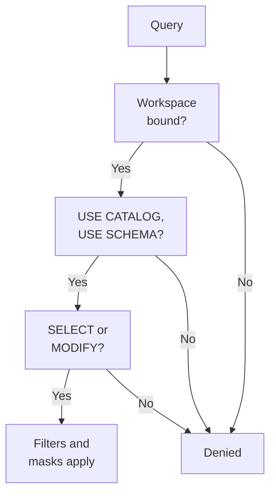
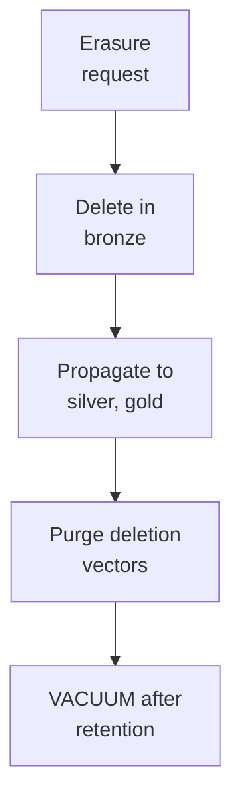

# Domain 6 — Ensuring Data Security and Compliance

This section is 8% of the exam. It rewards knowing which control answers which question. Grants decide who can reach an object. Workspace bindings decide where it can be reached from. Attribute-based access control (ABAC) policies and masks decide what a user sees inside it. Deletion and `VACUUM` decide when data is really gone.

The sections follow the guide, one per objective.

| Guide objective | Section |
|---|---|
| Least-privilege access control lists (ACLs) on Unity Catalog and workspace objects | Grant least privilege on Unity Catalog and workspace objects |
| ABAC policies with governed tags for row filters and column masks at scale | Enforce row filters and column masks at scale with ABAC |
| Anonymization and pseudonymization: hashing, tokenization, suppression, generalization | Anonymize and pseudonymize confidential data |
| A compliant pipeline with personally identifiable information (PII) detection and masking | Detect and mask PII in pipelines |
| A purging strategy for retention and deletion policies | Purge data for retention and erasure |

---

## What this domain actually asks

Three habits carry most of the marks.

**Know which layer a question is about.** A query passes several checks in turn, and each one can stop it:



**A restriction is not access.** Row filters, column masks and ABAC filter or mask data on tables the user can already read. They never grant `SELECT`. An option that "gives analysts access with a policy" has skipped the grant.

**Tags are a security boundary.** ABAC applies only where the right governed tags are in place, so whoever can change tags can change protection. Questions about scale reward the policy at the catalog. Questions about safety reward control over who tags.

---

## Grant least privilege on Unity Catalog and workspace objects

Unity Catalog organizes data as `catalog.schema.table` inside a metastore, and every object in that hierarchy is a securable object. Nothing is allowed by default: a user or group must be granted a privilege explicitly. Three things are needed to work with a table.

| Operation | Privileges needed |
|---|---|
| Read a table or view | `USE CATALOG` on the catalog, `USE SCHEMA` on the schema, `SELECT` on the object |
| Write to a table | `USE CATALOG`, `USE SCHEMA`, `MODIFY` on the table |
| Create a table | `USE CATALOG`, `USE SCHEMA`, `CREATE TABLE` on the schema |
| Assign a filter or mask function | `EXECUTE` on the function, plus `USE CATALOG` and `USE SCHEMA` |

**`SELECT` alone is never enough.** The usage privileges are also the boundary that keeps sharing in check. A table owner cannot open a table to people who lack `USE CATALOG` and `USE SCHEMA`. Only catalog and schema owners, or users with `MANAGE`, can grant those.

Privileges inherit downward. A grant on a catalog or schema covers every current and future child, so this one statement lets a group read all tables in the catalog, including tables created next year:

```sql
GRANT USE CATALOG, USE SCHEMA, SELECT ON CATALOG sales TO finance_team;
SHOW GRANTS ON SCHEMA sales.core;
```

Denials inherit the same way. Two things do not inherit. Grants on the metastore cover only metastore operations such as `CREATE CATALOG`, and ownership never passes down: owning a catalog lets you manage its schemas, not own them.

| | Owner | `MANAGE` privilege |
|---|---|---|
| Grant and revoke, transfer ownership, drop | Yes | Yes |
| Read and write data | Yes, implied | No, though the holder can grant themselves `SELECT` |
| How many principals | One user, service principal or group | Any number |

`ALL PRIVILEGES` on a table implies `SELECT`, `MODIFY` and `APPLY TAG`, but never `MANAGE`, which prevents privilege escalation. `BROWSE` lets people discover objects and their metadata without reading data, and Databricks suggests granting it on catalogs to all account users.

### Least privilege in practice

- **Grant to groups, not users.** Principals must exist at the account level, and workspace-local groups are not synchronized to the account.
- **Give groups the ownership of production catalogs and schemas**, not individuals.
- **Run jobs as service principals**, and keep direct `MODIFY` on production tables for them. A user running production writes can overwrite data by accident.
- **Give each team its own schema**, with `USE SCHEMA` and `CREATE TABLE` granted only to that team.
- Only the owner can edit a view's definition. To let a team co-edit one, give the view to a group that can read the sources.

**Workspace-catalog binding answers "from where".** By default any workspace attached to the metastore can reach any catalog. Binding a catalog to chosen workspaces denies access from every other workspace, even to users holding grants. You can also bind it read-only, which blocks writes from that workspace. External locations, storage credentials and service credentials can be bound the same way. Binding needs metastore admin, ownership of the catalog, or `MANAGE` on it.

Workspace objects use their own ACLs. Workspace admins have `CAN MANAGE` on everything, creators get `CAN MANAGE` on what they create, and objects in a folder inherit the folder's settings. A job has one owner, never a group. **A job started with Run Now runs with the owner's permissions**, not those of the person who clicked. Driver logs on classic compute are not scrubbed of secrets, so only `CAN MANAGE` holders can read them by default.

Store credentials in a secret scope instead of code. Align scopes to applications or roles, not people. Anyone who can read a secret can still see its value, however much the output is redacted.

<details>
<summary><b>Self-check — privileges</b></summary>

1. An analyst has `SELECT` on `sales.core.orders` and still cannot query it. What is missing?
2. A production catalog must be unreachable from the development workspace, even for engineers with grants. Which control does that?
3. A colleague says granting `ALL PRIVILEGES` on a catalog lets the team grant access to others. Is that right?

Answers: (1) `USE CATALOG` on `sales` and `USE SCHEMA` on `sales.core`. (2) Workspace-catalog binding, which denies access from unbound workspaces whatever the grants. (3) No; `ALL PRIVILEGES` excludes `MANAGE`, which granting to others requires.
</details>

---

## Enforce row filters and column masks at scale with ABAC

ABAC decides what a user sees by matching policies to **governed tags** on objects, not by naming each table. It is one of the Unity Catalog features that enforce row filters and column masks at scale. A governed tag is an account-level key with allowed values and controlled assignment. A policy attached to a catalog applies to every table in it that carries the targeted tags, including tables created and tagged later. Policies act like future grants.

| | ABAC policy | Table-level filter or mask | Dynamic view |
|---|---|---|---|
| Defined with | `CREATE POLICY ... ON CATALOG` or `SCHEMA` | `ALTER TABLE ... SET ROW FILTER` or `SET MASK` | A view with `CASE` and group checks |
| Covers | Every matching table in scope, new ones included | One table | The view only |
| Who can change it | Policy owners; table owners cannot remove it | The table owner | The view owner |
| Best for | Consistent rules across many tables | Table-specific logic | Spanning or reshaping several tables |

Databricks recommends ABAC for anything at scale. Table-level controls fit a small, stable set of tables with logic that does not generalize. Dynamic views fully support optimization, but they lack tags and policy metadata for auditing and do not resist probing attacks.

```sql
CREATE FUNCTION hr.governance.mask_ssn(ssn STRING, show_last INT)
RETURNS STRING RETURN CONCAT('***-**-', RIGHT(ssn, show_last));

CREATE POLICY mask_ssn_columns ON CATALOG hr
COLUMN MASK hr.governance.mask_ssn
TO `account users` EXCEPT `compliance team`
FOR TABLES
MATCH COLUMNS has_tag_value('pii', 'ssn') AS ssn_col
ON COLUMN ssn_col USING COLUMNS (4);
```

| Clause | What it sets |
|---|---|
| `ON` | The scope: metastore, catalog, schema or table, and everything below it |
| `TO` / `EXCEPT` | Who is subject to the policy, and who is exempt |
| `ROW FILTER` / `COLUMN MASK` | The user-defined function (UDF) that does the work |
| `WHEN` | Which tables match, by tag; omitted means every table in scope |
| `MATCH COLUMNS` | Which columns match, up to three conditions, all of which must match |

**Column tags do not inherit.** Tables and schemas pick up tags from their parents, but a column tag must be set on the column. In `MATCH COLUMNS`, `has_tag()` checks only the column's own tags. A table without columns matching every condition is not covered, and its data comes back unmasked.

A column mask's UDF receives the column value and must return the same type or one castable to it. A row filter's UDF drops rows where it returns `FALSE`. Prefer SQL UDFs, which the optimizer can inline, and prefer `TO` and `EXCEPT` for targeting people over identity checks inside the function. Only one distinct row filter and one distinct mask per column can resolve for a user. If an ABAC policy and a table-level mask apply different functions, the query fails.

### Permissions and requirements

- **Defining tags.** Creating the tag taxonomy needs account admin or `CREATE` on tags. Applying a governed tag needs both `ASSIGN` on the tag and `APPLY TAG` on the object.
- **Writing policies.** Creating a policy needs `MANAGE` or ownership of the object it attaches to, plus `EXECUTE` on the UDF.
- **Compute.** ABAC needs serverless compute, standard compute on Databricks Runtime 16.4 or above, or dedicated compute on 16.4 or above with fine-grained access control filtering. Compute on older runtimes can't access ABAC-secured tables; to keep such a workload running, scope the policy to a group and exclude its principal with `EXCEPT`.
- **Exemptions.** Cloning and OpenSharing a protected table work only for principals in the policy's `EXCEPT` list. Exempted principals see raw data, so keep that list to trusted service principals.
- **Pipelines.** A pipeline refreshing a materialized view or streaming table reads its sources as the pipeline's owner. If that identity is masked, the stored result is masked permanently. Exempt the pipeline identity with `EXCEPT`, and let `TO` decide who sees masked data downstream.

Good practice keeps ABAC small and safe. Agree one tag taxonomy before writing policies, attach policies at the catalog, and avoid one policy per edge case. Restrict who can tag, and audit tag changes. `SHOW EFFECTIVE POLICIES` tells you what applies to a given table.

<details>
<summary><b>Self-check — ABAC</b></summary>

1. A column mask policy at the catalog matches `has_tag_value('pii', 'ssn')`, but a new table's SSN column is unmasked. The table itself is tagged `pii : ssn`. Why?
2. A table owner wants to remove a catalog-level mask from their table. Can they?
3. Analysts covered by a row filter policy get "permission denied" on the table. What is missing?

Answers: (1) Column tags do not inherit from the table; the column must carry the tag. (2) No; table owners cannot remove, modify or bypass a policy set at a higher level. (3) A `SELECT` grant; policies restrict data, they never grant access.
</details>

---

## Anonymize and pseudonymize confidential data

The guide names four methods. Each maps to something you write inside a column mask, a policy UDF or a view, using Unity Catalog features and related built-in functions.

| Method | What it does | How it looks in Databricks |
|---|---|---|
| Hashing (pseudonymization) | Replaces a value with a consistent stand-in | `sha2(concat(val, version), 256)` in a `DETERMINISTIC` function |
| Tokenization | Replaces a value with a token that authorized users can map back | The reversible built-in is encryption: `aes_encrypt` with a key held in a secret; `aes_decrypt` reverses it |
| Suppression | Hides the value completely | Return `'***'`, `'REDACTED'` or `NULL`, or filter the row out |
| Generalization | Keeps a coarser version | Round a salary to the nearest thousand, or keep only an email domain |

**Consistent hashing keeps data joinable.** Because the same input always gives the same hash, pseudonymized keys still join across tables. Adding a version number to the hashed value supports key rotation: bump the version and new hashes appear without breaking history. `sha2` returns a checksum. When authorized users must recover the original, use `aes_encrypt`, which needs a 16, 24 or 32 byte key and defaults to Galois/Counter Mode (GCM), and keep the key out of code.

```sql
CREATE FUNCTION main.governance.pseudonymize(val STRING, version INT)
RETURNS STRING DETERMINISTIC
RETURN sha2(concat(val, CAST(version AS STRING)), 256);

CREATE FUNCTION main.governance.ssn_mask(ssn STRING)
RETURN CASE WHEN is_account_group_member('HumanResourceDept') THEN ssn ELSE '***-**-****' END;
ALTER TABLE main.hr.users ALTER COLUMN ssn SET MASK main.governance.ssn_mask;
```

The built-in `mask()` function replaces upper case letters with `X`, lower case with `x` and digits with `n`. For a partial reveal such as the last four digits of a Social Security number (SSN), string functions like `RIGHT` beat regular expressions, which scan the whole value on every row.

Some rules catch people out:

- **Every branch must return a castable type.** A mask returning `'CONFIDENTIAL'` for a `DOUBLE` column fails.
- **Check groups with `is_account_group_member()`.** `is_member()` sees only workspace groups.
- **Filters and masks cannot be set on a view.** Wrap the data in a dynamic view instead, and do not grant users the tables behind it.
- **Drop a mask from the table before dropping its function.** Otherwise the table becomes unreadable.
- **Keep masked functions simple and error-free.** Use, for example, `try_divide` instead of division that can fail, and turn American National Standards Institute (ANSI) SQL mode on so type mismatches raise errors rather than silently passing `NULL`.
- **Time travel and sharing are limited.** Time travel does not work on tables with table-level filters or masks, and such tables cannot be shared through OpenSharing. Time travel with ABAC policies is in Beta for qualifying tables and compute.

**Masking is not erasure.** Pseudonymized data can still be reidentified. When a person asks to be forgotten, Databricks calls complete deletion the safest choice.

<details>
<summary><b>Self-check — anonymization</b></summary>

1. Two teams must join on a customer key without seeing it. Which method keeps the join working?
2. Finance must be able to recover original account numbers; everyone else must not. Which method fits?
3. A mask returns `'HIDDEN'` for a numeric balance column. What happens?

Answers: (1) Consistent hashing with a deterministic function such as `sha2`. (2) Encryption with `aes_encrypt`, with the key held only where finance can use it. (3) It fails, because the return value is not castable to the column's type.
</details>

---

## Detect and mask PII in pipelines

You cannot mask what you have not found, so a compliant pipeline relies on Unity Catalog features for detection as well as masking. **Data Classification** scans Unity Catalog tables with an AI agent, detects sensitive columns, and tags them with system tags such as `class.email_address` or `class.us_ssn`. It scans tables, streaming tables and materialized views, so batch and streaming outputs are covered alike. Scanning is incremental, so new tables and columns are picked up without anyone configuring them. It needs serverless compute, and enabling it on a catalog takes ownership or `MANAGE`.

Once the detections look right, turn on automatic tagging for a class. Every existing and future detection is then tagged, though the backlog appears only at the next scan. Turning tagging off stops new tags but leaves existing ones in place. A wrong detection can be excluded, which removes its tag and stops it coming back. System tags such as `class.*` cannot be edited. The results sit in `system.data_classification.results`, which includes sample values, is visible only to account admins by default, and can be read only with serverless compute.

The tags then drive one ABAC policy instead of a mask per table:

```sql
CREATE POLICY mask_contact_pii ON CATALOG prod
COLUMN MASK prod.governance.mask_pii
TO `account users` EXCEPT `privacy_officers`
FOR TABLES
MATCH COLUMNS (has_tag('class.email_address') OR has_tag('class.phone_number')) AS pii
ON COLUMN pii;
```

**Block what is not yet classified.** Tag catalogs or schemas `classification : unverified` so every new table inherits the tag. Add a row filter policy that blocks those tables. When a steward finishes reviewing a table, they change the tag, the block lifts, and the masking policy takes over.

Pipelines need one more step. A materialized view or streaming table is refreshed as its pipeline owner. Exempt that identity from the policies on its sources, or the output stores masked values for good. The masks then apply when people read the output. Expect a few limits on protected tables: a `MERGE` cannot target one whose policy uses aggregations, windows or non-deterministic functions, and the Iceberg REST and Unity REST APIs cannot read them.

<details>
<summary><b>Self-check — PII detection</b></summary>

1. A team turns on automatic tagging for `class.us_ssn` and sees no tags on existing columns an hour later. Is it broken?
2. A pipeline's streaming table stores masked emails for everyone, including the privacy team. Why?
3. How do you keep new tables unreadable until someone has classified them?

Answers: (1) No; the backlog is tagged at the next scan. (2) The pipeline refreshed as an identity subject to the mask; exempt the pipeline owner with `EXCEPT`. (3) Inherit a `classification : unverified` tag from the schema and block tagged tables with a row filter policy.
</details>

---

## Purge data for retention and erasure

The General Data Protection Regulation (GDPR) and the California Consumer Privacy Act (CCPA) give people the right to be forgotten (a right-to-be-forgotten or right-to-erasure request). Their personal data must be deleted completely within a set period, and a purging strategy satisfies that with Delta Lake and Unity Catalog features. In Delta Lake a `DELETE` is only the first step, because old table versions still hold the rows for time travel.



**Start in bronze.** Collect requests in a control table, and let a scheduled job delete the matching rows in bronze, then propagate the deletes to silver and gold. For many users at once, use a `MERGE` against the control table:

```sql
MERGE INTO prod.bronze.users AS t
USING (SELECT user_id FROM prod.privacy.gdpr_requests) AS s
ON t.user_id = s.user_id
WHEN MATCHED THEN DELETE;

REORG TABLE prod.bronze.users APPLY (PURGE);  -- needed when deletion vectors are on
VACUUM prod.bronze.users;                     -- removes old files once past retention
```

**Make the deletion physical.** With deletion vectors, a `DELETE` only marks rows, so run `REORG TABLE ... APPLY (PURGE)` to rewrite the files. The old files still serve time travel until `VACUUM` removes them, and it removes only files older than the retention window, seven days by default. So `VACUUM` must run after the purged files have aged out. Predictive optimization does this maintenance automatically on managed tables. Do not chase speed with a tiny retention: Databricks strongly advises at least seven days, and a safety check blocks shorter windows. `VACUUM` also deletes change data feed files. Transaction log files expire separately, and a cluster's disk cache may hold deleted data until it restarts.

Downstream tables react differently:

| Table type | What to do after source deletes |
|---|---|
| Materialized view | Nothing special; refresh and maintenance remove the rows |
| Streaming table | Delete from it with data manipulation language (DML) too, and read the source with `skipChangeCommits` |
| Streaming table, full refresh | Reprocesses everything, but loses upstream data past its retention |

A delete in a streaming source breaks a streaming table that reads it, because streaming tables expect appends. Set `skipChangeCommits` so the stream ignores the change. It does not carry the delete downstream, which is why you delete from the streaming table yourself. Materialized view definitions need no change.

Two design habits make erasure easier. Key records on a surrogate such as `user_id`, not email, so you can delete the PII and keep the rest. Remember sources outside Delta Lake too, such as message queues and cloud files, which the regulations also cover. Data Classification helps find where a person's data lives before you delete it.

<details>
<summary><b>Self-check — purging</b></summary>

1. After a `DELETE` on a table with deletion vectors and an immediate `VACUUM`, an auditor can still read the rows with time travel. What went wrong?
2. A streaming table fails after GDPR deletes on its source. What fixes it without losing data?
3. Why key users on `user_id` rather than email?

Answers: (1) The data needs `REORG TABLE ... APPLY (PURGE)`, and then `VACUUM` once the old files pass the retention window. (2) Delete the rows from the streaming table too, and read the source with `skipChangeCommits`. (3) So PII can be deleted while non-PII data stays usable.
</details>

---

## Traps worth carrying into the exam

- Reading needs `USE CATALOG`, `USE SCHEMA` and `SELECT`; grants inherit to future objects.
- Ownership does not inherit; `ALL PRIVILEGES` never includes `MANAGE`.
- Grant to account-level groups, and run jobs as service principals.
- Workspace binding overrides grants; a catalog can be bound read-only.
- Run Now runs with the job owner's permissions.
- Filters, masks and ABAC restrict data; they never grant access.
- ABAC needs governed tags; column tags never inherit.
- Table owners cannot override a catalog-level policy.
- Exempt pipeline owners from masks, or the stored output stays masked.
- Consistent hashing keeps joins; encryption is the reversible option.
- Masks must return a castable type, and cannot be set on views.
- Data Classification tags `class.*` columns; auto-tagging backfills at the next scan.
- Erasure is `DELETE`, then `REORG ... APPLY (PURGE)`, then `VACUUM` after retention.
- Streaming tables need `skipChangeCommits` after source deletes; materialized views do not.
