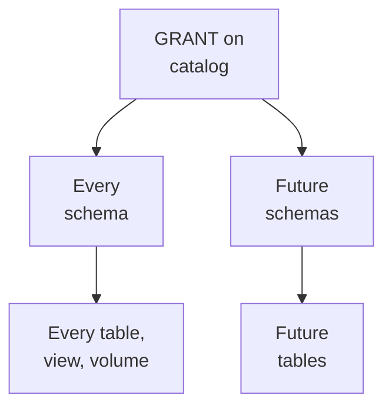

# Domain 7 — Data Governance

This section is 5% of the exam, with two objectives, and each asks you to demonstrate understanding of a mechanism. The first covers the mechanisms for adding metadata that makes data findable: tags and comments on Unity Catalog securable objects. The second is about how access flows through the catalog hierarchy. Both reward precision about who can write the metadata, who can see it, and what reaches child objects.

| Guide objective | Section |
|---|---|
| Tags and comments add metadata that improves data discoverability | Tag securable objects · Document objects with comments and make them findable |
| The permission inheritance model manages access across catalogs, schemas and objects | Manage access through the inheritance model |

---

## What this domain actually asks

Three habits carry most of the marks.

**Know what each kind of metadata is for.** A tag is a key with an optional value, for categorizing, searching and driving policies. A comment is free-text documentation. Certification is a system tag that tells people which assets to trust.

**Check who may write it.** Tagging, commenting and certifying each need specific privileges. The exceptions are favourite exam material: views take comments only from their owner, and governed tags need an extra permission.

**Follow what flows downward and what does not.** Privileges granted, and privileges denied, on a catalog or schema reach every current and future child. Ownership, metastore grants and column tags do not.

---

## Tag securable objects

Tags are keys with optional values that organize and categorize objects, and they make tables and views easier to find in workspace search. You can tag catalogs, schemas, tables, columns, volumes, views, functions and registered models, among others. **Tag data is stored as plain text and may be replicated globally**, so a tag must never hold personal or sensitive information.

| Kind | Who defines it | What is enforced |
|---|---|---|
| Ordinary tag | Anyone who may tag the object | Nothing beyond tagging privileges |
| Governed tag | Account admins or holders of `CREATE` on tags | Allowed values, and who may assign it (`ASSIGN`) |
| System tag | Databricks | Keys and values cannot be edited; only who may assign it is controlled |

Creating a governed tag with the same key as existing tags makes those assignments governed. Deleting a governed tag leaves its tags on objects, but they become ungoverned and anyone can change them.

**To tag an object you need ownership, or `APPLY TAG` on it plus `USE CATALOG` and `USE SCHEMA` on its parents.** `APPLY TAG` on a table or view also covers its columns. A governed tag additionally needs `ASSIGN` on that tag.

```sql
SET TAG ON TABLE main.sales.orders `domain` = `sales`;
ALTER TABLE main.sales.customers ALTER COLUMN email SET TAGS ('pii' = 'email');
UNSET TAG ON TABLE main.sales.orders domain;
```

`SET TAG` and `UNSET TAG` work from Databricks Runtime 16.1, and `ALTER ... SET TAGS` works from Databricks Runtime 13.3. A few rules trip people up:

- **Tag keys are case sensitive.** `Sales` and `sales` are two different tags.
- **Tag search needs the exact term.** A partial word will not match.
- **One column at a time.** A single `ALTER TABLE` cannot tag several columns, though comments can be set for several at once.
- **Untag before dropping.** Dropping a column that carries governed tags fails until you remove them.

**Tag inheritance has limits.** When ABAC policies are evaluated, a tag on a catalog or schema applies to the objects beneath it, but never to columns. Outside policy evaluation, do not count on tags flowing down. To read tags in bulk, query each catalog's information schema: `CATALOG_TAGS`, `SCHEMA_TAGS`, `TABLE_TAGS`, `COLUMN_TAGS` and `VOLUME_TAGS`. `TABLE_TAGS` also covers views and materialized views, and it shows only catalogs you are allowed to see.

### Certified and deprecated

The system tag `system.certification_status` has two values. `certified` marks an asset that meets your standards, and shows a check mark. `deprecated` warns that an asset is outdated, and shows a restricted icon. Applying it needs `ASSIGN` on that tag plus the usual tagging privileges. In search, `certificationStatus:certified` filters to trusted assets.

```sql
SET TAG ON TABLE main.sales.transactions `system.certification_status` = `certified`;
```

<details>
<summary><b>Self-check — tags</b></summary>

1. A steward has `APPLY TAG` on a table but cannot set the governed tag `pii : email` on one of its columns. What is missing?
2. A search for the tag `Sales` misses tables tagged `sales`. Why?
3. Is it safe to put a customer's account number in a tag value to make lookups easier?

Answers: (1) `ASSIGN` on the governed tag. (2) Tag keys are case sensitive, and tag search needs exact terms. (3) No; tag data is plain text and may be replicated globally.
</details>

---

## Document objects with comments and make them findable

A comment is a metadata field for describing any Unity Catalog securable object, and table columns too. Anyone with `BROWSE` on the catalog can read comments, even without `USE CATALOG` or `USE SCHEMA`. That is what makes them useful for discovery. Changing a table's comment records a `SET TBLPROPERTIES` operation in the table history. Catalog Explorer renders basic Markdown in comments, but `DESCRIBE` output shows the raw text.

| Object | Who can add or edit its comment |
|---|---|
| Catalog, schema, volume | The owner, or a user with `MANAGE` |
| Table or column | The owner, or `MODIFY` and `SELECT` on the table plus `USE CATALOG` and `USE SCHEMA` |
| View or materialized view | **The owner only**; `MANAGE` is not enough |

Which command you use depends on the target:

```sql
COMMENT ON TABLE main.sales.orders IS 'One row per order line, loaded nightly';
ALTER TABLE main.sales.orders ALTER COLUMN amount COMMENT 'Gross amount in USD';
COMMENT ON TABLE main.sales.orders IS NULL;   -- removes the comment
```

`COMMENT ON` covers catalogs, schemas, tables, volumes and other objects. Column comments use `ALTER TABLE ... ALTER COLUMN ... COMMENT`, and `CREATE` statements accept a `COMMENT` option. **Saving a comment runs an `ALTER` command**, which can disrupt pipelines and jobs that are using the object.

**AI-generated comments** draft descriptions from an object's metadata, such as its schema and column names. You request them object by object in Catalog Explorer; there is no workspace or catalog switch. You then accept or edit each suggestion before saving. Most objects need ownership or `MODIFY`, and views need their owner. Databricks strongly recommends a human review of every suggestion, and the model is not meant for finding personally identifiable information (PII). Use Data Classification for that.

### How people find data

Workspace search uses this metadata directly. With Unity Catalog, it searches these fields:

| Searched | Not searched |
|---|---|
| Table, view and model names and comments | Tables in the legacy Hive metastore |
| Column names and comments | Objects you lack permission to see |
| Table and view tag keys, with `tag:key` or `tag:key:value` | Catalogs, schemas or columns by tag |

AI-generated comments make search aware of company terms, and popularity signals rank the most used tables higher. You cannot search by tag in Catalog Explorer's filter field; use the workspace search bar.

`BROWSE` lets people discover objects without reading data. They see names, comments and tags in Catalog Explorer, search, the lineage graph and the information schema, and can request access. Catalog Explorer is where you inspect objects directly, including properties, permissions, sample data and lineage, which Unity Catalog captures automatically for queries run on Databricks. Those details go beyond the names, comments and tags that `BROWSE` alone reveals. The Discover page shows a curated, business-aligned subset.

<details>
<summary><b>Self-check — comments and discovery</b></summary>

1. A user with `MANAGE` on a view cannot edit its comment. Why?
2. Analysts without `SELECT` should still be able to find tables and read their descriptions. What should they be granted?
3. Can a governance team switch on AI-generated comments for a whole catalog at once?

Answers: (1) Only the owner of a view or materialized view can edit its comments. (2) `BROWSE` on the catalog. (3) No; suggestions are requested per object in Catalog Explorer and reviewed before saving.
</details>

---

## Manage access through the inheritance model

**A privilege granted on a parent applies to all its current and future children.** A grant on a catalog reaches every schema and every table, view, volume and function in them. A grant on a schema reaches everything in that schema. One statement can therefore cover a whole team's data, including tables created next year:

```sql
GRANT USE CATALOG, USE SCHEMA, SELECT ON CATALOG sales TO finance_team;
GRANT USE CATALOG, USE SCHEMA, CREATE TABLE ON CATALOG analytics TO data_engineers;
```



Inheritance does not remove the need for usage privileges. **Reading a table needs `USE CATALOG`, `USE SCHEMA` and `SELECT`**, even when `SELECT` comes from the catalog. Usage privileges are also a boundary. `USE SCHEMA` grants nothing by itself, and only schema owners or `MANAGE` holders can grant it. Schema owners therefore keep control over access to their schema, whatever a table owner grants.

| Inherits downward | Does not inherit |
|---|---|
| `SELECT`, `MODIFY`, `USE SCHEMA` and other grants on a catalog or schema | Ownership |
| Denials, whether privileges are assigned with `GRANT` or granted or denied by ABAC policies | Grants on the metastore, except `READ METADATA` |
| `MANAGE`, which a container passes to all its children | Column tags, even during ABAC policy evaluation |
| `READ METADATA` on a catalog, schema or the metastore | `BROWSE`, which is granted on the catalog and is not shown on children |

**Ownership stays on one object.** The owner of a catalog has all privileges on that catalog only. It can manage its schemas and tables, but does not own them. Owners of parent catalogs and schemas can still grant on everything inside and transfer its ownership. `SHOW GRANTS` never lists `ALL PRIVILEGES` for an owner, because owners hold their capabilities implicitly.

**`MANAGE` lets a holder administer an object without owning it.** On a catalog it needs no usage privileges and extends to every child. It does not include data access, though: reading still takes `USE CATALOG`, `USE SCHEMA` and `SELECT`, which a `MANAGE` holder can grant to themselves.

Pick the lightest privilege that does the job. `BROWSE` on a catalog lets people discover objects. `READ METADATA` exposes sensitive metadata and suits auditors and governance teams only. A few mechanics finish the picture:

- **Composite privileges are independent.** A composite and its children are granted and revoked separately, so revoking the composite leaves explicitly granted children in place.
- **`REVOKE` always succeeds.** It works even if the privilege was never granted, and simply ensures the privilege is absent.
- **Transfer ownership with `ALTER`.** Use `ALTER TABLE ... OWNER TO`, ideally to a group.
- **Old metastores may lack inheritance.** Metastores created in the public preview might still run an older privilege model without it.

```sql
SHOW GRANTS ON SCHEMA sales.core;
REVOKE CREATE TABLE ON SCHEMA sales.core FROM `contractors`;
ALTER TABLE sales.core.orders OWNER TO `sales_admins`;
```

<details>
<summary><b>Self-check — inheritance</b></summary>

1. A group has `SELECT` on the `sales` catalog but cannot read `sales.core.orders`. What is missing?
2. The owner of the `sales` catalog finds that they do not own a table a colleague created in it. Is something wrong?
3. An engineer revokes `SELECT` on a table from a user who never had it, expecting an error. What happens?

Answers: (1) `USE CATALOG` and `USE SCHEMA`; inherited `SELECT` still needs the usage privileges. (2) No; ownership does not inherit, though the catalog owner can manage the table. (3) The `REVOKE` succeeds and ensures the privilege is absent.
</details>

---

## Traps worth carrying into the exam

- Tags are plain text and may be replicated globally; never put sensitive values in them.
- Tag keys are case sensitive, and tag search needs exact terms.
- Tagging needs `APPLY TAG` plus usage privileges; governed tags also need `ASSIGN`.
- Deleting a governed tag leaves its tags behind, ungoverned.
- Only a view's owner can comment on it; `MANAGE` is not enough.
- Saving a comment runs `ALTER`, which can disrupt pipelines.
- `BROWSE` shows names, comments and tags without data access.
- AI-generated comments are requested per object and must be reviewed.
- Hive metastore tables do not appear in workspace search.
- Grants on a catalog or schema reach current and future children; ownership and metastore grants do not.
- Inherited `SELECT` still needs `USE CATALOG` and `USE SCHEMA`.
- `MANAGE` does not include data access.
- `REVOKE` succeeds even if nothing was granted.
