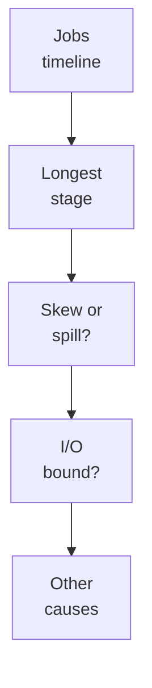
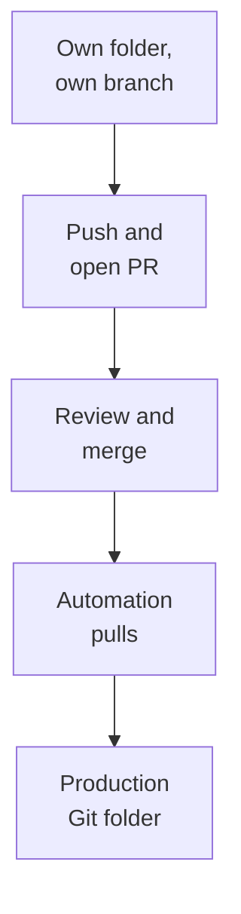

# Domain 8 — Debugging and Deploying

This section is 10% of the exam. One part is diagnosis: knowing which screen or log holds the pertinent evidence for a symptom, how to analyze the error, and how to recover a failed run without redoing work that succeeded. The other part is deployment: moving code and resources between environments with Declarative Automation Bundles (formerly Databricks Asset Bundles) and Databricks Git folders (formerly Repos). How to structure a bundle project is covered in Domain 1; this section is about deploying it.

| Guide objective | Section |
|---|---|
| Spark UI, cluster logs, system tables and query profiles for troubleshooting | Find the diagnostic information |
| Job repairs and parameter overrides for failed runs | Repair failed runs and override parameters |
| Event logs and the Spark UI for pipelines and Spark workloads | Debug pipelines and streams |
| Deploy resources with Declarative Automation Bundles | Deploy with Declarative Automation Bundles |
| Git-based continuous integration (CI) and continuous delivery (CD) workflows with Git folders | Run CI/CD with Git folders |

---

## What this domain actually asks

Three habits carry most of the marks.

**Match the symptom to the source.** Lifecycle events such as resizing or lost spot instances are in the compute event log. An exception's stack trace is in the driver logs. A misbehaving task is in its executor's logs. History across many runs is in the system tables. Wrong options name a real log that does not hold the answer.

**Recover only what failed.** A repair re-runs the unsuccessful tasks and the tasks that depend on them, using the current settings. It does not make a task safe to re-run, so a task that appends can duplicate data.

**Know when a value is fixed.** A bundle variable is resolved when you deploy. A job parameter is set when you run. Passing a new variable to a run of an already deployed job changes nothing.

---

## Find the diagnostic information

Debugging a Spark application starts with three sources: the Spark user interface (UI), the driver logs and the executor logs. Open the Spark UI from the compute's page with the Spark UI tab. Databricks' own diagnosis guide follows a fixed path:



| Symptom | Where to look | What it tells you |
|---|---|---|
| Executors disappeared | Compute event log, then the Executors tab | Autoscaling (expected), lost spot instances, or memory |
| A job failed | The job's page, the failed stage, its tasks | The failure reason for each task |
| A task or the driver hangs | Thread dump from the Executors tab | A snapshot of the Java virtual machine (JVM) thread states |
| A stream never started | Driver logs | The exception's stack trace |
| One task misbehaves | That executor's logs | Its log4j output |
| Gaps in the timeline | Metrics tab, event log, driver logs | Idle time, plan compilation, non-Spark code or an overloaded driver |

In a stage's details, the Input and Output columns show data read from and written to storage. The Shuffle Read and Shuffle Write columns show shuffle volume. Grayed boxes in a job's directed acyclic graph (DAG) are skipped stages, which Spark skips when data is checkpointed or cached. They are not failures. Executor logs are not available on compute in standard access mode.

**A long stage with one task is a red flag.** One processor works while the rest of the cluster idles. Common causes are:

- a window function without `PARTITION BY`
- an unsplittable file such as gzip
- the `multiLine` option on JSON or CSV
- schema inference on a large file
- `repartition(1)` or `coalesce(1)`

**Memory errors are often generic.** A message like `ExecutorLostFailure` does not prove a memory problem. To check, double the memory per core and see whether the failure moves. Likely causes include too few shuffle partitions, a large broadcast, user-defined functions (UDFs), skew and streaming state.

**Gaps in the jobs timeline mean the workers are waiting.** On all-purpose compute the usual reason is simply that nobody is submitting work. Other causes are a complex plan the driver is still compiling, non-Spark code such as a plain Python loop, or an overloaded driver. A plan becomes complex, for example, when `withColumn()` runs in a loop; combine the calls with `selectExpr()` or move the logic to SQL. The Metrics tab's server load view shows an overloaded driver as one red block among blue workers. Once the driver is confirmed overloaded, Databricks suggests first doubling the driver size, before reducing concurrency or splitting the load.

Logs outlive the screens if you deliver them. **Compute log delivery** sends driver, worker and event logs to a destination you choose, such as an S3 bucket that the compute reaches through an instance profile. The compute event log records lifecycle events such as creation, termination and edits, not Spark task errors. For history across many runs, query the `system.lakeflow` tables. For SQL statements, the query profile covered in Domain 5 is the place to look.

<details>
<summary><b>Self-check — diagnostics</b></summary>

1. A streaming notebook shows no Streaming tab in the Spark UI. Where should you look first?
2. A stage reading a single large gzip file takes an hour with one task. What explains it?
3. Executors keep disappearing from a job. What should you check before the executor logs?

Answers: (1) The driver logs, for the exception that stopped the stream starting. (2) Gzip is unsplittable, so the file is read as one task. (3) The compute event log, for autoscaling or lost spot instances.
</details>

---

## Repair failed runs and override parameters

The **matrix view** in a job's Runs tab shows each task's history, so a failed or skipped task stands out, and clicking it shows the output and error. Fix the cause first, then remediate the run. Edit the task's configuration, change the compute, or raise maximum concurrent runs if that limit caused the failure. Then repair the run.

| | Repair run | Run now (with different settings) |
|---|---|---|
| What runs | Unsuccessful tasks and their dependents | All tasks, or the tasks you select |
| Applies to | Jobs with two or more tasks | Any job, including single-task jobs |
| Settings used | The current job and task settings | The current settings, with any overrides for this run |
| Parameters | Values entered in the dialog override existing ones | New or overridden job parameters for this run |

**A repair re-runs each task from the beginning.** Databricks does not make tasks idempotent, so a task that appended part of its output before failing will append it again. Write such tasks with overwrite or `MERGE`. Some repair details matter:

- **Shared job clusters.** If tasks share a job cluster, the repair gets a new one, named for example `my_job_cluster_v1`.
- **Duration.** It spans the first run's start to the last repair's end.
- **Disabled tasks.** These are left out unless listed in `rerun_tasks`.
- **Parameters.** Values entered for one repair can be cleared on the next to restore the originals.

Run now with different settings controls a single run. You can deselect tasks for that run only; to skip a task every time, disable it in the job. When you select tasks by key, `+task` adds its upstream tasks, `task+` its downstream tasks, and `+task+` both:

```bash
databricks bundle run my_job --only +load_orders,publish_report+
```

**Job parameters** are key-value pairs with defaults that a run, or a repair, can override. Tasks that take key-value parameters receive them automatically. When a job parameter and a task parameter share a key, the job parameter wins. Tasks that take JSON-array parameters do not receive them automatically and must reference `{{job.parameters.run_date}}`. A continuous job that keeps failing is retried with exponential backoff, and its Run now button becomes Restart run.

<details>
<summary><b>Self-check — repair</b></summary>

1. In a five-task job, task three fails and tasks four and five are skipped. What does a repair re-run?
2. A single-task job fails. Can it be repaired?
3. A repaired task appended half its rows before failing. What happens on repair?

Answers: (1) Tasks three, four and five, with the current settings. (2) No; repair needs two or more tasks, so trigger it again with Run now. (3) It re-runs from the beginning and appends those rows again, unless it uses overwrite or merge.
</details>

---

## Debug pipelines and streams

A Lakeflow pipeline records its health in its **event log**, a hidden Delta table in the pipeline's default catalog and schema. It does not appear in Catalog Explorer, and by default only the pipeline's run-as user can query it, through `event_log()`. To share it, create a view over it rather than granting the table. To monitor many pipelines at once, Databricks recommends the `pipeline_events` system table, in Beta. The fields you query most often are:

- **Expectation results** are in `details:flow_progress.data_quality.expectations`, and dropped records in `details:flow_progress.data_quality`.
- **Backlog** is in `details:flow_progress.metrics.backlog_bytes`, on `flow_progress` events.

```sql
SELECT timestamp, details:flow_progress.metrics.backlog_bytes AS backlog
FROM event_log('a1b2c3d4-5678-90ab-cdef-1234567890ab')
WHERE event_type = 'flow_progress';
```

For Structured Streaming on classic compute, the Spark UI shows a **Streaming** tab only while a stream is running. Its Processing Time graph is the key one. As a rule of thumb, each batch should finish within 80% of the batch interval. If processing time reaches or passes the interval, batches queue up and a backlog builds, which can eventually bring the stream down. The batch details page shows what each batch read, such as the Kafka topic, partitions and offsets. It also links to the job that processed the batch, and from there to its tasks and executors.

<details>
<summary><b>Self-check — pipelines and streams</b></summary>

1. An analyst cannot find a pipeline's event log in Catalog Explorer. Is it missing?
2. A stream's batches take longer than its trigger interval. What will happen?

Answers: (1) No; it is hidden, readable with `event_log()` by the run-as user unless shared through a view. (2) Batches queue up and the backlog grows, which can eventually bring the stream down.
</details>

---

## Deploy with Declarative Automation Bundles

A bundle describes jobs, pipelines and other resources as YAML source files next to your code, and the Databricks command-line interface (CLI) validates, deploys and runs it. It is the recommended approach to CI/CD on Databricks. A bundle has exactly one `databricks.yml` at its root, which can include other files. That file declares the bundle's name and its **targets**, the environments you deploy to.

```yaml
bundle:
  name: orders_etl
variables:
  catalog:
    default: dev_catalog
targets:
  dev:
    mode: development
    default: true
  prod:
    mode: production
    git:
      branch: main
    variables:
      catalog: prod_catalog
    run_as:
      service_principal_name: "5cf3a04b-a73c-4f46-9f3d-52da7999069e"
```

```bash
databricks bundle validate -t prod
databricks bundle deploy -t prod
databricks bundle run -t prod orders_job --params run_date=2026-10-05
```

`validate` checks the configuration and prints the bundle's identity without changing the workspace, and `summary` lists the deployed resources with links. `deploy` without `-t` uses the default target. `destroy` permanently deletes what the bundle deployed, after asking for confirmation.

**A deployment tracks resources by identifier (ID), not by name.** Resources missing from the workspace are created, existing ones updated, and ones you removed from the configuration are deleted. The bundle's identity comes from its root path, by default `~/.bundle/${bundle.name}/${bundle.target}`, so changing the name, target or workspace makes it forget what it deployed. To bring an existing job or pipeline under a bundle without recreating its data, use `databricks bundle deployment bind`.

### Modes, variables and identities

| | `mode: development` | `mode: production` |
|---|---|---|
| Names | Prefixed with `[dev` and the user's short name, tagged `dev` | Unchanged |
| Schedules and triggers | Paused | As configured |
| Pipelines | Marked `development: true` | Must be `development: false` |
| Compute override with `--cluster-id` | Allowed | Not allowed |
| Git branch | Not checked | Must match the target's branch, unless `--force` |

Modes are optional shortcuts. Presets can change their defaults, and a setting on an individual resource overrides the presets. Wherever a setting appears both at top level and in a target, the target wins and non-conflicting settings are merged.

**Variables are resolved at deploy time.** Reference one as `${var.name}`. The CLI takes the first value it finds, in this order:

| Order | Source |
|---|---|
| 1 | `--var="name=value"` on the command |
| 2 | An environment variable `BUNDLE_VAR_name` |
| 3 | `.databricks/bundle/prod/variable-overrides.json` |
| 4 | The target's `variables` mapping |
| 5 | The variable's `default` |

Because variables are fixed at deploy time, give a run its values through job parameters, and set variables the same way for deploy and run. A `lookup` variable resolves a named cluster, warehouse or similar object to its ID, and fails if the name matches none or several. Substitutions such as `${bundle.target}` and `${workspace.current_user.userName}` fill in values from the deployment context. `validate --output json` shows the resolved values.

**Run production as a service principal.** `run_as` separates the identity that deploys from the identity that runs. Databricks calls a service principal for production targets the most secure choice, and non-admins can set `run_as` only to themselves. Permissions can be declared at top level for every resource, which Databricks recommends, or on individual resources, but never both for the same principal. For production, deploy into a read-only folder so non-admins cannot edit what was deployed.

<details>
<summary><b>Self-check — bundles</b></summary>

1. An engineer passes `--var="catalog=test"` when running an already deployed job, and the job still writes to `prod_catalog`. Why?
2. The same variable is set with `--var` and in the target's `variables` mapping. Which wins?
3. A production deploy fails from a feature branch. What is checking it?

Answers: (1) Variables are resolved at deploy time; pass run-time values as job parameters. (2) `--var`. (3) Production mode validates that the current Git branch matches the target's branch.
</details>

---

## Run CI/CD with Git folders

Git folders are a Git client inside the workspace. You can clone, branch, commit, push and pull, merge and rebase, and compare diffs. An application programming interface (API) lets automation update a folder. Git operations use workspace Git credentials. An on-premises Git server that is not reachable from the internet needs a Git proxy.



**Give each developer their own folder and branch.** Switching the branch of a shared Git folder switches it for everyone using that folder, so only one person should run Git operations on each folder. Developers work in folders under `/Workspace/Users/`, push their branch, and open a pull request (PR).

**A production Git folder is updated only by automation.** An admin creates it outside the user folders, on the deployment branch. It is synced either by external CI/CD such as GitHub Actions when a PR merges, or by a scheduled job that calls the Repos API. Most users get Can Run access, and only admins and service principals can edit it. A service principal doing this needs its own Git credentials. Use a service principal for shared or automated work, and your own credentials when working interactively.

| Approach | What is source controlled | Use when |
|---|---|---|
| Declarative Automation Bundles | Code plus job, pipeline and other resource definitions | Full CI/CD, the recommended approach |
| Production Git folder | Code files only; job and pipeline configuration are not | Deploying only code, or no external CI/CD pipeline |
| Git with jobs | Code files, from a snapshot taken when each run starts | Simple jobs; task order, compute and schedules are not versioned |

Git folders have size limits: a working branch can hold 1 gigabyte (GB), and a single Git operation can use 2 GB of memory and 4 GB of disk writes. Adding a large file to `.gitignore` does not shrink a repository that already committed it. Databricks advises against monorepos for Git folders.

<details>
<summary><b>Self-check — Git folders</b></summary>

1. Two engineers share one Git folder, and one switches branches. What happens to the other?
2. A team keeps job schedules and compute settings in a production Git folder's notebooks. Are the job definitions source controlled?
3. A job pulls a production Git folder as a service principal and fails to authenticate. What is missing?

Answers: (1) Their branch switches too; each developer should have their own folder. (2) No; only code files are, so use bundles to version job definitions. (3) Git credentials linked to the service principal itself.
</details>

---

## Traps worth carrying into the exam

- Lifecycle events are in the compute event log; stack traces are in driver logs.
- Grayed stages are skipped, not failed.
- One task on a long stage points to gzip, `coalesce(1)`, or a window without `PARTITION BY`.
- Check memory by doubling memory per core; double the driver for an overloaded driver.
- Repair re-runs only failed tasks and dependents, with current settings, from the start.
- Single-task jobs cannot be repaired; use Run now.
- Job parameters beat task parameters with the same key.
- The pipeline event log is hidden; only the run-as user reads it by default.
- Batches slower than the interval build a backlog.
- Deployments track resources by ID; removing one from the bundle deletes it.
- Development mode pauses schedules and allows cluster overrides; production checks the branch.
- Bundle variables are fixed at deploy time; `--var` beats every other source.
- Run production as a service principal with `run_as`.
- One developer per Git folder; production folders change only through automation.
- Git folders version code only; bundles version job definitions too.
