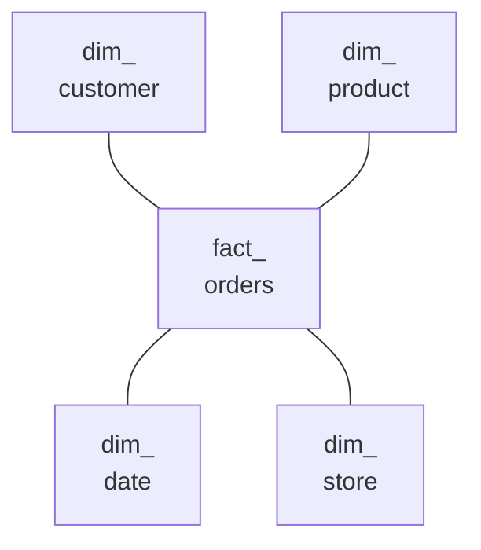

# Domain 9 — Data Modeling

This section is 5% of the exam, with two objectives. The first is physical: design scalable Delta and Iceberg table layouts for large data assets by mapping partitioning to data grain, aligning clustering to relationship access patterns, and keeping file sizes balanced through compaction. The second is logical: design dimensional models for analytical workloads, leveraging the objects that serve them. Materialized views pre-compute aggregation, and Unity Catalog metric views give governed, reusable metric definitions that support efficient querying and aggregation. Domain 5 covers the layout features in depth. Here they are applied to modeling.

| Guide objective | Section |
|---|---|
| Scalable table layouts: partitioning, clustering and compaction | Lay out large tables for scale |
| Dimensional models with materialized views and metric views | Design the dimensional model · Serve it with materialized views and metric views |

---

## What this domain actually asks

Three habits carry most of the marks.

**Let size and access decide the layout.** Small and medium tables are not partitioned at all. Clustering follows the columns that queries filter and join on, and compaction keeps files a healthy size.

**Keep facts and dimensions apart.** Facts are narrow event rows of keys and measures. Dimensions are one row per business entity. Wrong options copy attributes into facts, or enforce keys that Databricks never enforces.

**Pick the object by its job.** A materialized view stores the result of one query. A metric view stores a governed definition that can be sliced by any field at query time.

---

## Lay out large tables for scale

**Partition only at scale, and only on low-cardinality columns.** Most tables under 100 terabytes (TB) need no partitioning, because unpartitioned Delta tables are already clustered by ingestion time.

| Table size | Layout Databricks advises |
|---|---|
| Under 1 TB | Do not partition |
| 1 TB to 100 TB | Liquid clustering instead of partitioning |
| 100 TB or more | Partitioning might help; try liquid clustering first and measure |

Map any partition column to the table's coarse grain, such as a date. Partitioning suits only low or known cardinality columns, so a high-cardinality one such as a customer identifier (ID) or a timestamp splits the table into tiny partitions. Each partition should hold at least 1 gigabyte (GB), and fewer, larger partitions beat many small ones. A bad choice is expensive, because fixing it can mean rewriting the table. Partitioning also buys no atomicity, since Delta transactions do not follow partition boundaries.

**Cluster on the columns your queries filter and join on.** Liquid clustering replaces partitioning and `ZORDER`, and you can change its keys without rewriting data. Choose keys from the filter and join columns of the table's main access patterns. If two columns are highly correlated, one is enough. A table once partitioned by date and Z-ordered by customer becomes hierarchical clustering on the date with the customer as a standard key. Keys matter here too: a surrogate built with `sha2()` is random, so rows that belong together scatter across files and clustering stops helping. If a table sees many `UPDATE` or `MERGE` operations, cluster on a column that follows ingestion order, such as an event timestamp, to keep its natural layout.

```sql
CREATE TABLE gold.fact_orders (
  order_id BIGINT, customer_id BIGINT, order_date DATE, amount DECIMAL(18,2)
) CLUSTER BY (order_date, customer_id);
```

**Keep files balanced with compaction.** Writes leave small files, and not every write clusters data, so run `OPTIMIZE` regularly unless predictive optimization runs it for you. It groups data by clustering keys on clustered tables and works within partitions on partitioned ones. Each run rewrites only what still needs clustering, and it never changes the data readers see. Predictive optimization runs it automatically on managed tables; with it on, turn off scheduled `OPTIMIZE` jobs. Without it, a heavily updated table needs `OPTIMIZE` every hour or two. Running it more often costs more, so a daily run is a sensible starting point.

Two write-time features help between runs. **Auto compaction** combines small files on the writing cluster after each write. **Optimized writes** cut the number of small files per partition, and you should not call `coalesce(n)` or `repartition(n)` before a write that uses them. Neither replaces `OPTIMIZE`, and tables over 1 TB should run it on a schedule.

Databricks sizes target files by table size, smaller for small tables and larger for large ones. When the target grows, existing files are not rewritten larger. Set a fixed `targetFileSize` if every file must reach the new size.

<details>
<summary><b>Self-check — layout</b></summary>

1. A 600 GB orders table is filtered by date and customer. Should it be partitioned by customer?
2. A dimension's surrogate key is `sha2(customer_id)`, and clustering on it skips almost nothing. Why?
3. A table uses auto compaction. Does it still need `OPTIMIZE`?

Answers: (1) No; under 1 TB do not partition, and customer is high cardinality; cluster on date and customer instead. (2) Hash keys are random, so related rows scatter across files. (3) Yes; auto compaction and optimized writes do not replace `OPTIMIZE`, especially above 1 TB.
</details>

---

## Design the dimensional model

A dimensional model organizes gold-layer data into two kinds of tables:

| | Fact table | Dimension table |
|---|---|---|
| Holds | Events or measurements, such as orders or clicks | Descriptive context, such as customers, products or dates |
| One row per | Occurrence of the event | Business entity |
| Columns | Mostly keys and numeric measures | Descriptive attributes |
| Built in a pipeline as | A streaming table fed incrementally from silver | A materialized view, or a streaming table with SCD Type 2 for history |

A **star schema** puts one fact table in the middle, joined to its dimensions through their keys:



In the medallion design the warehouse is modeled in silver, often in third normal form (3NF) or Data Vault, and feeds dimensional data marts in gold. For new work, Databricks recommends against heavily normalized models. Star and snowflake schemas perform well because queries need fewer joins and fewer keys stay in sync. **Keep facts narrow** and join for descriptive detail at query time rather than copying dimension attributes into every fact row.

**Choose keys that survive rebuilds.**

- **Natural keys first.** A stable natural key clusters and joins well.
- **Surrogates only when needed.** Use a surrogate only when a source reuses or changes its IDs, and derive it deterministically from the natural key so a full refresh maps each entity to the same value.
- **`IDENTITY` with care.** It is safe only for append-only sources that are never fully refreshed, because a rebuild can renumber entities and silently break fact joins.
- **Generated dates.** Build `dim_date` as a materialized view with `sequence()` and `explode()` rather than ingesting it.
- **History.** Keep dimension history with `AUTO CDC ... STORED AS SCD TYPE 2`.

Declare relationships with constraints, knowing which ones Databricks enforces:

| | Enforced | Informational |
|---|---|---|
| Kinds | `NOT NULL`, `CHECK` | `PRIMARY KEY`, `FOREIGN KEY`, `UNIQUE` (in Public Preview) |
| On violation | The transaction fails | Nothing; duplicates and orphans are accepted |

```sql
ALTER TABLE gold.dim_customer ADD CONSTRAINT dim_customer_pk PRIMARY KEY (customer_id) RELY;
ALTER TABLE gold.fact_orders ADD CONSTRAINT fact_orders_customer_fk
  FOREIGN KEY (customer_id) REFERENCES gold.dim_customer;
```

A foreign key must reference a primary key or unique constraint, and the primary key must exist first. `CREATE TABLE ... AS SELECT` cannot declare constraints. Adding **`RELY`** to a key you have verified lets Photon rewrite queries. It can drop a `DISTINCT` on the key, or remove a left join to a dimension whose columns the query never uses. Databricks does not check the constraint, though, so relying on a false one returns wrong results. Transactions are scoped to one table by default, so loading a fact and its dimensions is several independent commits.

<details>
<summary><b>Self-check — dimensional model</b></summary>

1. A fact table carries customer name, region and segment on every row. What does Databricks recommend?
2. A dimension keyed by `IDENTITY` is fully refreshed, and fact joins start returning wrong customers. Why?
3. A team declares a primary key and is surprised that duplicates still load. Is something broken?

Answers: (1) Keep facts narrow with the customer key, and join to the dimension at query time. (2) A rebuild reassigns `IDENTITY` values; derive surrogates deterministically from the natural key. (3) No; primary and foreign keys are informational and not enforced.
</details>

---

## Serve it with materialized views and metric views

Gold-layer consumers need fast aggregates and consistent definitions, and two objects provide them.

| | Standard view | Materialized view | Metric view |
|---|---|---|---|
| Stores | Only the query | The query's results | Governed measure and field definitions |
| Computed | On every query | On refresh, often incrementally | At query time, optionally from materializations |
| Grouping | Fixed in the definition | Fixed in the definition | Any field, chosen by the query |
| Best for | Simple reuse | Pre-computed aggregation and joins | One definition of each KPI, sliced many ways |

**Materialized views pre-compute.** They cache query results and refresh them, so reads are fast. A refresh always shows the correct result at the time of its update, processing late or out-of-order data. It is often incremental, but some changes force a full recompute. They are not built for millisecond latency, since updates take seconds or minutes, and not every join can be maintained incrementally. Each is backed by a pipeline. You create one on a Pro or Serverless SQL warehouse or in a pipeline, and refresh it on a schedule or when its sources change:

```sql
CREATE MATERIALIZED VIEW gold.daily_revenue
SCHEDULE EVERY 1 HOUR
AS SELECT order_date, region, SUM(amount) AS revenue
FROM gold.fact_orders JOIN gold.dim_customer USING (customer_id)
GROUP BY order_date, region;
```

Business intelligence (BI) tools can query gold materialized views directly, with no separate reporting extract, transform, load (ETL) step. If a user-defined function (UDF) used by a materialized view changes behaviour in a way Databricks cannot detect, run a full refresh yourself.

**Metric views govern definitions.** A standard view locks in its grouping. A metric view defines a measure once, such as revenue per customer, and lets each query group by any field, so every team reports the same number for the same key performance indicator (KPI). It is built from a source, joins, filters, fields (dimensions) and measures. The source can be a table, a view, a materialized view or another metric view. Joins follow the star schema: the fact table is the source, joined many-to-one, by default, to its dimensions. Nested joins express a snowflake schema, and a `one_to_many` join measures facts at a different grain. Setting `at_most_one_match: true` lets the engine skip joins, but it is not validated, so set it only when it is true.

```sql
SELECT region, MEASURE(`Total Revenue`), MEASURE(`Revenue per Customer`)
FROM gold.sales_metrics
GROUP BY region;
```

Every measure must be wrapped in `MEASURE()`, so `SELECT *` does not work. A metric view cannot be joined directly at query time; put its query in a common table expression (CTE) and join the result. Creating one needs `SELECT` on the source plus `CREATE TABLE` and `USE SCHEMA` in the target schema, and `CREATE VIEW ... WITH METRICS LANGUAGE YAML` defines it in SQL.

**Materialization makes metric views fast.** A metric view can declare materializations, which are materialized views at chosen granularities. The optimizer rewrites matching queries to read them and falls back to the source otherwise. Materialization needs serverless compute for its pipelines and Databricks Runtime 17.3 or above. In relaxed mode the rewrite does not check freshness, so align the refresh schedule with the source pipeline. A metric view cannot be materialized if it or its sources use row filters, column masks or ABAC policies. A result computed once as the owner would bypass each user's restrictions.

<details>
<summary><b>Self-check — serving</b></summary>

1. Finance wants one definition of net revenue that analysts can group by region, product or month. Which object fits?
2. A query against a metric view uses `SELECT *` and fails. Why?
3. A metric view over a table with a column mask cannot be materialized. Why?

Answers: (1) A metric view, which defines the measure once and allows any grouping. (2) Measures must be evaluated with `MEASURE()`, so columns are listed explicitly. (3) A materialization is computed once as the owner and would bypass per-user masks.
</details>

---

## Traps worth carrying into the exam

- Under 1 TB do not partition; from 1 to 100 TB cluster instead.
- Partition only on low-cardinality grain columns, with at least 1 GB per partition.
- Cluster on filter and join columns; hashed surrogate keys defeat clustering.
- Compaction features do not replace `OPTIMIZE`.
- Facts are narrow streaming tables; dimensions are materialized views or SCD Type 2 streaming tables.
- Prefer natural keys; derive surrogates deterministically; avoid `IDENTITY` on rebuilt dimensions.
- Primary and foreign keys are not enforced; `RELY` is trusted, not checked.
- Databricks recommends star or snowflake schemas over 3NF for new models.
- Materialized views pre-compute one query; metric views define measures for any grouping.
- Wrap measures in `MEASURE()`, and join metric views through a CTE.
- No materialization over row filters, masks or ABAC policies.
