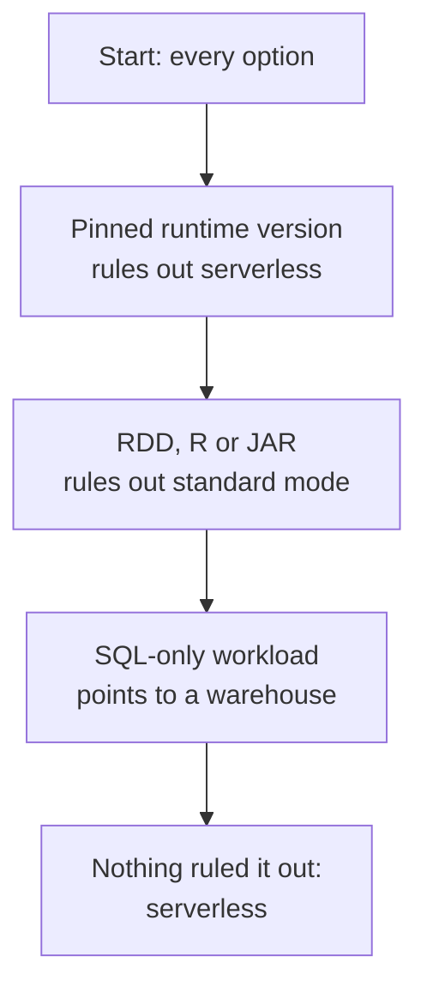

# Domain 1 — Set up and configure an Azure Databricks environment

Microsoft publishes this skill area at 15–20% of the exam, which makes it the joint-lightest of the
four. Do not read that as permission to skim it. Almost every sentence in the other three areas
assumes the vocabulary established here. This area is also configuration- and product-behaviour-
oriented, so most of its questions can be settled by matching the stated requirement to documented
behaviour rather than by weighing two defensible designs against each other.

## What this domain actually asks

Two questions, and the exam asks both as configuration decisions.

The first is which compute to run work on. You are given a requirement — a startup latency, a
library, a cost ceiling, an access mode — and asked which compute type meets it. Serverless compute
is a managed service you connect to on demand, with no cluster to size or start, and much of this
half turns on what that convenience costs you.

The second is how data is organised so it can be governed. A catalog contains schemas, and a schema
contains tables, views, volumes, models and functions. That sentence is the spine of the whole
certification. Objective 1.2 asks you to create those objects for a stated requirement, and the
requirement usually names isolation, an environment, or sharing with someone outside your
organisation.

Both halves happen inside an Azure Databricks workspace, which is the boundary you log into and
the scope most permissions are granted within. Compute lives in a workspace. Unity Catalog does
not — it sits above the workspace at the account level, which is precisely why it can govern data
across several of them. Holding that asymmetry in mind early saves a lot of confusion later.

Neither half rewards recall of feature lists. Both reward knowing which single condition in a
scenario removes an option from consideration.

## Choosing compute: what the requirement rules out

Work backwards from the constraint. Microsoft's objective says *select and configure* compute, and
the sub-bullets list compute types and settings rather than comparisons — so read a stem as naming a
requirement and expecting you to see what that requirement disqualifies, not as asking which compute
is best.

**Serverless compute** is an Azure Databricks-managed service giving on-demand compute for
notebooks, workflows and Lakeflow pipelines. There is no cluster for you to size, start or
terminate. It is also *versionless*: Databricks upgrades the serverless runtime automatically, and
serverless workloads always run on the latest runtime version.

That last property is the cleanest discriminator in the objective, and it runs the opposite way to
most people's intuition. A requirement naming a specific Databricks Runtime version is **not**
satisfied by serverless. Candidates reach for serverless when they see "latest" and reach past it
when they see a version number, and the second instinct is the correct one.

**Classic compute** is where the runtime version, node type, worker count, autoscaling and
termination are all settings you choose. You pay for that control with the work of configuring it.

For Databricks SQL there are exactly three warehouse types: serverless, pro and classic. An option
naming a fourth is wrong on its face. Serverless SQL warehouses start fast — typically between two
and six seconds — which is the figure that makes "fastest startup" decidable rather than a matter
of impression.

| Warehouse type | Reach for it when |
|---|---|
| Serverless | Startup latency matters, or usage is bursty |
| Pro | You need warehouse features without serverless |
| Classic | Legacy configurations still in place |

**Job compute** is the other name worth fixing early. Job compute terminates when the job is
complete and cannot be restarted; all-purpose compute persists, and a team leaves it running and
shares it interactively. Note what that does *not* say. A job does not have to be scheduled — it can
be triggered by hand — and a job has tasks, plural, so job compute is not "one thing then stop". The
distinction is lifecycle, not frequency. A useful second fact comes with it: a job pointed at an
existing all-purpose compute that has been terminated causes that compute to **autostart**, so the
run does not simply fail.

One naming point the guide creates by itself. Its compute list reads "job compute, serverless,
warehouse, classic compute, and **shared compute**" — and shared compute is not a fifth type
alongside the others. It is an access mode: standard access mode, which the documentation still
glosses as *formerly shared access mode*, and which lets any number of users attach and run
workloads concurrently on the same resource. So the guide's list mixes four compute types with one
access-mode name. This is the "ask which noun it attaches to" habit arriving before you even reach
the limitations.

| Requirement in the stem | What it points to | Why |
|---|---|---|
| Minimal management overhead | Serverless | No cluster to size or start |
| A named runtime version | Classic | Serverless is versionless |
| Fastest query start | Serverless SQL warehouse | Typically two to six seconds |
| Lowest effort, supported workload | Serverless | Recommended over pools |

Where a workload supports serverless, Databricks recommends serverless rather than instance pools.
Note the shape of that sentence: it is a recommendation conditional on serverless support, not a
statement that pools are obsolete. Read it as written.

<b>Self-check — compute choice</b>

A team needs to run a nightly notebook job. The job imports a library that requires a specific
Databricks Runtime version certified by their security team. Which compute type fits?

Classic **job** compute. Serverless is versionless and always runs the latest runtime, so a pinned
version requirement rules it out — even though "nightly scheduled job" otherwise reads like a
serverless case. Then pick the right classic shape: the workload is a job, so job compute, which
terminates when the run completes, fits rather than all-purpose compute left running.

## Access modes, and what they take away

Access mode is a separate setting from compute type, and confusing the two is the most common
error in this objective.

On classic compute, Databricks recommends **standard access mode** unless your workload depends on
one of that mode's documented limitations. Five of those limitations do most of the work in exam
questions, and they are worth knowing as a list because each one eliminates standard access mode on
its own.

| Not supported on standard access mode | What the stem will say instead |
|---|---|
| Resilient distributed dataset (RDD) APIs | A workload written against RDDs |
| Spark-submit job tasks | Use a Java archive (JAR) task |
| R | A team working in R |
| Databricks Runtime for machine learning | Install ML libraries as compute-scoped libraries |
| GPU-enabled compute | Deep learning, or a GPU instance type |

The last three matter more than their length suggests, because objective 1.1 names machine learning
in the same breath as Photon and runtime version. They also explain a default you will meet in the
interface. Access mode selection is **Auto**, and Auto resolves to standard access mode in most
cases. Three choices change that: a machine learning runtime, a GPU instance type, or a runtime
below 14.3. Pick any of them and you get dedicated access mode, because the platform has already
applied the three restrictions above on your behalf.

Hold that as a mechanism rather than as a number. What the exam is testing is that **Auto is a
resolution rule, not a mode** — something you choose moves it, and you did not notice choosing it.
The runtime figure is the current documented boundary and is the part most likely to move; the
three triggers, and the fact that any of them lands you in dedicated mode, are the stable half.

> **Trap.** Both limitations belong to the *access mode*, not to serverless compute. A great deal
> of study material lists them under "serverless limitations", because the two topics travel
> together in summaries. If a stem names a workload needing RDD APIs, it is asking about access
> mode unless it also names a compute type. A candidate who has fused the two will eliminate
> serverless on a question that never mentioned it.

The portable rule: when you read a limitation, ask which noun it attaches to before you ask what it
rules out.

<b>Self-check — access modes</b>

A team asks for a compute resource running Databricks Runtime for machine learning, and finds it is
on dedicated access mode without having chosen that. Why?

Databricks Runtime for ML is not supported on standard access mode, and access mode selection
defaults to Auto. Selecting an ML runtime is one of the three conditions that makes Auto resolve to
dedicated. The obstacle is the access mode, not the compute type — and here the platform resolved it
before anyone noticed there was one.

## Sizing: drivers, workers and what scales

A compute resource has a driver and, usually, workers. A Spark job needs at least one worker node.
With zero workers you can still run non-Spark commands on the driver, but Spark commands fail
outright. That failure is categorical, not a slowdown, which is what makes it examinable.

**Single node compute** has no workers at all: the driver acts as both master and worker. It suits
a single analyst or early experimentation. It also has real limits. Graphics processing unit (GPU)
scheduling is not enabled on it, large-scale data processing exhausts its resources, and Databricks
recommends multi-node compute for that work.

The two shapes are not points on one dial.

| | Single node | Multi-node |
|---|---|---|
| Workers | None, driver does both | One or more required |
| Convert to the other | Not possible | Cannot scale to zero workers |
| GPU scheduling | Not enabled | Available |

Because neither converts into the other, a workload that outgrows single node compute needs a
rebuild rather than a resize. A stem describing growth is asking about creating something new.

**Autoscaling** replaces a fixed worker count with a minimum and a maximum, between which
Databricks chooses the number required to run the job. Without autoscaling you enter a fixed number
of workers. Either way you are configuring a number; what changes is whether it is one number or
two.

More workers is not a general fix. Adding workers can help stability, but too many are avoided
because of the overhead of shuffling data between them. Total executor memory — the combined random
access memory (RAM) across all executors — determines how much data is held in memory before
spilling to disk, and that is usually the figure that matters for a transformation that is
struggling.

The objective lists the performance settings by name, and they are worth reading as a set rather
than as options: central processing unit (CPU) and node count, autoscaling, termination, node type,
cluster size and pooling. Three of those are really one decision seen from different angles. Node
type decides what a single machine is good at, node count decides how many you get, and cluster
size is the product of the two. A stem that fixes one of them is usually asking you to reason about
another.

Node families differ by purpose: some instance types suit memory-intensive work, others
compute-intensive work. For analytical workloads that read the same data repeatedly, the
recommended node types are storage optimised with disk cache enabled, or instances with local
storage. A pool can be selected as the worker or driver node.

Two cost settings recur, and both appear in almost every cost-reduction scenario. **Auto
termination** shuts compute down after a period of inactivity, and is the standard answer to an
idle-cost question — it is also the setting people forget on compute they created for one
experiment. **Spot instances** cost less because the provider can reclaim them, which is fine for
work that can be retried and is the reason they suit workloads with lax latency requirements.

Reading a sizing question is mostly a matter of noticing which resource the symptom points at.

| Symptom in the stem | Look at |
|---|---|
| Spill to disk, or out-of-memory errors | Total executor memory, node family |
| Long start time on every run | Pools, or serverless |
| Cost with low utilisation | Auto termination, autoscaling minimum |
| Slow shuffle-heavy join | Node size against node count, and the join itself |

> **Trap.** The driver does not go on spot, and it is worth knowing *why* rather than only *that*.
> Where you enable spot instances on compute directly, the platform guarantees it: the first instance
> is always on-demand — the driver node is always on-demand — and only the instances after it are
> spot. Pools are the one path where that guarantee does not apply, which is why the documentation
> separately says not to use a pool with spot instances as the driver type, and to select an
> on-demand driver type so the driver is not reclaimed. Losing a worker is a retry; losing the driver
> is the job. A cost-cutting option that moves everything including the driver to spot is offering
> the intuitive answer, and it is wrong for a reason you can name.

**Instance pools** hold warm instances so clusters start faster. When a cluster releases an
instance it returns to the pool and becomes free for another cluster — but only clusters attached
to that pool can use its idle instances. Azure Databricks does not charge a Databricks Unit (DBU)
while instances sit idle in a pool, though the instance provider still bills for the underlying
machines. "No DBU charge" is not "no charge", and a distractor claiming idle pool instances are
free is trading on exactly that gap.

<b>Self-check — sizing</b>

A job that does a large join is slow, and the team proposes doubling the worker count. What does
the documentation suggest instead, and why?

Look at memory before scale. Total executor memory determines how much data is held before spilling
to disk. Adding workers helps stability but too many increase shuffle overhead, which is precisely
what a large join is already dominated by.

## Photon, runtime version and libraries

**Photon** is the vectorised query engine. Two facts about it answer most questions. It is the
default engine for all SQL warehouses, so an option telling you to enable it there is wrong. And it
requires no change to code or queries — it also covers the DataFrame application programming
interface (API) across Python, R, Scala and Java, not SQL alone.

**Databricks Runtime** versions are chosen when you configure classic compute. A version marked for long-term support (LTS)
is under that support, which is the property a requirement leans on when it says a workload
must stay on a supported version. Databricks Runtime for machine learning is a separate set of
runtime versions, each pinned to its own MLflow version — so machine learning is a runtime *choice*
made at configuration time, not a toggle you flip afterwards. Pair that with the single-node limit
above: a stem combining machine learning with single node compute has a documented obstacle in GPU
scheduling.

**Cluster libraries** are available to every notebook and job running on that cluster. The
interesting content is the two states in which you cannot install one.

| Situation | Can you install a cluster library? |
|---|---|
| Ordinary cluster | Yes, through the interface, API, command line or Terraform |
| Compute created from a library-enforcing policy | No, admins control it at the policy level |
| Compute that manages dependencies with environments | Not applicable, base environments replace them |

Scope is the other half of that objective bullet, and two scopes are live. A **compute-scoped
library** is the one in the table above. It is installed on the compute and usable by every notebook
and job running there. A **notebook-scoped library** is Python or R only, and it scopes an
environment to a single notebook session. It does not affect other notebooks on the same compute,
and it does not persist — each session re-installs it. JARs cannot be installed at the notebook
level at all. **Workspace libraries** are deprecated and should not be used, which makes that name a
safe wrong answer. Storing libraries as *workspace files* is a different thing, still fully
supported, and installable directly onto compute or a job task.

Library installation options have a defined precedence order. Know that an order exists; do not
try to recall the ranking from memory under time pressure unless you have read it recently.

## Who can do what to a compute resource

Permissions on compute run through a ladder, and the ladder for a **pool** is shorter than the one
for compute: a pool has three levels — no permissions, can attach to, and can manage. There is no
restart level on a pool. That asymmetry is small, documented, and a clean way to separate two
otherwise similar questions.

Two rules explain most permission scenarios. Workspace admins hold the manage permission on every
object in their workspace. And a user automatically holds it on objects they create — which is why
the person who created a cluster never needs a grant on it, and why an option offering them one is
redundant.

Permissions have visible consequences, and a consequence is easier to write a scenario around than a
permission name, so expect to meet these as symptoms. By default,
Spark driver logs are viewable only to users with the manage permission on job compute and
all-purpose compute in dedicated or standard access mode, and the same default applies to compute
created from a pool. Relaxing that takes an explicit Spark configuration property, not a permission
change.

## How Unity Catalog is shaped

**Unity Catalog** governs data across workspaces, and every asset it governs is a *securable object*.
Data and AI assets sit in a three-level namespace: a catalog contains schemas; a schema contains
tables, views, volumes, models and functions. A schema is the second level of that namespace, written
`catalog.schema.table`. Read that notation out loud once — items reference objects by three-part
name, and a candidate who has never seen it written hesitates over questions that are not really
about naming.

Three levels is the namespace, not the whole model, and the difference is examinable. Other securable
objects — storage credentials, external locations, connections and shares — sit directly under the
metastore rather than inside any catalog. That is not a footnote: an external location is what you
must configure before an external table can exist, and a connection is what you must configure before
a foreign catalog can exist. A candidate who believes everything lives under a catalog cannot place
either prerequisite, and both are asked directly.

A catalog is the primary unit of data organisation in the Unity Catalog governance model.

Creating things has requirements worth memorising because they are asked directly.

| Action | What it requires |
|---|---|
| Create a catalog | The create catalog privilege on the metastore |
| Create a catalog, no metastore storage | A managed storage location must be specified |
| Create a schema | Compute using a Unity Catalog-compliant access mode |

That last row connects the two halves of this domain. SQL warehouses always support Unity Catalog,
which is why the same statement succeeds from a warehouse and fails from a misconfigured cluster —
a confusing symptom with a documented cause.

Securable objects in Unity Catalog are hierarchical, and **privileges are inherited downward**.
This is the most reusable fact in the domain. A grant made at a higher level reaches the objects
below it, so an option that re-grants at every level is doing work the model already does. The
reverse error is equally available: inheritance does not run upward.

One more piece of shape. Where a workspace was enabled for Unity Catalog automatically, the
pre-provisioned workspace catalog is the default catalog, and a workspace admin can change it.
Combined with the three-level namespace, that is why an unqualified statement can create a table in
two different places on two different workspaces. Separately, objects in the internal Databricks
catalog are not queried, modified or deleted directly — the underlying data is managed through
whichever feature created it.

<b>Self-check — Unity Catalog shape</b>

A grant is made on a schema. Does it need repeating on the tables inside that schema?

No. Securable objects are hierarchical and privileges are inherited downward. An option that
re-grants at the table level is describing work the model already does.

## Isolation is a catalog decision

An Azure Databricks account has one metastore per region, and every workspace in that region shares
it. Take the two boundaries in the order Microsoft puts them: metastores provide *regional*
isolation but are not intended as the default unit of *data* isolation, and data isolation typically
begins at the catalog level. So within a region, **catalogs are the primary unit of data isolation**
in the typical governance model, with schemas adding a further layer of organisation. Microsoft
states the regional consequence plainly too — because the account has one metastore per region,
catalogs are inherently isolated by region — but read that as a property catalogs *inherit* from the
metastore, not as a claim that they are independent of it.

Storage is the mechanism underneath that. Each catalog typically has its own managed storage
location, which is what gives you *physical* isolation at the catalog level rather than only a
permissions boundary. You can also set storage at the metastore level, where it becomes the default
for any catalog without one of its own, and at the schema level when you want isolation finer than a
catalog. All three levels exist; catalog is simply the level the typical model uses.

The mechanism the objective wants is **workspace binding**, and it exists because of a default worth
memorising: a catalog is shared with every workspace attached to the metastore unless you specify a
binding. Nothing about creating a catalog in one workspace makes it private to that workspace. Where
work environments and data have the same isolation requirements, a catalog can be bound to a specific
workspace, and catalogs are created so they can be scoped to a limited set of workspaces. That is how
a development environment is kept away from production data, and how naming conventions earn their
place — a catalog name that encodes environment and sharing intent is doing governance work, not
decoration.

The objective names three things a naming convention should account for: isolation, the development
environment, and **external sharing**. The first two are the catalog-and-binding story above. The
third matters because data destined to leave your organisation is easier to govern when it is
already gathered behind a name that says so — you are granting on a boundary that exists rather
than assembling one later out of individual objects. Deciding that at creation time costs nothing;
retrofitting it costs a migration.

> **Trap.** The catalog-as-isolation-unit rule has a documented limit that is routinely skipped.
> Data isolation for *external* tables and volumes depends on how the data is managed in cloud
> storage, and is independent of the schema's managed location. So a requirement to isolate data
> that already lives in a storage account is not answered by catalog design alone.

Ownership follows a consistent rule across the platform: the creator of any object is its first
owner. For production, ownership is reassigned to groups rather than left with individuals. Two
related defaults complete the picture — groups are used to grant access to securables and direct
grants to individual users are avoided, and direct modify access to production tables is reserved
for service principals. Service principals run jobs because running a production job as a person
risks overwriting production data by accident.

<b>Self-check — isolation</b>

A team wants development and production data kept apart, in one region. What is the mechanism, and
what would not work?

Separate catalogs, bound to their respective workspaces. Separate metastores would not work: there
is one metastore per region and every workspace in that region shares it.

A second team creates `prod_catalog` from the production workspace and assumes the development
workspace therefore cannot see it. Are they right?

No. Catalogs are shared with all workspaces attached to the metastore unless a binding is specified.
Creating a catalog from a particular workspace grants that workspace nothing exclusive — the binding
is a separate, deliberate act, and skipping it is how development ends up looking at production
data.

## Tables, views and volumes

Managed against external is one pattern, and it applies to two object types. Learn it once.

A **managed table** keeps its data files in the schema or catalog that contains it — drawing on
whichever managed storage location applies, since storage can be set at metastore, catalog or schema
level. Managed tables are the default and recommended table type, for Delta Lake and Apache Iceberg.
Microsoft's own comparison is worth quoting rather than paraphrasing: compared with external and
foreign tables, managed tables cost less to store and query, maintain and optimise themselves
automatically, and stay accessible to external clients through open APIs.

Take that as a consequence rather than as the separator. The question a stem actually turns on is
*who owns the storage lifecycle* — and cost, optimisation and interoperability all follow from the
answer. A scenario resolved by "managed is cheaper" has been resolved on the wrong axis, because
cost depends on the workload and ownership does not.

An **external table** registers a table over data that is already somewhere else, or that is in a
format managed tables do not accept. The format rule has two clean sides: managed tables are Delta or
Iceberg, while external tables can use Delta, comma-separated values (CSV), JavaScript Object
Notation (JSON), Avro, Parquet, optimised row columnar (ORC) and plain text. So a requirement naming
any of those five extra formats has eliminated managed before anything else is considered. Before you can create an external table, an external location granting
access to that cloud storage must be configured. That ordering constraint is the whole question in a
"what must be done first" stem.

| | Managed table | External table |
|---|---|---|
| Data files live | In the schema or catalog | In storage you already manage |
| Storage lifecycle | Unity Catalog owns it | Yours to manage |
| Formats | Delta or Iceberg | Delta, CSV, JSON, Avro, Parquet, ORC, text |
| Prerequisite | None beyond the schema | An external location, configured first |

> **Trap.** Interoperability is not the separator. Managed tables support access from Delta Lake
> and Apache Iceberg clients, so choosing managed does not lock your data inside the platform. The
> lock-in intuition is why candidates over-choose external tables, and it is the most productive
> wrong answer in this objective.

**Volumes** govern non-tabular data of any format — structured, semi-structured or unstructured —
where tables govern tabular data. That one sentence answers "when do I use a volume". Two of
Microsoft's listed use cases carry most of the exam weight: registering landing areas for raw data
produced by external systems, and registering staging locations for ingestion with Auto Loader,
`COPY INTO` or create-table-as-select statements. They are common uses rather than the definition —
governing non-tabular data is the definition. Volumes come in the same two kinds: managed
volumes use Databricks-managed storage, external volumes add governance over existing cloud object
storage.

**Materialized views** pre-compute and cache query results to improve performance and reduce cost.
The exam names the symptom rather than the feature, so recognise the situations: keeping a business
intelligence dashboard current with minimal end-user query latency, or reducing complex extract,
transform and load orchestration with simple SQL logic. Both phrasings are Microsoft's, listed as
common use cases — read them as symptoms a stem will describe, not as a claim that materialized views
replace orchestration. The user who creates a materialized
view is its owner, consistent with the general rule.

Data definition language (DDL) operations behave differently on managed and external tables, and
the difference traces back to who owns the files — which is the distinction you have already
learned. Dropping a managed table removes data the platform owns; dropping an external table removes
the registration and leaves the files where they were, and you delete those files yourself if you
want them gone. Work from ownership and you will not have to memorise the behaviours separately.

Drop is not instant erasure, though, and the difference between "removed" and "gone" is a question in
itself. A dropped managed table stays recoverable with `UNDROP TABLE` — seven days by default on the
managed-tables page — and once that recovery period ends, an **asynchronous** purge removes the
underlying files from cloud storage. Managed volumes follow the same shape, with seven-day retention
on delete, while an external volume's data simply remains in cloud storage after the volume is
dropped.

> **A note on that number.** Microsoft's pages do not agree on it: the managed-tables page says seven
> days in three places and the managed-versus-external comparison says data files are permanently
> deleted after an eight-day retention period. Learn the behaviour, which every page agrees on —
> there is a recovery window, `UNDROP` works inside it, and the purge afterwards is asynchronous
> rather than instant. Do not memorise the figure, and do not be thrown if an option quotes either
> one.
>
> **And it is not the same seven days as `VACUUM`.** Delta's default retention threshold for data
> files after `VACUUM` is also seven days, which makes the two easy to fuse. They are different
> mechanisms on different objects: the recovery window is how long a *dropped table* can be brought
> back, and `VACUUM` retention is how long *unreferenced files* of a live table are kept before they
> can be removed. An option that answers a dropped-table question with a retention setting is
> trading on that collision.

So a stem asking how to recover a table dropped this morning has an answer, and a stem asking how to
guarantee immediate physical deletion does not have the one a candidate expects.

<b>Self-check — managed against external</b>

A stem says data must remain in an existing storage account and is stored as Avro. Which table
type, and what must happen first?

An external table. First configure an external location granting access to that storage — the
table cannot be created before it exists.

## Reaching data you do not own

The objective's wording is "implement a foreign catalog by configuring connections". The product
behind that wording is **Lakehouse Federation**, which has two types: query federation and catalog
federation.

One fact decides almost every question here. Lakehouse Federation gives governed, **read-only**
access to external data through Unity Catalog foreign catalogs, with automatic query pushdown and
table-level access controls. If a scenario requires writing back to the external system, federation
is not the answer.

What is, in that case, is the Spark Data Source API — used when the source is unsupported, when
write access is needed, or when you want more control over query execution and parallelisation.
Databricks Runtime bundles connectors for common databases including PostgreSQL, SQL Server, MySQL,
Snowflake and Redshift, and a Java Database Connectivity (JDBC) connection in Unity Catalog can
supply a driver for any JDBC-compatible database.

| | Lakehouse Federation | Spark Data Source API |
|---|---|---|
| Writes | Read-only | Supported |
| Governance | Unity Catalog foreign catalog | Yours to arrange |
| Reach for it when | Governed reads, minimal setup | Unsupported source, or writes |

The word "write" in a stem settles this pair on its own.

## Genie, and why it sits here

Genie is the assistive experience for asking data questions in natural language, and it sits in a
governance objective because every answer is grounded in your organisation's data and governed
through Unity Catalog. There are three surfaces. Genie One is the simplified interface for business
users to discover and interact with data assets. Genie Agents are the domain-specific environments
where data teams configure the trusted data, metrics and business rules that power those answers.
Genie Code is the coding and data assistant for developers inside the workspace.

| Genie surface | Who uses it | What it holds |
|---|---|---|
| Genie One | Business users | Discovery and questions |
| Genie Agents | Data teams | Trusted data, metrics, rules |
| Genie Code | Developers | Coding and data assistance |

The objective asks about configuring instructions for data discovery, so the surface you configure
is the Agent, and the surface that discovers is Genie One. That split is not an inference from the
objective's wording — Microsoft describes an Agent as something data analysts curate with datasets
registered to Unity Catalog, example SQL queries, SQL expressions for business semantics, and text
instructions tailored to the organisation's terminology. Those four things *are* the configuration,
and the word "instructions" in the objective points at the last of them. Because it all runs through
Unity Catalog, a user still sees only what they are permitted to see.

One naming point will save you a moment of doubt. Genie Agents were formerly known as Genie Spaces,
and the exam objective still uses the older umbrella term "AI/BI Genie". Study material written
before the rename describes the same surface; only the label moved.

Genie is under active development and its commercial terms carry dates that will pass. Learn the
discovery-and-governance framing, which is what the objective tests. Do not memorise pricing or
availability details.

## Traps worth carrying into the exam

- **Ask which noun a limitation attaches to.** RDD APIs and Spark-submit restrictions belong to
  standard access mode, not to serverless compute.
- **A version number rules serverless out.** Versionless means always latest, which fails a pinned
  requirement rather than satisfying it.
- **A pinned-runtime job lands on classic *job* compute.** Ruling serverless out is the first step,
  not the answer; leaving all-purpose compute running is the other miss.
- **Workspace libraries are deprecated; workspace *files* are not.** One word apart, opposite
  answers.
- **The driver is always on-demand.** Enabling spot instances puts workers on spot and leaves the
  driver on-demand; only the pool path needs you to enforce it yourself.
- **"No DBU charge" is not "no charge".** Idle pool instances still cost you machine time.
- **Single node and multi-node do not convert.** Growth means a rebuild.
- **Privileges inherit downward, never upward.** Re-granting at every level is redundant work.
- **Catalogs isolate managed data, not external data.** External tables and volumes are isolated by
  how their storage is managed.
- **Managed tables are not a lock-in.** Delta Lake and Iceberg clients reach them, so interoperability
  cannot be your separator.
- **Federation is read-only.** The word "write" moves you to the Spark Data Source API.
- **The creator owns it.** On compute and on catalog objects alike, creation grants control without
  a separate grant.
- **Unity Catalog sits above the workspace.** Compute belongs to a workspace; catalogs are account
  level, which is what lets them govern several workspaces at once.
- **Photon is already on for SQL warehouses.** An instruction to enable it there is doing nothing.
- **A pool has no restart level.** Three levels on a pool, four on compute — the asymmetry is
  documented and worth a mark.
- **Drop behaviour follows ownership.** Dropping a managed table removes the data; dropping an
  external table removes only the registration.
- **Removed is not yet gone.** A dropped managed table is recoverable with `UNDROP`, and the purge
  afterwards is asynchronous. Know the behaviour; Microsoft's pages disagree on the number.
- **Three levels is the namespace, not the model.** Storage credentials, external locations,
  connections and shares sit directly under the metastore.
- **A catalog is shared until you bind it.** Every workspace on the metastore sees it unless a
  workspace binding says otherwise.
- **Standard access mode rules out five things.** RDD APIs, Spark-submit, R, ML runtime and
  GPU-enabled compute — not just the first two.
