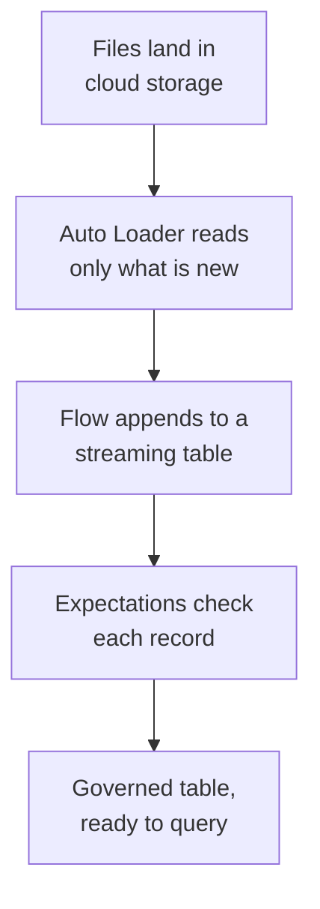

# Domain 3 — Prepare and process data

Microsoft publishes this skill area at 30–35% of the exam, making it one of the two heaviest. It is
also the area where the exam is most likely to show you something on screen — a statement, a
pipeline definition, a configuration — rather than describe it. Twenty-eight objective bullets sit
under four objectives here, roughly twice what domain 1 carries.

## What this domain actually asks

Four questions, and the first three are choices while the fourth is a guarantee.

**How is the data shaped?** Which table format, how the files are laid out so queries can skip what
they do not need, and how change over time is recorded.

**How does it arrive?** Which ingestion tool, batch or streaming, and what happens when the same
file is seen twice.

**How is it changed?** The ordinary transformation surface — joins, set operations, reshaping,
merging — where the exam is most willing to put a query in front of you.

**How do you know it is right?** Constraints on the table, expectations in the pipeline, and what
happens to the schema when the incoming data stops matching it.

The first three reward knowing which condition eliminates an option. The fourth rewards knowing
precisely what is enforced and what merely looks enforced, which is where most marks are quietly
lost.

## Extraction type, and what the source will give you

Before the format question comes a smaller one the guide names first: the **extraction type**. There
are three, and a scenario usually settles it in a single clause.

| Extraction type | What it reads | The clause that names it |
|---|---|---|
| Full | The whole source, every run | "reload", "no watermark", "small reference table" |
| Incremental | Only what is new since last time | "new records", "high-water mark", "nightly delta" |
| Change-based | A change feed of inserts, updates and deletes | "CDC feed", "must capture deletes" |

The third is the one candidates under-use, and the separator between it and incremental is
*deletes*. An incremental extraction keyed on a modified-date column sees new and changed rows and
cannot see a row that has gone; a change feed carries the deletion as an event. A requirement to
keep the target in step with upstream deletions is a change-based requirement, whatever the volume.

One limitation decides several questions: some sources and specific tables do not support
incremental ingestion at all, which promotes a full extraction from inelegant to necessary.

## Choosing a table format

The guide lists Parquet, Delta, CSV, JSON and Iceberg — the **file type** half of the same
sub-bullet. Teach yourself the format question first, because it constrains everything after it.

**Delta Lake is the default assumption**, and two later decisions depend on it. All constraints on
Azure Databricks require Delta Lake, so a table in another format cannot carry a `NOT NULL` or a
`CHECK`. And deletion-vector behaviour differs by format: Apache Iceberg v3 tables include deletion
vectors by default, while Delta Lake tables require them to be enabled explicitly.

CSV and JSON appear mostly as *source* formats rather than as targets. They are the shapes data
arrives in. A requirement to register a table over data already sitting in one of them points at an
external table rather than a managed one — the domain 1 decision arriving here with a new reason
attached.

Iceberg is worth one extra note, because it interacts with layout. Managed Iceberg tables use their
partition definitions as liquid clustering keys, so conversion is unnecessary and running the
conversion command raises an error.

| Format | Where you meet it |
|---|---|
| Delta | The default target; constraints require it |
| Iceberg | Interoperability, and deletion vectors by default |
| Parquet | The columnar file format underneath |
| CSV and JSON | Source shapes, usually external tables |

### Managed or unmanaged

The guide's wording is "choose between managed and **unmanaged** tables", and unmanaged is simply
the other name for external. Domain 1 taught the governance side of that choice; here it arrives as
a statement you write. An external table needs a `LOCATION` clause, and when it is dropped the files
at that location are not dropped. A managed table has no `LOCATION` and Unity Catalog owns the
storage lifecycle.

Read the requirement for who should own the files. Data that already sits in a controlled storage
location, or that other systems read and write directly, points at an external table. Data the
platform should manage, optimise and eventually delete points at a managed one — which is the
default and the recommendation.

### Granularity

One sub-bullet asks you to choose **granularity** on a column or a table based on requirements, and
it is easy to skim past because the word sounds abstract. It is not.

Table granularity is the question of what one row *means*. One row per order, or one row per order
line? One row per sensor reading, or one row per sensor per minute? Choose too fine and every query
aggregates before it can answer anything; choose too coarse and the detail a later requirement needs
has already been thrown away, permanently.

Column granularity is the same question inside a value. A timestamp stored to the second cannot be
rolled back up from a date. A postcode cannot be recovered from a region.

The portable rule: granularity is a one-way door. You can always aggregate a finer grain upward, and
you can never recover a finer grain from a coarser one. When a requirement is uncertain, the cost of
being too fine is query effort; the cost of being too coarse is a re-ingestion you may not be able
to perform. This also decides the slowly changing dimension question in the next section, because
the grain of a dimension row is what history is recorded against.

## Laying data out so queries can find it

Three techniques compete here and the documentation is unusually direct about which to prefer.

**Databricks recommends liquid clustering over Z-ordering for all new tables.** Read the scope of
that: *new* tables. It is one of the clearest recommendations anywhere in this exam's material, and
a question asking what to use on a new table has a documented answer rather than a judgement call.

The separator between clustering and partitioning is not performance in the abstract — it is what
happens when requirements change.

| | Liquid clustering | Partitioning |
|---|---|---|
| Changing the columns | Flexible and simple to alter | Rigid and difficult to alter |
| Getting it wrong | Adjust the keys | A conversion, or a rewrite |
| Fit | Fast-growing tables needing tuning | Stable, well-understood access |

That cost is what makes the comparison matter rather than being academic — an ineffective
partitioning strategy degrades query performance and is expensive to change on a large table.

There is now a documented way out, and it is worth knowing precisely because the old answer was a
rewrite. From Databricks Runtime 18.1, an existing partitioned Delta table is converted with
`ALTER TABLE ... REPLACE PARTITIONED BY WITH CLUSTER BY`, which minimises reader and writer downtime
and works on managed and external tables alike. Two edges survive it. Streaming tables and
materialized views created in a pipeline are not supported — there you change the pipeline definition
to use `CLUSTER BY` instead of `PARTITIONED BY`. And managed Iceberg tables need no conversion at
all, because they already read their partition definitions as clustering keys, so running the command
raises an error.

Note which `ALTER TABLE` matches which starting state, because that is the shape of a configuration
question. An **unpartitioned** table takes `ALTER TABLE ... CLUSTER BY (...)`. A **partitioned** one
takes the conversion above. Clustering is not compatible with partitioning or `ZORDER`, which is why
there is no third option where they coexist.

Liquid clustering has two documented fits worth recognising in a stem. It suits fast-growing tables
that would otherwise need maintenance and tuning effort. And it suits tables where a typical
partition key might return results from too many or too few partitions — that symptom is the tell
that partitioning is the wrong instrument. It improves performance for tables suffering from poor
data-skipping or over-partitioning, and `CLUSTER BY AUTO` gives automatic improvement for tables
whose query patterns change frequently.

Before sizing partitions, ask whether to partition at all — the documentation answers that with
table size, and the thresholds are the most decidable numbers in this section.

| Table size | What the documentation says |
|---|---|
| Under 1 TB | Do not partition |
| 1 TB to 100 TB | Use liquid clustering instead |
| 100 TB or more | Partitioning might help — try liquid clustering first and verify |

If you do partition, size it. Each partition should contain at least one gigabyte of data, and
tables with fewer, larger partitions tend to outperform tables with many smaller ones.

Two limits shape a clustering choice as well. You can specify up to **four** clustering keys, and on
tables below 10 TB more keys can make single-column filtering *worse*. And a clustering key must be a
column that has statistics collected — Delta collects them for the first 32 columns by default — so a
key chosen further right than that silently does nothing.

> **Trap.** Z-ordering cannot be applied to fields already used for partitioning. An option that
> Z-orders the partition column is a clean wrong answer, and it is tempting because both techniques
> sound complementary. They are not.

<b>Self-check — layout</b>

A table is growing fast, its query patterns keep shifting, and the team has already partitioned it
badly once. What does the documentation point to?

Liquid clustering, and `CLUSTER BY AUTO` for the shifting query patterns. Clustering columns are
simple to alter where partitioning is rigid, and the bad partitioning is exactly the case where a
fix would otherwise mean a full rewrite.

## Deletion vectors, history and time travel

Deletion vectors accelerate `DELETE`, `UPDATE` and `MERGE`. The mechanism is the thing to hold:
without them, changing a single row means rewriting the whole Parquet file that contains it, so
instead the row is marked as modified in metadata and reads apply those marks at query time to
resolve the current state. Work from that and the rest of the section follows — including why Photon
uses them for predictive input/output on updates, which is a documented consequence rather than the
definition.

Enabling them has more edges than most features.

| Situation | How deletion vectors behave |
|---|---|
| Iceberg v3 table | Included by default |
| Delta Lake table | Must be enabled explicitly |
| Materialized view or streaming table in Hive metastore | Not enabled by default |

They are enabled or removed through the `enableDeletionVectors` table property. The runtime floors
differ by direction: writing with all optimizations needs Databricks Runtime 14.3 with long-term
support (LTS) or above, while reading needs 12.2 LTS or above.

> **Trap.** An `ALTER` statement **cannot** enable or remove deletion vectors on a materialized
> view or streaming table — a `CREATE TABLE` statement must be used. This is the same shape as the
> single-node compute rule from domain 1: something that looks like an adjustment turns out to be a
> recreate.

History is the other half of this section. `DESCRIBE HISTORY` returns the operations, user and
timestamp for each write to a table, in reverse chronological order.

> **Trap.** Table history and time travel are controlled by **different retention thresholds**.
> Table history retention is set by `logRetentionDuration` and defaults to 30 days. The data files
> that time travel depends on are governed by the `VACUUM` retention threshold, which defaults to
> seven days. Two figures, two purposes. Merging them is how a candidate answers a retention
> question with the right idea and the wrong number.

<b>Self-check — retention</b>

A team can still see that a write happened six weeks ago but cannot query the table as it was then.
Is anything broken?

No. History retention defaults to 30 days and is governed separately from the data files, which
`VACUUM` clears on a seven-day default. Seeing the record without being able to read the data is
the expected result of two different thresholds.

## Recording change over time

The guide asks you to choose a slowly changing dimension (SCD) type and to design a temporal
history table. The whole decision is one question: does history survive an update?

| | Type 1 | Type 2 |
|---|---|---|
| On update | Record changed directly | History retained |
| Scope | No history kept | All updates, or specified columns |

The specified-columns option on Type 2 is the part candidates do not know, and it is therefore
available as a distractor — a stem can describe retaining history only for a handful of attributes
and still mean Type 2.

A stem asking what a record looked like last quarter is asking for Type 2. A stem that emphasises
current state and simplicity is asking for Type 1.

## Choosing how data arrives

The guide's bullet is "choose an appropriate data ingestion tool", and it names three: Lakeflow
Connect, notebooks, and Azure Data Factory.

**Lakeflow Connect** provides managed connectors. Its trade is automation for coverage — standard
connectors trade some of that automation for broader source support and customisation, so a stem
naming an unusual source or a need for control points away from the managed path. For database
connectors, the ingestion gateway runs in its own job as a **continuous task**, which has an
obvious cost consequence.

**Notebooks** are the custom path, where transformation logic belongs with the ingestion.

**Azure Data Factory** is the choice when the orchestration already lives outside the workspace.

| Tool | Reach for it when |
|---|---|
| Lakeflow Connect | The source is supported and you want least code |
| Notebooks | Custom logic belongs with the ingestion |
| Azure Data Factory | Orchestration already lives outside the workspace |

One limitation is worth carrying: some sources and specific tables do not support incremental
ingestion. That rules out an otherwise attractive option, and it is the kind of constraint a
scenario states in passing.

<b>Self-check — ingestion tool</b>

A team needs data from a SaaS application, wants as little pipeline code as possible, and has no
unusual requirements. Where does that point, and what would move it?

A managed Lakeflow Connect connector. It would move to a standard connector if the source were
unsupported, or if they needed customisation the managed path does not allow.

## How files actually get loaded

Three mechanisms, and idempotency is the thread running through all of them.

**Auto Loader** incrementally and efficiently processes new data files as they arrive in cloud
storage, without additional setup. It scales to billions of files for a migration or backfill, and
to near real-time ingestion of millions of files per hour. Databricks recommends it whenever Apache
Spark Structured Streaming is used to ingest from cloud object storage, with interfaces in Python
and Scala.

**`COPY INTO`** gives exactly-once, idempotent file processing by default. Because the statement is
idempotent it can be scheduled to run repeatedly and will load only new data — so an option that
adds manual deduplication around it is solving a problem that does not exist. It also supports
target table schema inference, mapping, merging and evolution, which is where this objective
touches the schema-drift one.

**Streaming tables** are Delta tables with additional support for streaming or incremental
processing, targeted by one or more flows in a pipeline. They are built for incremental work and most
often carry append-oriented volume — but do not read "append-only" as a limit, because a streaming
table is also the target an `AUTO CDC` flow upserts into, which is anything but append-only.

Their processing guarantee needs stating carefully, because the loose version of it is a trap. Within
its own managed tables a pipeline gives you **exactly-once** processing, and you get it for free
across Auto Loader file ingestion, Kafka, Kinesis and Azure Event Hubs reads, and `AUTO CDC` upserts.
The rule of thumb is that an all-Delta-to-Delta pipeline already has it.

Three guarantees get run together and they are not the same thing.

| Guarantee | What it covers |
|---|---|
| `COPY INTO` idempotency | The same *file* is not loaded twice |
| Pipeline exactly-once | Each *record* affects a managed table once, despite retries |
| Business-key deduplication | The same *logical event* arriving twice — yours to solve |

> **Trap.** Exactly-once is not deduplication. If an at-least-once source sends the same record twice,
> the pipeline treats them as two unique records and writes both — removing them is your job, not the
> platform's. The guarantee is about each record affecting the result once despite retries, not about
> the source behaving. It also stops at the edges the platform does not control: a custom external
> sink, Kafka as a sink, or an unverified custom source are at-least-once, and need idempotent writes
> or explicit deduplication there.

| | Auto Loader | `COPY INTO` |
|---|---|---|
| Shape | Continuous, files as they arrive | A statement you run or schedule |
| Scale | Millions of files per hour | Suited to bounded batches |
| Guarantee | Incremental processing | Exactly-once, idempotent |

### The other two SQL methods

The guide names three SQL ingestion methods and `COPY INTO` is only one of them.

**`CREATE TABLE ... AS SELECT`** — CTAS — creates a table from a query, taking its schema from the
result. The rule worth carrying: if you do not define columns, you must supply either `AS query` or
`LOCATION`. A `CREATE TABLE` with a bare name and neither is not a statement.

**`CREATE OR REPLACE TABLE`** looks like a convenience and is a governance decision. `REPLACE`
preserves the table's history, its granted privileges, and its row filters and column masks — and
Databricks strongly recommends it *over* dropping and re-creating a table, which throws all of that
away. Everything domain 2 spent on fine-grained access control survives a `REPLACE` and does not
survive a drop. One syntax edge comes free with it: `IF NOT EXISTS` cannot coexist with `REPLACE`, so
`CREATE OR REPLACE TABLE IF NOT EXISTS` is not allowed.

| SQL method | Reach for it when |
|---|---|
| CTAS | Creating a new table from a query result |
| `CREATE OR REPLACE TABLE` | Rebuilding a table while keeping history and grants |
| `COPY INTO` | Loading files repeatedly and idempotently |

Note one recommendation that reverses the obvious choice: for a more scalable and robust file
ingestion experience, Databricks recommends SQL users use streaming tables rather than `COPY INTO`.
That is a recommendation, not a deprecation.

Flows are how a streaming table gets fed, and they do three things worth knowing. A flow can add
streaming sources that append to an existing streaming table **without requiring a full refresh**,
can backfill a table with missing historical data, and can combine data from multiple sources
without using a `UNION` clause.

### Streaming from Azure Event Hubs

The guide names Azure Event Hubs by itself, and the answer is a negative with a reason — which is
the most examinable shape a fact can take.

Azure Event Hubs is a supported pipeline source — it sits in the documented list of message buses
alongside Kafka, Kinesis, Pub/Sub and Pulsar. What is not supported is one particular route to it.

You consume Event Hubs through its **Kafka-compatible endpoint**, using the Structured Streaming
Kafka connector that ships in Databricks Runtime. You **cannot** use the Structured Streaming Event
Hubs connector, because that library is not part of Databricks Runtime and a pipeline does not allow
third-party Java virtual machine libraries. So the restriction is on the *connector library*, not on
the source: an option offering the Event Hubs connector is the intuitive answer and a documented
impossibility, while an option saying Event Hubs cannot be ingested at all is wrong the other way.

Two practical details follow from it. The shared access policy key is sensitive, so it belongs in a
secret scope rather than in pipeline code — the same secrets machinery domain 2 covers. And because
a read-only pipeline needs only *listen* permission, the default `RootManageSharedAccessKey` policy,
which carries manage, send and listen, is more than the job requires.

<b>Self-check — loading</b>

A scheduled job runs `COPY INTO` against the same folder every hour. A reviewer worries about
duplicate rows. Are they right?

No. `COPY INTO` is exactly-once and idempotent by default, which is precisely why it is safe to
schedule repeatedly — it loads only new data.

A team is told to ingest from Azure Event Hubs and reaches for the Event Hubs Spark connector. What
stops them, and what do they use instead?

The connector is not in Databricks Runtime and a pipeline cannot load third-party Java virtual machine
libraries. They
read the Kafka-compatible endpoint with the Structured Streaming Kafka connector instead.

## Change data capture

When the source database has a change data capture (CDC) feed enabled, the platform can process
changes from that feed directly rather than re-reading the whole table.

> **A note on names.** The newer `AUTO CDC` interfaces replaced the older `APPLY CHANGES` ones and
> have the same syntax. The older interfaces remain available, but Databricks recommends `AUTO CDC`
> in their place. The exam guide names neither, so recognise both in study material and answer on the
> mechanism.

There are **two** of these APIs and the separator is what the source can give you.

| API | Use it when | Interface |
|---|---|---|
| `AUTO CDC` | The source has a change data capture feed | SQL and Python |
| `AUTO CDC FROM SNAPSHOT` | No feed — only snapshots are available | Python only |

The second compares in-order snapshots to work out what changed, then processes the result. Read a
stem that says the source database has no change feed as pointing straight at it, and note that the
Python-only restriction eliminates a SQL option on top of that.

Both need two things named: `KEYS`, which identifies the record, and `SEQUENCE BY`, which decides
which version is newer. Those are not decoration — they are why `AUTO CDC INTO` is idempotent with
respect to them, so applying the same change twice, or out of order, lands on the same final state.
The sequencing column must be a sortable type and cannot contain nulls, which makes choosing it a
data-type decision as much as a modelling one.

Two constraints matter. The change data capture interfaces are **not supported** by Apache Spark
Declarative Pipelines — read that name carefully, because it is close to the Lakeflow pipelines the
rest of this material describes. And using them requires the pipeline to be configured for
serverless Lakeflow pipelines or particular pipeline editions. Learn that a prerequisite exists
rather than memorising which tier satisfies it.

The slowly changing dimension choice from earlier applies directly here: a CDC feed processed as
Type 1 updates records in place, and as Type 2 retains their history.

Type 2 is also where the temporal-history sub-bullet becomes concrete, and this domain is the one
most willing to put a table on screen. A Type 2 target carries `__START_AT` and `__END_AT` columns
recording when each version was active, and a row whose `__END_AT` is null is the version in force
now. Given that, a question showing you three rows for one key is answerable by reading the nulls.

## Transforming what arrived

This is the surface the exam is most willing to show you.

A **join** combines the rows of a left table reference with those of a right one, based on join
criteria. Three **set operators** combine two subqueries into one — the guide names union,
intersect and except.

> **Trap.** When set operations are chained, `INTERSECT` has higher precedence than `UNION` and
> `EXCEPT`. Precedence is invisible until it changes a result, which is exactly what a query-bearing
> question exploits. A related detail on the same operators: the type of each result column is the
> least common type of the corresponding columns in the two subqueries.

| Operator | Returns |
|---|---|
| `UNION` | Rows in either subquery |
| `INTERSECT` | Rows in both |
| `EXCEPT` | Rows in the first but not the second |

**Filtering, grouping and aggregating** are the plainest sub-bullet in the objective and the one
most likely to arrive as a query on screen. `WHERE` limits the rows a `FROM` clause produces.
`GROUP BY` collapses those rows into groups. Aggregate functions summarise each group. `HAVING`
filters the groups *after* aggregation.

That last distinction is the only part of this worth memorising, because it is the only part a
question can turn on. `WHERE` runs before the grouping and sees individual rows; `HAVING` runs after
it and sees the aggregates. A condition on a `SUM` cannot live in `WHERE`, and a condition intended
to discard rows before they are counted does not belong in `HAVING` — put it there and the count
changes.

**Reshaping** is a matched pair. `PIVOT` transforms rows by rotating the unique values of a
specified column list into separate columns; `UNPIVOT` rotates columns back into rows. They are
inverses, and a question can ask for either direction.

Denormalising belongs beside them. Where pivoting changes the shape of a result, denormalising
changes the shape of the stored model — folding a dimension's attributes into the fact table so a
query does not have to join for them. It trades storage and update cost for read simplicity, which
is the same trade the granularity decision makes in a different currency.

**Merging** is where the load sub-bullet lives. A merge can carry any number of `whenMatched` and
`whenNotMatched` clauses, and a third clause type that candidates forget: `whenNotMatchedBySource`
executes when a *target* row does not match any source row. That is how you express a deletion of
records that have disappeared upstream.

| Clause | Fires when |
|---|---|
| `whenMatched` | Source row matches a target row |
| `whenNotMatched` | Source row matches nothing in the target |
| `whenNotMatchedBySource` | Target row matches nothing in the source |

One nuance on the third: there is no source row available to it, so its expressions cannot read
source values. It can delete or update the target row, not populate it from upstream.

Two rules govern what happens when you use several clauses of the same kind, and they are easy to
state backwards. Multiple clauses of one kind **are** evaluated in the order they are specified, and
**all of them except the last must have conditions** — so the final clause is the catch-all and the
ones above it are the special cases, read top to bottom. What order does *not* decide is which kind
applies: that is settled by whether the source row matched, so no amount of reordering turns a
`whenNotMatched` clause into the one that handles a match.

Merge is one of three load operations the guide names, and the other two are simpler than the
attention merge gets suggests.

| Operation | What it is | What it does to existing rows |
|---|---|---|
| `INSERT INTO` | A SQL statement | Nothing — inserted rows are additive |
| `INSERT OVERWRITE` | The other clause of the same statement | Truncates the table, or the partitions you name |
| Append | A write *mode*, not a statement | Nothing — adds new records without matching |
| `MERGE` | A SQL statement | Matches on a condition, then updates, deletes or inserts |

Two distinctions hide in that table and both are worth holding. `INSERT INTO` and `INSERT OVERWRITE`
are the two clauses of one statement, and they are opposites. With `INTO`, all rows inserted are
additive to the existing rows. With `OVERWRITE`, the table is truncated before the first row lands —
or, if you name a partition specification, just those partitions are. The second distinction is
smaller: `INSERT INTO` is a *statement* while append is a *write mode*. They reach the same outcome
from the SQL side and the DataFrame side, which is why a stem can describe either.

Read for whether the target's existing rows matter. If they do not, you are inserting or appending.
If they must go, you are overwriting. If a row might already be there and should be changed rather
than duplicated, you are merging — and if you find yourself writing merge logic to handle a change
feed, `AUTO CDC` already does it.

Two smaller bullets round the objective out. Choosing appropriate column **data types** is a design
decision, because each type represents a defined domain of values — and type resolution across a
set operation follows the least-common-type rule above. And **profiling** computes summary
statistics over a dataset, which is how distributions are assessed *before* a transformation is
chosen rather than after it has gone wrong.

Profiling exists to answer three questions the guide names separately, and they are three different
problems with three different remedies.

| Problem | What it actually is | Where the fix belongs |
|---|---|---|
| Duplicates | The same logical record more than once | A business key, deduplicated before the merge |
| Missing values | A field the source never sent | Ingestion — decide a default or reject the record |
| Nulls | A value that is legitimately absent | The model — `NOT NULL` only if absent is invalid |

The distinction between the second and third is the one that costs marks. A missing value and a SQL
`NULL` look identical once the row has landed, but they mean different things: one is a source
defect, the other is information. Enforcing `NOT NULL` on a column where absence is meaningful turns
valid records into failures. And duplicates are not a null problem at all — they are an identity
problem, which is why the answer is a key rather than a constraint. Profile first so you know which
of the three you have; the remedies are not interchangeable.

### What NULL does to the operators you were going to use

Knowing you have nulls is half of it. The other half is that several operators treat them in ways
that are individually documented and collectively surprising.

**Comparison does not work on them.** The standard operators return unknown or `NULL` when either
operand is `NULL`, which is why a second operator exists: the null-safe equal operator returns
`False` when one operand is `NULL` and `True` when both are. Join two tables on a key that can be
missing and `=` silently drops those rows; the null-safe operator keeps them.

**Aggregates skip them, with exactly one exception.** `NULL` values are ignored by all the aggregate
functions, and the only exception is `COUNT(*)`. So `COUNT(*)` and `COUNT(column)` disagree by
precisely the number of absent values — which makes the pair a profiling measure and makes reaching
for the wrong one a wrong number rather than an error.

**Grouping contradicts comparison, on purpose.** Two `NULL` values are not equal, and yet for
grouping and `DISTINCT` processing they are collected into the same bucket. Both statements are
documented and both are true. An option arguing from the first to the second — *nulls are not equal,
so each forms its own group* — is a true premise reaching a false conclusion.

> **Trap.** Two defaults that catch people out. `ORDER BY` places all `NULL` values **first** by
> default, not last, unless the null ordering says otherwise. And `NOT IN` always returns unknown
> when the list contains a `NULL` and does not contain the input value — so an exclusion list with
> one null in it returns **no rows at all**, nothing errors, and the source looks empty.

For the duplicate third of the problem, `dropDuplicates` returns a DataFrame with duplicate rows
removed, optionally considering only certain columns. Read the batch-against-streaming line before
using it: on a static batch DataFrame it simply drops duplicates, while on a streaming DataFrame it
keeps all data across triggers as intermediate state, and `withWatermark` is what bounds how late a
duplicate may arrive and therefore how much state is held. The same one-line call is cheap in one
place and unbounded in the other.

### Choosing the column type, and what the engine changes underneath you

The guide asks you to choose appropriate column data types, and the examinable content is what
happens when you choose badly rather than a list of type names.

Three mechanisms resolve type conflicts. **Promotion** safely expands a type to a wider one.
**Implicit downcasting** narrows one. **Implicit crosscasting** moves a value into another type
family. Only the first is safe by construction: downcasting is convenient and carries the risk of
unexpected runtime errors if the value turns out not to be representable in the narrower type. A
pipeline that has run for a year on an `INT` column proves nothing about the row that arrives
tomorrow.

| Choice | Difference that matters |
|---|---|
| `cast` against `try_cast` | `cast` errors on a value it cannot convert; `try_cast` returns `NULL` |
| `TIMESTAMP` against `TIMESTAMP_NTZ` | The first uses the session local timezone; the second takes no time zone into account |

Neither row has a safer side. A load that must not fail overnight wants `try_cast`; a load where a
silently nulled value would be worse than a page at 3am wants `cast`. And `TIMESTAMP_NTZ` is not a
display setting — it changes what operations compute, which is why the same rows read from two
regions can disagree when nobody chose deliberately.

One resolution rule is worth memorising because reasoning produces the wrong answer. Where the least
common type would land on `FLOAT` and any contributing type is exact numeric — `TINYINT`,
`SMALLINT`, `INTEGER`, `BIGINT` or `DECIMAL` — the result is pushed to `DOUBLE` instead, to avoid
losing digits. Combine an `INT` column with a `FLOAT` one and you get `DOUBLE`.

<b>Self-check — transformation</b>

A query chains a `UNION` and an `INTERSECT` without parentheses and returns fewer rows than
expected. What is worth checking?

Precedence. `INTERSECT` binds tighter than `UNION` and `EXCEPT`, so the intersection is evaluated
first and the union sees a smaller input than the author intended.

## Constraints: what the table itself enforces

This is the most productive trap in the domain, because a relational background supplies exactly
the wrong answer.

| | Enforced | Informational |
|---|---|---|
| Which | `NOT NULL`, `CHECK` | Primary key, foreign key, unique |
| What happens | Verified before rows are added | Nothing is verified |
| Use | Prevent bad data | Describe relationships |

**A primary key on this platform does not prevent duplicates.** Informational constraints define
relationships between fields and are not enforced. Only enforced constraints verify data integrity
before rows are added to a table.

The two enforced kinds map onto the objective's own wording, which names four validation checks.
`NOT NULL` is the **nullability** check. `CHECK` requires a specified boolean expression to be true
for each input row, and that one clause carries the other three.

| The guide's check | How it is expressed |
|---|---|
| Nullability | `NOT NULL` on the column |
| Range checking | `CHECK (amount BETWEEN 0 AND 1000000)` |
| Data cardinality | `CHECK` on a value's domain, or a `COUNT` in a pipeline expectation |
| Data type checks | The column's declared type, plus a `CHECK` for values a type cannot exclude |

**Data cardinality** is worth a sentence because the word is used loosely elsewhere. Here it is the
number of distinct values a column should hold — a status column that should only ever contain four
values, a foreign key that should match exactly one parent. Low-cardinality expectations are
expressible as a `CHECK` against a value list; the distinct-count kind belongs in a pipeline
expectation, because a constraint evaluates one row at a time and cannot count across them. That row
boundary is the useful rule: if the rule needs to see more than one row, it is not a `CHECK`.

**Data type checks** are the pair to that. The declared type is the first and cheapest check — an
`INT` column cannot hold `"unknown"` — and choosing it well removes work later. What a type cannot
express is a *sub-range* of itself, which is where `CHECK` comes back in: `INT` admits negative
numbers, so an age column needs both the type and the constraint.

Two details sit around the edges. Existing rows are verified against a `NOT NULL` constraint before
it is added, so adding one to a populated table can fail. And a `NOT NULL` on a column nested
within a struct requires the parent struct to be not null, while columns nested within array or map
types do not accept `NOT NULL` at all.

All constraints require Delta Lake, which is the format decision from the top of this domain
arriving with consequences.

<b>Self-check — constraints</b>

A requirement says customer identifiers must be unique. Which constraint, and does it satisfy the
requirement?

A unique constraint is informational and is **not** enforced, so on its own it does not satisfy a
requirement to prevent duplicates. Enforcement has to come from somewhere else — a `CHECK`, or the
pipeline logic that writes the table.

## Expectations: what the pipeline enforces

Where constraints guard the table, expectations guard the pipeline — and the guide calls them
**pipeline expectations** in Lakeflow Spark Declarative Pipelines, the name it uses for the product
this material calls Lakeflow pipelines.

Each expectation has three components and it is worth being able to name them. A **name**, which is
the identifier its metrics are tracked under. A **constraint**, meaning a SQL condition that must
evaluate to true or false for every record. And an **action** on records that fail, which is the
examinable part.

| Action | SQL | What happens to the record | Metrics recorded |
|---|---|---|---|
| warn (default) | `EXPECT` | Written to the target anyway | Yes |
| drop | `EXPECT ... ON VIOLATION DROP ROW` | Removed before the write | Yes |
| fail | `EXPECT ... ON VIOLATION FAIL UPDATE` | Update fails immediately | No |

Notice which one is the default. An expectation written with no `ON VIOLATION` clause **warns** — it
records the violation and writes the record regardless. An option that adds an expectation to *stop*
bad data, without naming an action, has not stopped anything.

> **Trap.** `fail` sounds like the most rigorous option and gives you the least information.
> Tracking metrics are available for `warn` and `drop` but **not** for `fail`, because a fail action
> causes the update to fail the moment an invalid record is detected. And once a pipeline has failed
> on a violation, the pipeline code must be fixed to handle the invalid data before it can run again.

There is a fourth route the table above does not show. Invalid records can be **quarantined**
without failing or dropping data — which is the answer when a requirement rejects both losing the
records and stopping the pipeline.

One capability difference is worth carrying. Both SQL and Python support multiple expectations on a
dataset, but only **Python** allows multiple expectations to be grouped with a collective action. A
requirement to apply one action across a set of rules is a requirement for the Python interface.

Data quality metrics are read by querying the pipeline event log, which is the same event log the
monitoring objective in domain 4 uses.

<b>Self-check — expectations</b>

A requirement says invalid records must be kept for inspection, and the pipeline must not stop.
Which action?

None of the three on their own — quarantine the invalid records. `fail` stops the pipeline and
`drop` discards the records, so neither satisfies both halves of the requirement.

## Schema enforcement and drift

Schema changes come in two shapes, and the difference is how much data moves.

**Explicit.** `ALTER TABLE` statements change a table's schema without writing new data.

**Implicit.** `WITH SCHEMA EVOLUTION`, or setting `mergeSchema` to `true`, makes schema changes
based on the schema of the data being inserted or merged into an existing table. This is the
mechanism behind managing schema drift — the incoming data changes shape and the table follows.

Some changes are neither, and cost more. A column's type or name can be changed, or a column
dropped, only by **rewriting** the table with the `overwriteSchema` option. A stem naming a type
change is describing a rewrite, not an alteration.

| Change | What it takes |
|---|---|
| Add a column | `ALTER TABLE`, or implicit evolution |
| Let incoming data widen the table | `mergeSchema`, or `WITH SCHEMA EVOLUTION` |
| Widen a type | Schema evolution, where the component supports it |
| Rename or drop a column | Supported in the right configuration; a streaming source may need schema tracking and a restart |
| Any other type change | Not supported by evolution — an explicit rewrite |

**And schema evolution is not one switch.** This is the part most likely to be got wrong, because the
word sounds like a setting. Azure Databricks treats it as four independent component categories —
**connectors** such as Auto Loader and the Lakeflow connectors, **format parsers** such as
`from_json`, **engines** such as Structured Streaming, and **datasets**, meaning the streaming
tables, materialized views and Delta tables that persist the data. Each one handles schema change on
its own terms, and you configure each one separately.

The Auto Loader case shows why that matters. There are two persisted schemas: the one Auto Loader
keeps in its schema location, and the one on the target Delta table. Normally they agree. When
incoming data makes Auto Loader evolve its schema, the target table must evolve too or the query
fails — so you either enable evolution on the table, run the data definition language statement
yourself, or rewrite it. A stem
describing a stream that failed after a new field appeared upstream is describing exactly that
mismatch, and "schema evolution was enabled" is not by itself an answer to it.

The five change types are the taxonomy to carry: new columns, column renaming, dropped columns, type
widening, and other type changes. Support differs by component, so do not assume Auto Loader,
Structured Streaming and Delta behave alike.

Two details about Auto Loader specifically, because both invert an expectation. Its rescued-data
column is **not** an automatic safety net: an unsupported type change lands there only if that column
has been set *and* the evolution mode is `rescue`, and otherwise the schema change needs a manual
intervention. And automatic evolution does not happen without a visible interruption — when Auto
Loader evolves its schema the stream **initially fails**, and the evolved schema is used on restart.
A stem describing a stream that died when a new field appeared and then ran cleanly after a restart
is describing the documented behaviour, not a fault.

Dropping a column has an afterlife. `REORG TABLE` rewrites the files and `VACUUM` then physically
deletes those containing the dropped column's data — the same two-step physical removal that makes
a deletion real in the governance material.

The practical reading of this section is that schema *enforcement* and schema *drift* are two sides
of one setting. Enforcement is the default: a write whose shape does not match the table is
rejected, which is what stops a malformed file quietly corrupting a column. Drift management is the
deliberate relaxation of that default for a source you expect to change. A requirement that says new
fields should be picked up automatically is asking for the relaxation; a requirement that says the
table must not change shape unexpectedly is asking for the default. Both are correct answers to
different stems, and the word to read for is whether the change is *expected*.

> **Trap.** Schema updates conflict with **all** concurrent write operations, so schema changes are
> coordinated rather than slipped in. A scenario describing a failed concurrent write may be
> describing a schema change running alongside it.

## Traps worth carrying into the exam

- **Liquid clustering is the recommendation for new tables.** Over Z-ordering, explicitly.
- **You cannot Z-order a partition column.** The two do not layer.
- **Fewer, larger partitions win.** At least a gigabyte each — and under a terabyte, do not
  partition at all.
- **A bad partitioning choice is now convertible.** `REPLACE PARTITIONED BY WITH CLUSTER BY`, from
  runtime 18.1, rather than a rewrite.
- **History and time travel expire on different clocks.** 30 days against seven.
- **Deletion vectors on a materialized view need a recreate.** `ALTER` will not do it.
- **A primary key does not prevent duplicates.** Informational means nothing checks it.
- **Constraints need Delta Lake.** The format decision has teeth.
- **`fail` records no metrics.** The strictest action is the least observable.
- **Only Python groups expectations.** A collective action means the Python interface.
- **`COPY INTO` is already idempotent.** Do not add deduplication around it.
- **`INTERSECT` binds tighter than `UNION`.** Precedence changes results silently.
- **`whenNotMatchedBySource` exists.** It is how upstream deletions are handled.
- **Widening is evolution; other type changes are a rewrite.** Renaming and dropping are supported
  in the right configuration too — it is the unsupported type changes that need `overwriteSchema`.
- **The rescued-data column is not automatic.** It needs the column set and the mode set to `rescue`.
- **`INSERT INTO` never overwrites.** `INSERT OVERWRITE` is the clause that truncates.
- **Exactly-once is not deduplication.** A source that sends a record twice gets it written twice.
- **The Event Hubs connector cannot be used.** Read the Kafka-compatible endpoint instead.
- **`warn` is the default expectation action.** No `ON VIOLATION` clause means nothing is blocked.
- **`REPLACE` keeps grants and masks; a drop does not.** Which is why it is recommended over one.
- **There are two CDC APIs.** No change feed on the source means `AUTO CDC FROM SNAPSHOT`, Python
  only.
- **Schema evolution is per component, not per pipeline.** Four layers, configured separately.
- **`HAVING` filters groups, `WHERE` filters rows.** Putting a row filter in `HAVING` changes the
  aggregate.
