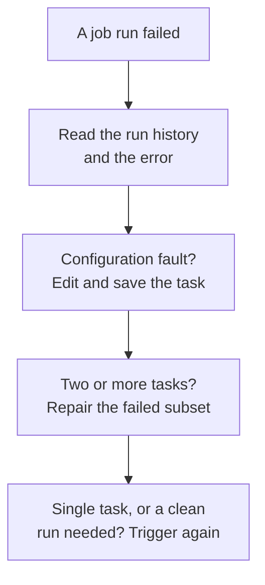

# Domain 4 — Deploy and maintain data pipelines and workloads

Microsoft publishes this skill area at 30–35% of the exam, the same band as domain 3. Where that
domain is about building something that works, this one is about everything after: how work is
ordered, how it reaches production, what you do when it fails at three in the morning, and what it
costs while running.

## Two product names to fix before anything else

The exam guide names two products in this area and this domain is built on both, so get the
vocabulary straight first — it is also the vocabulary older study material will not have.

**Lakeflow Jobs** is the workflow automation: orchestration for data processing workloads, letting
you coordinate and run multiple tasks as part of a larger workflow. Objective 4.2 is titled
*Implement Lakeflow Jobs*, and everything this page calls a *job* is one.

**Lakeflow Spark Declarative Pipelines** is the guide's name, and it is a compound of two things
that are genuinely different. Apache Spark Declarative Pipelines is the open declarative framework
for building batch and streaming pipelines in SQL and Python. *Lakeflow pipelines* — the name the
documentation uses — extend it and are interoperable with it, while running on the
performance-optimised Databricks Runtime. So the guide's compound name points at the Databricks
product; the documentation's shorter name is the same thing.

That distinction is not pedantry. It is why the change data capture interfaces from domain 3 are
documented as *not supported by Apache Spark Declarative Pipelines* — a sentence that reads as a
riddle until you know the framework and the product are two names for two layers.

## What this domain actually asks

Four questions, and they map onto four stages of a pipeline's life.

**How is work ordered?** Pipeline mode, task dependencies, and what should happen when part of a
job fails rather than all of it.

**How does it run?** Lakeflow Jobs, the compute they use, triggers and schedules, and being told
when something needs attention.

**How does it reach production?** Source control, testing, and packaging a project so it deploys
the same way twice.

**How do you know it is healthy?** Reading a query profile or a directed acyclic graph (DAG),
recognising the symptoms the guide names — caching, skew, spill, shuffle — and knowing which of
them the platform has already handled for you.

That last point is the theme worth carrying. A surprising amount of this objective is about
checking whether a problem has already been solved automatically before reaching for a manual fix.

## Triggered or continuous

A pipeline runs in one of two modes, and the difference is whether it stops.

In **triggered** mode the system stops after refreshing all tables, based on the data available when
the update started. In **continuous** execution it processes new data as it arrives in the sources,
keeping tables fresh throughout the pipeline.

| | Triggered | Continuous |
|---|---|---|
| Ends | After one refresh | Runs on |
| Data considered | What existed at start | What arrives |
| Suits | Bounded batches, cost control | Freshness requirements |

Two facts stop a natural wrong inference. **Pipeline mode is independent of the table type** — both
materialized views and streaming tables can be updated in either mode, so a streaming table does not
force continuous execution.

> **Trap.** The constraint runs the other way, and it is the part candidates miss. Refresh
> operations for *standalone* materialized views and streaming tables **always** run in triggered
> mode. Job orchestration controls execution mode only for pipelines — a standalone object stays
> triggered regardless of what orchestrates it. Read the word "standalone" carefully when you meet
> it.

<b>Self-check — pipeline mode</b>

A team wants a standalone streaming table kept continuously fresh and plans to orchestrate it with a
continuous job. Will that work?

No. Standalone materialized views and streaming tables refresh in triggered mode — continuous is a
pipeline-level behaviour, not something a standalone dataset does — whatever
the orchestration. Continuous execution is a property of a pipeline, not of the object.

## Ordering work, and what happens when part of it fails

Designing the **order of operations** is the first bullet of this objective. The platform does part
of it for you: upstream tasks run before downstream tasks, and as many as possible run in parallel. Your job is to declare the dependencies; the scheduler decides what can
overlap.

**Task logic** is the other half of that bullet. It is what each task does, and whether that belongs
in a notebook or in a Lakeflow pipeline. The rule of thumb from domain 3 applies. Use a declarative
pipeline when the result can be described. Use a notebook when the steps are the point. Those
dependencies are represented in the job DAG as lines between tasks — the same artefact the
troubleshooting objective later asks you to read, used here for a different purpose.

**Precedence constraints** is the guide's own phrase for the notebook-pipeline case, and it means the
same machinery seen from the notebook side. A notebook task that depends on another does not start
until its upstream finishes; tasks with no dependency between them run in parallel; and a failure
upstream propagates, so downstream work is skipped rather than run against incomplete data. Declaring
the dependency is the whole of it — you never write the waiting yourself, and an option that adds
polling or a sleep is solving a problem the scheduler already owns.

The **Run if dependencies** field is where error handling actually lives. It adds control flow logic
to tasks based on other tasks' success, failure or completion.

There are **six** conditions, and the second three exist to handle failure rather than to avoid it.

| Condition | Task runs when | If unmet, the task is |
|---|---|---|
| All succeeded | Every dependency ran and succeeded — the default | `Upstream failed` |
| At least one succeeded | At least one dependency succeeded | `Upstream failed` |
| None failed | Nothing failed and at least one dependency ran | `Upstream failed` |
| All done | Every dependency finished, whatever the outcome | — |
| At least one failed | One or more dependencies failed | `Excluded` |
| All failed | Every dependency failed | `Excluded` |

**All succeeded is the default.** Learn the right-hand column as carefully as the left: a task that
did not meet a success-shaped condition is marked `Upstream failed`, meaning it never ran rather than
that it failed, while a task that did not meet a failure-shaped condition is `Excluded`, and an
excluded task is skipped. The split is not arbitrary — if your task exists to react to a failure and
no failure happened, nothing has gone wrong. All done has no unmet state at all, which follows from
what it asks: once the dependencies have finished, it is satisfied.

Those two states then behave differently one step further down, and this is where a multi-branch
scenario is decided. When the scheduler evaluates the *next* task's condition, an upstream `Excluded`
counts as **successful**; an upstream `Upstream failed` or `Upstream canceled` counts as **failed**,
not as skipped. Treating both as "didn't run" gets the downstream answer wrong in both directions.

Two more rules complete the picture. If *all* of a task's dependencies are excluded, that task is
excluded too — regardless of its own `Run if` condition — and the exclusion cascades down a linear
chain, so excluding A in A → B → C runs none of them. And cancelling a task propagates downstream,
but tasks whose condition handles failure still run, which is how a cleanup task fires on a
cancellation as well as on a failure.

The classic scenario is a cleanup or notification task that must run whether the pipeline succeeded
or not. That is **All done** — neither success condition will do it, because both suppress the task
when things go wrong, which is precisely when you want it.

Three task types add control flow beyond dependencies, and each answers a differently shaped stem.
An **If/else condition** task runs part of the DAG based on a boolean expression — the answer when
downstream work should happen only if the upstream actually produced new data. A **For each** task
loops another task over an input array. And a **Run Job** task triggers another job in the workspace,
which is the mechanism when one job must invoke another rather than duplicating its tasks.

<b>Self-check — task ordering</b>

A final task must send a summary whether the pipeline succeeded or failed. Which Run if condition?

**All done.** All succeeded and At least one succeeded both suppress the task on failure, which is
exactly the case the summary exists for. None failed will not do it either — it needs nothing to have
failed.

A different task should raise an incident only when the load step failed. It is configured with
`At least one failed`, and the load succeeds. What state is it in, and what does the task after it
see?

`Excluded`, and it is skipped. The task downstream of it evaluating `All succeeded` still runs,
because an excluded upstream counts as successful.

## What a job is made of

A job needs a compute resource to run its logic, and the choice is the one from domain 1: serverless
compute, classic jobs compute, or all-purpose compute. Job compute exists and terminates with the
run; all-purpose compute is what a team leaves running and shares.

**A schedule is optional.** It can be omitted and the job triggered manually instead, so a stem
describing an on-demand job is not describing a misconfiguration.

One detail bridges this objective to the next. A job can be viewed as `YAML` from its menu, by
switching to the code version. That is the same definition a bundle deploys — the interface and the
packaged project are two views of one thing, which is worth seeing once before bundles arrive.

## Triggers, schedules and being told

Trigger controls live in the job details pane, and they appear **only** for jobs that already have a
trigger configured — which explains an absence that otherwise looks like a missing feature. A
trigger's status toggles between active and paused, and pausing rather than deleting is the
reversible operation.

> **Trap.** If a run is active when a continuous trigger is resumed, the scheduler waits for that
> run to complete before triggering a new one. An option claiming that resuming produces a
> concurrent run is wrong.

Notifications fire on seven events, and a job or task can be configured for any of them.

| Event | Fires when |
|---|---|
| Start | A run begins |
| Success | A run completes successfully |
| Failure | A run stops unsuccessfully |
| Duration warning | A run exceeds a configured duration threshold |
| Streaming backlog | A backlog metric exceeds a configured threshold |
| Maintenance start | Continuous jobs with a maintenance window only — not a general job event |
| Maintenance complete | The paired event, and why the count is seven rather than six |

Destinations are an email address, or a system destination such as Slack, Microsoft Teams, PagerDuty
or a webhook — and an administrator configures those before anyone can select one.

Alerting then has three constraints that are each easy to assume away.

| Constraint | What it means |
|---|---|
| Three system destinations | Per job or task, per notification event type |
| No email on maintenance events | Use a system destination instead |
| Duration limit must be set | No limit, no slow-job notification |

Two behaviours matter more than any of them, because both make a correctly configured alert go
quiet. **Job-level notifications are not sent while failed tasks are being retried**, so where you
need to hear about each failed attempt the answer is task-level notifications; job-level notification
does not give per-attempt visibility. Task notifications also offer *mute until the last retry*,
which is the opposite adjustment for the opposite problem. And a job that finishes in a **Succeeded
with failures** state counts as successful, so hearing about that one means selecting Success, not
Failure.

That last one is a prerequisite wearing the costume of a feature. Being notified when a job exceeds
a duration limit requires the limit to be configured first — a requirement for slow-job alerts is a
requirement to set a threshold.

Adding or editing notifications needs `CAN MANAGE` or `IS OWNER` on the job, which is the permission
ladder from domain 1 applied to a new object.

## When a job fails

The guide names four operations, and they divide into two you reach for on a finished run and two
that are simply the run's controls.

| Operation | What it does |
|---|---|
| Run | Starts a new run — and the only route for a failed single-task job |
| Repair | Re-runs the unsuccessful tasks and their dependents, preserving completed work |
| Restart | Cancels the active run, resets the retry period, and starts a new run |
| Stop | Terminates an active run |

The pair that actually gets confused is the middle two.

| | Repair | Restart |
|---|---|---|
| Scope | Re-runs the unsuccessful subset and its dependents | Starts a new run |
| Completed task results | Preserved and not re-run | Not carried over — the new run starts clean |
| Also does | — | Cancels active run, resets retry period |

Read the middle row precisely. Restart does not *undo* anything a previous run wrote; it simply does
not continue from that run's completed task state. Whatever the earlier run already put into a table
is still there, which is exactly why the repair warning below matters.

Restart's extra clause has a specific home: when a continuous job's consecutive failures pass a
threshold, it enters exponential backoff, and **Restart run** is the control offered there.

> **Trap.** **Repair is supported only for jobs orchestrating two or more tasks.** A failed
> single-task job is re-run by triggering it again, not repaired. Repair feels universally available
> and is not, and the single-task case has a different answer.

> **Trap, and the more expensive one.** Repair is cheap but it is not automatically *safe*. A repair
> re-runs each unsuccessful task from the beginning, and Lakeflow Jobs does not make tasks
> idempotent — so a task that wrote part of its output before failing can write that part again.
> Idempotency is a property of the task's own implementation, not of the repair operation — which is
> why the platform cannot give it to you. Whether a repair is safe depends on what the task writes,
> which is the same reasoning domain 3 applies to pipelines: prefer an overwrite or a merge to an
> append where duplicated data would matter. A scenario where a partially-written append failed halfway is not asking you to repair it.

One mechanical detail explains an observation that otherwise looks wrong: where tasks share a job
cluster, a repair creates a *new* job cluster with a version suffix, carrying the original's current
settings. That is also why a repair picks up cluster changes you made before clicking it.

**Automatic restart** is configured through retry settings, which carry two distinct periods: the
period the job runs without error to be considered successful, and the time before the next retry if
no run is currently active. A distractor can swap them.

| Setting | What it governs |
|---|---|
| The period to run without error to be considered successful | How long a run must survive to count |
| The interval before the next retry | The wait before the next attempt |

**And there is no single retry default to memorise.** The default for task retries *depends on the
job configuration*, and for most configurations the default is to retry nothing at all on task
failure. Two configurations differ: serverless jobs auto-optimise retries by default, and continuous
jobs use an exponential backoff policy. So a scenario in which a failed task simply failed, with no
retry, is not describing a misconfiguration — it is describing the common default. If you want
retries, you add a retry policy.

One interaction is worth carrying because it changes a worst-case calculation: where a task has both
a timeout and retries configured, **the timeout applies to each retry**. A ten-minute timeout with
three retries is up to forty minutes of wall clock, not ten.

Those are the documented descriptions rather than field labels, and that is deliberate — learn what
each one governs, because an interface label is the kind of thing that moves between the exam being
written and you sitting it.

Automatic restart is the unattended case; repair and restart are what you do by hand once someone is
looking at it.

Where the failure relates to task configuration rather than to data, the task configuration is
edited and saved before re-running — which is the fork worth establishing before anything else.

<b>Self-check — failure handling</b>

A six-task job failed on task five after four expensive successes. What is the cheap route, and when
would it not be available?

Repair, which re-runs only the unsuccessful subset and preserves the completed work. It would not be
available if the job had a single task, where the only route is to trigger it again.

## Source control and the development lifecycle

**Version control** is the foundation this objective builds on, and Git folders bring it into the
workspace, supporting the common operations: cloning, branching, committing and pushing. The objective adds branching strategy, pull requests and conflict
resolution on top of that — ordinary Git practice, applied to notebooks and project files rather
than to application code.

Testing is the other half, and the guide names four kinds: unit, integration, end-to-end, and user
acceptance testing. They differ in what they hold constant.

| Kind of test | What it exercises |
|---|---|
| Unit | One function, in isolation |
| Integration | Two or more components working together |
| End-to-end | The whole pipeline, as deployed |
| User acceptance | Whether it meets the stated requirement |

The ladder is what travels, so read it as one sentence. A unit test holds everything constant but a
function. An integration test lets two components meet. An end-to-end test runs the pipeline the way
it is deployed rather than the way it is written. User acceptance asks a question none of the other
three can, because it is about the requirement rather than the code.

Functions and their unit tests are organised with notebooks in several common approaches, each with
its own benefits and challenges — which is a fair description of the situation rather than a single
prescribed layout. The portable point for the exam is the ladder itself: a stem describing a fault
that only appears when two components meet is describing an integration gap, not a unit-test gap.

The lifecycle these pieces form is worth stating once. The objective's bullets are its steps, not a
list of features. Code lives in a Git folder and moves through branches. A pull
request is where review happens, and conflict resolution is the ordinary cost of more than one
person working at once. Tests run against the change. The project is packaged as a bundle and
deployed to a target environment — development first, production once it validates. Nothing in that
sequence is specific to data engineering, which is the point: the objective exists because data
projects have historically skipped it.

A scenario describing changes made directly in production, or a notebook copied between workspaces
by hand, is describing the absence of this lifecycle. It is not a configuration problem to solve.

## Packaging and deploying

> **A note on names.** Both the guide and the documentation now call these **Declarative
> Automation Bundles**. The documentation records the change directly — *formerly known as
> Databricks Asset Bundles* — and the objective adopted the new name with the October 19, 2026
> skills update. Older training material still says **Databricks Asset Bundles**, so recognise
> both names; the concepts are unchanged either way.

A bundle brings software engineering practice — source control, code review, testing, continuous
integration and delivery — to data and AI projects, by describing resources such as jobs and
pipelines **as source files**. A project's source files and metadata deploy as a single bundle to a
target environment, which is what makes a deployment repeatable.

The objective names three deployment routes separately, and they are genuinely three.

| Route | When it fits |
|---|---|
| Workspace | Collaborating on a bundle without local tooling |
| Command-line interface | Local development, and scripted deployment |
| REST | Another system creating or updating the same jobs and pipelines through their own APIs |

The command-line interface is the one most material assumes, but it is not the only path, and a stem
describing a team working entirely in the workspace is not describing a limitation.

Read the REST row carefully, because it is the one the guide's wording makes easy to mis-picture.
The CLI is what deploys a bundle: `bundle deploy` sends it to the target workspace declared in the
configuration files. There is no separate bundle-deploy REST verb to reach for instead. What the
documentation gives you is the relationship underneath — a bundle resource *is* the create payload
of a Databricks REST API object, expressed as YAML, so the same jobs and pipelines a bundle would
deploy can be created and updated through those resource APIs. A stem saying the build agent has no
CLI available is pointing at that path, or at a pipeline that wraps the CLI, and never at an
endpoint whose job is to deploy bundles.

Two practical points. Using bundles inside the workspace does **not** require the command-line
interface (CLI) to be installed — the objective names CLI and REST deployment separately, and the
workspace path is a third option. And remote workspaces need workspace files enabled, which is the
default on Databricks Runtime 11.3 with long-term support (LTS) and above.

**Deployment modes are optional.** A bundle deploys without setting a mode or configuring presets;
modes apply a group of commonly used settings at once.

| | Development mode | Production mode |
|---|---|---|
| Pipelines | Marked as development | Validated as not development |
| Jobs | Concurrent runs enabled | — |
| Purpose | Fast iteration | Safety check before release |

> **Trap.** When a preset conflicts with a resource's own setting, **the specific setting wins**. If
> a job's own maximum concurrent runs is 10 and the preset says 20, the job gets 10. If a schedule is
> unpaused and the preset says paused, the schedule stays unpaused. Learn the principle, not the two
> examples.

Full continuous integration and delivery with bundles is one option, not the only one — source
controlling and deploying code files and notebooks alone is the lighter alternative, and a stem
describing a small project may be describing that.

<b>Self-check — deployment</b>

A bundle sets a preset for maximum concurrent runs, and one job in it declares its own. Which
applies?

The job's own setting. Presets are a convenience that applies common settings at once; a specific
resource setting takes precedence over them.

## Reading what went wrong

The guide names three diagnostic surfaces together, and they answer three different questions.

| Surface | The question it answers |
|---|---|
| Directed acyclic graph | What depends on what, and where did the run stop |
| Spark UI | What happened inside the jobs, stages and tasks |
| Query profile | Which operators in one query consumed the time |

Reach for them in that order when you do not yet know where the problem is: the graph tells you
which step, the Spark UI tells you what that step did, and the query profile tells you which part of
one statement was expensive.

The guide names three tools together — the DAG, the Spark UI and the query profile — and a set of
symptoms: caching, skew, spill and shuffle.

The **query profile** shows where the time went rather than how long the query took. It identifies
the slowest part of an execution and shows the impact of modifications, and each operator can be
visualised with metrics including time spent, rows processed and memory consumption. That memory
figure is what points at spill.

It also surfaces two failure shapes by name: **exploding joins** and **full table scans**. Those are
exactly what a troubleshooting stem describes without naming, so learn to recognise the description.

Now the part that reframes the whole objective. **Adaptive query execution** is query
re-optimization that happens *during* execution, and it already does several things candidates
assume are manual work.

| It automatically | Which means |
|---|---|
| Converts sort merge to broadcast hash join | The classic manual hint is often unnecessary |
| Splits skewed tasks into even ones | Skew may already be handled |
| Detects and propagates empty relations | Wasted stages get pruned |

It applies only to queries containing at least one exchange — usually from a join, aggregate or
window — or a subquery. A query with neither gets no benefit, and that is a nameable reason rather
than a mystery.

The practical rule: before proposing a manual broadcast hint or a repartition, ask whether the
query qualifies for adaptive execution. If it does, the platform is already doing it, and the real
answer lies elsewhere.

Job run history is the other surface. The runs list carries filters, a graph of recently finished
runs, and the top five errors — which is where a troubleshooting scenario actually starts.

### Performance tuning, in order

**Performance tuning** on this platform has an order, and following it prevents most wasted effort.

| Ask first | Because |
|---|---|
| Does adaptive execution apply? | It may have fixed the skew or the join already |
| What does the profile say? | Guessing at the slow operator is usually wrong |
| Is it layout or is it code? | Compaction and a rewritten query are different fixes |
| Is the compute right? | Memory-bound work needs memory, not more nodes |

The last row reaches back to domain 1: total executor memory decides how much data is held before
spilling to disk, so a spill problem is often a node-type problem wearing a query costume.

### Resource bottlenecks, and when to restart the compute

Performance tuning answers "why is this query slow". The objective also names **resolving resource
bottlenecks**, which is a different question: what is the scarce thing. Three shapes cover it, and
the symptom names the shape.

| Bottleneck | What you see | Where to look |
|---|---|---|
| Processor-bound | High utilisation, compute-heavy stages | Node type and count, parallelism, the query itself |
| Memory-bound | Spill to disk, out-of-memory failures | Total executor memory, a memory-optimised node family, less held per task, less caching |
| Shuffle-heavy | Large shuffle volume, long stages, skewed tasks | The query plan, join strategy, data layout |

Read those columns rather than reaching for more workers. A memory-bound job given more workers gets
more shuffle; a shuffle-heavy job given more workers gets more of the thing that is already hurting
it. The sizing reasoning from domain 1 applies unchanged, and so does its warning that total executor
memory, not worker count, is what decides when data spills.

**Cluster restart** is the last item in that bullet and it is a different kind of remedy. It fixes
the *compute*, not the code: a resource that has accumulated state, is holding cached data you no
longer want, or is behaving oddly for no reason the query explains. Where a scenario describes a
stale or misbehaving compute resource rather than a query defect, restarting is the answer — and
where it describes a slow query, restarting is the option that changes nothing.

Three things about restarting are worth holding, because two of them decide whether you can do it
now. **Restarting gets the latest images** for the resource's containers and VM hosts, which is why
Databricks says it is important to schedule regular restarts for long-running compute — compute
processing streaming data above all. A resource that has been up for two months is still running the
images it started with. **Starting a terminated resource is not a rebuild**: it comes back with the
same cluster ID, all its libraries installed automatically and its notebooks reattached, so anything
pinned to that ID keeps working. And **editing a running resource usually costs a restart** —
every attribute except its size and permissions requires one, and that restart disrupts whoever is
on the resource at the time. Size and permissions are the two you can change underneath people.

**Caching** deserves naming because the objective names it and because it cuts both ways. Caching
reduces repeated reads of reused data and consumes memory to do it. On a memory-constrained workload,
or where the cached dataset is read once, caching makes things worse rather than better. Keep it
separate from the things that also make reads cheaper but cost no memory: data skipping, adaptive
query execution, and file compaction.

And **shuffle** is worth a definition rather than only a symptom. It is the redistribution of data
across partitions, caused by joins, aggregations and repartitioning — anything that has to move rows
between workers. That is why it shows up as network cost, as long stages, as spill when the moved
data will not fit, and as skew when it moves unevenly.

| Symptom | What it is |
|---|---|
| Shuffle | Data moving between partitions |
| Spill | Data written to disk because memory ran out |
| Skew | One partition holding disproportionately more than its peers |

The three travel together and are not the same problem. Shuffle is movement, spill is a memory
shortfall, skew is a distribution. A stem describing a few tasks running far longer than the rest is
skew; one describing disk activity during a join is spill.

### Sending logs to Azure

The objective names two Azure services explicitly, and they do different jobs.

**Compute log delivery** is the streaming mechanism. When all-purpose or jobs compute is created you
can specify a location for cluster logs — the Spark driver, the worker nodes, and events. Logs are
delivered every five minutes and archived hourly in the destination you chose, and delivery
continues until the compute resource is terminated. Those two intervals, and that termination
boundary, are the examinable details.

**Log Analytics workspaces** collect log and trace data, which is analysed with Kusto Query
Language. That is the Azure-side destination the objective means by log streaming, and **Azure
Monitor** is the service it sits inside.

**An Azure Monitor alert is not a job notification, and the objective names them in two different
bullets.** A job notification is configured on the job, fires on job or task events, and goes to the
recipients the job lists. An **alert rule** is configured in Azure, on data that has already arrived:
it combines the resources to monitor, the signal or data from them, and the conditions that make it
fire. A **log search alert rule** watches everything sending data into a Log Analytics workspace,
across subscriptions and regions.

That ordering is the examinable part. Compute log delivery and diagnostic settings put the data
there; the alert rule is a separate object that watches it. Finishing the streaming does not create
an alert, and no permission on the job creates one either. So a stem asking to be told when cluster
logs show a particular pattern is an alert-rule question, and every option about `CAN MANAGE`,
notification recipients or **Select Success** is answering the other bullet.

> **Trap.** Azure Monitor diagnostic settings do **not** log every Azure Databricks service, and
> services unavailable there are labelled as such in the documentation. Where a service is missing,
> the audit log system table is what reaches those events — and the workspace-level and
> account-level designations apply only to that system table, so account-level activity is not on the
> Azure side at all. This is the same divergence domain 2 met from the governance side, and it matters
> just as much here: a requirement for complete coverage is not satisfied by the Azure-side surface
> alone.

<b>Self-check — diagnosis</b>

A join is slow and one task takes far longer than its siblings. What is the symptom, and what should
you check before tuning?

Skew. Check whether adaptive query execution applies — it splits skewed tasks automatically for sort
merge and shuffle hash joins, so if the query qualifies the platform has already addressed it and
the cause is elsewhere.

## Making it faster and cheaper

`OPTIMIZE` and `VACUUM` appear in this objective as a cost pair. Domain 2 met them as governance;
here the framing is compute and storage.

`OPTIMIZE` improves a Delta table's file layout. Bin-packing optimization is **idempotent** —
running it twice on the same dataset has no effect the second time — so extra runs buy nothing
while still costing compute, because compaction and rewriting are processor-intensive operations
doing large amounts of Parquet decoding and encoding. Databricks recommends starting with a daily
run and adjusting the frequency to balance cost against performance.

Two automatic paths exist alongside the manual one. Small files can be compacted automatically using
auto compaction, and predictive optimization on Unity Catalog managed tables runs `OPTIMIZE`
automatically when it is cost effective — which is part of why managed tables are described as
maintaining themselves.

`VACUUM` deletes unused data files and so reduces cloud storage costs, on a seven-day default
retention threshold. The governance reading of that threshold belongs to domain 2; what matters
here is that storage cost and recoverability are the two ends of the same setting.

Cluster consumption is the third lever, and it reaches back to domain 1: auto termination for idle
compute, autoscaling bounds sized to the workload, and node types matched to whether the work is
memory-bound or processor-bound.

Monitoring that consumption is its own bullet. The useful framing: cost here is almost always a
question of time rather than of rate. Compute that runs
when nobody needs it. A cluster sized for a peak that happens twice a day. An optimization job
running hourly against daily data. Each pays full price for idle capability. The fixes are
unglamorous and documented. Terminate on idle. Set the autoscaling minimum honestly rather than
defensively. Let predictive optimization decide when maintenance is worth running.

The exam presents these as scenarios where something *works* but costs too much. That is a different
shape from the failures earlier in this domain. Read for whether
anything is actually broken before reaching for a troubleshooting answer.

<b>Self-check — optimization</b>

A team runs `OPTIMIZE` hourly on a table that changes twice a day, and cost has risen. What is
wrong?

Bin-packing is idempotent, so runs against unchanged data achieve nothing while still consuming
processor-intensive compute. Daily is the documented starting point, adjusted from there.

## Traps worth carrying into the exam

- **There are six `Run if` conditions, not three.** And the unmet state differs: `Upstream failed`
  for the success-shaped ones, `Excluded` for the failure-shaped ones.
- **`Excluded` counts as success downstream.** `Upstream failed` counts as failure, not as skipped.
- **A repair can duplicate data.** Tasks are not idempotent, so a partial write gets rewritten.
- **Job-level failure notifications go quiet during retries.** Task notifications are the answer.
- **"Succeeded with failures" is a success.** Select Success to be told about it.
- **An Azure Monitor alert is not a job notification.** Log delivery puts data in Log Analytics;
  an alert rule watches it. `CAN MANAGE` on the job does not create that rule.
- **There is no bundle-deploy REST endpoint.** The CLI deploys the bundle; REST reaches the same
  jobs and pipelines through their own resource APIs.
- **Development mode pauses schedules and triggers by default** — and it is a default, not a rule:
  a preset can change it and a resource setting beats the preset.
- **Cluster restart fixes compute, not queries.** A slow query is unmoved by it.

- **Standalone objects always refresh triggered.** Orchestration does not change that.
- **Pipeline mode is not decided by table type.** Streaming tables run in either mode.
- **All succeeded is the default Run if condition.** A cleanup task needs **All done**.
- **`Upstream failed` means never ran.** It is not a failure of that task.
- **Repair needs two or more tasks.** A single-task job is triggered again.
- **Restart does not roll back writes.** It starts a new run rather than continuing from the last
  one's completed tasks; repair preserves those and re-runs the unsuccessful subset.
- **Resuming a continuous trigger will not double-run.** The scheduler waits.
- **No duration limit, no slow-job alert.** The threshold is a prerequisite.
- **A specific setting beats a bundle preset.** Every time.
- **Deployment modes are optional.** They are convenience, not ceremony.
- **Adaptive query execution may have fixed the skew already.** Check before tuning.
- **`OPTIMIZE` is idempotent.** Running it more often is pure cost.
